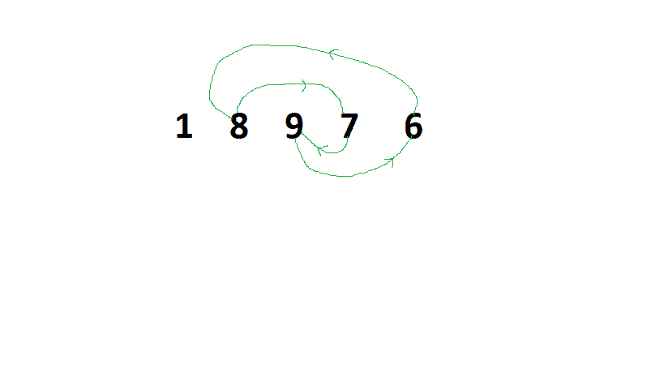

# 对数组进行排序的最小成本，因此交换 X 和 Y 需要 XY

> 原文:[https://www . geeksforgeeks . org/对数组进行排序的最小成本交换 x 和 y 成本-xy/](https://www.geeksforgeeks.org/minimum-cost-to-sort-an-array-such-that-swapping-x-and-y-costs-xy/)

给定一个由 **N** 个不同正整数组成的[数组](https://www.geeksforgeeks.org/introduction-to-arrays/)。任务是找到最小的成本来[排序给定的数组](https://www.geeksforgeeks.org/c-program-to-sort-an-array-in-ascending-order/)。交换两个元素 **X** 和 **Y** 的成本为 **X*Y** 。

**示例:**

> **输入:** arr[] = {8，4，5，3，2，7}
> **输出:** 57
> **解释:**
> 用索引 5 交换索引 4 处的元素–成本(arr[4]*arr[5]) = (2*7) = 14，
> 数组变成{8，4，5，3，7，2}
> 然后，用索引 5 交换索引 0 处的元素–成本(arr[0]* arr[5])= = 将索引 2 处的元素交换为 3–成本(arr[2]*arr[3]) = (5*3) = 15，
> 数组变为{2，4，3，5，7，8}
> 然后，将索引 1 处的元素交换为 2–成本(arr[1]*arr[2]) = (4*3) = 12，
> 数组变为{2，3，4，5，7，8}
> 数组现在已排序，总成本= 14+16+15+15
> 
> **输入:** arr[] = {1，8，9，7，6}
> **输出:** 36

**方法:**思路是，对一个循环进行排序，我们有两种选择，要么只使用循环的局部最小值，要么同时使用数组的局部最小值和整体最小值。选择一个成本较低的交换元素。以下是步骤:

1.  计算局部最小值(比如说**局部 _ 最小值**)和整体最小值(比如说整体 _ 最小值)，局部最小值是当前周期中的最小元素，整体最小值是整个数组中的最小元素。
2.  仅使用局部最小值计算并存储成本以对周期进行排序(比如**成本 1** )。
3.  此外，通过使用局部最小值和整体最小值来计算和存储对周期进行排序的成本(比如**成本 2** )。
4.  现在这个周期排序的最小成本将是成本 1 和成本 2 中的最小**。将此成本加到总成本中。**

下面是 arr[] = {1，8，9，7，6}:
数组的图示

[](https://media.geeksforgeeks.org/wp-content/uploads/20200807160618/min2.png)

*   在上图中，循环 **{8，9，7，6}** 可以使用局部最小元素 **6** 或整体最小元素 **1** 进行排序。通过仅使用局部最小元素，即交换 6 和 9、交换 6 和 7、交换 6 和 8。所以总成本为 **6*9 + 6*7 + 6*8 = 144** 。
*   通过同时使用整体最小值和局部最小值元素，即交换 1 和 6、交换 1 和 9、交换 1 和 7、交换 1 和 8、交换 1 和 6。所以总成本是 1*6 +1*9 +1*7 +1*8 +1*6 = 36。
*   以上费用最低为 36。

下面是上述方法的实现:

## C++

```
// C++ program for the above approach
#include <bits/stdc++.h>
using namespace std;

// Function returns the minimum cost
// to sort the given array
int minCost(int arr[], int n)
{
    // Create array of pairs in which
    // 1st element is the array element
    // and 2nd element is index of first
    pair<int, int> sorted[n];

    // Initialize the total cost
    int total_cost = 0;

    for (int i = 0; i < n; i++) {
        sorted[i].first = arr[i];
        sorted[i].second = i;
    }
    // Sort the array with respect to
    // array value
    sort(sorted, sorted + n);

    // Initialize the overall minimum
    // which is the 1st element
    int overall_minimum = sorted[0].first;

    // To keep track of visited elements
    // create a visited array & initialize
    // all elements as not visited
    bool vis[n] = { false };

    // Iterate over every element
    // of the array
    for (int i = 0; i < n; i++) {

        // If the element is visited or
        // in the sorted position, and
        // check for next element
        if (vis[i] && sorted[i].second == i)
            continue;

        // Create a vector which stores
        // all elements of a cycle
        vector<int> v;
        int j = i;

        // It covers all the elements
        // of a cycle
        while (!vis[j]) {

            vis[j] = true;
            v.push_back(sorted[j].first);
            j = sorted[j].second;
        }

        // If cycle is found then the
        // swapping is required
        if (v.size() > 0) {

            // Initialize local minimum with
            // 1st element of the vector as
            // it contains the smallest
            // element in the beginning
            int local_minimum = v[0], result1 = 0,
                result2 = 0;

            // Stores the cost with using only
            // local minimum value.
            for (int k = 1; k < v.size(); k++)
                result1 += (local_minimum * v[k]);

            // Stores the cost of using both
            // local minimum and overall minimum
            for (int k = 0; k < v.size(); k++)
                result2 += (overall_minimum * v[k]);

            // Update the result2
            result2 += (overall_minimum
                        * local_minimum);

            // Store the minimum of the
            // two result to total cost
            total_cost += min(result1, result2);
        }
    }

    // Return the minimum cost
    return total_cost;
}

// Driver Code
int main()
{
    // Given array arr[]
    int arr[] = { 1, 8, 9, 7, 6 };
    int n = (sizeof(arr) / sizeof(int));

    // Function Call
    cout << minCost(arr, n);
    return 0;
}
```

## Java 语言(一种计算机语言，尤用于创建网站)

```
// Java program to implement
// the above approach
import java.util.*;

class GFG{

// Function returns the minimum cost
// to sort the given array
static int minCost(int arr[], int n)
{

    // Create array of pairs in which
    // 1st element is the array element
    // and 2nd element is index of first
    int[][] sorted = new int[n][2];

    // Initialize the total cost
    int total_cost = 0;

    for(int i = 0; i < n; i++)
    {
        sorted[i][0] = arr[i];
        sorted[i][1] = i;
    }

    // Sort the array with respect to
    // array value
    Arrays.sort(sorted, (a, b) -> a[0] - b[0]);

    // Initialize the overall minimum
    // which is the 1st element
    int overall_minimum = sorted[0][0];

    // To keep track of visited elements
    // create a visited array & initialize
    // all elements as not visited
    boolean[] vis = new boolean[n];

    // Iterate over every element
    // of the array
    for(int i = 0; i < n; i++)
    {

        // If the element is visited or
        // in the sorted position, and
        // check for next element
        if (vis[i] && sorted[i][1] == i)
            continue;

        // Create a vector which stores
        // all elements of a cycle
        ArrayList<Integer> v = new ArrayList<>();
        int j = i;

        // It covers all the elements
        // of a cycle
        while (!vis[j])
        {
            vis[j] = true;
            v.add(sorted[j][0]);
            j = sorted[j][1];
        }

        // If cycle is found then the
        // swapping is required
        if (v.size() > 0)
        {

            // Initialize local minimum with
            // 1st element of the vector as
            // it contains the smallest
            // element in the beginning
            int local_minimum = v.get(0), result1 = 0,
                result2 = 0;

            // Stores the cost with using only
            // local minimum value.
            for(int k = 1; k < v.size(); k++)
                result1 += (local_minimum * v.get(k));

            // Stores the cost of using both
            // local minimum and overall minimum
            for(int k = 0; k < v.size(); k++)
                result2 += (overall_minimum * v.get(k));

            // Update the result2
            result2 += (overall_minimum *
                          local_minimum);

            // Store the minimum of the
            // two result to total cost
            total_cost += Math.min(result1, result2);
        }
    }

    // Return the minimum cost
    return total_cost;
}

// Driver code
public static void main (String[] args)
{

    // Given array arr[]
    int arr[] = { 1, 8, 9, 7, 6 };
    int n = arr.length;

    // Function call
    System.out.print(minCost(arr, n));
}
}

// This code is contributed by offbeat
```

## 蟒蛇 3

```
# Python3 program for the above approach

# Function returns the minimum cost
# to sort the given array
def minCost(arr, n):

    # Create array of pairs in which
    # 1st element is the array element
    # and 2nd element is index of first
    sortedarr = []

    # Initialize the total cost
    total_cost = 0

    for i in range(n):
        sortedarr.append([arr[i], i])

    # Sort the array with respect to
    # array value
    sortedarr.sort()

    # Initialize the overall minimum
    # which is the 1st element
    overall_minimum = sortedarr[0][0]

    # To keep track of visited elements
    # create a visited array & initialize
    # all elements as not visited
    vis = [False] * n

    # Iterate over every element
    # of the array
    for i in range(n):

        # If the element is visited or
        # in the sorted position, and
        # check for next element
        if vis[i] and sortedarr[i][1] == i:
            continue

        # Create a vector which stores
        # all elements of a cycle
        v = []
        j = i
        size = 0

        # It covers all the elements
        # of a cycle
        while vis[j] == False:
            vis[j] = True
            v.append(sortedarr[j][0])
            j = sortedarr[j][1]
            size += 1

        # If cycle is found then the
        # swapping is required
        if size != 0:

            # Initialize local minimum with
            # 1st element of the vector as
            # it contains the smallest
            # element in the beginning
            local_minimum = v[0]
            result1 = 0
            result2 = 0

            # Stores the cost with using only
            # local minimum value.
            for k in range(1, size):
                result1 += local_minimum * v[k]

            # Stores the cost of using both
            # local minimum and overall minimum
            for k in range(size):
                result2 += overall_minimum * v[k]

            # Update the result2
            result2 += (overall_minimum *
                          local_minimum)

            # Store the minimum of the
            # two result to total cost
            total_cost += min(result1, result2)

    # Return the minimum cost
    return  total_cost

# Driver code

# Given array arr[]
A = [ 1, 8, 9, 7, 6 ]

# Function call
ans = minCost(A, len(A))

print(ans)

# This code is contributed by kumarkashyap
```

**Output:** 

```
36

```

**时间复杂度:**O(N)
T3】辅助空间: O(N)