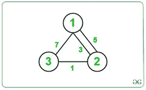
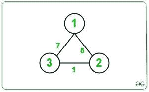

# 通过降低边的成本使用迪克斯特拉的最小成本

> 原文:[https://www . geeksforgeeks . org/通过降低边缘成本来降低使用成本的最低成本/](https://www.geeksforgeeks.org/minimum-cost-using-dijkstra-by-reducing-cost-of-an-edge/)

给定形式{X，Y，Z}的 N 个节点和 M 条边的无向图，使得在 **X** 和 **Y** 之间有一条边，代价为 **Z** 。任务是找到从源节点 **1** 到目的节点 **N** 的最小遍历成本，这样我们可以将遍历过程中仅一条路径的成本降低 2。
**举例:**

> **输入:** N = 3，M = 4，边= {{1，2，3}，{2，3，1}，{1，3，7}，{2，1，5 } }
> T3】输出:2
> T6】解释:T8】
> 
> 
> 
> 从源节点 1 到目标节点 N 的最小成本为= 3/2 + 1 = 1 + 1 = 2。
> **输入:** N = 3，M = 3，边= {{2，3，1}，{1，3，7}，{2，1，5}}
> **输出:** 2
> **解释:**
> 
> 
> 
> 从源节点 1 到目标节点 N 的最小成本为= 7/2 = 3。

**方法:**思路是考虑每一条边，通过降低其成本来尽量降低整体成本。主要思想是打破从源到目的地的路径，进入源到任意顶点 **u** 即**路径(1 到 u)** 和从目的地到任意顶点 **v** 即**路径(n 到 v)** 为所有 u 和 v，下面是步骤:

1.  执行[迪克斯特拉算法](https://www.geeksforgeeks.org/dijkstras-shortest-path-algorithm-greedy-algo-7/)从源**节点 1** 为所有顶点找到单个源最短路径，并将其存储在数组中作为 **dist_from_source[]** 。
2.  执行迪克斯特拉算法，从源**节点 N** 为所有顶点找到单一源最短路径，并将其存储在数组中作为 **dist_from_dest[]** 。
3.  将最小成本(比如**最小成本**)初始化为最大值。
4.  遍历给定的边，对于每个边，将当前成本减少一半，并将最小成本更新为:

> minCost = min(minCost，dist _ from _ source[u]+c/2+dist _ from _ dest[v])
> 其中，
> c 是当前边的成本，
> dist_from_source[u]是从节点 1 到 u 的路径成本
> dist_from_source[v]是从节点 v 到 N 的路径成本

2.  完成上述步骤后，打印**最小成本**的值。

以下是上述方法的实现:

## C++14

```
// C++ program for the above approach
#include <bits/stdc++.h>
using namespace std;
#define INF 1e9

// Function for Dijkstra Algorithm to
// find single source shortest path
void dijkstra(int source, int n,
              vector<pair<int,
                          int> >
                  adj[],
              vector<int>& dist)
{
    // Resize dist[] to N and assign
    // any large value to it
    dist.resize(n, INF);

    // Initialise distance of source
    // node as 0
    dist = 0;

    // Using min-heap priority_queue
    // for sorting wrt edges_cost
    priority_queue<pair<int, int>,
                   vector<pair<int,
                               int> >,
                   greater<pair<int,
                                int> > >
        pq;

    // Push the current dist
    // and source to pq
    pq.push({ dist, source });

    // Until priority queue is empty
    while (!pq.empty()) {

        // Store the cost of linked
        // node to edges
        int u = pq.top().second;
        // int d = pq.top().first;

        // Pop the top node
        pq.pop();

        // Iterate over edges
        for (auto& edge : adj[u]) {

            // Find the starting and
            // ending vertex of edge
            int v = edge.first;
            int w = edge.second;

            // Update the distance of
            // node v to minimum of
            // dist[u] + w if it is
            // minimum
            if (dist[u] + w < dist[v]) {
                dist[v] = dist[u] + w;
                pq.push({ dist[v], v });
            }
        }
    }
}

// Function to find the minimum cost
// between node 1 to node n
void minCostPath(
    vector<pair<int, pair<int, int> > >& edges,
    int n, int M)
{

    // To create Adjacency List
    vector<pair<int, int> > adj[100005];

    // Iterate over edges
    for (int i = 0; i < M; i++) {

        // Get source, destination and
        // edges of edges[i]
        int x = edges[i].first;
        int y = edges[i].second.first;
        int z = edges[i].second.second;

        // Create Adjacency List
        adj[x].push_back({ y, z });
        adj[y].push_back({ x, z });
    }

    // To store the cost from node 1
    // and node N
    vector<int> dist_from_source;
    vector<int> dist_from_dest;

    // Find the cost of travel between
    // source(1) to any vertex
    dijkstra(1, n + 1, adj, dist_from_source);

    // Find the cost of travel between
    // destination(n) to any vertex
    dijkstra(n, n + 1, adj, dist_from_dest);

    // Initialise the minimum cost
    int min_cost = dist_from_source[n];

    // Traverse the edges
    for (auto& it : edges) {

        // Get the edges
        int u = it.first;
        int v = it.second.first;
        int c = it.second.second;

        // Find the current cost from
        // node 1 to u and node u to v
        // and node v to N with only
        // current edge cost reduced
        // to half
        int cur_cost = dist_from_source[u]
                       + c / 2
                       + dist_from_dest[v];

        // Update the min_cost
        min_cost = min(min_cost, cur_cost);
    }

    // Print the minimum cost
    cout << min_cost << '\n';
}

// Driver Code
int main()
{
    // Give Nodes and Edges
    int N = 3;
    int M = 3;

    // Given Edges with cost
    vector<pair<int, pair<int, int> > > edges;

    edges.push_back({ 2, { 3, 1 } });
    edges.push_back({ 1, { 3, 7 } });
    edges.push_back({ 2, { 1, 5 } });

    // Function Call
    minCostPath(edges, N, M);
    return 0;
}
```

## java 描述语言

```
<script>

// Javascript program for the above approach

// Function for Dijkstra Algorithm to
// find single source shortest path
function dijkstra(source, n, adj, dist)
{

    // Resize dist[] to N and assign
    // any large value to it
    dist = Array(n).fill(1000000000);

    // Initialise distance of source
    // node as 0
    dist = 0;

    // Using min-heap priority_queue
    // for sorting wrt edges_cost
    var pq = [];

    // Push the current dist
    // and source to pq
    pq.push([dist, source]);

    // Until priority queue is empty
    while (pq.length!=0) {

        // Store the cost of linked
        // node to edges
        var u = pq[pq.length-1][1];
        // int d = pq.top()[0];

        // Pop the top node
        pq.pop();

        // Iterate over edges
        for (var edge of adj[u]) {

            // Find the starting and
            // ending vertex of edge
            var v = edge[0];
            var w = edge[1];

            // Update the distance of
            // node v to minimum of
            // dist[u] + w if it is
            // minimum
            if (dist[u] + w < dist[v]) {
                dist[v] = dist[u] + w;
                pq.push([dist[v], v ]);
            }
        }
        pq.sort();
    }
    return dist;
}

// Function to find the minimum cost
// between node 1 to node n
function minCostPath(edges, n, M)
{

    // To create Adjacency List
    var adj = Array.from(Array(100005), ()=>new Array());

    // Iterate over edges
    for (var i = 0; i < M; i++) {

        // Get source, destination and
        // edges of edges[i]
        var x = edges[i][0];
        var y = edges[i][1][0];
        var z = edges[i][1][1];

        // Create Adjacency List
        adj[x].push([y, z ]);
        adj[y].push([x, z ]);
    }

    // To store the cost from node 1
    // and node N
    var dist_from_source = [];
    var dist_from_dest = [];

    // Find the cost of travel between
    // source(1) to any vertex
    dist_from_source = dijkstra(1, n + 1, adj, dist_from_source);

    // Find the cost of travel between
    // destination(n) to any vertex
    dist_from_dest = dijkstra(n, n + 1, adj, dist_from_dest);

    // Initialise the minimum cost
    var min_cost = dist_from_source[n];

    // Traverse the edges
    for (var it of edges) {

        // Get the edges
        var u = it[0];
        var v = it[1][0];
        var c = it[1][1];

        // Find the current cost from
        // node 1 to u and node u to v
        // and node v to N with only
        // current edge cost reduced
        // to half
        var cur_cost = dist_from_source[u]
                       + parseInt(c / 2)
                       + dist_from_dest[v];

        // Update the min_cost
        min_cost = Math.min(min_cost, cur_cost);
    }

    // Print the minimum cost
    document.write( min_cost + "<br>");
}

// Driver Code
// Give Nodes and Edges
var N = 3;
var M = 3;

// Given Edges with cost
var edges = [];
edges.push([2, [3, 1]]);
edges.push([1, [3, 7 ]]);
edges.push([2, [1, 5 ]]);

// Function Call
minCostPath(edges, N, M);

// This code is contributed by noob2000.

</script>
```

## 蟒蛇 3

```
# Python3 program for the above approach
import heapq as hq

INF = 1e9

# Function for Dijkstra Algorithm to
# find single source shortest path
def dijkstra(source, n, adj, dist):
    # Initialise distance of source
    # node as 0
    dist = 0

    # Using min-heap priority_queue
    # for sorting wrt edges_cost
    pq = []

    # Push the current dist
    # and source to pq
    hq.heappush(pq, (dist, source))

    # Until priority queue is empty
    while pq:

        # Store the cost of linked
        # node to edges
        d, u = hq.heappop(pq)

        # Iterate over edges
        for v,w in adj[u]:

            # Update the distance of
            # node v to minimum of
            # dist[u] + w if it is
            # minimum
            if dist[u] + w < dist[v]:
                dist[v] = dist[u] + w
                hq.heappush(pq, (dist[v], v))

# Function to find the minimum cost
# between node 1 to node n
def minCostPath(edges, n, M):

    # To create Adjacency List
    adj = [[]for _ in range(100005)]

    # Iterate over edges
    for i in range(M):

        # Get source, destination and
        # edges of edges[i]
        x = edges[i][0]
        y = edges[i][1][0]
        z = edges[i][1][1]

        # Create Adjacency List
        adj[x].append((y, z))
        adj[y].append((x, z))

    # To store the cost from node 1
    # and node N
    dist_from_source = [INF] * (n+1)
    dist_from_dest = [INF] * (n+1)

    # Find the cost of travel between
    # source(1) to any vertex
    dijkstra(1, n + 1, adj, dist_from_source)

    # Find the cost of travel between
    # destination(n) to any vertex
    dijkstra(n, n + 1, adj, dist_from_dest)

    # Initialise the minimum cost
    min_cost = dist_from_source[n]

    # Traverse the edges
    for it in edges:

        # Get the edges
        u = it[0]
        v = it[1][0]
        c = it[1][1]

        # Find the current cost from
        # node 1 to u and node u to v
        # and node v to N with only
        # current edge cost reduced
        # to half
        cur_cost = dist_from_source[u] + c // 2 + dist_from_dest[v]

        # Update the min_cost
        min_cost = min(min_cost, cur_cost)

    # Prthe minimum cost
    print(min_cost)

# Driver Code
if __name__ == "__main__":
    # Give Nodes and Edges
    N = 3
    M = 3

    # Given Edges with cost
    edges = []

    edges.append((2, (3, 1)))
    edges.append((1, (3, 7)))
    edges.append((2, (1, 5)))

    # Function Call
    minCostPath(edges, N, M)
```

**Output:** 

```
3
```

***时间复杂度:** O(N + M)，其中 N 为节点数，M 为边数。*
***辅助空间:** O(N)，其中 N 为节点数。*