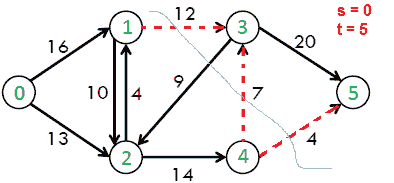

# 寻找流网络中的最小 s-t 切割

> 原文:[https://www . geeksforgeeks . org/有向图中的最小切割数/](https://www.geeksforgeeks.org/minimum-cut-in-a-directed-graph/)

在流网络中，s-t 割是一种要求源和宿在不同子集内的割，它由从源侧到宿侧的边组成。s-t 割集的容量由割集中每条边的容量之和定义。(来源: [Wiki](http://en.wikipedia.org/wiki/Cut_(graph_theory)) )
这里讨论的问题是找到给定网络的最小容量 s-t 割。预期输出是最小切割的所有边缘。

例如，在下面的流网络中，示例 s-t 切割是{{0，1}、{0，2}}、{{0，2}、{1，2}、{1，3}}等。最小 s-t 切割为{{1，3}，{4，3}，{4 5}}容量为 12+7+4 = 23。

[](https://media.geeksforgeeks.org/wp-content/cdn-uploads/minCut.png)

我们强烈建议先阅读下面的帖子。最大流问题的福特-富尔克森算法

**最小割和最大流**
和[最大二部匹配](https://www.geeksforgeeks.org/maximum-bipartite-matching/)一样，这是另一个可以用[福特-富尔克森算法](https://www.geeksforgeeks.org/ford-fulkerson-algorithm-for-maximum-flow-problem/)解决的问题。这是基于最大流最小割定理。

[最大流量最小割定理](http://en.wikipedia.org/wiki/Max-flow_min-cut_theorem)指出，在一个流量网络中，最大流量等于最小割的容量。这个定理的证明见 [CLRS 书](http://www.flipkart.com/introduction-algorithms-3/p/itmczynzhyhxv2gs?pid=9788120340077&affid=sandeepgfg)。

从福特-福尔克森，我们得到了最低削减的能力。如何打印形成最小切口的所有边？思路是用[残差图](https://www.geeksforgeeks.org/ford-fulkerson-algorithm-for-maximum-flow-problem/)。

以下是打印最小切口所有边缘的步骤。

**1)** 运行福特-富尔克森算法，考虑最终的[残差图](https://www.geeksforgeeks.org/ford-fulkerson-algorithm-for-maximum-flow-problem/)。

**2)** 在残差图中找到从源可达的顶点集。

**3)** 从可达顶点到不可达顶点的所有边都是最小割边。打印所有这样的边。

下面是上述方法的实现。

## C++

```
// C++ program for finding minimum cut using Ford-Fulkerson
#include <iostream>
#include <limits.h>
#include <string.h>
#include <queue>
using namespace std;

// Number of vertices in given graph
#define V 6

/* Returns true if there is a path from source 's' to sink 't' in
  residual graph. Also fills parent[] to store the path */
int bfs(int rGraph[V][V], int s, int t, int parent[])
{
    // Create a visited array and mark all vertices as not visited
    bool visited[V];
    memset(visited, 0, sizeof(visited));

    // Create a queue, enqueue source vertex and mark source vertex
    // as visited
    queue <int> q;
    q.push(s);
    visited[s] = true;
    parent[s] = -1;

    // Standard BFS Loop
    while (!q.empty())
    {
        int u = q.front();
        q.pop();

        for (int v=0; v<V; v++)
        {
            if (visited[v]==false && rGraph[u][v] > 0)
            {
                q.push(v);
                parent[v] = u;
                visited[v] = true;
            }
        }
    }

    // If we reached sink in BFS starting from source, then return
    // true, else false
    return (visited[t] == true);
}

// A DFS based function to find all reachable vertices from s.  The function
// marks visited[i] as true if i is reachable from s.  The initial values in
// visited[] must be false. We can also use BFS to find reachable vertices
void dfs(int rGraph[V][V], int s, bool visited[])
{
    visited[s] = true;
    for (int i = 0; i < V; i++)
       if (rGraph[s][i] && !visited[i])
           dfs(rGraph, i, visited);
}

// Prints the minimum s-t cut
void minCut(int graph[V][V], int s, int t)
{
    int u, v;

    // Create a residual graph and fill the residual graph with
    // given capacities in the original graph as residual capacities
    // in residual graph
    int rGraph[V][V]; // rGraph[i][j] indicates residual capacity of edge i-j
    for (u = 0; u < V; u++)
        for (v = 0; v < V; v++)
             rGraph[u][v] = graph[u][v];

    int parent[V];  // This array is filled by BFS and to store path

    // Augment the flow while there is a path from source to sink
    while (bfs(rGraph, s, t, parent))
    {
        // Find minimum residual capacity of the edhes along the
        // path filled by BFS. Or we can say find the maximum flow
        // through the path found.
        int path_flow = INT_MAX;
        for (v=t; v!=s; v=parent[v])
        {
            u = parent[v];
            path_flow = min(path_flow, rGraph[u][v]);
        }

        // update residual capacities of the edges and reverse edges
        // along the path
        for (v=t; v != s; v=parent[v])
        {
            u = parent[v];
            rGraph[u][v] -= path_flow;
            rGraph[v][u] += path_flow;
        }
    }

    // Flow is maximum now, find vertices reachable from s
    bool visited[V];
    memset(visited, false, sizeof(visited));
    dfs(rGraph, s, visited);

    // Print all edges that are from a reachable vertex to
    // non-reachable vertex in the original graph
    for (int i = 0; i < V; i++)
      for (int j = 0; j < V; j++)
         if (visited[i] && !visited[j] && graph[i][j])
              cout << i << " - " << j << endl;

    return;
}

// Driver program to test above functions
int main()
{
    // Let us create a graph shown in the above example
    int graph[V][V] = { {0, 16, 13, 0, 0, 0},
                        {0, 0, 10, 12, 0, 0},
                        {0, 4, 0, 0, 14, 0},
                        {0, 0, 9, 0, 0, 20},
                        {0, 0, 0, 7, 0, 4},
                        {0, 0, 0, 0, 0, 0}
                      };

    minCut(graph, 0, 5);

    return 0;
}
```

## Java 语言(一种计算机语言，尤用于创建网站)

```
// Java program for finding min-cut in the given graph
import java.util.LinkedList;
import java.util.Queue;

public class Graph {

    // Returns true if there is a path
    // from source 's' to sink 't' in residual 
    // graph. Also fills parent[] to store the path 
    private static boolean bfs(int[][] rGraph, int s,
                                int t, int[] parent) {

        // Create a visited array and mark 
        // all vertices as not visited     
        boolean[] visited = new boolean[rGraph.length];

        // Create a queue, enqueue source vertex
        // and mark source vertex as visited     
        Queue<Integer> q = new LinkedList<Integer>();
        q.add(s);
        visited[s] = true;
        parent[s] = -1;

        // Standard BFS Loop     
        while (!q.isEmpty()) {
            int v = q.poll();
            for (int i = 0; i < rGraph.length; i++) {
                if (rGraph[v][i] > 0 && !visited[i]) {
                    q.offer(i);
                    visited[i] = true;
                    parent[i] = v;
                }
            }
        }

        // If we reached sink in BFS starting 
        // from source, then return true, else false     
        return (visited[t] == true);
    }

    // A DFS based function to find all reachable 
    // vertices from s. The function marks visited[i] 
    // as true if i is reachable from s. The initial 
    // values in visited[] must be false. We can also 
    // use BFS to find reachable vertices
    private static void dfs(int[][] rGraph, int s,
                                boolean[] visited) {
        visited[s] = true;
        for (int i = 0; i < rGraph.length; i++) {
                if (rGraph[s][i] > 0 && !visited[i]) {
                    dfs(rGraph, i, visited);
                }
        }
    }

    // Prints the minimum s-t cut
    private static void minCut(int[][] graph, int s, int t) {
        int u,v;

        // Create a residual graph and fill the residual 
        // graph with given capacities in the original 
        // graph as residual capacities in residual graph
        // rGraph[i][j] indicates residual capacity of edge i-j
        int[][] rGraph = new int[graph.length][graph.length]; 
        for (int i = 0; i < graph.length; i++) {
            for (int j = 0; j < graph.length; j++) {
                rGraph[i][j] = graph[i][j];
            }
        }

        // This array is filled by BFS and to store path
        int[] parent = new int[graph.length]; 

        // Augment the flow while tere is path from source to sink     
        while (bfs(rGraph, s, t, parent)) {

            // Find minimum residual capacity of the edhes 
            // along the path filled by BFS. Or we can say 
            // find the maximum flow through the path found.
            int pathFlow = Integer.MAX_VALUE;         
            for (v = t; v != s; v = parent[v]) {
                u = parent[v];
                pathFlow = Math.min(pathFlow, rGraph[u][v]);
            }

            // update residual capacities of the edges and 
            // reverse edges along the path
            for (v = t; v != s; v = parent[v]) {
                u = parent[v];
                rGraph[u][v] = rGraph[u][v] - pathFlow;
                rGraph[v][u] = rGraph[v][u] + pathFlow;
            }
        }

        // Flow is maximum now, find vertices reachable from s     
        boolean[] isVisited = new boolean[graph.length];     
        dfs(rGraph, s, isVisited);

        // Print all edges that are from a reachable vertex to
        // non-reachable vertex in the original graph     
        for (int i = 0; i < graph.length; i++) {
            for (int j = 0; j < graph.length; j++) {
                if (graph[i][j] > 0 && isVisited[i] && !isVisited[j]) {
                    System.out.println(i + " - " + j);
                }
            }
        }
    }

    //Driver Program
    public static void main(String args[]) {

        // Let us create a graph shown in the above example
        int graph[][] = { {0, 16, 13, 0, 0, 0},
                {0, 0, 10, 12, 0, 0},
                {0, 4, 0, 0, 14, 0},
                {0, 0, 9, 0, 0, 20},
                {0, 0, 0, 7, 0, 4},
                {0, 0, 0, 0, 0, 0}
            };
        minCut(graph, 0, 5);
    }
}
// This code is contributed by Himanshu Shekhar
```

## 计算机编程语言

```
# Python program for finding min-cut in the given graph 
# Complexity : (E*(V^3)) 
# Total augmenting path = VE and BFS 
# with adj matrix takes :V^2 times 

from collections import defaultdict 

# This class represents a directed graph
# using adjacency matrix representation 
class Graph: 

    def __init__(self,graph): 
        self.graph = graph # residual graph 
        self.org_graph = [i[:] for i in graph] 
        self. ROW = len(graph) 
        self.COL = len(graph[0]) 

    '''Returns true if there is a path from 
    source 's' to sink 't' in 
    residual graph. Also fills 
    parent[] to store the path '''
    def BFS(self,s, t, parent): 

        # Mark all the vertices as not visited 
        visited =[False]*(self.ROW) 

        # Create a queue for BFS 
        queue=[] 

        # Mark the source node as visited and enqueue it 
        queue.append(s) 
        visited[s] = True

        # Standard BFS Loop 
        while queue: 

            #Dequeue a vertex from queue and print it 
            u = queue.pop(0) 

            # Get all adjacent vertices of 
            # the dequeued vertex u 
            # If a adjacent has not been
            # visited, then mark it 
            # visited and enqueue it 
            for ind, val in enumerate(self.graph[u]): 
                if visited[ind] == False and val > 0 : 
                    queue.append(ind) 
                    visited[ind] = True
                    parent[ind] = u 

        # If we reached sink in BFS starting
        # from source, then return 
        # true, else false 
        return True if visited[t] else False

    # Function for Depth first search 
    # Traversal of the graph
    def dfs(self, graph,s,visited):
        visited[s]=True
        for i in range(len(graph)):
            if graph[s][i]>0 and not visited[i]:
                self.dfs(graph,i,visited)

    # Returns the min-cut of the given graph 
    def minCut(self, source, sink): 

        # This array is filled by BFS and to store path 
        parent = [-1]*(self.ROW) 

        max_flow = 0 # There is no flow initially 

        # Augment the flow while there is path from source to sink 
        while self.BFS(source, sink, parent) : 

            # Find minimum residual capacity of the edges along the 
            # path filled by BFS. Or we can say find the maximum flow 
            # through the path found. 
            path_flow = float("Inf") 
            s = sink 
            while(s != source): 
                path_flow = min (path_flow, self.graph[parent[s]][s]) 
                s = parent[s] 

            # Add path flow to overall flow 
            max_flow += path_flow 

            # update residual capacities of the edges and reverse edges 
            # along the path 
            v = sink 
            while(v != source): 
                u = parent[v] 
                self.graph[u][v] -= path_flow 
                self.graph[v][u] += path_flow 
                v = parent[v] 

        visited=len(self.graph)*[False]
        self.dfs(self.graph,s,visited)

        # print the edges which initially had weights 
        # but now have 0 weight 
        for i in range(self.ROW): 
            for j in range(self.COL): 
                if self.graph[i][j] == 0 and\
                self.org_graph[i][j] > 0 and visited[i]: 
                    print str(i) + " - " + str(j) 

# Create a graph given in the above diagram 
graph = [[0, 16, 13, 0, 0, 0], 
        [0, 0, 10, 12, 0, 0], 
        [0, 4, 0, 0, 14, 0], 
        [0, 0, 9, 0, 0, 20], 
        [0, 0, 0, 7, 0, 4], 
        [0, 0, 0, 0, 0, 0]] 

g = Graph(graph) 

source = 0; sink = 5

g.minCut(source, sink) 

# This code is contributed by Neelam Yadav 
```

## C#

```
// C# program for finding min-cut in the given graph
using System;
using System.Collections.Generic;

class Graph
{

    // Returns true if there is a path
    // from source 's' to sink 't' in residual 
    // graph. Also fills parent[] to store the path 
    private static bool bfs(int[,] rGraph, int s,
                            int t, int[] parent) 
    {

        // Create a visited array and mark 
        // all vertices as not visited     
        bool[] visited = new bool[rGraph.Length];

        // Create a queue, enqueue source vertex
        // and mark source vertex as visited     
        Queue<int> q = new Queue<int>();
        q.Enqueue(s);
        visited[s] = true;
        parent[s] = -1;

        // Standard BFS Loop     
        while (q.Count != 0) 
        {
            int v = q.Dequeue();
            for (int i = 0; i < rGraph.GetLength(0); i++) 
            {
                if (rGraph[v,i] > 0 && !visited[i]) 
                {
                    q.Enqueue(i);
                    visited[i] = true;
                    parent[i] = v;
                }
            }
        }

        // If we reached sink in BFS starting 
        // from source, then return true, else false     
        return (visited[t] == true);
    }

    // A DFS based function to find all reachable 
    // vertices from s. The function marks visited[i] 
    // as true if i is reachable from s. The initial 
    // values in visited[] must be false. We can also 
    // use BFS to find reachable vertices
    private static void dfs(int[,] rGraph, int s,
                            bool[] visited) 
    {
        visited[s] = true;
        for (int i = 0; i < rGraph.GetLength(0); i++) 
        {
            if (rGraph[s,i] > 0 && !visited[i])
            {
                dfs(rGraph, i, visited);
            }
        }
    }

    // Prints the minimum s-t cut
    private static void minCut(int[,] graph, int s, int t) 
    {
        int u, v;

        // Create a residual graph and fill the residual 
        // graph with given capacities in the original 
        // graph as residual capacities in residual graph
        // rGraph[i,j] indicates residual capacity of edge i-j
        int[,] rGraph = new int[graph.Length,graph.Length]; 
        for (int i = 0; i < graph.GetLength(0); i++)
        {
            for (int j = 0; j < graph.GetLength(1); j++)
            {
                rGraph[i, j] = graph[i, j];
            }
        }

        // This array is filled by BFS and to store path
        int[] parent = new int[graph.Length]; 

        // Augment the flow while there is path
        // from source to sink     
        while (bfs(rGraph, s, t, parent)) 
        {

            // Find minimum residual capacity of the edhes 
            // along the path filled by BFS. Or we can say 
            // find the maximum flow through the path found.
            int pathFlow = int.MaxValue;         
            for (v = t; v != s; v = parent[v]) 
            {
                u = parent[v];
                pathFlow = Math.Min(pathFlow, rGraph[u, v]);
            }

            // update residual capacities of the edges and 
            // reverse edges along the path
            for (v = t; v != s; v = parent[v])
            {
                u = parent[v];
                rGraph[u, v] = rGraph[u, v] - pathFlow;
                rGraph[v, u] = rGraph[v, u] + pathFlow;
            } 
        }

        // Flow is maximum now, find vertices reachable from s     
        bool[] isVisited = new bool[graph.Length];     
        dfs(rGraph, s, isVisited);

        // Print all edges that are from a reachable vertex to
        // non-reachable vertex in the original graph     
        for (int i = 0; i < graph.GetLength(0); i++) 
        {
            for (int j = 0; j < graph.GetLength(1); j++)
            {
                if (graph[i, j] > 0 && 
                    isVisited[i] && !isVisited[j])
                {
                    Console.WriteLine(i + " - " + j);
                }
            }
        }
    }

    // Driver Code
    public static void Main(String []args)
    {

        // Let us create a graph shown 
        // in the above example
        int [,]graph = {{0, 16, 13, 0, 0, 0},
                        {0, 0, 10, 12, 0, 0},
                        {0, 4, 0, 0, 14, 0},
                        {0, 0, 9, 0, 0, 20},
                        {0, 0, 0, 7, 0, 4},
                        {0, 0, 0, 0, 0, 0}};
        minCut(graph, 0, 5);
    }
}

// This code is contributed by PrinciRaj1992
```

**Output:**

```
1 - 3
4 - 3
4 - 5
```

**参考文献:**
[http://www . Stanford . edu/class/cs97si/08-network-flow-problems . pdf](http://www.stanford.edu/class/cs97si/08-network-flow-problems.pdf)
[http://www . cs . Princeton . edu/courses/archive/spring 06/cos 226/讲座/maxflow.pdf](http://www.cs.princeton.edu/courses/archive/spring06/cos226/lectures/maxflow.pdf)

如果您发现任何不正确的地方，或者您想分享更多关于上面讨论的主题的信息，请写评论