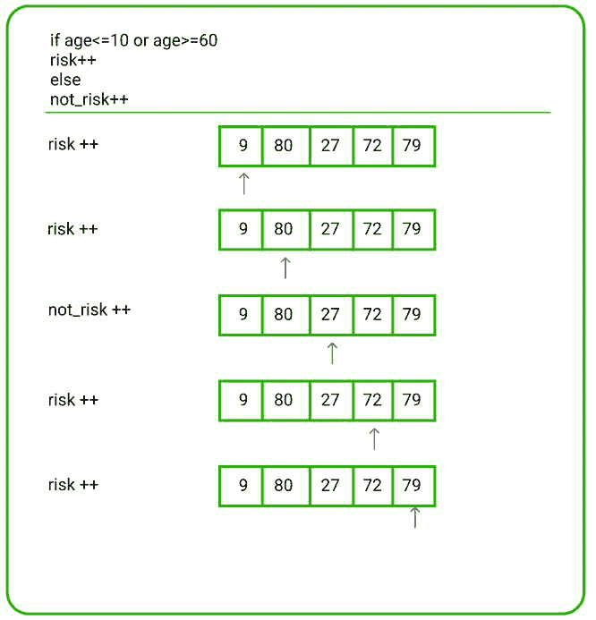

# 治愈 N 人所需的最少天数

> 原文:[https://www . geesforgeks . org/最短治愈天数-n-persons/](https://www.geeksforgeeks.org/minimum-days-required-to-cure-n-persons/)

给定一个[数组](https://www.geeksforgeeks.org/array-data-structure/)**arr【】**，代表医院中 **N** 人的年龄，并且每天最多只有一个医生可以给 **P** 人注射免疫剂量，任务是找到给予治疗所需的最小天数，使得一个**高风险的人**和一个正常人在同一天没有注射剂量。
***注:**凡年龄 **≤ 10** 或 **≥ 60** 者均视为**高风险人群**。*

**示例:**

> **输入:** arr[] = {9，80，27，72，79}，P = 2
> **输出:** 3
> **说明:**
> 有 4 个高风险人群。因此，在第 1 天和第 2 天，可以免疫 2 名高风险人员。最后一天，正常人可以免疫。因此，需要 3 天。
> 
> [](https://media.geeksforgeeks.org/wp-content/uploads/20210104151451/vaccinechart.JPG)

**方法:**按照以下步骤解决问题:

1.  初始化一个变量，比如**风险**，存储年龄小于等于 **10** 且大于等于 **60** 的人数。
2.  初始化一个变量，比如 **normal_risk** ，存储年龄在**【11，59】**范围内的人数
3.  [遍历数组](https://www.geeksforgeeks.org/c-program-to-traverse-an-array/)检查年龄是否小于等于 **10** 或大于等于 **60** 。如果发现为真，则增加**风险**的值。
4.  否则，增加 **normal_risk** 的值。
5.  最后打印**上限(风险/ P) +上限(正常 _ 风险/ P)** 的值

下面是上述方法的实现:

## C++

```
// C++ Program for the above approach

#include <bits/stdc++.h>
using namespace std;

// Function to find minimum count of days required
// to give a cure such that the high risk person
// and risk person does not get a dose on same day.
void daysToCure(int arr[], int N, int P)
{

    // Stores count of persons whose age is
    // less than or equal to 10 and
    // greater than or equal to 60.
    int risk = 0;

    // Stores the count of persons
    // whose age is in the range [11, 59]
    int normal_risk = 0;

    // Traverse the array arr[]
    for (int i = 0; i < N; i++) {

        // If age less than or equal to 10
        // or greater than or equal to 60
        if (arr[i] >= 60 || arr[i] <= 10) {

            // Update risk
            risk++;
        }
        else {

            // Update normal_risk
            normal_risk++;
        }
    }

    // Calculate days to cure risk
    // and normal_risk persons
    int days = (risk / P) + (risk % P > 0)
               + (normal_risk / P)
               + (normal_risk % P > 0);

    // Print the days
    cout << days;
}

// Driver Code
int main()
{
    // Given array
    int arr[] = { 9, 80, 27, 72, 79 };

    // Size of the array
    int N = sizeof(arr) / sizeof(arr[0]);

    // Given P
    int P = 2;

    daysToCure(arr, N, P);

    return 0;
}
```

## Java 语言(一种计算机语言，尤用于创建网站)

```
// Java Program for the above approach
class GFG
{
  // Function to find minimum count of days required
  // to give a cure such that the high risk person
  // and risk person does not get a dose on same day.
  static void daysToCure(int arr[], int N, int P)
  {

    // Stores count of persons whose age is
    // less than or equal to 10 and
    // greater than or equal to 60.
    int risk = 0;

    // Stores the count of persons
    // whose age is in the range [11, 59]
    int normal_risk = 0;

    // Traverse the array arr[]
    for (int i = 0; i < N; i++)
    {

      // If age less than or equal to 10
      // or greater than or equal to 60
      if (arr[i] >= 60 || arr[i] <= 10)
      {

        // Update risk
        risk++;
      }
      else
      {

        // Update normal_risk
        normal_risk++;
      }
    }

    // Calculate days to cure risk
    // and normal_risk persons
    int days = (risk / P) +  (normal_risk / P);

    if(risk % P > 0)
    {
      days++;
    }

    if(normal_risk % P > 0)
    {
      days++;
    }

    // Print the days
    System.out.print(days);
  } 

    public static void main(String[] args) {
        // Given array
        int arr[] = { 9, 80, 27, 72, 79 };

        // Size of the array
        int N = arr.length;

        // Given P
        int P = 2;  
        daysToCure(arr, N, P);
    }
}

// This code is contributed by divyeshrabadiya07
```

## 蟒蛇 3

```
# Python3 Program for the above approach

# Function to find minimum count of days required
# to give a cure such that the high risk person
# and risk person does not get a dose on same day.
def daysToCure(arr, N, P):

    # Stores count of persons whose age is
    # less than or equal to 10 and
    # greater than or equal to 60.
    risk = 0

    # Stores the count of persons
    # whose age is in the range [11, 59]
    normal_risk = 0

    # Traverse the array arr[]
    for i in range(N):

        # If age less than or equal to 10
        # or greater than or equal to 60
        if (arr[i] >= 60 or arr[i] <= 10):

            # Update risk
            risk += 1
        else:

            # Update normal_risk
            normal_risk += 1

    # Calculate days to cure risk
    # and normal_risk persons
    days = (risk // P) + (risk % P > 0) + (normal_risk // P) + (normal_risk % P > 0)

    # Prthe days
    print (days)

# Driver Code
if __name__ == '__main__':

    # Given array
    arr = [9, 80, 27, 72, 79 ]

    # Size of the array
    N = len(arr)

    # Given P
    P = 2

    daysToCure(arr, N, P)

    # This code is contributed by mohit kumar 29.
```

## C#

```
// C# Program for the above approach
using System;
class GFG
{

  // Function to find minimum count of days required
  // to give a cure such that the high risk person
  // and risk person does not get a dose on same day.
  static void daysToCure(int[] arr, int N, int P)
  {

    // Stores count of persons whose age is
    // less than or equal to 10 and
    // greater than or equal to 60.
    int risk = 0;

    // Stores the count of persons
    // whose age is in the range [11, 59]
    int normal_risk = 0;

    // Traverse the array arr[]
    for (int i = 0; i < N; i++)
    {

      // If age less than or equal to 10
      // or greater than or equal to 60
      if (arr[i] >= 60 || arr[i] <= 10)
      {

        // Update risk
        risk++;
      }
      else
      {

        // Update normal_risk
        normal_risk++;
      }
    }

    // Calculate days to cure risk
    // and normal_risk persons
    int days = (risk / P) +  (normal_risk / P);

    if(risk % P > 0)
    {
      days++;
    }

    if(normal_risk % P > 0)
    {
      days++;
    }

    // Print the days
    Console.Write(days);
  }

  // Driver code
  static void Main()
  {

    // Given array
    int[] arr = { 9, 80, 27, 72, 79 };

    // Size of the array
    int N = arr.Length;

    // Given P
    int P = 2;  
    daysToCure(arr, N, P);
  }
}

// This code is contributed by divyesh072019.
```

## java 描述语言

```
<script>
// javascript Program for the above approach

    // Function to find minimum count of days required
    // to give a cure such that the high risk person
    // and risk person does not get a dose on same day.
    function daysToCure(arr , N , P) {

        // Stores count of persons whose age is
        // less than or equal to 10 and
        // greater than or equal to 60.
        var risk = 0;

        // Stores the count of persons
        // whose age is in the range [11, 59]
        var normal_risk = 0;

        // Traverse the array arr
        for (i = 0; i < N; i++) {

            // If age less than or equal to 10
            // or greater than or equal to 60
            if (arr[i] >= 60 || arr[i] <= 10) {

                // Update risk
                risk++;
            } else {

                // Update normal_risk
                normal_risk++;
            }
        }

        // Calculate days to cure risk
        // and normal_risk persons
        var days = parseInt((risk / P) + (normal_risk / P));

        if (risk % P > 0) {
            days++;
        }

        if (normal_risk % P > 0) {
            days++;
        }

        // Print the days
        document.write(days);
    }

        // Given array
        var arr = [ 9, 80, 27, 72, 79 ];

        // Size of the array
        var N = arr.length;

        // Given P
        var P = 2;
        daysToCure(arr, N, P);

// This code contributed by Rajput-Ji

</script>
```

**Output**

```
3
```

***时间复杂度:**O(N)*
T5**辅助空间:** O(1)