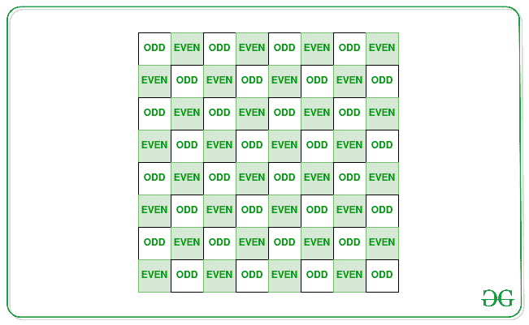

# 使所有相邻矩阵元素对不同所需的最小减量

> 原文:[https://www . geesforgeks . org/minimum-reductions-需要制作所有相邻矩阵元素对-distinct/](https://www.geeksforgeeks.org/minimum-decrements-required-to-make-all-pairs-of-adjacent-matrix-elements-distinct/)

给定维度为 **N * M** 的[矩阵](https://www.geeksforgeeks.org/matrix/)**mat【】【】**，任务是计算所需的不同数组元素的最小递减数，使得没有两个相邻的矩阵元素相等。

**示例:**

> **输入:** mat[][] = { {2，3，4}，{2，5，4} }
> **输出:** 3
> **说明:**将矩阵元素 arr[0][0]、arr[0][1]和 arr[0][2]各减少 1。矩阵修改为{{1，2，3}，{2，5，4}}。因此，所有相邻矩阵元素对都变得不同。
> 
> **输入:** mat[][] = { {1，2，3}，{1，2，3}，{1，2，3} }
> **输出:** 3
> **解释:**将矩阵第二行中的每个元素减少 1。矩阵的所有相邻元素都不同，如下所示:
> 1 2 3
> 0 1 2
> 1 2 3

**方法:**主要思想是通过假设矩阵像下面显示的象棋网格来解决给定的问题:

[](https://media.geeksforgeeks.org/wp-content/cdn-uploads/20210303152155/522313.jpg)

按照以下步骤解决问题:

1.  [遍历矩阵](https://www.geeksforgeeks.org/row-wise-vs-column-wise-traversal-matrix/)
2.  对于每个矩阵元素，会出现以下两种情况:
    *   **情况 1 :** 如果 **(i + j)** 是偶数，**垫【I】【j】**应该是偶数。否则 **mat[i][j]** 应该是奇数。
    *   **情况 2:** 如果 **(i + j)** 为偶数，则**mat【I】【j】**处的值应为偶数。否则， **mat[i][j]** 处的值应为奇数。
3.  因此，计算这两种情况下所需的操作数。
4.  打印获得的两个计数的最小值。

下面是上述方法的实现:

## C++

```
// C++ program for
// the above approach
#include <bits/stdc++.h>
using namespace std;

// Matrix dimensions
const int n = 3;
const int m = 3;

// Function to count minimum
// number of operations required
void countDecrements(long long arr[][m])
{
    int count_1 = 0;
    int count_2 = 0;

    for (int i = 0; i < n; i++) {
        for (int j = 0; j < m; j++) {

            // Case 1:
            if ((i + j) % 2 == arr[i][j] % 2)
                count_1++;

            // Case 2:
            if (1 - (i + j) % 2 == arr[i][j] % 2)
                count_2++;
        }
    }

    // Print the minimum number
    // of operations required
    cout << min(count_1, count_2);
}

// Driver Code
int main()
{
    // The given matrix
    long long arr[][m]
        = { { 1, 2, 3 },
            { 1, 2, 3 },
            { 1, 2, 3 } };

    // Function Call to count
    // the minimum number of
    // decrements required
    countDecrements(arr);

    return 0;
}
```

## Java 语言(一种计算机语言，尤用于创建网站)

```
// Java program for the above approach
import java.io.*;
import java.lang.*;
import java.util.*;

class GFG {

  // Function to count minimum
  // number of operations required
  static void countDecrements(long arr[][])
  {

    // Matrix dimensions
    int n = arr.length;
    int m = arr[0].length;

    int count_1 = 0;
    int count_2 = 0;

    for (int i = 0; i < n; i++) {
      for (int j = 0; j < m; j++) {

        // Case 1:
        if ((i + j) % 2 == arr[i][j] % 2)
          count_1++;

        // Case 2:
        if (1 - (i + j) % 2 == arr[i][j] % 2)
          count_2++;
      }
    }

    // Print the minimum number
    // of operations required
    System.out.println(Math.min(count_1, count_2));
  }

  // Driver Code
  public static void main(String[] args)
  {

    // The given matrix
    long arr[][] = { { 1, 2, 3 },
                    { 1, 2, 3 },
                    { 1, 2, 3 } };

    // Function Call to count
    // the minimum number of
    // decrements required
    countDecrements(arr);
  }
}

// This code is contributed by Kingash.
```

## 蟒蛇 3

```
# Python program for
# the above approach

# Matrix dimensions
n = 3
m = 3

# Function to count minimum
# number of operations required
def countDecrements(arr):
    count_1 = 0
    count_2 = 0

    for i in range(n):
        for j in range(m):

            # Case 1:
            if ((i + j) % 2 == arr[i][j] % 2):
                count_1 += 1

            # Case 2:
            if (1 - (i + j) % 2 == arr[i][j] % 2):
                count_2 += 1

    # Print the minimum number
    # of operations required
    print(min(count_1, count_2))

# Driver Code
# The given matrix
arr = [[1, 2, 3],
       [1, 2, 3],
       [1, 2, 3]]

# Function Call to count
# the minimum number of
# decrements required
countDecrements(arr)

# This code is contributed by souravmahato348.
```

## C#

```
// C# program for the above approach
using System;

class GFG{

// Function to count minimum
// number of operations required
static void countDecrements(long[,] arr)
{

    // Matrix dimensions
    int n = arr.GetLength(0);
    int m = arr.GetLength(1);

    int count_1 = 0;
    int count_2 = 0;

    for(int i = 0; i < n; i++)
    {
        for(int j = 0; j < m; j++)
        {

            // Case 1:
            if ((i + j) % 2 == arr[i, j] % 2)
                count_1++;

            // Case 2:
            if (1 - (i + j) % 2 == arr[i, j] % 2)
                count_2++;
        }
    }

    // Print the minimum number
    // of operations required
    Console.WriteLine(Math.Min(count_1, count_2));
}

// Driver Code
public static void Main()
{

    // The given matrix
    long[,] arr = { { 1, 2, 3 },
                    { 1, 2, 3 },
                    { 1, 2, 3 } };

    // Function Call to count
    // the minimum number of
    // decrements required
    countDecrements(arr);
}
}

// This code is contributed by ukasp
```

## java 描述语言

```
<script>

// Javascript program for
// the above approach

// Matrix dimensions
const n = 3;
const m = 3;

// Function to count minimum
// number of operations required
function countDecrements(arr)
{
    let count_1 = 0;
    let count_2 = 0;

    for(let i = 0; i < n; i++)
    {
        for(let j = 0; j < m; j++)
        {

            // Case 1:
            if ((i + j) % 2 == arr[i][j] % 2)
                count_1++;

            // Case 2:
            if (1 - (i + j) % 2 == arr[i][j] % 2)
                count_2++;
        }
    }

    // Print the minimum number
    // of operations required
    document.write(Math.min(count_1, count_2));
}

// Driver Code

// The given matrix
let arr = [ [ 1, 2, 3 ],
            [ 1, 2, 3 ],
            [ 1, 2, 3 ] ];

// Function Call to count
// the minimum number of
// decrements required
countDecrements(arr);

// This code is contributed by subhammahato348

</script>
```

**Output:** 

```
3
```

***时间复杂度:**O(N<sup>2</sup>)*
***辅助空间:** O(1)*