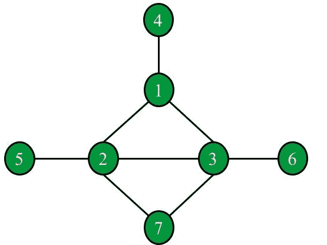

# 给定图形中形成三角形的三个节点的最小度数

> 原文:[https://www . geesforgeks . org/最小三节点度-在给定图形中形成三角形/](https://www.geeksforgeeks.org/minimum-degree-of-three-nodes-forming-a-triangle-in-a-given-graph/)

给定一个由 **N** 顶点和 **M** 边组成的[无向图](https://www.geeksforgeeks.org/graph-data-structure-and-algorithms/)和一个数组**边[][]** ，每行代表由一条边连接的两个顶点，任务是找出在图中形成一个[三角形的三个节点的最小度数。如果](https://www.geeksforgeeks.org/number-of-triangles-in-a-undirected-graph/)[图形](https://www.geeksforgeeks.org/graph-data-structure-and-algorithms/)中不存在任何三角形，则打印**-1”**。

**示例:**

> **输入:** N = 7，边= [[1，2]，[1，3]，[2，3]，[1，4]，[2，5]，[2，7]，[3，6]，[3，7]]
> **输出:** 4
> **解释:**以下是上图的表示:
> 
> [](https://media.geeksforgeeks.org/wp-content/uploads/20210221215520/ExampleGraph1.jpg)
> 
> 有两个相连的三角形:
> 
> 1.  一个由节点{1，2，3}组成。三角形的度数= 5。
> 2.  由节点{2，3，7}形成的第二个三角形。三角形的度数= 4。
> 
> 最低学历是 4。
> 
> **输入:** N = 6，边= [[1，2]，[1，3]，[2，3]，[1，6]，[3，4]，[4，5]]
> **输出:** 2

**方法:**给定的问题可以通过[求构成三角形的每三个节点的度](https://www.geeksforgeeks.org/find-degree-particular-vertex-graph/)，[计算该三角形中每个节点的度](https://www.geeksforgeeks.org/sum-of-degrees-of-all-nodes-of-a-undirected-graph/)来解决。按照以下步骤解决问题:

*   初始化一个变量，比如说 **ans** 为 [**INT_MAX**](https://www.geeksforgeeks.org/int_max-int_min-cc-applications/) ，存储形成三角形的节点的最小度数。
*   [从给定的一组边](https://www.geeksforgeeks.org/c-program-to-implement-adjacency-matrix-of-a-given-graph/)创建邻接矩阵。
*   [将给定图形的每个节点的度数](https://www.geeksforgeeks.org/finding-in-and-out-degrees-of-all-vertices-in-a-graph/)存储在辅助[数组](https://www.geeksforgeeks.org/introduction-to-arrays/)中，比如**度数[]** 。
*   现在，在范围**【1，N】**上迭代所有可能的节点三元组 **(i，j，k)** ，并执行以下步骤:
    *   [如果每对三元组](https://www.geeksforgeeks.org/check-if-every-vertex-triplet-in-graph-contains-two-vertices-connected-to-third-vertex/)之间都有边，那么就存在三角形。因此，将 **ans** 的值更新为 **ans** 和**的最小值(度[i] +度[j] +度[k]–6)**。
    *   否则[继续下一次迭代](https://www.geeksforgeeks.org/continue-statement-cpp/)。
*   完成上述步骤后，如果**和**的值为 **INT_MAX** ，则打印**-1”**。否则，将**和**的值打印为图形中任意三角形的最小度数。

下面是上述方法的实现:

## C++

```
// C++ program for the above approach

#include <bits/stdc++.h>
using namespace std;

// Function to find the minimum degree
// of a connected triangle in the graph
int minTrioDegree(int N,
                  vector<vector<int> >& Edges)
{
    // Store the degree of each node
    // in the graph
    int degree[N + 1] = { 0 };

    // Stores the representation of
    // graph in an adjancency matrix
    int adj[N + 1][N + 1] = { 0 };

    // Create the adjacency matrix and
    // count the degree of nodes
    for (int i = 0; i < Edges.size(); i++) {

        // u & v are the endpoint of
        // the ith edge
        int u = Edges[i][0];
        int v = Edges[i][1];

        // Mark both edges i.e.,
        // edge u->v and v->u
        adj[u][v] = adj[u][v] = 1;

        // Increment degree by 1
        // of both endnodes
        degree[u]++;
        degree[v]++;
    }

    // Stores the required result
    int ans = INT_MAX;

    // Traverse for the first node
    for (int i = 1; i <= N; i++) {

        // Traverse for the second node
        for (int j = i + 1; j <= N; j++) {

            // If there is an edge between
            // these two nodes
            if (adj[i][j] == 1) {

                // Traverse all possible
                // third nodes
                for (int k = j + 1;
                     k <= N; k++) {

                    // If there is an edge
                    // between third node
                    // and the previous two
                    if (adj[i][k] == 1
                        && adj[j][k] == 1) {

                        // Update ans
                        ans = min(ans,
                                  degree[i]
                                      + degree[j]
                                      + degree[k] - 6);
                    }
                }
            }
        }
    }

    // Return the result
    return ans == INT_MAX ? -1 : ans;
}

// Driver Code
int main()
{
    vector<vector<int> > Edges;
    Edges = { { 1, 2 }, { 1, 3 },
              { 2, 3 }, { 1, 4 },
              { 2, 5 }, { 2, 7 },
              { 3, 6 }, { 3, 7 } };
    int N = 7;

    cout << minTrioDegree(N, Edges);

    return 0;
}
```

## Java 语言(一种计算机语言，尤用于创建网站)

```
// Java program for the above approach
import java.util.*;

class GFG{

// Function to find the minimum degree
// of a connected triangle in the graph
static int minTrioDegree(int N,int [][]Edges)
{
    // Store the degree of each node
    // in the graph
    int degree[] = new int[N + 1];

    // Stores the representation of
    // graph in an adjancency matrix
    int adj[][] = new int[N + 1][N + 1];

    // Create the adjacency matrix and
    // count the degree of nodes
    for (int i = 0; i < Edges.length; i++) {

        // u & v are the endpoint of
        // the ith edge
        int u = Edges[i][0];
        int v = Edges[i][1];

        // Mark both edges i.e.,
        // edge u.v and v.u
        adj[u][v] = adj[u][v] = 1;

        // Increment degree by 1
        // of both endnodes
        degree[u]++;
        degree[v]++;
    }

    // Stores the required result
    int ans = Integer.MAX_VALUE;

    // Traverse for the first node
    for (int i = 1; i <= N; i++) {

        // Traverse for the second node
        for (int j = i + 1; j <= N; j++) {

            // If there is an edge between
            // these two nodes
            if (adj[i][j] == 1) {

                // Traverse all possible
                // third nodes
                for (int k = j + 1;
                     k <= N; k++) {

                    // If there is an edge
                    // between third node
                    // and the previous two
                    if (adj[i][k] == 1
                        && adj[j][k] == 1) {

                        // Update ans
                        ans = Math.min(ans,
                                  degree[i]
                                      + degree[j]
                                      + degree[k] - 6);
                    }
                }
            }
        }
    }

    // Return the result
    return ans == Integer.MAX_VALUE ? -1 : ans;
}

// Driver Code
public static void main(String[] args)
{
    int [][]Edges = { { 1, 2 }, { 1, 3 },
              { 2, 3 }, { 1, 4 },
              { 2, 5 }, { 2, 7 },
              { 3, 6 }, { 3, 7 } };
    int N = 7;

    System.out.print(minTrioDegree(N, Edges));

}
}

// This code is contributed by 29AjayKumar
```

## 蟒蛇 3

```
# Python3 program for the above approach
import sys

# Function to find the minimum degree
# of a connected triangle in the graph
def minTrioDegree(N, Edges):

    # Store the degree of each node
    # in the graph
    degree = [0] * (N+1)

    # Stores the representation of
    # graph in an adjancency matrix
    adj = []

    for i in range(0, N+1):
        temp = []
        for j in range(0, N+1):
            temp.append(0)

        adj.append(temp)

    # Create the adjacency matrix and
    # count the degree of nodes
    for i in range(len(Edges)):

        # u & v are the endpoint of
        # the ith edge
        u = Edges[i][0]
        v = Edges[i][1]

        # Mark both edges i.e.,
        # edge u->v and v->u
        adj[u][v] = adj[u][v] = 1

        # Increment degree by 1
        # of both endnodes
        degree[u] += 1
        degree[v] += 1

    # Stores the required result
    ans = sys.maxsize

    # Traverse for the first node
    for i in range(1, N+1, 1):

        # Traverse for the second node
        for j in range(i + 1, N+1, 1):

            # If there is an edge between
            # these two nodes
            if adj[i][j] == 1:

                # Traverse all possible
                # third nodes
                for k in range(j + 1, N+1, 1):

                    # If there is an edge
                    # between third node
                    # and the previous two
                    if (adj[i][k] == 1) and (adj[j][k] == 1):

                        # Update ans
                        ans = min(ans, degree[i] + degree[j] + degree[k] - 6)

    # Return the result
    if ans == sys.maxsize:
        return -1
    return ans

# Driver Code
Edges = [[1, 2], [1, 3], [2, 3], [1, 4], [2, 5], [2, 7], [3, 6], [3, 7]]
N = 7

print(minTrioDegree(N, Edges))

# This code is contributed by Dharanendra L V.
```

## C#

```
// C# program for the above approach
using System;
using System.Collections.Generic;
public class GFG
{

// Function to find the minimum degree
// of a connected triangle in the graph
static int minTrioDegree(int N, int [,]Edges)
{

    // Store the degree of each node
    // in the graph
    int []degree = new int[N + 1];

    // Stores the representation of
    // graph in an adjancency matrix
    int [,]adj = new int[N + 1, N + 1];

    // Create the adjacency matrix and
    // count the degree of nodes
    for (int i = 0; i < Edges.GetLength(0); i++)
    {

        // u & v are the endpoint of
        // the ith edge
        int u = Edges[i, 0];
        int v = Edges[i, 1];

        // Mark both edges i.e.,
        // edge u.v and v.u
        adj[u, v] = adj[u, v] = 1;

        // Increment degree by 1
        // of both endnodes
        degree[u]++;
        degree[v]++;
    }

    // Stores the required result
    int ans = int.MaxValue;

    // Traverse for the first node
    for (int i = 1; i <= N; i++) {

        // Traverse for the second node
        for (int j = i + 1; j <= N; j++) {

            // If there is an edge between
            // these two nodes
            if (adj[i,j] == 1) {

                // Traverse all possible
                // third nodes
                for (int k = j + 1;
                     k <= N; k++) {

                    // If there is an edge
                    // between third node
                    // and the previous two
                    if (adj[i,k] == 1
                        && adj[j,k] == 1) {

                        // Update ans
                        ans = Math.Min(ans,
                                  degree[i]
                                      + degree[j]
                                      + degree[k] - 6);
                    }
                }
            }
        }
    }

    // Return the result
    return ans == int.MaxValue ? -1 : ans;
}

// Driver Code
public static void Main(String[] args)
{
    int [,]Edges = { { 1, 2 }, { 1, 3 },
              { 2, 3 }, { 1, 4 },
              { 2, 5 }, { 2, 7 },
              { 3, 6 }, { 3, 7 } };
    int N = 7;

    Console.Write(minTrioDegree(N, Edges));
}
}

// This code is contributed by 29AjayKumar
```

## java 描述语言

```
<script>

// javascript program for the above approach

// Function to find the minimum degree
// of a connected triangle in the graph
function minTrioDegree(N,Edges)
{
    // Store the degree of each node
    // in the graph
    var degree = Array.from({length: N+1}, (_, i) => 0);

    // Stores the representation of
    // graph in an adjancency matrix
    var adj = Array(N+1).fill(0).map(x => Array(N+1).fill(0));

    // Create the adjacency matrix and
    // count the degree of nodes
    for (var i = 0; i < Edges.length; i++) {

        // u & v are the endpovar of
        // the ith edge
        var u = Edges[i][0];
        var v = Edges[i][1];

        // Mark both edges i.e.,
        // edge u.v and v.u
        adj[u][v] = adj[u][v] = 1;

        // Increment degree by 1
        // of both endnodes
        degree[u]++;
        degree[v]++;
    }

    // Stores the required result
    var ans = Number.MAX_VALUE;

    // Traverse for the first node
    for (var i = 1; i <= N; i++) {

        // Traverse for the second node
        for (var j = i + 1; j <= N; j++) {

            // If there is an edge between
            // these two nodes
            if (adj[i][j] == 1) {

                // Traverse all possible
                // third nodes
                for (var k = j + 1;
                     k <= N; k++) {

                    // If there is an edge
                    // between third node
                    // and the previous two
                    if (adj[i][k] == 1
                        && adj[j][k] == 1) {

                        // Update ans
                        ans = Math.min(ans,
                                  degree[i]
                                      + degree[j]
                                      + degree[k] - 6);
                    }
                }
            }
        }
    }

    // Return the result
    return ans == Number.MAX_VALUE ? -1 : ans;
}

// Driver Code
var Edges = [ [ 1, 2 ], [ 1, 3 ],
              [ 2, 3 ], [ 1, 4 ],
              [ 2, 5 ], [ 2, 7 ],
              [ 3, 6 ], [ 3, 7 ] ];
    var N = 7;

    document.write(minTrioDegree(N, Edges));

// This code is contributed by 29AjayKumar
</script>
```

**Output:** 

```
4
```

***时间复杂度:**O(N<sup>3</sup>)*
***辅助空间:** O(N <sup>2</sup> )*