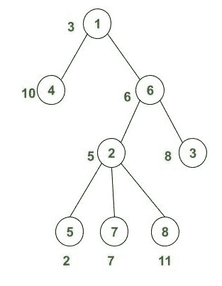
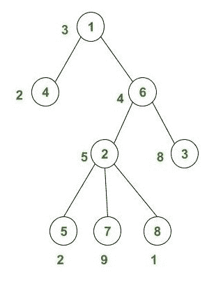

# 给定树的和树中任意两个加权节点之间的最小差

> 原文:[https://www . geesforgeks . org/给定树的任意两个加权和树节点之间的最小差异/](https://www.geeksforgeeks.org/minimum-difference-between-any-two-weighted-nodes-in-sum-tree-of-the-given-tree/)

给定一个由 **N** 个节点组成的树，任务是将给定的树转换成它的[和树](https://www.geeksforgeeks.org/convert-a-given-tree-to-sum-tree/)(包括它自己的权重)，并找到和树的任意两个节点的权重之间的最小差。

**注:**给定树的 N 个节点以从上到下的形式给出，用 N-1 行表示，每一行描述两个相连的节点。

**示例:**

> **输入:**
> 
> 
> 
> **输出:** 1
> **说明:**
> 节点 1: 3(自身重量)+ (10 + 6 + 5 + 8 + 2 + 7 + 11)(子树节点的重量)= 52
> 节点 2: 5(自身重量)+ (2 + 7 + 11)(子树节点的重量)= 25
> 节点 3: 8(自身重量)+ (0)(子树节点的重量)= 8 【T8 + (0)(子树节点的权重)= 10
> 节点 5 的总权重:2(自身权重)+ (0)(子树节点的权重)= 2
> 节点 6 的总权重:6(自身权重)+ (5 + 8 + 2 + 7 + 11)(子树节点的权重)= 39
> 节点 7 的总权重:7(自身权重)+ (0)(子树节点的权重)= 7
> 节点 8 的总权重:11(自身权重
> 
> **输入:**
> 
> 
> 
> **输出:** 0

**进场:**

1.  我们将[从下面遍历给定的树](https://www.geeksforgeeks.org/tree-traversals-inorder-preorder-and-postorder/)，并将该节点的权重加上其子树节点的权重存储在一个数组中，并将每个节点的索引标记为已访问。因此，在这两者之间，如果我们重新访问该节点，那么我们不必再次计算该节点的权重。
2.  我们将[对存储了每个节点总重量的数组](https://www.geeksforgeeks.org/sorting-algorithms/)进行排序。
3.  现在在排序的数组中找到[成对的差异，最后给出最小差异的那一对打印出最小差异。](https://www.geeksforgeeks.org/absolute-difference-of-all-pairwise-consecutive-elements-in-an-array/)

下面是上述方法的实现:

## C++

```
// C++ program for the above approach

#include <bits/stdc++.h>
using namespace std;

// Function to find minimum
// difference between any two node
void MinimumDifference(int total_weight[],
                       int N)
{
    int min_difference = INT_MAX;

    for (int i = 1; i < N; i++) {

        // Pairwise difference
        if (total_weight[i]
                - total_weight[i - 1]
            < min_difference) {
            min_difference
                = total_weight[i]
                  - total_weight[i - 1];
        }
    }

    cout << min_difference << endl;
}

// Function to find total weight
// of each individual node
void SumTree(vector<pair<int, int> > v,
             int individual_weight[],
             int N)
{
    // Array to store total weight
    // of each node from 1 to N
    int total_weight[N] = { 0 };

    // Array to keep track of node
    // previously counted or not
    int visited[N] = { 0 };

    // To store node no. from
    /// N-1 lines
    int first, second;

    // To traverse from (N-1)
    // line to 1 line
    for (int i = (N - 2); i >= 0; i--) {
        first = v[i].first;
        second = v[i].second;

        // Node is note visited
        if (visited[second - 1] == 0) {

            total_weight[second - 1]
                += individual_weight[second - 1];

            // Make node visited
            visited[second - 1] = 1;
        }

        total_weight[first - 1]
            += total_weight[second - 1];

        // Node is note visited
        if (visited[first - 1] == 0) {

            total_weight[first - 1]
                += individual_weight[first - 1];

            // Make node visited
            visited[first - 1] = 1;
        }
    }

    // Sort the total weight of each node
    sort(total_weight, total_weight + N);

    // Call function to find minimum
    // difference
    MinimumDifference(total_weight, N);
}

// Driver code
int main()
{
    // Total node of rooted tree
    int N = 8;

    vector<pair<int, int> > v;

    // N-1 lines describing
    // rooted tree from top
    // to bottom
    v.push_back(make_pair(1, 4));
    v.push_back(make_pair(1, 6));
    v.push_back(make_pair(6, 2));
    v.push_back(make_pair(6, 3));
    v.push_back(make_pair(2, 5));
    v.push_back(make_pair(2, 7));
    v.push_back(make_pair(2, 8));

    // Array describing weight
    // of each node from 1 to N
    int individual_weight[N] = { 3, 5, 8, 10,
                                 2, 6, 7, 11 };

    SumTree(v, individual_weight, N);

    return 0;
}
```

## Java 语言(一种计算机语言，尤用于创建网站)

```
// Java program for the above approach
import java.util.*;

class GFG{

static class pair
{
    int first, second;
    public pair(int first, int second) 
    {
        this.first = first;
        this.second = second;
    }   
}

// Function to find minimum
// difference between any two node
static void MinimumDifference(int total_weight[],
                              int N)
{
    int min_difference = Integer.MAX_VALUE;

    for(int i = 1; i < N; i++)
    {

        // Pairwise difference
        if (total_weight[i] -
            total_weight[i - 1] <
            min_difference)
        {
            min_difference = total_weight[i] -
                             total_weight[i - 1];
        }
    }

    System.out.print(min_difference + "\n");
}

// Function to find total weight
// of each individual node
static void SumTree(Vector<pair> v,
                    int individual_weight[],
                    int N)
{

    // Array to store total weight
    // of each node from 1 to N
    int total_weight[] = new int[N];

    // Array to keep track of node
    // previously counted or not
    int visited[] = new int[N];

    // To store node no. from
    /// N-1 lines
    int first, second;

    // To traverse from (N-1)
    // line to 1 line
    for(int i = (N - 2); i >= 0; i--)
    {
        first = v.get(i).first;
        second = v.get(i).second;

        // Node is note visited
        if (visited[second - 1] == 0)
        {
            total_weight[second - 1] +=
            individual_weight[second - 1];

            // Make node visited
            visited[second - 1] = 1;
        }

        total_weight[first - 1] +=
        total_weight[second - 1];

        // Node is note visited
        if (visited[first - 1] == 0)
        {
            total_weight[first - 1] +=
            individual_weight[first - 1];

            // Make node visited
            visited[first - 1] = 1;
        }
    }

    // Sort the total weight of each node
    Arrays.sort(total_weight);

    // Call function to find minimum
    // difference
    MinimumDifference(total_weight, N);
}

// Driver code
public static void main(String[] args)
{

    // Total node of rooted tree
    int N = 8;

    Vector<pair> v = new Vector<>();

    // N-1 lines describing
    // rooted tree from top
    // to bottom
    v.add(new pair(1, 4));
    v.add(new pair(1, 6));
    v.add(new pair(6, 2));
    v.add(new pair(6, 3));
    v.add(new pair(2, 5));
    v.add(new pair(2, 7));
    v.add(new pair(2, 8));

    // Array describing weight
    // of each node from 1 to N
    int individual_weight[] = { 3, 5, 8, 10,
                                2, 6, 7, 11 };

    SumTree(v, individual_weight, N);
}
}

// This code is contributed by Amit Katiyar
```

## 蟒蛇 3

```
# Python3 program for the above approach
import sys

# Function to find minimum difference
# between any two node
def minimum_difference(total_weight, n):

    min_difference = sys.maxsize

    for i in range(1, n):

        # Pairwise difference
        if (total_weight[i] -
            total_weight[i - 1] <
            min_difference):
            min_difference = (total_weight[i] -
                              total_weight[i - 1])
    print(min_difference)

# Function to find total weight
# of each individual node
def SumTree(v, individual_weight, N):

    # Array to store total weight of
    # each node from 1 to n
    total_weight = [0 for i in range(N)]

    # Array to keep track of node
    # previously counted or not
    visited = [0 for i in range(N)]

    # To traverse from (n-1) line to 1 line
    for i in range(N - 2, -1, -1):
        first = v[i][0]
        second = v[i][1]

        if visited[second - 1] == 0:
            total_weight[second - 1] += (
            individual_weight[second - 1])

            # Make node visited
            visited[second - 1] = 1

        total_weight[first - 1] += (
        total_weight[second - 1])

        # Node is note visited
        if visited[first - 1] == 0:
            total_weight[first - 1] += (
            individual_weight[first - 1])

            # Make node visited
            visited[first - 1] = 1

    # Sort the total weight of each node
    total_weight.sort()

    # Call function to find minimum difference
    minimum_difference(total_weight, n)

# Driver Code
if __name__=='__main__':

    # Total node of rooted tree
    n = 8
    v = []

    # n-1 lines describing rooted
    # tree from top to bottom
    v.append([1, 4])
    v.append([1, 6])
    v.append([6, 2])
    v.append([6, 3])
    v.append([2, 5])
    v.append([2, 7])
    v.append([2, 8])

    # Array describing weight of each
    # node from 1 to n
    individual_weight = [ 3, 5, 8, 10,
                          2, 6, 7, 11 ]

    SumTree(v, individual_weight, n)

# This code is contributed by rutvik_56
```

## C#

```
// C# program for the
// above approach
using System;
using System.Collections.Generic;
class GFG{

class pair
{
  public int first,
             second;
  public pair(int first,
              int second) 
  {
    this.first = first;
    this.second = second;
  }   
}

// Function to find minimum
// difference between any two node
static void MinimumDifference(int []total_weight,
                              int N)
{
  int min_difference = int.MaxValue;

  for(int i = 1; i < N; i++)
  {
    // Pairwise difference
    if (total_weight[i] -
        total_weight[i - 1] <
        min_difference)
    {
      min_difference = total_weight[i] -
                       total_weight[i - 1];
    }
  }

  Console.Write(min_difference + "\n");
}

// Function to find total weight
// of each individual node
static void SumTree(List<pair> v,
                    int []individual_weight,
                    int N)
{   
  // Array to store total weight
  // of each node from 1 to N
  int []total_weight = new int[N];

  // Array to keep track of node
  // previously counted or not
  int []visited = new int[N];

  // To store node no. from
  /// N-1 lines
  int first, second;

  // To traverse from (N-1)
  // line to 1 line
  for(int i = (N - 2); i >= 0; i--)
  {
    first = v[i].first;
    second = v[i].second;

    // Node is note visited
    if (visited[second - 1] == 0)
    {
      total_weight[second - 1] +=
            individual_weight[second - 1];

      // Make node visited
      visited[second - 1] = 1;
    }

    total_weight[first - 1] +=
          total_weight[second - 1];

    // Node is note visited
    if (visited[first - 1] == 0)
    {
      total_weight[first - 1] +=
            individual_weight[first - 1];

      // Make node visited
      visited[first - 1] = 1;
    }
  }

  // Sort the total weight
  // of each node
  Array.Sort(total_weight);

  // Call function to find minimum
  // difference
  MinimumDifference(total_weight, N);
}

// Driver code
public static void Main(String[] args)
{   
  // Total node of rooted tree
  int N = 8;

  List<pair> v = new List<pair>();

  // N-1 lines describing
  // rooted tree from top
  // to bottom
  v.Add(new pair(1, 4));
  v.Add(new pair(1, 6));
  v.Add(new pair(6, 2));
  v.Add(new pair(6, 3));
  v.Add(new pair(2, 5));
  v.Add(new pair(2, 7));
  v.Add(new pair(2, 8));

  // Array describing weight
  // of each node from 1 to N
  int []individual_weight = {3, 5, 8, 10,
                             2, 6, 7, 11};

  SumTree(v, individual_weight, N);
}
}

// This code is contributed by shikhasingrajput
```

## java 描述语言

```
<script>
    // Javascript program for the above approach

    // Function to find minimum
    // difference between any two node
    function MinimumDifference(total_weight, N)
    {
        let min_difference = Number.MAX_VALUE;

        for (let i = 1; i < N; i++) {

            // Pairwise difference
            if (total_weight[i]
                    - total_weight[i - 1]
                < min_difference) {
                min_difference
                    = total_weight[i]
                      - total_weight[i - 1];
            }
        }

        document.write(min_difference + "</br>");
    }

    // Function to find total weight
    // of each individual node
    function SumTree(v, individual_weight, N)
    {
        // Array to store total weight
        // of each node from 1 to N
        let total_weight = new Array(N);
        total_weight.fill(0);

        // Array to keep track of node
        // previously counted or not
        let visited = new Array(N);
        visited.fill(0);

        // To store node no. from
        /// N-1 lines
        let first, second;

        // To traverse from (N-1)
        // line to 1 line
        for (let i = (N - 2); i >= 0; i--) {
            first = v[i][0];
            second = v[i][1];

            // Node is note visited
            if (visited[second - 1] == 0) {

                total_weight[second - 1]
                    += individual_weight[second - 1];

                // Make node visited
                visited[second - 1] = 1;
            }

            total_weight[first - 1]
                += total_weight[second - 1];

            // Node is note visited
            if (visited[first - 1] == 0) {

                total_weight[first - 1]
                    += individual_weight[first - 1];

                // Make node visited
                visited[first - 1] = 1;
            }
        }

        // Sort the total weight of each node
        total_weight.sort(function(a, b){return a - b});

        // Call function to find minimum
        // difference
        MinimumDifference(total_weight, N);
    }

    // Total node of rooted tree
    let N = 8;

    let v = [];

    // N-1 lines describing
    // rooted tree from top
    // to bottom
    v.push([1, 4]);
    v.push([1, 6]);
    v.push([6, 2]);
    v.push([6, 3]);
    v.push([2, 5]);
    v.push([2, 7]);
    v.push([2, 8]);

    // Array describing weight
    // of each node from 1 to N
    let individual_weight = [ 3, 5, 8, 10, 2, 6, 7, 11 ];

    SumTree(v, individual_weight, N);

// This code is contributed by decode2207.
</script>
```

**Output:** 

```
1
```

**时间复杂度:** *O(N * Log(N))* ，其中 N 是有根树的节点总数。
**辅助空间:** O(N)