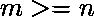
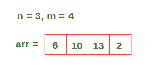
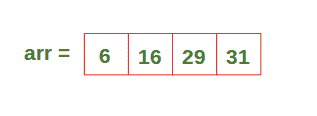
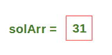
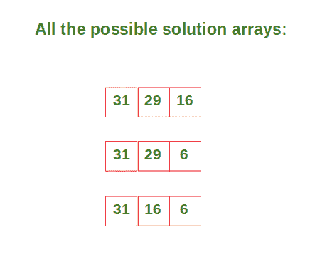
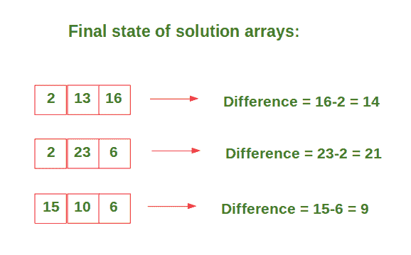
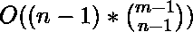
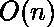

# 分布的地雷最高值和最小值之间的最小差值

> 原文:[https://www . geeksforgeeks . org/分布式地雷最高价值和最低价值之间的最小差异/](https://www.geeksforgeeks.org/minimum-difference-between-the-highest-and-the-smallest-value-of-mines-distributed/)

鉴于 **n** 公司和 **m** 石油矿山具有价值，任务是以公平的方式在 **n** 公司之间分配矿山。这就是获得最高矿山价值总和的公司和获得最低矿山价值总和的公司之间的差异应该最小。计算最小差异。请注意，分配给每个公司的油矿应该彼此相邻。还有，

**示例:**

> **输入:** n = 2，m = 4
> 地雷值= [6，10，13，2]
> **输出:**1–>地雷分布为{(6，10)，(13，2)}，因此输出为(6+10)–(13+2)= 1
> 
> **输入:** n = 3，m = 4
> 地雷值= [6，10，13，2]
> **输出:**9–>地雷分布为{(6)、(10)、(13，2)}，因此输出为(13+2)–(6)= 9

**来源:**三星 RnD 3 小时编码轮问

**进场:**

1.  构造一个数组，使每个索引处的值包含数组中当前值和所有先前值的总和。
2.  在我们的解决方案数组中包含数组中的最后一个值。
3.  从第二个最后一个索引开始，从给定的 **m-1** 值中选择 **n-1** 值，递归构建所有可能的解数组(因为数组中的最后一个值已经包含在我们的解数组中)。
4.  对于除最后一个值以外的每个索引处的值，从解决方案数组中当前索引处的值中减去下一个索引处的值。计算所有解决方案数组的最高值和最低值之间的差值，并返回最小值。

让我们举一个例子来逐步理解上述方法:

最初，输入如下所示:



在**步骤-1** 之后，我们的数组看起来像下面给出的数组:



在**步骤-2** 之后，溶液阵列看起来像下面给出的阵列:



在**步骤-3** 之后，我们得到以下可能的解决方案阵列:



在**步骤-4** 之后，我们的解决方案阵列看起来像下面给出的阵列。然后，我们计算所有数组中最大值和最小值之间的差值，并返回最小值(在本例中为 9)。



下面是上述方法的实现:

```
# Python3 code to minimize the difference 
# between the highest and lowest value containing company

# This function constructs the solution array 
# recursively and returns the difference 
# between the highest and lowest value.
def func(solArr, arr, index, n):

    # If the values have been distributed,
    # compute the difference
    if n == 0:
        for i in range(len(solArr)-1):
            solArr[i] = solArr[i] - solArr[i + 1]

        return max(solArr) - min(solArr)

    else:

        # solArr can be constructed even if we 
        # don't include the current value
        if index >= n:
            return min(func(solArr[:] + [arr[index]], arr, index-1, n-1), 
                       func(solArr[:], arr, index-1, n))

        # solArr can't be constructed hence 
        # we have to include the current value    
        else:
            return func(solArr[:] + [arr[index]], arr, index-1, n-1)

n = 3
arr = [6, 10, 13, 2]

# Construct array such that value at each index 
# contains the sum of current and all previous 
# values in the array.
for i in range(1, len(arr)):
    arr[i] += arr[i-1]

# Include the last value of 
# the array in our solution array.
solArr = [arr[-1]]

print(func(solArr[:], arr, len(arr)-2, n-1))
```

**Output:**

```
9

```

**时间复杂度:** 
**空间复杂度:** 