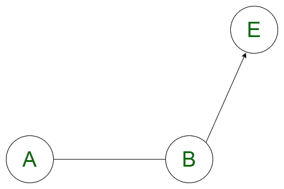
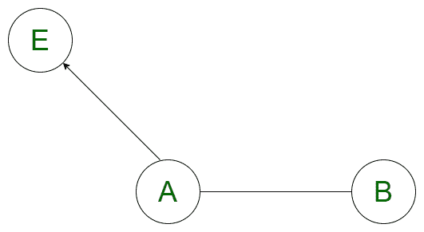
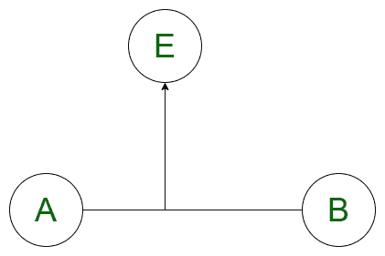

# 使用矢量从一点到线段的最小距离

> 原文:[https://www . geesforgeks . org/使用矢量的点到线段的最小距离/](https://www.geeksforgeeks.org/minimum-distance-from-a-point-to-the-line-segment-using-vectors/)

给定线段的两个端点 **A(x1，y1)** 、 **B(x2，y2)** 的坐标和一个点 **E(x，y)** 的坐标；任务是找到由给定坐标形成的点到线段的最小距离。
**注意**一条**线**的两端可以到无穷大，即一条**线**没有终点。另一方面，**线段**具有起点和终点，因此线段的长度是固定的。
**示例:**

> **输入:** A = {0，0}，B = {2，0}，E = {4，0}
> 
> **输出:** 2
> 要求距离，必须在向量 AB，be 和 AB，AE 之间求点积。
> AB =(x2–x1，y2–y1)=(2–0，0–0)=(2，0)
> BE =(x–x2，y–y2)=(4–2，0–0)=(2，0)
> AE =(x–x1，y–y1)=(4–0，0–0)=(4，0)
> AB。BE =(AB<sub>x</sub>* BE<sub>x</sub>+AB<sub>y</sub>* BE<sub>y</sub>)=(2 * 2+0 * 0)= 4
> AB。AE =(AB<sub>x</sub>* AE<sub>x</sub>+AB<sub>y</sub>* AE<sub>y</sub>)=(2 * 4+0 * 0)= 8
> 因此，从 E 点到线段最近的点是 b 点。
> 最小距离= BE =
> 
> 
> 
> = 2
> **输入:** A = {0，0}，B = {2，0}，E = {1，1 }
> T4】输出: 1

**方法:**想法是使用向量的概念来解决问题，因为最近的点总是位于线段上。假设向量 AB 的方向是 A 到 B，会出现三种情况:

1.线段 AB 上距离点 **E** 最近的点是点 **B** 本身，如果向量 **AB(A 到 B)** 和向量 **BE(B 到 E)** 的点积为正，其中 **E** 是给定点。 **AB 起。BE > 0** ，给定点与矢量 AB 所在方向相同，最近点必须是 B 本身，因为最近点位于线段上。



2.线段 AB 上距离点 **E** 最近的点是点 **A** 本身，如果向量 **AB(A 到 B)** 和向量 **BE(B 到 E)** 的点积为负，其中 **E** 是给定点。 **AB 起。BE < 0** ，给定点位于线段 AB 的反方向，最近点必须是 A 本身，因为最近点位于线段上。



3.如果点积为 0，则点 **E** 垂直于线段 AB，从线段 AB 到给定点 E 的垂直距离最短。如果某个任意点 F 是线段上垂直于 E 的点，那么垂直距离可以计算为**| EF | = |(AB X AE)/| AB | |**T4】



下面是上述方法的实现:

## C++

```
// C++ implementation of the approach
#include <bits/stdc++.h>

// To store the point
#define Point pair<double, double>
#define F first
#define S second
using namespace std;

// Function to return the minimum distance
// between a line segment AB and a point E
double minDistance(Point A, Point B, Point E)
{

    // vector AB
    pair<double, double> AB;
    AB.F = B.F - A.F;
    AB.S = B.S - A.S;

    // vector BP
    pair<double, double> BE;
    BE.F = E.F - B.F;
    BE.S = E.S - B.S;

    // vector AP
    pair<double, double> AE;
    AE.F = E.F - A.F,
    AE.S = E.S - A.S;

    // Variables to store dot product
    double AB_BE, AB_AE;

    // Calculating the dot product
    AB_BE = (AB.F * BE.F + AB.S * BE.S);
    AB_AE = (AB.F * AE.F + AB.S * AE.S);

    // Minimum distance from
    // point E to the line segment
    double reqAns = 0;

    // Case 1
    if (AB_BE > 0) {

        // Finding the magnitude
        double y = E.S - B.S;
        double x = E.F - B.F;
        reqAns = sqrt(x * x + y * y);
    }

    // Case 2
    else if (AB_AE < 0) {
        double y = E.S - A.S;
        double x = E.F - A.F;
        reqAns = sqrt(x * x + y * y);
    }

    // Case 3
    else {

        // Finding the perpendicular distance
        double x1 = AB.F;
        double y1 = AB.S;
        double x2 = AE.F;
        double y2 = AE.S;
        double mod = sqrt(x1 * x1 + y1 * y1);
        reqAns = abs(x1 * y2 - y1 * x2) / mod;
    }
    return reqAns;
}

// Driver code
int main()
{
    Point A = make_pair(0, 0);
    Point B = make_pair(2, 0);
    Point E = make_pair(1, 1);

    cout << minDistance(A, B, E);

    return 0;
}
```

## Java 语言(一种计算机语言，尤用于创建网站)

```
// Java implementation of the approach
class GFG
{

static class pair
{
    double F, S;
    public pair(double F, double S)
    {
        this.F = F;
        this.S = S;
    }
    public pair() {
    }
}

// Function to return the minimum distance
// between a line segment AB and a point E
static double minDistance(pair A, pair B, pair E)
{

    // vector AB
    pair AB = new pair();
    AB.F = B.F - A.F;
    AB.S = B.S - A.S;

    // vector BP
    pair BE = new pair();
    BE.F = E.F - B.F;
    BE.S = E.S - B.S;

    // vector AP
    pair AE = new pair();
    AE.F = E.F - A.F;
    AE.S = E.S - A.S;

    // Variables to store dot product
    double AB_BE, AB_AE;

    // Calculating the dot product
    AB_BE = (AB.F * BE.F + AB.S * BE.S);
    AB_AE = (AB.F * AE.F + AB.S * AE.S);

    // Minimum distance from
    // point E to the line segment
    double reqAns = 0;

    // Case 1
    if (AB_BE > 0)
    {

        // Finding the magnitude
        double y = E.S - B.S;
        double x = E.F - B.F;
        reqAns = Math.sqrt(x * x + y * y);
    }

    // Case 2
    else if (AB_AE < 0)
    {
        double y = E.S - A.S;
        double x = E.F - A.F;
        reqAns = Math.sqrt(x * x + y * y);
    }

    // Case 3
    else
    {

        // Finding the perpendicular distance
        double x1 = AB.F;
        double y1 = AB.S;
        double x2 = AE.F;
        double y2 = AE.S;
        double mod = Math.sqrt(x1 * x1 + y1 * y1);
        reqAns = Math.abs(x1 * y2 - y1 * x2) / mod;
    }
    return reqAns;
}

// Driver code
public static void main(String[] args)
{
    pair A = new pair(0, 0);
    pair B = new pair(2, 0);
    pair E = new pair(1, 1);

    System.out.print((int)minDistance(A, B, E));
}
}

// This code is contributed by 29AjayKumar
```

## 蟒蛇 3

```
# Python3 implementation of the approach
from math import sqrt

# Function to return the minimum distance
# between a line segment AB and a point E
def minDistance(A, B, E) :

    # vector AB
    AB = [None, None];
    AB[0] = B[0] - A[0];
    AB[1] = B[1] - A[1];

    # vector BP
    BE = [None, None];
    BE[0] = E[0] - B[0];
    BE[1] = E[1] - B[1];

    # vector AP
    AE = [None, None];
    AE[0] = E[0] - A[0];
    AE[1] = E[1] - A[1];

    # Variables to store dot product

    # Calculating the dot product
    AB_BE = AB[0] * BE[0] + AB[1] * BE[1];
    AB_AE = AB[0] * AE[0] + AB[1] * AE[1];

    # Minimum distance from
    # point E to the line segment
    reqAns = 0;

    # Case 1
    if (AB_BE > 0) :

        # Finding the magnitude
        y = E[1] - B[1];
        x = E[0] - B[0];
        reqAns = sqrt(x * x + y * y);

    # Case 2
    elif (AB_AE < 0) :
        y = E[1] - A[1];
        x = E[0] - A[0];
        reqAns = sqrt(x * x + y * y);

    # Case 3
    else:

        # Finding the perpendicular distance
        x1 = AB[0];
        y1 = AB[1];
        x2 = AE[0];
        y2 = AE[1];
        mod = sqrt(x1 * x1 + y1 * y1);
        reqAns = abs(x1 * y2 - y1 * x2) / mod;

    return reqAns;

# Driver code
if __name__ == "__main__" :

    A = [0, 0];
    B = [2, 0];
    E = [1, 1];

    print(minDistance(A, B, E));

# This code is contributed by AnkitRai01
```

## C#

```
// C# implementation of the approach
using System;

class GFG
{

class pair
{
    public double F, S;
    public pair(double F, double S)
    {
        this.F = F;
        this.S = S;
    }
    public pair() {
    }
}

// Function to return the minimum distance
// between a line segment AB and a point E
static double minDistance(pair A, pair B, pair E)
{

    // vector AB
    pair AB = new pair();
    AB.F = B.F - A.F;
    AB.S = B.S - A.S;

    // vector BP
    pair BE = new pair();
    BE.F = E.F - B.F;
    BE.S = E.S - B.S;

    // vector AP
    pair AE = new pair();
    AE.F = E.F - A.F;
    AE.S = E.S - A.S;

    // Variables to store dot product
    double AB_BE, AB_AE;

    // Calculating the dot product
    AB_BE = (AB.F * BE.F + AB.S * BE.S);
    AB_AE = (AB.F * AE.F + AB.S * AE.S);

    // Minimum distance from
    // point E to the line segment
    double reqAns = 0;

    // Case 1
    if (AB_BE > 0)
    {

        // Finding the magnitude
        double y = E.S - B.S;
        double x = E.F - B.F;
        reqAns = Math.Sqrt(x * x + y * y);
    }

    // Case 2
    else if (AB_AE < 0)
    {
        double y = E.S - A.S;
        double x = E.F - A.F;
        reqAns = Math.Sqrt(x * x + y * y);
    }

    // Case 3
    else
    {

        // Finding the perpendicular distance
        double x1 = AB.F;
        double y1 = AB.S;
        double x2 = AE.F;
        double y2 = AE.S;
        double mod = Math.Sqrt(x1 * x1 + y1 * y1);
        reqAns = Math.Abs(x1 * y2 - y1 * x2) / mod;
    }
    return reqAns;
}

// Driver code
public static void Main(String[] args)
{
    pair A = new pair(0, 0);
    pair B = new pair(2, 0);
    pair E = new pair(1, 1);

    Console.Write((int)minDistance(A, B, E));
}
}

// This code is contributed by 29AjayKumar
```

## java 描述语言

```
<script>

// JavaScript implementation of the approach

// Function to return the minimum distance
// between a line segment AB and a point E
function minDistance( A,  B,  E)
{

    // vector AB
    var AB=[];
    AB.push (B[0] - A[0]);
    AB.push(B[1] - A[1]);

    // vector BP
    var BE=[];
    BE.push(E[0] - B[0]);
    BE.push(E[1] - B[1]);

    // vector AP
   var AE=[];
    AE.push(E[0] - A[0]),
    AE.push(E[1] - A[1]);

    // Variables to store dot product
    var AB_BE, AB_AE;

    // Calculating the dot product
    AB_BE=(AB[0] * BE[0] + AB[1] * BE[1]);
    AB_AE=(AB[0] * AE[0] + AB[1] * AE[1]);

    // Minimum distance from
    // point E to the line segment
    var reqAns = 0;

    // Case 1
    if (AB_BE > 0) {

        // Finding the magnitude
        var y = E[1] - B[1];
        var x = E[0] - B[0];
        reqAns = Math.sqrt(x * x + y * y);
    }

    // Case 2
    else if (AB_AE < 0) {
        var y = E[1] - A[1];
        var x = E[0] - A[0];
        reqAns = Math.sqrt(x * x + y * y);
    }

    // Case 3
    else {

        // Finding the perpendicular distance
       var x1 = AB[0];
        var y1 = AB[1];
       var x2 = AE[0];
        var y2 = AE[1];
        var mod = Math.sqrt(x1 * x1 + y1 * y1);
        reqAns = Math.abs(x1 * y2 - y1 * x2) / mod;
    }
    return reqAns;
}

var A =[0, 0];
    var B = [2, 0];
    var E = [1, 1];

    document.write( minDistance(A, B, E));

</script>
```

**Output:** 

```
1
```

**时间复杂度:** O(1)

**辅助空间:** O(1)