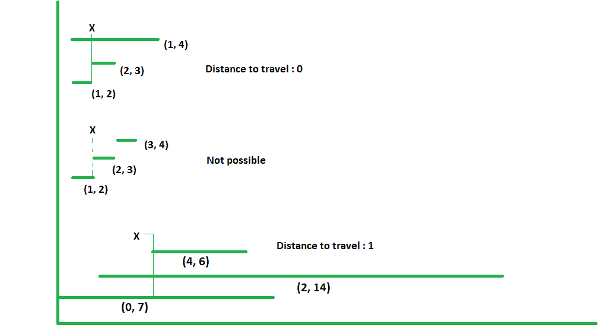

# 覆盖所有区间的最小行驶距离

> 原文:[https://www . geesforgeks . org/最小距离-行程-封面-间隔/](https://www.geeksforgeeks.org/minimum-distance-travel-cover-intervals/)

给定许多区间作为范围和我们的位置。我们需要找到到达这样一个点的最小距离，这个点同时覆盖了所有的时间间隔。

**示例:**

```
Input : Intervals = [(0, 7), (2, 14), (4, 6)]
        Position = 3
Output : 1
We can reach position 4 by traveling
distance 1, at which all intervals will
be covered. So answer will be 1

Input : Intervals = [(1, 2), (2, 3), (3, 4)]
        Position = 2
Output : -1 
It is not possible to cover all intervals
at once at any point

Input : Intervals = [(1, 2), (2, 3), (1, 4)]
        Position = 2
Output : 0
All Intervals are covered at current 
position only so no need travel and
answer will be 0

All above examples are shown in below diagram.
```



我们可以通过只关注端点来解决这个问题。因为要求通过到达一个点来覆盖所有的区间，所以所有的区间必须共享一个点才能存在答案。即使是最左端点的区间也必须与最右端点的区间重叠。
首先，我们从所有区间中找到最右边的起点和最左边的终点。然后，我们可以将我们的位置与这些点进行比较，得到如下解释的结果:

1.  如果最右边的开始点在最左边的结束点的右边，那么不可能同时覆盖所有的间隔。(如实施例 2)
2.  如果我们的位置在最右侧起点和最左侧终点的中间，那么就不需要移动，所有的间隔将只由当前位置覆盖(如例 3)
3.  如果我们的位置在这两个点的左边，那么我们需要到达最右边的起点，如果我们的位置在这两个点的右边，那么我们需要到达最左边的终点。

参考上图了解这些情况。和第一个例子一样，最右边的开始是 4，最左边的结束是 6，所以我们需要从当前位置 3 到达 4 来覆盖所有的区间。

为了更好的理解，请参见下面的代码。

## C++

```
// C++ program to find minimum distance to
// travel to cover all intervals
#include <bits/stdc++.h>
using namespace std;

//  structure to store an interval
struct Interval
{
    int start, end;
    Interval(int start, int end) : start(start),
                                       end(end)
    {}
};

//  Method returns minimum distance to travel
// to cover all intervals
int minDistanceToCoverIntervals(Interval intervals[],
                                       int N, int x)
{
    int rightMostStart = INT_MIN;
    int leftMostEnd = INT_MAX;

    //  looping over all intervals to get right most
    // start and left most end
    for (int i = 0; i < N; i++)
    {
        if (rightMostStart < intervals[i].start)
            rightMostStart = intervals[i].start;

        if (leftMostEnd > intervals[i].end)
            leftMostEnd = intervals[i].end;
    }

    int res;

    /*  if rightmost start > leftmost end then all
        intervals are not aligned and it is not
        possible to cover all of them  */
    if (rightMostStart > leftMostEnd)
        res = -1;

    //  if x is in between rightmoststart and
    // leftmostend then no need to travel any distance
    else if (rightMostStart <= x && x <= leftMostEnd)
        res = 0;

    //  choose minimum according to current position x
    else
        res = (x < rightMostStart) ? (rightMostStart - x) :
                                     (x - leftMostEnd);

    return res;
}

//  Driver code to test above methods
int main()
{
    int x = 3;
    Interval intervals[] = {{0, 7}, {2, 14}, {4, 6}};
    int N = sizeof(intervals) / sizeof(intervals[0]);

    int res = minDistanceToCoverIntervals(intervals, N, x);
    if (res == -1)
        cout << "Not Possible to cover all intervals\n";
    else
        cout << res << endl;
}
```

## Java 语言(一种计算机语言，尤用于创建网站)

```
// Java program to find minimum distance
// to travel to cover all intervals
import java.util.*;

class GFG{

// Structure to store an interval
static class Interval
{
    int start, end;
    Interval(int start, int end)
    {
        this.start = start;
        this.end = end;
    }
};

// Method returns minimum distance to
// travel to cover all intervals
static int minDistanceToCoverIntervals(Interval intervals[],
                                       int N, int x)
{
    int rightMostStart = Integer.MIN_VALUE;
    int leftMostEnd = Integer.MAX_VALUE;

    // Looping over all intervals to get
    // right most start and left most end
    for(int i = 0; i < N; i++)
    {
        if (rightMostStart < intervals[i].start)
            rightMostStart = intervals[i].start;

        if (leftMostEnd > intervals[i].end)
            leftMostEnd = intervals[i].end;
    }

    int res;

    // If rightmost start > leftmost end then
    // all intervals are not aligned and it
    // is not possible to cover all of them 
    if (rightMostStart > leftMostEnd)
        res = -1;

    // If x is in between rightmoststart and
    // leftmostend then no need to travel
    // any distance
    else if (rightMostStart <= x &&
             x <= leftMostEnd)
        res = 0;

    // Choose minimum according to
    // current position x
    else
        res = (x < rightMostStart) ?
              (rightMostStart - x) :
              (x - leftMostEnd);

    return res;
}

//  Driver code
public static void main(String[] args)
{
    int x = 3;
    Interval []intervals = { new Interval(0, 7),
                             new Interval(2, 14),
                             new Interval(4, 6) };
    int N = intervals.length;

    int res = minDistanceToCoverIntervals(
        intervals, N, x);

    if (res == -1)
        System.out.print("Not Possible to " +
                         "cover all intervals\n");
    else
        System.out.print(res + "\n");
}
}

// This code is contributed by Rajput-Ji
```

## 蟒蛇 3

```
# Python program to find minimum distance to
# travel to cover all intervals

#  Method returns minimum distance to travel
# to cover all intervals
def minDistanceToCoverIntervals(Intervals, N, x):
    rightMostStart = Intervals[0][0]
    leftMostStart = Intervals[0][1]

    # looping over all intervals to get right most
    # start and left most end
    for curr in Intervals:
        if rightMostStart < curr[0]:
            rightMostStart = curr[0]
        if leftMostStart > curr[1]:
            leftMostStart = curr[1]

    # if rightmost start > leftmost end then all
    # intervals are not aligned and it is not
    # possible to cover all of them
    if rightMostStart > leftMostStart:
        res = -1

    # if x is in between rightmoststart and
    # leftmostend then no need to travel any distance
    elif rightMostStart <= x and x <= leftMostStart:
        res = 0

    # choose minimum according to current position x
    else:
        res = rightMostStart-x if x < rightMostStart else x-leftMostStart
    return res

# Driver code to test above methods
Intervals = [[0, 7], [2, 14], [4, 6]]
N = len(Intervals)
x = 3

res = minDistanceToCoverIntervals(Intervals, N, x)
if res == -1:
    print("Not Possible to cover all intervals")
else:
    print(res)

    # This code is contributed by rj13to.
```

## C#

```
// C# program to find minimum distance
// to travel to cover all intervals
using System;

class GFG{

// Structure to store an interval
public class Interval
{
    public int start, end;

    public Interval(int start, int end)
    {
        this.start = start;
        this.end = end;
    }
};

// Method returns minimum distance to
// travel to cover all intervals
static int minDistanceToCoverIntervals(
    Interval []intervals, int N, int x)
{
    int rightMostStart = int.MinValue;
    int leftMostEnd = int.MaxValue;

    // Looping over all intervals to get
    // right most start and left most end
    for(int i = 0; i < N; i++)
    {
        if (rightMostStart < intervals[i].start)
            rightMostStart = intervals[i].start;

        if (leftMostEnd > intervals[i].end)
            leftMostEnd = intervals[i].end;
    }

    int res;

    // If rightmost start > leftmost end then
    // all intervals are not aligned and it
    // is not possible to cover all of them 
    if (rightMostStart > leftMostEnd)
        res = -1;

    // If x is in between rightmoststart and
    // leftmostend then no need to travel
    // any distance
    else if (rightMostStart <= x &&
             x <= leftMostEnd)
        res = 0;

    // Choose minimum according to
    // current position x
    else
        res = (x < rightMostStart) ?
              (rightMostStart - x) :
              (x - leftMostEnd);

    return res;
}

//  Driver code
public static void Main(String[] args)
{
    int x = 3;
    Interval []intervals = { new Interval(0, 7),
                             new Interval(2, 14),
                             new Interval(4, 6) };
    int N = intervals.Length;

    int res = minDistanceToCoverIntervals(
        intervals, N, x);

    if (res == -1)
        Console.Write("Not Possible to " +
                      "cover all intervals\n");
    else
        Console.Write(res + "\n");
}
}

// This code is contributed by shikhasingrajput
```

**输出:**

```
1
```

本文由 [**乌卡什·特里维迪**](https://in.linkedin.com/in/utkarsh-trivedi-253069a7) 供稿。如果你喜欢 GeeksforGeeks 并想投稿，你也可以使用[write.geeksforgeeks.org](http://www.write.geeksforgeeks.org)写一篇文章或者把你的文章邮寄到 review-team@geeksforgeeks.org。看到你的文章出现在极客博客主页上，帮助其他极客。
如果发现有不正确的地方，或者想分享更多关于上述话题的信息，请写评论。