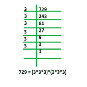

# 使数字成为完美立方体的最小除数

> 原文:[https://www . geeksforgeeks . org/一个数的最小除数使数成为完美立方/](https://www.geeksforgeeks.org/minimum-divisor-of-a-number-to-make-the-number-perfect-cube/)

给定一个正整数 **N** ，任务是找到最小除数，除以该除数，使其成为一个完美的立方体。如果 N 已经是一个完美的立方体，那么打印 1。
**例:**

```
Input : N = 128
Output : 2
By Dividing N by 2, we get 64 which is a perfect cube.

Input : n = 6
Output : 6
By Dividing N by 6, we get 1 which is a perfect cube.

Input : n = 64
Output : 1
```

如下图所示，如果一个数的所有质因数都是 3 的倍数，那么这个数就是一个完美的立方体。



所以思路是求 N 的素因子分解，求每个素因子的幂。现在，求幂不能被 3 整除的所有质因数的乘积作为质因数* <sup>幂%3</sup> 。乘法的结果就是答案。
以下是上述办法的实施情况:

## C++

```
// C++ program to find minimum number which divide n
// to make it a perfect cube
#include <bits/stdc++.h>
using namespace std;

// Returns the minimum divisor
int findMinNumber(int n)
{
    int count = 0, ans = 1;

    // Since 2 is only even prime, compute its
    // power separately.
    while (n % 2 == 0) {
        count++;
        n /= 2;
    }

    // If count is not divisible by 3,
    // it must be removed by dividing
    // n by prime number power.
    if (count % 3 != 0)
        ans *= pow(2, (count % 3));

    for (int i = 3; i <= sqrt(n); i += 2) {
        count = 0;
        while (n % i == 0) {
            count++;
            n /= i;
        }

        // If count is not divisible by 3,
        // it must be removed by dividing
        // n by prime number power.
        if (count % 3 != 0)
            ans *= pow(i, (count % 3));
    }

    // if n is a prime number
    if (n > 2)
        ans *= n;

    return ans;
}

// Driven Program
int main()
{
    int n = 128;
    cout << findMinNumber(n) << endl;
    return 0;
}
```

## Java 语言(一种计算机语言，尤用于创建网站)

```
// Java program to find minimum number which divide n
// to make it a perfect cube
class GFG{

// Returns the minimum divisor
static int findMinNumber(int n)
{
    int count = 0, ans = 1;

    // Since 2 is only even prime, compute its
    // power separately.
    while (n % 2 == 0) {
        count++;
        n /= 2;
    }

    // If count is not divisible by 3,
    // it must be removed by dividing
    // n by prime number power.
    if (count % 3 != 0)
        ans *= Math.pow(2, (count % 3));

    for (int i = 3; i <= Math.sqrt(n); i += 2) {
        count = 0;
        while (n % i == 0) {
            count++;
            n /= i;
        }

        // If count is not divisible by 3,
        // it must be removed by dividing
        // n by prime number power.
        if (count % 3 != 0)
            ans *= Math.pow(i, (count % 3));
    }

    // if n is a prime number
    if (n > 2)
        ans *= n;

    return ans;
}

// Driver code
public static void main(String[] args)
{
    int n = 128;
    System.out.print(findMinNumber(n) +"\n");
}
}

// This code is contributed by Rajput-Ji
```

## 蟒蛇 3

```
# Python3 program to find minimum number which divide n
# to make it a perfect cube

# Returns the minimum divisor
def findMinNumber(n):
    count = 0;
    ans = 1;

    # Since 2 is only even prime, compute its
    # power separately.
    while (n % 2 == 0):
        count+=1;
        n /= 2;

    # If count is not divisible by 3,
    # it must be removed by dividing
    # n by prime number power.
    if (count % 3 != 0):
        ans *= pow(2, (count % 3));

    for i in range(3, int(pow(n, 1/2)), 2):
        count = 0;
        while (n % i == 0):
            count += 1;
            n /= i;

        # If count is not divisible by 3,
        # it must be removed by dividing
        # n by prime number power.
        if (count % 3 != 0):
            ans *= pow(i, (count % 3));

    # if n is a prime number
    if (n > 2):
        ans *= n;

    return ans;

# Driver code
if __name__ == '__main__':
    n = 128;
    print(findMinNumber(n));

# This code is contributed by 29AjayKumar
```

## C#

```
// C# program to find minimum number which divide n
// to make it a perfect cube
using System;

class GFG{

// Returns the minimum divisor
static int findMinNumber(int n)
{
    int count = 0, ans = 1;

    // Since 2 is only even prime, compute its
    // power separately.
    while (n % 2 == 0) {
        count++;
        n /= 2;
    }

    // If count is not divisible by 3,
    // it must be removed by dividing
    // n by prime number power.
    if (count % 3 != 0)
        ans *= (int)Math.Pow(2, (count % 3));

    for (int i = 3; i <= Math.Sqrt(n); i += 2) {
        count = 0;
        while (n % i == 0) {
            count++;
            n /= i;
        }

        // If count is not divisible by 3,
        // it must be removed by dividing
        // n by prime number power.
        if (count % 3 != 0)
            ans *= (int)Math.Pow(i, (count % 3));
    }

    // if n is a prime number
    if (n > 2)
        ans *= n;

    return ans;
}

// Driver code
public static void Main(String[] args)
{
    int n = 128;
    Console.Write(findMinNumber(n) +"\n");
}
}

// This code is contributed by 29AjayKumar
```

## java 描述语言

```
<script>

// Javascript program to find minimum number which divide n
// to make it a perfect cube

// Returns the minimum divisor
function findMinNumber(n)
{
    var count = 0, ans = 1;

    // Since 2 is only even prime, compute its
    // power separately.
    while (n % 2 == 0) {
        count++;
        n /= 2;
    }

    // If count is not divisible by 3,
    // it must be removed by dividing
    // n by prime number power.
    if (count % 3 != 0)
        ans *= Math.pow(2, (count % 3));

    for (var i = 3; i <= Math.sqrt(n); i += 2) {
        count = 0;
        while (n % i == 0) {
            count++;
            n /= i;
        }

        // If count is not divisible by 3,
        // it must be removed by dividing
        // n by prime number power.
        if (count % 3 != 0)
            ans *= Math.pow(i, (count % 3));
    }

    // if n is a prime number
    if (n > 2)
        ans *= n;

    return ans;
}

// Driven Program
var n = 128;
document.write(findMinNumber(n));

// This code is contributed by rutvik_56.
</script>
```

**Output:** 

```
2
```

***时间复杂度:** O(sqrt(n))*

***辅助空间:** O(1)*