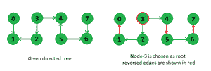

# 生成根的最小边反转

> 原文:[https://www . geeksforgeeks . org/最小边反转到根/](https://www.geeksforgeeks.org/minimum-edge-reversals-to-make-a-root/)

给定一个有 V 个顶点和 V-1 条边的有向树，我们需要选择这样一个根(从给定的节点开始，我们可以到达每隔一个节点)，具有最小数量的边反转。

**示例:**



```
In above tree, if we choose node 3 as our 
root then we need to reverse minimum number
of 3 edges to reach every other node, 
changed tree is shown on the right side.

```

我们可以用 [DFS](https://www.geeksforgeeks.org/depth-first-traversal-for-a-graph/) 来解决这个问题。我们在给定树的任意随机节点上开始 dfs，在每个节点上，我们存储它到起始节点的距离，假设所有边都是无向的，我们还存储从起始节点到当前节点的路径中需要反转的边的数量，让我们将这些边表示为后边，因此后边是指路径中指向节点的边。利用这个 dfs，我们还计算了树中边反转的总数。在此计算之后，在每个节点上，我们可以计算“到达每隔一个节点的边反转次数”，如下所示，
当选择某个节点作为 dfs 的起始节点时，让树中的反转总数为 R，然后**如果我们想要从节点 I 到达每隔一个节点，我们需要将路径节点 I 的所有后边缘反转到起始节点，并且我们还需要将除节点 I 之外的所有其他后边缘反转到起始节点路径。**第一部分将是(节点 I 到起始节点的距离-节点 I 处的后边缘计数)，因为我们想要反转从节点 I 到起始节点的路径中的边缘，所以它将是总边缘(即距离)减去从起始节点到节点 I 的后边缘(即节点 I 处的后边缘计数)。第二部分将是(树 R 的总边反转或总后边–节点 I 的后边计数)。在计算每个节点的这个值之后，我们将选择其中的最小值作为我们的结果。

在下面的代码中，在给定的边方向上添加权重 0，在相反的方向上添加权重 1，用于在 dfs 方法中计数反向边。

## C++

```
// C++ program to find min edge reversal to
// make every node reachable from root
#include <bits/stdc++.h>
using namespace std;

// method to dfs in tree and populates disRev values
int dfs(vector< pair<int, int> > g[],
        pair<int, int> disRev[], bool visit[], int u)
{
    // visit current node
    visit[u] = true;
    int totalRev = 0;

    // looping over all neighbors
    for (int i = 0; i < g[u].size(); i++)
    {
        int v = g[u][i].first;
        if (!visit[v])
        {
            // distance of v will be one more than distance of u
            disRev[v].first = disRev[u].first + 1;

            // initialize back edge count same as
            // parent node's count
            disRev[v].second = disRev[u].second;

            // if there is a reverse edge from u to i,
            // then only update
            if (g[u][i].second)
            {
                disRev[v].second = disRev[u].second + 1;
                totalRev++;
            }
            totalRev += dfs(g, disRev, visit, v);
        }
    }

    // return total reversal in subtree rooted at u
    return totalRev;
}

// method prints root and minimum number of edge reversal
void printMinEdgeReverseForRootNode(int edges[][2], int e)
{
    // number of nodes are one more than number of edges
    int V = e + 1;

    // data structure to store directed tree
    vector< pair<int, int> > g[V];

    // disRev stores two values - distance and back
    // edge count from root node
    pair<int, int> disRev[V];

    bool visit[V];

    int u, v;
    for (int i = 0; i < e; i++)
    {
        u = edges[i][0];
        v = edges[i][1];

        // add 0 weight in direction of u to v
        g[u].push_back(make_pair(v, 0));

        // add 1 weight in reverse direction
        g[v].push_back(make_pair(u, 1));
    }

    //    initialize all variables
    for (int i = 0; i < V; i++)
    {
        visit[i] = false;
        disRev[i].first = disRev[i].second = 0;
    }

    int root = 0;

    // dfs populates disRev data structure and
    // store total reverse edge counts
    int totalRev = dfs(g, disRev, visit, root);

    // UnComment below lines to print each node's
    // distance and edge reversal count from root node
    /*
    for (int i = 0; i < V; i++)
    {
        cout << i << " : " << disRev[i].first
              << " " << disRev[i].second << endl;
    }
    */

    int res = INT_MAX;

    // loop over all nodes to choose minimum edge reversal
    for (int i = 0; i < V; i++)
    {
        // (reversal in path to i) + (reversal
        // in all other tree parts)
        int edgesToRev = (totalRev - disRev[i].second) +
                         (disRev[i].first - disRev[i].second);

        // choose minimum among all values
        if (edgesToRev < res)
        {
            res = edgesToRev;
            root = i;
        }
    }

    // print the designated root and total
    // edge reversal made
    cout << root << " " << res << endl;
}

// Driver code to test above methods
int main()
{
    int edges[][2] =
    {
        {0, 1},
        {2, 1},
        {3, 2},
        {3, 4},
        {5, 4},
        {5, 6},
        {7, 6}
    };
    int e = sizeof(edges) / sizeof(edges[0]);

    printMinEdgeReverseForRootNode(edges, e);
    return 0;
}
```

## Java 语言(一种计算机语言，尤用于创建网站)

```
// Java program to find min edge reversal to 
// make every node reachable from root 
import java.util.*;

class GFG
{
    // pair class
    static class pair
    {
        int first,second;
        pair(int a ,int b)
        {
            first = a;
            second = b;
        }
    }

// method to dfs in tree and populates disRev values 
static int dfs(Vector<Vector< pair >> g, 
        pair disRev[], boolean visit[], int u) 
{ 
    // visit current node 
    visit[u] = true; 
    int totalRev = 0; 

    // looping over all neighbors 
    for (int i = 0; i < g.get(u).size(); i++) 
    { 
        int v = g.get(u).get(i).first; 
        if (!visit[v]) 
        { 
            // distance of v will be one more than distance of u 
            disRev[v].first = disRev[u].first + 1; 

            // initialize back edge count same as 
            // parent node's count 
            disRev[v].second = disRev[u].second; 

            // if there is a reverse edge from u to i, 
            // then only update 
            if (g.get(u).get(i).second!=0) 
            { 
                disRev[v].second = disRev[u].second + 1; 
                totalRev++; 
            } 
            totalRev += dfs(g, disRev, visit, v); 
        } 
    } 

    // return total reversal in subtree rooted at u 
    return totalRev; 
} 

// method prints root and minimum number of edge reversal 
static void printMinEdgeReverseForRootNode(int edges[][], int e) 
{ 
    // number of nodes are one more than number of edges 
    int V = e + 1; 

    // data structure to store directed tree 
    Vector<Vector< pair >> g=new Vector<Vector< pair >>();

    for(int i = 0; i < V + 1; i++)
    g.add(new Vector<pair>());

    // disRev stores two values - distance and back 
    // edge count from root node 
    pair disRev[] = new pair[V]; 

    for(int i = 0; i < V; i++)
    disRev[i] = new pair(0, 0);

    boolean visit[] = new boolean[V]; 

    int u, v; 
    for (int i = 0; i < e; i++) 
    { 
        u = edges[i][0]; 
        v = edges[i][1]; 

        // add 0 weight in direction of u to v 
        g.get(u).add(new pair(v, 0)); 

        // add 1 weight in reverse direction 
        g.get(v).add(new pair(u, 1)); 
    } 

    // initialize all variables 
    for (int i = 0; i < V; i++) 
    { 
        visit[i] = false; 
        disRev[i].first = disRev[i].second = 0; 
    } 

    int root = 0; 

    // dfs populates disRev data structure and 
    // store total reverse edge counts 
    int totalRev = dfs(g, disRev, visit, root); 

    // UnComment below lines to print each node's 
    // distance and edge reversal count from root node 
    /* 
    for (int i = 0; i < V; i++) 
    { 
        cout << i << " : " << disRev[i].first 
            << " " << disRev[i].second << endl; 
    } 
    */

    int res = Integer.MAX_VALUE; 

    // loop over all nodes to choose minimum edge reversal 
    for (int i = 0; i < V; i++) 
    { 
        // (reversal in path to i) + (reversal 
        // in all other tree parts) 
        int edgesToRev = (totalRev - disRev[i].second) + 
                        (disRev[i].first - disRev[i].second); 

        // choose minimum among all values 
        if (edgesToRev < res) 
        { 
            res = edgesToRev; 
            root = i; 
        } 
    } 

    // print the designated root and total 
    // edge reversal made 
    System.out.println(root + " " + res ); 
} 

// Driver code 
public static void main(String args[])
{ 
    int edges[][] = 
    { 
        {0, 1}, 
        {2, 1}, 
        {3, 2}, 
        {3, 4}, 
        {5, 4}, 
        {5, 6}, 
        {7, 6} 
    }; 
    int e = edges.length; 

    printMinEdgeReverseForRootNode(edges, e); 
}
} 

// This code is contributed by Arnab Kundu
```

## 蟒蛇 3

```
# Python3 program to find min edge reversal
# to make every node reachable from root
import sys

# Method to dfs in tree and populates 
# disRev values
def dfs(g, disRev, visit, u):

    # Visit current node
    visit[u] = True
    totalRev = 0

    # Looping over all neighbors
    for i in range(len(g[u])):
        v = g[u][i][0]

        if (not visit[v]):

            # Distance of v will be one more
            # than distance of u
            disRev[v][0] = disRev[u][0] + 1

            # Initialize back edge count same as
            # parent node's count
            disRev[v][1] = disRev[u][1]

            # If there is a reverse edge from u to i,
            # then only update
            if (g[u][i][1]):
                disRev[v][1] = disRev[u][1] + 1
                totalRev += 1

            totalRev += dfs(g, disRev, visit, v)

    # Return total reversal in subtree rooted at u
    return totalRev

# Method prints root and minimum number of
# edge reversal
def printMinEdgeReverseForRootNode(edges, e):

    # Number of nodes are one more than
    # number of edges
    V = e + 1

    # Data structure to store directed tree
    g = [[] for i in range(V)]

    # disRev stores two values - distance
    # and back edge count from root node
    disRev = [[0, 0] for i in range(V)]

    visit = [False for i in range(V)]

    # u, v
    for i in range(e):
        u = edges[i][0]
        v = edges[i][1]

        # Add 0 weight in direction of u to v
        g[u].append([v, 0])

        # Add 1 weight in reverse direction
        g[v].append([u, 1])

    # Initialize all variables
    for i in range(V):
        visit[i] = False
        disRev[i][0] = disRev[i][1] = 0

    root = 0

    # dfs populates disRev data structure and
    # store total reverse edge counts
    totalRev = dfs(g, disRev, visit, root)

    # UnComment below lines to preach node's
    # distance and edge reversal count from root node
    # for (i = 0 i < V i++)
    # {
    #     cout << i << " : " << disRev[i][0]
    #         << " " << disRev[i][1] << endl
    # }
    res = sys.maxsize

    # Loop over all nodes to choose 
    # minimum edge reversal
    for i in range(V):

        # (reversal in path to i) + (reversal
        # in all other tree parts)
        edgesToRev = ((totalRev - disRev[i][1]) + 
                  (disRev[i][0] - disRev[i][1]))

        # Choose minimum among all values
        if (edgesToRev < res):
            res = edgesToRev
            root = i

    # Print the designated root and total
    # edge reversal made
    print(root, res) 

# Driver code 
if __name__ == '__main__':

    edges = [ [ 0, 1 ], [ 2, 1 ],
              [ 3, 2 ], [ 3, 4 ],
              [ 5, 4 ], [ 5, 6 ],
              [ 7, 6 ] ]

    e = len(edges)

    printMinEdgeReverseForRootNode(edges, e)

# This code is contributed by mohit kumar 29
```

## C#

```
// C# program to find min edge reversal to 
// make every node reachable from root
using System;
using System.Collections.Generic;

class GFG
{
    // pair class
    public class pair
    {
        public int first,second;
        public pair(int a, int b)
        {
            first = a;
            second = b;
        }
    }

// method to dfs in tree and populates disRev values 
static int dfs(List<List< pair >> g, 
               pair []disRev, Boolean []visit, int u) 
{ 
    // visit current node 
    visit[u] = true; 
    int totalRev = 0; 

    // looping over all neighbors 
    for (int i = 0; i < g[u].Count; i++) 
    { 
        int v = g[u][i].first; 
        if (!visit[v]) 
        { 
            // distance of v will be one more 
            // than distance of u 
            disRev[v].first = disRev[u].first + 1; 

            // initialize back edge count same as 
            // parent node's count 
            disRev[v].second = disRev[u].second; 

            // if there is a reverse edge from u to i, 
            // then only update 
            if (g[u][i].second != 0) 
            { 
                disRev[v].second = disRev[u].second + 1; 
                totalRev++; 
            } 
            totalRev += dfs(g, disRev, visit, v); 
        } 
    } 

    // return total reversal in subtree rooted at u 
    return totalRev; 
} 

// method prints root and minimum number of edge reversal 
static void printMinEdgeReverseForRootNode(int [,]edges, int e) 
{ 
    // number of nodes are one more than number of edges 
    int V = e + 1; 

    // data structure to store directed tree 
    List<List< pair >> g = new List<List< pair >>();

    for(int i = 0; i < V + 1; i++)
    g.Add(new List<pair>());

    // disRev stores two values - distance and back 
    // edge count from root node 
    pair []disRev = new pair[V]; 

    for(int i = 0; i < V; i++)
    disRev[i] = new pair(0, 0);

    Boolean []visit = new Boolean[V]; 

    int u, v; 
    for (int i = 0; i < e; i++) 
    { 
        u = edges[i, 0]; 
        v = edges[i, 1]; 

        // add 0 weight in direction of u to v 
        g[u].Add(new pair(v, 0)); 

        // add 1 weight in reverse direction 
        g[v].Add(new pair(u, 1)); 
    } 

    // initialize all variables 
    for (int i = 0; i < V; i++) 
    { 
        visit[i] = false; 
        disRev[i].first = disRev[i].second = 0; 
    } 

    int root = 0; 

    // dfs populates disRev data structure and 
    // store total reverse edge counts 
    int totalRev = dfs(g, disRev, visit, root); 

    // UnComment below lines to print each node's 
    // distance and edge reversal count from root node 
    /* 
    for (int i = 0; i < V; i++) 
    { 
        cout << i << " : " << disRev[i].first 
            << " " << disRev[i].second << endl; 
    } 
    */

    int res = int.MaxValue; 

    // loop over all nodes to choose minimum edge reversal 
    for (int i = 0; i < V; i++) 
    { 
        // (reversal in path to i) + (reversal 
        // in all other tree parts) 
        int edgesToRev = (totalRev - disRev[i].second) + 
                         (disRev[i].first - disRev[i].second); 

        // choose minimum among all values 
        if (edgesToRev < res) 
        { 
            res = edgesToRev; 
            root = i; 
        } 
    } 

    // print the designated root and total 
    // edge reversal made 
    Console.WriteLine(root + " " + res); 
} 

// Driver code 
public static void Main(String []args)
{ 
    int [,]edges = {{0, 1}, {2, 1}, 
                    {3, 2}, {3, 4}, 
                    {5, 4}, {5, 6}, 
                    {7, 6}}; 
    int e = edges.GetLength(0); 

    printMinEdgeReverseForRootNode(edges, e); 
}
} 

// This code is contributed by 29AjayKumar
```

## java 描述语言

```
<script>

// Javascript program to find min edge 
// reversal to make every node reachable 
// from root
class pair
{
    constructor(a, b)
    {
        this.first = a;
        this.second = b;
    }
}

// Method to dfs in tree and populates
// disRev values
function dfs(g, disRev, visit, u)
{

    // Visit current node
    visit[u] = true;
    let totalRev = 0;

    // Looping over all neighbors
    for(let i = 0; i < g[u].length; i++)
    {
        let v = g[u][i].first;
        if (!visit[v])
        {

            // Distance of v will be one more
            // than distance of u
            disRev[v].first = disRev[u].first + 1;

            // Initialize back edge count same as
            // parent node's count
            disRev[v].second = disRev[u].second;

            // If there is a reverse edge from u to i,
            // then only update
            if (g[u][i].second != 0)
            {
                disRev[v].second = disRev[u].second + 1;
                totalRev++;
            }
            totalRev += dfs(g, disRev, visit, v);
        }
    }

    // Return total reversal in subtree 
    // rooted at u
    return totalRev;
}

// Method prints root and minimum number
// of edge reversal
function printMinEdgeReverseForRootNode(edges, e)
{

    // Number of nodes are one more 
    // than number of edges
    let V = e + 1;

    // Data structure to store directed tree
    let g = [];

    for(let i = 0; i < V + 1; i++)
        g.push([]);

    // disRev stores two values - distance and 
    // back edge count from root node
    let disRev = new Array(V);

    for(let i = 0; i < V; i++)
        disRev[i] = new pair(0, 0);

    let visit = new Array(V);
    let u, v;

    for(let i = 0; i < e; i++)
    {
        u = edges[i][0];
        v = edges[i][1];

        // Add 0 weight in direction of u to v
        g[u].push(new pair(v, 0));

        // Add 1 weight in reverse direction
        g[v].push(new pair(u, 1));
    }

    // Initialize all variables
    for(let i = 0; i < V; i++)
    {
        visit[i] = false;
        disRev[i].first = disRev[i].second = 0;
    }

    let root = 0;

    // dfs populates disRev data structure and
    // store total reverse edge counts
    let totalRev = dfs(g, disRev, visit, root);

    // UnComment below lines to print each node's
    // distance and edge reversal count from root node
    /*
    for (int i = 0; i < V; i++)
    {
        cout << i << " : " << disRev[i].first
            << " " << disRev[i].second << endl;
    }
    */
    let res = Number.MAX_VALUE;

    // Loop over all nodes to choose 
    // minimum edge reversal
    for(let i = 0; i < V; i++)
    {

        // (reversal in path to i) + (reversal
        // in all other tree parts)
        let edgesToRev = (totalRev - disRev[i].second) +
                         (disRev[i].first - disRev[i].second);

        // Choose minimum among all values
        if (edgesToRev < res)
        {
            res = edgesToRev;
            root = i;
        }
    }

    // Print the designated root and total
    // edge reversal made
    document.write(root + " " + res );
}

// Driver code
let edges = [ [ 0, 1 ], [ 2, 1 ],
              [ 3, 2 ], [ 3, 4 ],
              [ 5, 4 ], [ 5, 6 ],
              [ 7, 6 ] ];

let e = edges.length;

printMinEdgeReverseForRootNode(edges, e);

// This code is contributed by rag2127

</script>
```

**输出:**

```
3 3
```

本文由 [**乌卡什·特里维迪**](https://in.linkedin.com/in/utkarsh-trivedi-253069a7) 供稿。如果你喜欢 GeeksforGeeks 并想投稿，你也可以使用[write.geeksforgeeks.org](https://write.geeksforgeeks.org)写一篇文章或者把你的文章邮寄到 review-team@geeksforgeeks.org。看到你的文章出现在极客博客主页上，帮助其他极客。
如果发现有不正确的地方，或者想分享更多关于上述话题的信息，请写评论。