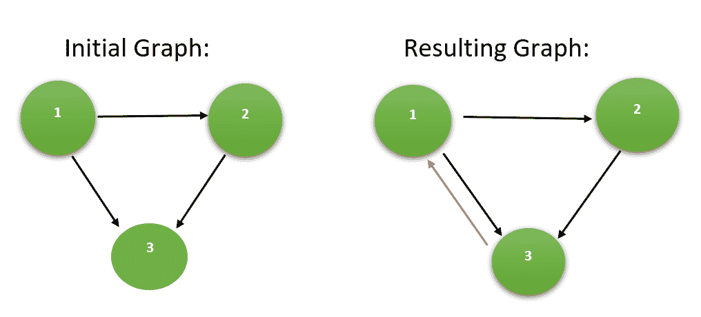

# 使有向图强连通所需的最小边数

> 原文:[https://www . geesforgeks . org/极小边-制作有向图所需-强连通/](https://www.geeksforgeeks.org/minimum-edges-required-to-make-a-directed-graph-strongly-connected/)

给定一个由 **N 个**顶点和 **M 个**边组成的**有向** [**图**](https://www.geeksforgeeks.org/graph-data-structure-and-algorithms/) ，任务是找到使给定图 [**强连通**](https://www.geeksforgeeks.org/strongly-connected-components/) 所需的最小边数。

**示例:**

> **输入:** N = 3，M = 3，源[] = {1，2，1}，目的地[] = {2，3，3}
> **输出:** 1
> **解释:**
> 添加有向边连接这对顶点{3，1}使图强连通。
> 因此，所需的最小边数为 1。
> 以下是上述示例的图示:
> 
> [](https://media.geeksforgeeks.org/wp-content/uploads/20200719192620/graph7.PNG)
> 
> **输入:** N = 5，M = 5，源[] = {1，3，1，3，4}，目的地[] = {2，2，3，4，5}
> **输出:** 2
> **解释:**
> 添加 2 条有向边连接以下一对顶点使图强连通:
> 
> *   {2, 1}
> *   {5, 2}
> 
> 因此，所需的最小边数是 2。

**逼近:**
对于[强连通图](https://www.geeksforgeeks.org/strongly-connected-components/)，每个顶点至少要有**的[内角和](https://www.geeksforgeeks.org/finding-in-and-out-degrees-of-all-vertices-in-a-graph/)外角** ***1*** 。因此，为了使图强连通，每个顶点必须有一条输入边和一条输出边。使图强连通所需的最大输入边数和输出边数是使图强连通所需的最小边数。
按照以下步骤解决问题:

*   使用 [DFS](https://www.geeksforgeeks.org/depth-first-search-or-dfs-for-a-graph/) 求出图的每个顶点的入度和出度的计数。
*   如果一个顶点的入度或出度大于 *1* ，则认为它只是 *1* 。
*   计算给定图形的总入度和出度**。**
*   使图强连通所需的最小边数由***max(N-合计度，N-合计度)给出。**T3】*
*   打印最小边数作为结果。

下面是上述方法的实现:

## C++

```
// C++ program to implement
// the above approach
#include <bits/stdc++.h>
using namespace std;

// Perform DFS to count the in-degree
// and out-degree of the graph
void dfs(int u, vector<int> adj[], int* vis, int* inDeg,
         int* outDeg)
{
    // Mark the source as visited
    vis[u] = 1;

    // Traversing adjacent nodes
    for (auto v : adj[u])
    {
        // Mark out-degree as 1
        outDeg[u] = 1;
        // Mark in-degree as 1
        inDeg[v] = 1;

        // If not visited
        if (vis[v] == 0)
        {
            // DFS Traversal on
            // adjacent vertex
            dfs(v, adj, vis, inDeg, outDeg);
        }
    }
}

// Function to return minimum number
// of edges required to make the graph
// strongly connected
int findMinimumEdges(int source[], int N, int M, int dest[])
{
    // For Adjacency List
    vector<int> adj[N + 1];

    // Create the Adjacency List
    for (int i = 0; i < M; i++)
    {
        adj[ source[i] ].push_back(dest[i]);
    }

    // Initialize the in-degree array
    int inDeg[N + 1] = { 0 };

    // Initialize the out-degree array
    int outDeg[N + 1] = { 0 };

    // Initialize the visited array
    int vis[N + 1] = { 0 };

    // Perform DFS to count in-degrees
    // and out-degreess
    dfs(1, adj, vis, inDeg, outDeg);

    // To store the result
    int minEdges = 0;

    // To store total count of in-degree
    // and out-degree
    int totalIndegree = 0;
    int totalOutdegree = 0;

    // Find total in-degree
    // and out-degree
    for (int i = 1; i <= N; i++)
    {
        if (inDeg[i] == 1)
            totalIndegree++;
        if (outDeg[i] == 1)
            totalOutdegree++;
    }

    // Calculate the minimum
    // edges required
    minEdges = max(N - totalIndegree, N - totalOutdegree);

    // Return the minimum edges
    return minEdges;
}

// Driver Code
int main()
{
    int N = 5, M = 5;

    int source[] = { 1, 3, 1, 3, 4 };
    int destination[] = { 2, 2, 3, 4, 5 };

    // Function call
    cout << findMinimumEdges(source, N, M, destination);
    return 0;
}
```

## Java 语言(一种计算机语言，尤用于创建网站)

```
// Java program to implement
// the above approach
import java.util.*;
class GFG{

// Perform DFS to count the 
// in-degree and out-degree 
// of the graph
static void dfs(int u, Vector<Integer> adj[], 
                int[] vis, int[] inDeg,
         int[] outDeg)
{
  // Mark the source 
  // as visited
  vis[u] = 1;

  // Traversing adjacent nodes
  for (int v : adj[u]) 
  {
    // Mark out-degree as 1
      outDeg[u] = 1;
    // Mark in-degree as 1
      inDeg[v] = 1;

    // If not visited
    if (vis[v] == 0) 
    {

      // DFS Traversal on
      // adjacent vertex
      dfs(v, adj, vis, 
          inDeg, outDeg);
    }
  }
}

// Function to return minimum 
// number of edges required 
// to make the graph strongly 
// connected
static int findMinimumEdges(int source[], 
                            int N, int M, 
                            int dest[])
{
  // For Adjacency List
  @SuppressWarnings("unchecked")
  Vector<Integer> []adj = 
         new Vector[N + 1];

  for (int i = 0; i < adj.length; i++)
    adj[i] = new Vector<Integer>();

  // Create the Adjacency List
  for (int i = 0; i < M; i++) 
  {
    adj].add(dest[i]);
  }

  // Initialize the in-degree array
  int inDeg[] = new int[N + 1];

  // Initialize the out-degree array
  int outDeg[] = new int[N + 1];

  // Initialize the visited array
  int vis[] = new int[N + 1];

  // Perform DFS to count 
  // in-degrees and out-degreess
  dfs(1, adj, vis, inDeg, outDeg);

  // To store the result
  int minEdges = 0;

  // To store total count of 
  // in-degree and out-degree
  int totalIndegree = 0;
  int totalOutdegree = 0;

  // Find total in-degree
  // and out-degree
  for (int i = 1; i <= N; i++) 
  {
    if (inDeg[i] == 1)
      totalIndegree++;
    if (outDeg[i] == 1)
      totalOutdegree++;
  }

  // Calculate the minimum
  // edges required
  minEdges = Math.max(N - totalIndegree, 
                      N - totalOutdegree);

  // Return the minimum edges
  return minEdges;
}

// Driver Code
public static void main(String[] args)
{
  int N = 5, M = 5;
  int source[] = {1, 3, 1, 3, 4};
  int destination[] = {2, 2, 3, 4, 5};

  // Function call
  System.out.print(findMinimumEdges(source, 
                                    N, M, 
                                    destination));
}
}
```

## 蟒蛇 3

```
# Python3 program to implement
# the above approach

# Perform DFS to count the in-degree
# and out-degree of the graph
def dfs(u, adj, vis,inDeg, outDeg):

    # Mark the source as visited
    vis[u] = 1;

    # Traversing adjacent nodes
    for v in adj[u]:
        # Mark out-degree as 1
        outDeg[u] = 1;
        # Mark in-degree as 1
        inDeg[u] = 1;

        # If not visited
        if (vis[v] == 0):

            # DFS Traversal on
            # adjacent vertex
            dfs(v, adj, vis, 
                inDeg, outDeg)

# Function to return minimum 
# number of edges required 
# to make the graph strongly 
# connected
def findMinimumEdges(source, N, 
                     M, dest):

    # For Adjacency List
    adj = [[] for i in range(N + 1)]

    # Create the Adjacency List
    for i in range(M):
        adj].append(dest[i]);

    # Initialize the in-degree array
    inDeg = [0 for i in range(N + 1)]

    # Initialize the out-degree array
    outDeg = [0 for i in range(N + 1)]

    # Initialize the visited array
    vis = [0 for i in range(N + 1)]

    # Perform DFS to count in-degrees
    # and out-degreess
    dfs(1, adj, vis, inDeg, outDeg);

    # To store the result
    minEdges = 0;

    # To store total count of 
    # in-degree and out-degree
    totalIndegree = 0;
    totalOutdegree = 0;

    # Find total in-degree
    # and out-degree
    for i in range(1, N):    
        if (inDeg[i] == 1):
            totalIndegree += 1;
        if (outDeg[i] == 1):
            totalOutdegree += 1;    

    # Calculate the minimum
    # edges required
    minEdges = max(N - totalIndegree, 
                   N - totalOutdegree);

    # Return the minimum edges
    return minEdges;

# Driver code
if __name__ == "__main__":

    N = 5
    M = 5

    source = [1, 3, 1, 3, 4]
    destination = [2, 2, 3, 4, 5]

    # Function call
    print(findMinimumEdges(source, N, 
                           M, destination))

# This code is contributed by rutvik_56
```

## C#

```
// C# program to implement
// the above approach
using System;
using System.Collections.Generic;

class GFG{

// Perform DFS to count the 
// in-degree and out-degree 
// of the graph
static void dfs(int u, List<int> []adj, 
                int[] vis, int[] inDeg,
                int[] outDeg)
{

    // Mark the source 
    // as visited
    vis[u] = 1;

    // Traversing adjacent nodes
    foreach (int v in adj[u]) 
    {
          // Mark out-degree as 1
        outDeg[u] = 1;
        // Mark in-degree as 1
        inDeg[v] = 1;

        // If not visited
        if (vis[v] == 0) 
        {            
            // DFS Traversal on
            // adjacent vertex
            dfs(v, adj, vis, 
                inDeg, outDeg);
        }
    }
}

// Function to return minimum 
// number of edges required 
// to make the graph strongly 
// connected
static int findMinimumEdges(int []source, 
                            int N, int M, 
                            int []dest)
{

    // For Adjacency List
    List<int> []adj = new List<int>[N + 1];

    for(int i = 0; i < adj.Length; i++)
        adj[i] = new List<int>();

    // Create the Adjacency List
    for(int i = 0; i < M; i++) 
    {
        adj].Add(dest[i]);
    }

    // Initialize the in-degree array
    int []inDeg = new int[N + 1];

    // Initialize the out-degree array
    int []outDeg = new int[N + 1];

    // Initialize the visited array
    int []vis = new int[N + 1];

    // Perform DFS to count 
    // in-degrees and out-degreess
    dfs(1, adj, vis, inDeg, outDeg);

    // To store the result
    int minEdges = 0;

    // To store total count of 
    // in-degree and out-degree
    int totalIndegree = 0;
    int totalOutdegree = 0;

    // Find total in-degree
    // and out-degree
    for (int i = 1; i <= N; i++) 
    {
        if (inDeg[i] == 1)
            totalIndegree++;
        if (outDeg[i] == 1)
            totalOutdegree++;
    }

    // Calculate the minimum
    // edges required
    minEdges = Math.Max(N - totalIndegree, 
                        N - totalOutdegree);

    // Return the minimum edges
    return minEdges;
}

// Driver Code
public static void Main(String[] args)
{
    int N = 5, M = 5;
    int []source = { 1, 3, 1, 3, 4 };
    int []destination = { 2, 2, 3, 4, 5 };

    // Function call
    Console.Write(findMinimumEdges(source, 
                                   N, M, 
                                   destination));
}
}

// This code is contributed by Amit Katiyar
```

## java 描述语言

```
<script>
// Javascript program to implement
// the above approach

// Perform DFS to count the 
// in-degree and out-degree 
// of the graph
function dfs(u, adj, vis, inDeg, outDeg)
{

    // Mark the source 
    // as visited
    vis[u] = 1;

    // Traversing adjacent nodes
    for(var v of adj[u]) 
    {
          // Mark out-degree as 1
        outDeg[u] = 1;
        // Mark in-degree as 1
        inDeg[v] = 1;

        // If not visited
        if (vis[v] == 0) 
        {            
            // DFS Traversal on
            // adjacent vertex
            dfs(v, adj, vis, 
                inDeg, outDeg);
        }
    }
}

// Function to return minimum 
// number of edges required 
// to make the graph strongly 
// connected
function findMinimumEdges(source, N, M, dest)
{

    // For Adjacency List
    var adj = Array.from(Array(N+1), ()=>Array());

    // Create the Adjacency List
    for(var i = 0; i < M; i++) 
    {
        adj].push(dest[i]);
    }

    // Initialize the in-degree array
    var inDeg = Array(N+1).fill(0);

    // Initialize the out-degree array
    var outDeg = Array(N+1).fill(0);

    // Initialize the visited array
    var vis = Array(N+1).fill(0);

    // Perform DFS to count 
    // in-degrees and out-degreess
    dfs(1, adj, vis, inDeg, outDeg);

    // To store the result
    var minEdges = 0;

    // To store total count of 
    // in-degree and out-degree
    var totalIndegree = 0;
    var totalOutdegree = 0;

    // Find total in-degree
    // and out-degree
    for (var i = 1; i <= N; i++) 
    {
        if (inDeg[i] == 1)
            totalIndegree++;
        if (outDeg[i] == 1)
            totalOutdegree++;
    }

    // Calculate the minimum
    // edges required
    minEdges = Math.max(N - totalIndegree, 
                        N - totalOutdegree);

    // Return the minimum edges
    return minEdges;
}

// Driver Code
var N = 5, M = 5;
var source = [1, 3, 1, 3, 4];
var destination = [2, 2, 3, 4, 5];

// Function call
document.write(findMinimumEdges(source, 
                               N, M, 
                               destination));

</script>
```

**Output**

```
2
```

**时间复杂度:**O(N+M)
T3】辅助空间: O(N)