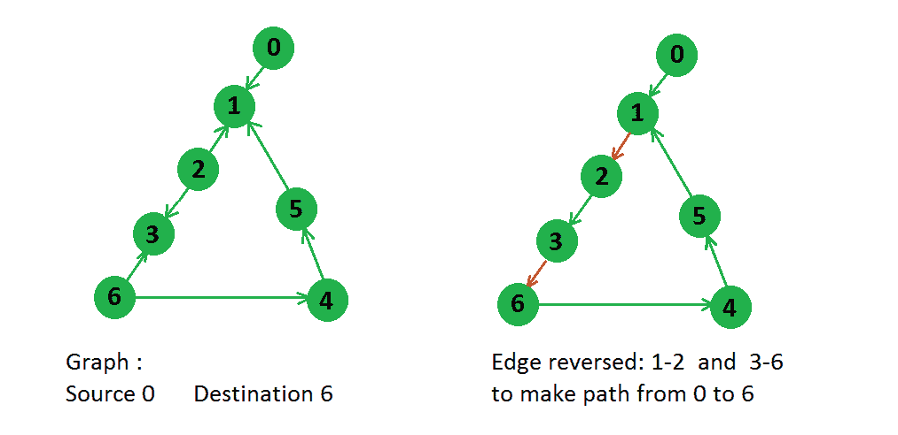
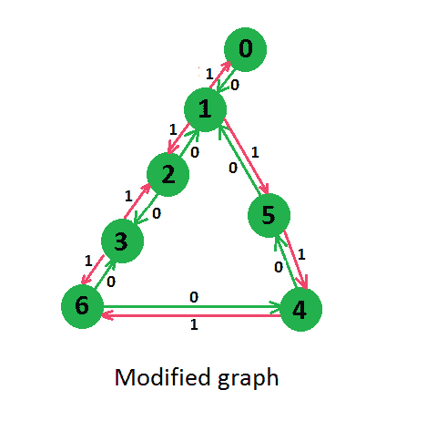

# 从源到目的地的最短反向边数

> 原文:[https://www . geesforgeks . org/minimum-edges-reverse-make-path-source-destination/](https://www.geeksforgeeks.org/minimum-edges-reverse-make-path-source-destination/)

给定一个有向图以及一个源节点和目的节点，我们需要找到需要反转多少条边，以便从源节点到目的节点至少有一条路径。

示例:



```
In above graph there were two paths from node 0 to node 6,
0 -> 1 -> 2 -> 3 -> 6
0 -> 1 -> 5 -> 4 -> 6
But for first path only two edges need to be reversed, so answer will be 2 only.
```

这个问题可以通过假设给定图形的不同版本来解决。在这个版本中，我们创建了一个对应于每条边的反向边，并为其分配权重 1，为原始边分配权重 0。经过这种修改后，上面的图看起来如下所示，



现在我们可以看到，我们已经修改了图形，这样，如果我们向原始边移动，就不会产生成本，但是如果我们向反向边移动，就会增加 1 成本。因此，如果我们将[迪克斯特拉最短路径](https://www.geeksforgeeks.org/greedy-algorithms-set-6-dijkstras-shortest-path-algorithm/)应用于这个来自给定源的修改图，那么这将给我们从源到达目的地的最小成本，即从源到目的地的最小边反转。

下面是基于上述概念的代码。

## C++

```
// C++ Program to find minimum edge reversal to get
// atleast one path from source to destination
#include <bits/stdc++.h>
using namespace std;
#define INF 0x3f3f3f3f

// This class represents a directed graph using
// adjacency list representation
class Graph
{
    int V;
    list<pair<int, int>> *graph;

public:
    // Constructor:
    Graph(int V)
    {
        this->V = V;
        graph = new list<pair<int, int>>[V];
    }

    // Adding edges into the graph:
    void addEdge(int u, int v, int w)
    {
        graph[u].push_back(make_pair(v, w));
    }

    // Returns shortest path from source to all other vertices.
    vector<int> shortestPath(int source)
    {
        // Create a set to store vertices that are being prerocessed
        set<pair<int, int>> setds;

        // Create a vector for distances and initialize all
        // distances as infinite (INF)
        vector<int> distance(V, INF);

        // Insert source itself in Set and initialize its distance as 0.
        setds.insert(make_pair(0, source));
        distance = 0;

        /* Looping till all shortest distance are finalized
           then setds will become empty */
        while (!setds.empty())
        {
            // The first vertex in Set is the minimum distance
            // vertex, extract it from set.
            pair<int, int> tmp = *(setds.begin());
            setds.erase(setds.begin());

            // vertex label is stored in second of pair (it
            // has to be done this way to keep the vertices
            // sorted distance (distance must be first item
            // in pair)
            int u = tmp.second;

            list<pair<int, int>>::iterator i;
            for (i = graph[u].begin(); i != graph[u].end(); ++i)
            {
                // Get vertex label and weight of current adjacent
                // of u.
                int v = (*i).first;
                int weight = (*i).second;

                //  If there is shorter path to v through u.
                if (distance[v] > distance[u] + weight)
                {
                    /*  If distance of v is not INF then it must be in
                        our set, so removing it and inserting again
                        with updated less distance.
                        Note : We extract only those vertices from Set
                        for which distance is finalized. So for them,
                        we would never reach here.  */
                    if (distance[v] != INF)
                        setds.erase(setds.find(make_pair(distance[v], v)));

                    // Updating distance of v
                    distance[v] = distance[u] + weight;
                    setds.insert(make_pair(distance[v], v));
                }
            }
        }
        return distance;
    }

    Graph modelGraphWithEdgeWeight(int edge[][2], int E, int V)
    {
        Graph g(V);
        for (int i = 0; i < E; i++)
        {
            // original edge : weight 0
            g.addEdge(edge[i][0], edge[i][1], 0);

            // reverse edge : weight 1
            g.addEdge(edge[i][1], edge[i][0], 1);
        }
        return g;
    }

    int getMinEdgeReversal(int edge[][2], int E, int V, int source, int destination)
    {
        // get modified graph with edge weight.
        Graph g = modelGraphWithEdgeWeight(edge, E, V);

        // distance vector stores shortest path.
        vector<int> dist = g.shortestPath(source);

        // If distance of destination is still INF then we cannot reach destination. Hence, not possible.
        if (dist[destination] == INF)
            return -1;
        else
            return dist[destination];
    }
};

int main()
{
    int V = 7;
    Graph g(V);

    int edge[][2] = {{0, 1}, {2, 1}, {2, 3}, {5, 1}, {4, 5}, {6, 4}, {6, 3}};
    int E = sizeof(edge) / sizeof(edge[0]);

    int minEdgeToReverse = g.getMinEdgeReversal(edge, E, V, 0, 6);

    if (minEdgeToReverse != -1)
        cout << minEdgeToReverse << endl;
    else
        cout << "Not Possible." << endl;

    return 0;
}
```

## Java 语言(一种计算机语言，尤用于创建网站)

```
// Java program to find minimum edge reversal to get
// atleast one path from source to destination
import java.util.ArrayList;
import java.util.Arrays;
import java.util.HashSet;
import java.util.Iterator;
import java.util.List;
import java.util.Set;

class Pair
{
    int first, second;

    public Pair(int first, int second)
    {
        this.first = first;
        this.second = second;
    }
}

// This class represents a directed graph using
// adjacency list representation
class Graph{

final int INF = (int)0x3f3f3f3f;

// No. of vertices
int V;

// In a weighted graph, we need to store vertex
// and weight pair for every edge
List<Pair>[] adj;

// Allocates memory for adjacency list
@SuppressWarnings("unchecked")
public Graph(int V)
{
    this.V = V;
    adj = new ArrayList[V];

    for(int i = 0; i < V; i++)
    {
        adj[i] = new ArrayList();
    }
}

// Function adds a directed edge from
// u to v with weight w
void addEdge(int u, int v, int w)
{
    adj[u].add(new Pair(v, w));
}

// Prints shortest paths from
// src to all other vertices
int[] shortestPath(int src)
{

    // Create a set to store vertices
    // that are being prerocessed
    Set<Pair> setds = new HashSet<Pair>();

    // Create a vector for distances and
    // initialize all distances as infinite(INF)
    int[] dist = new int[V];
    Arrays.fill(dist, INF);

    // Insert source itself in Set and initialize
    // its distance as 0.
    setds.add(new Pair(0, src));
    dist[src] = 0;

    // Looping till all shortest distance are
    // finalized then setds will become empty
    while (!setds.isEmpty())
    {

        // The first vertex in Set is the minimum
        // distance vertex, extract it from set.
        Iterator<Pair> itr = setds.iterator();
        Pair tmp = itr.next();
        itr.remove();

        // Vertex label is stored in second of pair (it
        // has to be done this way to keep the vertices
        // sorted distance (distance must be first item
        // in pair)
        int u = tmp.second;

        // 'i' is used to get all adjacent
        // vertices of a vertex
        for(Pair p : adj[u])
        {

            // Get vertex label and weight of
            // current adjacent of u.
            int v = p.first;
            int weight = p.second;

            // If there is shorter path to v through u.
            if (dist[v] > dist[u] + weight)
            {

                // If distance of v is not INF then it
                // must be in our set, so removing it
                // and inserting again with updated
                // less distance. Note : We extract
                // only those vertices from Set for
                // which distance is finalized. So
                // for them, we would never reach here.
                if (dist[v] != INF)
                {
                    setds.remove(new Pair(dist[v], v));
                }

                // setds.erase(setds.find(new Pair(dist[v], v)));

                // Updating distance of v
                dist[v] = dist[u] + weight;
                setds.add(new Pair(dist[v], v));
            }
        }
    }
    return dist;
}
}

class GFG{
static final int INF = (int)0x3f3f3f3f;

// Function adds reverse edge of each original
// edge in the graph. It gives reverse edge
// a weight = 1 and all original edges a
// weight of 0\. Now, the length of the
// shortest path will give us the answer.
// If shortest path is p: it means we
// used p reverse edges in the shortest path.
static Graph modelGraphWithEdgeWeight(int edge[][],
                                      int E, int V)
{
    Graph g = new Graph(V);
    for(int i = 0; i < E; i++)
    {

        // Original edge : weight 0
        g.addEdge(edge[i][0], edge[i][1], 0);

        // Reverse edge : weight 1
        g.addEdge(edge[i][1], edge[i][0], 1);
    }
    return g;
}

// Function returns minimum number of edges to be
// reversed to reach from src to dest
static int getMinEdgeReversal(int edge[][], int E,
                              int V, int src, int dest)
{

    // Get modified graph with edge weight
    Graph g = modelGraphWithEdgeWeight(edge, E, V);

    // Get shortes path vector
    int[] dist = g.shortestPath(src);

    // If distance of destination is still INF,
    // not possible
    if (dist[dest] == INF)
        return -1;
    else
        return dist[dest];
}

// Driver code
public static void main(String[] args)
{
    int V = 7;
    int edge[][] = { { 0, 1 }, { 2, 1 },
                     { 2, 3 }, { 5, 1 },
                     { 4, 5 }, { 6, 4 },
                     { 6, 3 } };
    int E = edge.length;

    int minEdgeToReverse = getMinEdgeReversal(
        edge, E, V, 0, 6);

    if (minEdgeToReverse != -1)
        System.out.println(minEdgeToReverse);
    else
        System.out.println("Not possible");
}
}

// This code is contributed by sanjeev2552
```

## 蟒蛇 3

```
# Python3 Program to find minimum edge reversal to get
# atleast one path from source to destination

# method adds a directed edge from u to v with weight w
def addEdge(u, v, w):
    global adj
    adj[u].append((v, w))

# Prints shortest paths from src to all other vertices
def shortestPath(src):

    # Create a set to store vertices that are being
    # prerocessed
    setds = {}

    # Create a vector for distances and initialize all
    # distances as infinite (INF)
    dist = [10**18 for i in range(V)]

    # Insert source itself in Set and initialize its
    global adj
    setds[(0, src)] = 1
    dist[src] = 0

    # /* Looping till all shortest distance are finalized

    # then setds will become empty */
    while (len(setds) > 0):

        # The first vertex in Set is the minimum distance
        # vertex, extract it from set.
        tmp = list(setds.keys())[0]
        del setds[tmp]

        # vertex label is stored in second of pair (it
        # has to be done this way to keep the vertices
        # sorted distance (distance must be first item
        # in pair)
        u = tmp[1]

        # 'i' is used to get all adjacent vertices of a vertex
        # list< pair<int, int> >::iterator i;
        for i in adj[u]:

            # Get vertex label and weight of current adjacent
            # of u.
            v = i[0];
            weight = i[1]

            # If there is shorter path to v through u.
            if (dist[v] > dist[u] + weight):

                # /* If distance of v is not INF then it must be in
                #     our set, so removing it and inserting again
                #     with updated less distance.
                #     Note : We extract only those vertices from Set
                #     for which distance is finalized. So for them,
                #     we would never reach here. */
                if (dist[v] != 10**18):
                    del setds[(dist[v], v)]

                # Updating distance of v
                dist[v] = dist[u] + weight
                setds[(dist[v], v)] = 1

    return dist

# /* method adds reverse edge of each original edge
# in the graph. It gives reverse edge a weight = 1
# and all original edges a weight of 0\. Now, the
# length of the shortest path will give us the answer.
# If shortest path is p: it means we used p reverse
# edges in the shortest path. */
def modelGraphWithEdgeWeight(edge, E, V):
    global adj
    for i in range(E):

        # original edge : weight 0
        addEdge(edge[i][0], edge[i][1], 0)

        # reverse edge : weight 1
        addEdge(edge[i][1], edge[i][0], 1)

# Method returns minimum number of edges to be
# reversed to reach from src to dest
def getMinEdgeReversal(edge, E, V,src, dest):

    # get modified graph with edge weight
    modelGraphWithEdgeWeight(edge, E, V)

    # get shortes path vector
    dist = shortestPath(src)

    # If distance of destination is still INF,
    # not possible
    if (dist[dest] == 10**18):
        return -1
    else:
        return dist[dest]

# Driver code
if __name__ == '__main__':
    V = 7
    edge = [[0, 1], [2, 1], [2, 3], [5, 1],[4, 5], [6, 4], [6, 3]]
    E, adj = len(edge), [[] for i in range(V + 1)]
    minEdgeToReverse = getMinEdgeReversal(edge, E, V, 0, 6)
    if (minEdgeToReverse != -1):
        print(minEdgeToReverse)
    else:
        print("Not possible")

        # This code is contributed by mohit kumar 29
```

**输出:**

```
2
```

解决这个问题的一个更有效的方法是使用 [0-1 BFS 概念](https://www.geeksforgeeks.org/0-1-bfs-shortest-path-binary-graph/)。

下面是该算法的实现:

## Java 语言(一种计算机语言，尤用于创建网站)

```
//Java code to find minimum edge reversal to get
//atleast one path from source to destination using 0-1 BFS
//Code By: Sparsh_CBS
import java.util.*;

class Node{
    private int val;
    private int weight;
    private Integer parent;
    Node(int val, int weight){
        this.val = val;
        this.weight = weight;
        parent = null;
    }
    //We have used the concept of parent to avoid
      //a child revisiting its parent and pushing it in
      //the deque during the 0-1 BFS
    Node(int val, int distance, Integer parent){
        this.val = val;
        this.weight = distance;
        this.parent = parent;
    }

    public int getVal(){
        return val;
    }

    public int getWeight(){
        return weight;
    }

    public Integer getParent(){
        return parent;
    }
}

public class Gfg{
    public static void main(String[] args) {
        List<List<Integer>> adj = new ArrayList<>();
        for(int i = 0; i < 7; i++)
            adj.add(new ArrayList<>());

        adj.get(0).add(1);

        adj.get(2).add(1);

        adj.get(5).add(1);

        adj.get(2).add(3);

        adj.get(6).add(3);

        adj.get(6).add(4);

        adj.get(4).add(5);

        int ans = getMinRevEdges(adj, 0, 6);

        if(ans == Integer.MAX_VALUE)
            System.out.println(-1);
        else
            System.out.println(ans);
    }

    private static int getMinRevEdges(List<List<Integer>> adj, int src, int dest){
        int n = adj.size();

        //Create the given graph into bidirectional graph
        List<List<Node>> newAdj = getBiDirectionalGraph(adj);

        //Now, Apply 0-1 BFS using Deque to get the shortest path

        //In the implementation, we will only add the
        //encountered node into the deque if and only if
        //the distance at which it was earlier explored was
        //strictly larger than the currently encountered distance
        Deque<Node> dq = new LinkedList<>();

        //Here Node is made up of : Node(int node_val, int node_distance, int node_parent)
        dq.offer(new Node(src,0,0));
        int[] dist = new int[n];
        //Set the distance of all nodes to infinity(Integer.MAX_VALUE)
        Arrays.fill(dist, Integer.MAX_VALUE);
        //set distance of source node as 0
        dist[src] = 0;

        while(!dq.isEmpty()){
            Node curr = dq.pollFirst();
            int currVal = curr.getVal();
            int currWeight = curr.getWeight();
            int currParent = curr.getParent();
            //If we encounter the destination node, we return
            if(currVal == dest)
                return currWeight;
            //Iterate over the neighbours of the current Node
            for(Node neighbourNode: newAdj.get(currVal)){
                int neighbour = neighbourNode.getVal();
                if(neighbour == currParent)
                    continue;

                int wt = neighbourNode.getWeight();
                if(wt == 0 && dist[neighbour] > currWeight){
                    dist[neighbour] = currWeight;
                    dq.offerFirst(new Node(neighbour,currWeight, currVal));
                }
                else if(dist[neighbour] > currWeight+wt){
                    dist[neighbour] = currWeight+wt;
                    dq.offerLast(new Node(neighbour, currWeight+wt, currVal));
                }
            }
        }
        return Integer.MAX_VALUE;
    }

      private static List<List<Node>> getBiDirectionalGraph(List<List<Integer>> adj){
        int n = adj.size();
        List<List<Node>> newAdj = new ArrayList<>();

        for(int i = 0; i < n; i++)
            newAdj.add(new ArrayList<>());

        boolean[] visited = new boolean[n];
        Queue<Integer> queue = new LinkedList<>();

        for(int i = 0; i < n; i++){
            if(!visited[i]){
                visited[i] = true;
                queue.offer(i);

                while(!queue.isEmpty()){
                    int curr = queue.poll();
                    for(int neighbour: adj.get(curr)){
                        //original edges are to be assigned a weight of 0
                        newAdj.get(curr).add(new Node(neighbour, 0));
                        //make a fake edge and assign a weight of 1
                        newAdj.get(neighbour).add(new Node(curr, 1));

                        if(visited[neighbour]){
                          //if the neighbour was visited, then dont
                         // add it again in the queue
                          continue;
                        }
                        visited[neighbour] = true;
                        queue.offer(neighbour);
                    }
                }
            }
        }
        return newAdj;
    }
}
```

***输出:***

```
2
```

**时间复杂度:** O(V+E)

**空间复杂度:** O(V+2*E)

本文由 [**乌卡什·特里维迪**](https://in.linkedin.com/in/utkarsh-trivedi-253069a7) 供稿。如果你喜欢 GeeksforGeeks 并想投稿，你也可以使用[write.geeksforgeeks.org](http://www.write.geeksforgeeks.org)写一篇文章或者把你的文章邮寄到 review-team@geeksforgeeks.org。看到你的文章出现在极客博客主页上，帮助其他极客。
如果发现有不正确的地方，或者想分享更多关于上述话题的信息，请写评论。