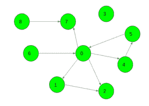
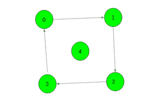

# 有向图中要添加的最小边，这样任何节点都可以从给定的节点到达

> 原文:[https://www . geesforgeks . org/有向图中要添加的最小边，以便从给定节点可以到达任何节点/](https://www.geeksforgeeks.org/minimum-edges-to-be-added-in-a-directed-graph-so-that-any-node-can-be-reachable-from-a-given-node/)

给定一个有向图和一个节点 **X** 。任务是找到必须添加到图中的最小边数，以便可以从给定节点到达任何节点。
**例:**

> **输入:** X = 0
> 
> 
> 
> **输出:**3
> T3】输入: X = 4
> 
> 
> 
> **输出:** 1

**方法:**首先，让我们用一个简单的 [DFS](https://www.geeksforgeeks.org/depth-first-traversal-for-a-graph/) 标记所有从 **X** 可到达的顶点为好。然后，对于每个坏顶点(从 X 不可达的顶点)v，计算从 v 可达的坏顶点的数量(这也可以通过简单的 DFS 来完成)。让这个数字为 cnt <sub>v</sub> 。现在，按照 cnt <sub>v</sub> 的非递增顺序迭代所有坏顶点。对于当前的坏顶点 v，如果它仍然没有被标记为好，从它运行一个 DFS，将所有可到达的顶点标记为好，并将答案增加 1(实际上，我们是隐式地添加边(s，v))。可以证明这个解给出了一个最优解。
以下是上述方法的实施:

## C++

```
// C++ implementation of the approach

#include <bits/stdc++.h>
using namespace std;

const int N = 5010;

int n, x;

vector<int> g[N];

// To check if the vertex has been
// visited or not
bool vis[N];

// To store if vertex is reachable
// from source or not
bool good[N];

int cnt;

void ADD_EDGE(int u, int v)
{
    g[u].push_back(v);
}

// Function to find all good vertices
void dfs1(int v)
{
    good[v] = true;
    for (auto to : g[v])
        if (!good[to])
            dfs1(to);
}

// Function to find cnt of all unreachable vertices
void dfs2(int v)
{
    vis[v] = true;
    ++cnt;
    for (auto to : g[v])
        if (!vis[to] && !good[to])
            dfs2(to);
}

// Function to return the minimum edges required
int Minimum_Edges()
{

    // Find all vertices reachable from the source
    dfs1(x);

    // To store all vertices with their cnt value
    vector<pair<int, int> > val;

    for (int i = 0; i < n; ++i) {

        // If vertex is bad i.e. not reachable
        if (!good[i]) {
            cnt = 0;
            memset(vis, false, sizeof(vis));

            // Find cnt of this vertex
            dfs2(i);
            val.push_back(make_pair(cnt, i));
        }
    }

    // Sort all unreachable vertices in
    // non-decreasing order of their cnt values
    sort(val.begin(), val.end());
    reverse(val.begin(), val.end());

    // Find the minimum number of edges
    // needed to be added
    int ans = 0;
    for (auto it : val) {
        if (!good[it.second]) {
            ++ans;
            dfs1(it.second);
        }
    }

    return ans;
}

// Driver code
int main()
{
    // Number of nodes and source node
    n = 5, x = 4;

    // Add edges to the graph
    ADD_EDGE(0, 1);
    ADD_EDGE(1, 2);
    ADD_EDGE(2, 3);
    ADD_EDGE(3, 0);

    cout << Minimum_Edges();

    return 0;
}
```

## Java 语言(一种计算机语言，尤用于创建网站)

```
// Java implementation of the approach
import java.util.*;

class GFG
{

// pair
static class pair
{
    int first,second;
    pair(int a,int b)
    {
        first = a;
        second = b;
    }
}

static int N = 5010;

static int n, x;

static Vector<Vector<Integer>> g = new Vector<Vector<Integer>>();

// To check if the vertex has been
// visited or not
static boolean vis[] = new boolean[N];

// To store if vertex is reachable
// from source or not
static boolean good[] = new boolean[N];

static int cnt;

static void ADD_EDGE(int u, int v)
{
    g.get(u).add(v);
}

// Function to find all good vertices
static void dfs1(int v)
{
    good[v] = true;
    for (int to = 0; to < g.get(v).size(); to++)
        if (!good[g.get(v).get(to)])
            dfs1(g.get(v).get(to));
}

// Function to find cnt of all unreachable vertices
static void dfs2(int v)
{
    vis[v] = true;
    ++cnt;
    for (int to = 0; to < g.get(v).size(); to++)
        if (!vis[g.get(v).get(to)] && !good[g.get(v).get(to)])
            dfs2(g.get(v).get(to));
}

// Function to return the minimum edges required
static int Minimum_Edges()
{

    // Find all vertices reachable from the source
    dfs1(x);

    // To store all vertices with their cnt value
    Vector<pair> val = new Vector<pair>();

    for (int i = 0; i < n; ++i)
    {

        // If vertex is bad i.e. not reachable
        if (!good[i])
        {
            cnt = 0;
            for(int j = 0; j < vis.length; j++)
                vis[j] = false;

            // Find cnt of this vertex
            dfs2(i);
            val.add(new pair(cnt, i));
        }
    }

    // Sort all unreachable vertices in
    // non-decreasing order of their cnt values
    Collections.sort(val,new Comparator<pair>()
    {
            public int compare(pair p1, pair p2)
            {
                return p1.first - p2.first;
            }
    });

    Collections.reverse(val);

    // Find the minimum number of edges
    // needed to be added
    int ans = 0;
    for (int it = 0; it < val.size(); it++)
    {
        if (!good[val.get(it).second])
        {
            ++ans;
            dfs1(val.get(it).second);
        }
    }

    return ans;
}

// Driver code
public static void main(String args[])
{
    // Number of nodes and source node
    n = 5; x = 4;

    for(int i = 0; i < N + 1; i++)
    g.add(new Vector<Integer>());

    // Add edges to the graph
    ADD_EDGE(0, 1);
    ADD_EDGE(1, 2);
    ADD_EDGE(2, 3);
    ADD_EDGE(3, 0);

    System.out.println( Minimum_Edges());
}
}

// This code is contributed by Arnab Kundu
```

## 蟒蛇 3

```
# Python3 implementation of the approach
N = 5010
g = [[] for i in range(N)]

# To check if the vertex
# has been visited or not
vis = [False for i in range(N)]

# To store if vertex is reachable
# from source or not
good = [False for i in range(N)]

def ADD_EDGE(u, v):

    g[u].append(v)

# Function to find all good vertices
def dfs1(v):

    good[v] = True
    for to in g[v]:
        if not good[to]:
            dfs1(to)

# Function to find cnt of
# all unreachable vertices
def dfs2(v):

    global cnt
    vis[v] = True
    cnt += 1
    for to in g[v]:
        if not vis[to] and not good[to]:
            dfs2(to)

# Function to return 
# the minimum edges required
def Minimum_Edges():

    global vis, cnt

    # Find all vertices reachable
    # from the source
    dfs1(x)

    # To store all vertices
    # with their cnt value
    val = []

    for i in range(0, n):

        # If vertex is bad i.e. not reachable
        if not good[i]:
            cnt = 0
            vis = [False for i in range(N)]

            # Find cnt of this vertex
            dfs2(i)
            val.append((cnt, i))

    # Sort all unreachable vertices
    # in non-decreasing order of
    # their cnt values
    val.sort(reverse = True)

    # Find the minimum number of edges
    # needed to be added
    ans = 0
    for it in val:
        if not good[it[1]]:
            ans += 1
            dfs1(it[1])

    return ans

# Driver code
if __name__ == "__main__":

    # Number of nodes and source node
    n, x = 5, 4

    # Add edges to the graph
    ADD_EDGE(0, 1)
    ADD_EDGE(1, 2)
    ADD_EDGE(2, 3)
    ADD_EDGE(3, 0)

    print(Minimum_Edges())

# This code is contributed by Rituraj Jain
```

## C#

```
// C# implementation of the approach
using System;
using System.Collections;
using System.Collections.Generic;

class GFG
{

// pair
class pair
{
    public int first,second;
    public pair(int a,int b)
    {
        first = a;
        second = b;
    }
}

static int N = 5010;

static int n, x;

static ArrayList g = new ArrayList();

// To check if the vertex has been
// visited or not
static bool []vis = new bool[N];

// To store if vertex is reachable
// from source or not
static bool []good = new bool[N];

static int cnt;

static void Add_EDGE(int u, int v)
{
    ((ArrayList)g[u]).Add(v);
}

// Function to find all good vertices
static void dfs1(int v)
{
    good[v] = true;
    for (int to = 0; to < ((ArrayList)g[v]).Count; to++)
        if (!good[(int)((ArrayList)g[v])[to]])
            dfs1((int)((ArrayList)g[v])[to]);
}

// Function to find cnt of all unreachable vertices
static void dfs2(int v)
{
    vis[v] = true;
    ++cnt;
    for (int to = 0; to < ((ArrayList)g[v]).Count; to++)
        if (!vis[(int)((ArrayList)g[v])[to]] && !good[(int)((ArrayList)g[v])[to]])
            dfs2((int)((ArrayList)g[v])[to]);
}

class sortHelper : IComparer
{
   int IComparer.Compare(object a, object b)
   {
      pair first = (pair)a;
      pair second = (pair)b;

      return first.first - second.first;
   }
}

// Function to return the minimum edges required
static int Minimum_Edges()
{

    // Find all vertices reachable from the source
    dfs1(x);

    // To store all vertices with their cnt value
    ArrayList val = new ArrayList();

    for (int i = 0; i < n; ++i)
    {

        // If vertex is bad i.e. not reachable
        if (!good[i])
        {
            cnt = 0;
            for(int j = 0; j < vis.Length; j++)
                vis[j] = false;

            // Find cnt of this vertex
            dfs2(i);
            val.Add(new pair(cnt, i));
        }
    }

    // Sort all unreachable vertices in
    // non-decreasing order of their cnt values
    val.Sort(new sortHelper());

    // Find the minimum number of edges
    // needed to be Added
    int ans = 0;
    for (int it = 0; it < val.Count; it++)
    {
        if (!good[((pair)val[it]).second])
        {
            ++ans;
            dfs1(((pair)val[it]).second);
        }
    }

    return ans;
}

// Driver code
public static void Main(string []args)
{
    // Number of nodes and source node
    n = 5; x = 4;

    for(int i = 0; i < N + 1; i++)
        g.Add(new ArrayList());

    // Add edges to the graph
    Add_EDGE(0, 1);
    Add_EDGE(1, 2);
    Add_EDGE(2, 3);
    Add_EDGE(3, 0);

    Console.WriteLine(Minimum_Edges());
}
}

// This code is contributed by rutvik_56
```

## java 描述语言

```
<script>
// Javascript implementation of the approach

class pair
{
    constructor(a,b)
    {
        this.first=a;
        this.second=b;
    }
}

let N = 5010;

let n, x;

let g = [];

// To check if the vertex has been
// visited or not
let vis= new Array(N);

// To store if vertex is reachable
// from source or not
let good=new Array(N);

for(let i=0;i<N;i++)
{
    vis[i]=false;
    good[i]=false;
}

let cnt;

function ADD_EDGE(u,v)
{
    g[u].push(v);
}

// Function to find all good vertices
function dfs1(v)
{
    good[v] = true;
    for (let to = 0; to < g[v].length; to++)
        if (!good[g[v][to]])
            dfs1(g[v][to]);
}

// Function to find cnt of all unreachable vertices
function dfs2(v)
{
    vis[v] = true;
    ++cnt;
    for (let to = 0; to < g[v].length; to++)
        if (!vis[g[v][to]] && !good[g[v][to]])
            dfs2(g[v][to]);   
}

// Function to return the minimum edges required
function Minimum_Edges()
{
    // Find all vertices reachable from the source
    dfs1(x);

    // To store all vertices with their cnt value
    let val = [];

    for (let i = 0; i < n; ++i)
    {

        // If vertex is bad i.e. not reachable
        if (!good[i])
        {
            cnt = 0;
            for(let j = 0; j < vis.length; j++)
                vis[j] = false;

            // Find cnt of this vertex
            dfs2(i);
            val.push(new pair(cnt, i));
        }
    }

    // Sort all unreachable vertices in
    // non-decreasing order of their cnt values
    val.sort(

            function(p1,p2)
            {
                return p1.first - p2.first;
            }
    );

    val.reverse();

    // Find the minimum number of edges
    // needed to be added
    let ans = 0;
    for (let it = 0; it < val.length; it++)
    {
        if (!good[val[it].second])
        {
            ++ans;
            dfs1(val[it].second);
        }
    }

    return ans;
}

// Driver code
// Number of nodes and source node
n = 5; x = 4;

for(let i = 0; i < N + 1; i++)
    g.push([]);

// Add edges to the graph
ADD_EDGE(0, 1);
ADD_EDGE(1, 2);
ADD_EDGE(2, 3);
ADD_EDGE(3, 0);

document.write( Minimum_Edges());

// This code is contributed by avanitrachhadiya2155
</script>
```

**Output:** 

```
1
```