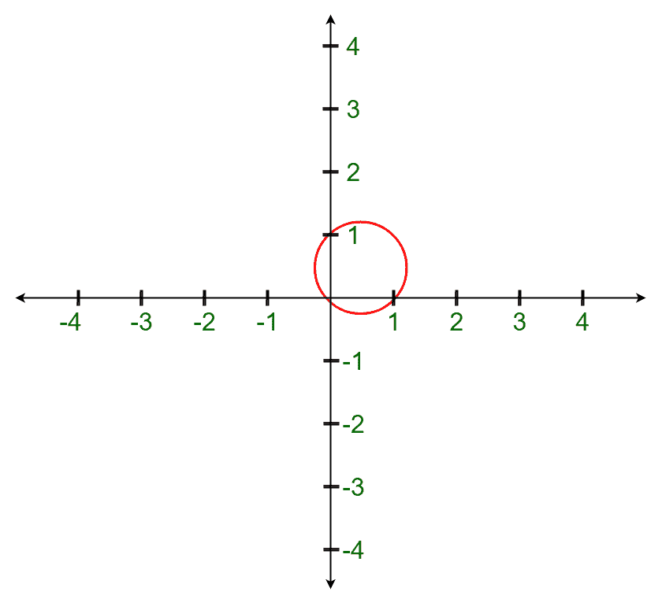

# 最小封闭圆|集合 1

> 原文:[https://www . geesforgeks . org/minimum-enclosing-circle-set-1/](https://www.geeksforgeeks.org/minimum-enclosing-circle-set-1/)

**先决条件:** [圆的方程当给定圆上的三个点时](https://www.geeksforgeeks.org/equation-of-circle-when-three-points-on-the-circle-are-given/)，[凸包](https://www.geeksforgeeks.org/convex-hull-set-2-graham-scan/)
给定一个数组**arr【】【】**包含在具有整数坐标的二维平面中的 **N 个**点。任务是找到最小封闭圆(MEC)的中心和半径。最小封闭圆是所有点都位于圆内或圆边界上的圆。
**举例:**

> **输入:** arr[][] = {{0，0}，{0，1}，{1，0}}
> **输出:**中心= {0.5，0.5}，半径= 0.7071
> **说明:**
> 在绘制上述半径为 0.707，中心为(0.5，0.5)的圆时，可以清楚地观察到，所有提到的点都位于圆内或圆上。
> 
> 
> 
> **输入:** arr[][] = {{5，-2}、{-3，-2}、{-2，5}、{1，6}、{0，2}}
> **输出:**中心= {1.0，1.0}，半径= 5.000

**幼稚的做法:**这个问题可以通过做几个观察来解决。

*   可以得出的第一个结论是，MEC 至少与一个点相交。这是因为如果 MEC 不在任何一点相交，那么圆可能会进一步缩小，直到它在其中一个点相交。
*   可以进行的第二个观察是，给定一个包围所有点并在一个点相交的圆，通过将中心向该点移动，同时将该点保持在圆的边界上，直到该圆与一个或多个附加点相交，圆可以进一步收缩。
*   如果圆在两点(A 和 B)相交，距离 **AB** 等于圆直径，那么圆就不能再收缩了。否则，圆心可以向 AB 的中点移动，直到圆与第三个点相交(在该点圆不能再收缩)。

从以上观察，可以得出结论，MEC 要么:

1.  *与 A、B 两点相交，其中 AB =圆直径。*在这种情况下，圆心将是 **A** 和 **B** 的**中点**，半径将是**距离 AB** 的一半。
2.  *与 3 个或更多点相交。*寻找中心和半径的方法已经在[这篇文章](https://www.geeksforgeeks.org/equation-of-circle-when-three-points-on-the-circle-are-given/)中讨论过了。

因此，对于 N <= 3\. For other cases, a simple idea can be formed to solve this problem. The idea is to use all pairs and triples of points to obtain the circle defined those points. After obtaining the circle, test to see if the other points are enclosed by that circle and return the smallest valid circle found.
来说，这个问题的解决方案是微不足道的。下面是上述方法的实现:

## 卡片打印处理机（Card Print Processor 的缩写）

```
// C++ program to find the minimum enclosing
// circle for N integer points in a 2-D plane
#include <iostream>
#include <math.h>
#include <vector>
using namespace std;

// Defining infinity
const double INF = 1e18;

// Structure to represent a 2D point
struct Point {
    double X, Y;
};

// Structure to represent a 2D circle
struct Circle {
    Point C;
    double R;
};

// Function to return the euclidean distance
// between two points
double dist(const Point& a, const Point& b)
{
    return sqrt(pow(a.X - b.X, 2) + pow(a.Y - b.Y, 2));
}

// Function to check whether a point lies inside
// or on the boundaries of the circle
bool is_inside(const Circle& c, const Point& p)
{
    return dist(c.C, p) <= c.R;
}

// The following two functions are the functions used
// To find the equation of the circle when three
// points are given.

// Helper method to get a circle defined by 3 points
Point get_circle_center(double bx, double by,
                        double cx, double cy)
{
    double B = bx * bx + by * by;
    double C = cx * cx + cy * cy;
    double D = bx * cy - by * cx;
    return { (cy * B - by * C) / (2 * D),
             (bx * C - cx * B) / (2 * D) };
}

// Function to return a unique circle that intersects
// three points
Circle circle_from(const Point& A, const Point& B,
                   const Point& C)
{
    Point I = get_circle_center(B.X - A.X, B.Y - A.Y,
                                C.X - A.X, C.Y - A.Y);
    I.X += A.X;
    I.Y += A.Y;
    return { I, dist(I, A) };
}

// Function to return the smallest circle
// that intersects 2 points
Circle circle_from(const Point& A, const Point& B)
{
    // Set the center to be the midpoint of A and B
    Point C = { (A.X + B.X) / 2.0, (A.Y + B.Y) / 2.0 };

    // Set the radius to be half the distance AB
    return { C, dist(A, B) / 2.0 };
}

// Function to check whether a circle encloses the given points
bool is_valid_circle(const Circle& c, const vector<Point>& P)
{

    // Iterating through all the points to check
    // whether the points lie inside the circle or not
    for (const Point& p : P)
        if (!is_inside(c, p))
            return false;
    return true;
}

// Function to return find the minimum enclosing
// circle from the given set of points
Circle minimum_enclosing_circle(const vector<Point>& P)
{

    // To find the number of points
    int n = (int)P.size();

    if (n == 0)
        return { { 0, 0 }, 0 };
    if (n == 1)
        return { P[0], 0 };

    // Set initial MEC to have infinity radius
    Circle mec = { { 0, 0 }, INF };

    // Go over all pair of points
    for (int i = 0; i < n; i++) {
        for (int j = i + 1; j < n; j++) {

            // Get the smallest circle that
            // intersects P[i] and P[j]
            Circle tmp = circle_from(P[i], P[j]);

            // Update MEC if tmp encloses all points
            // and has a smaller radius
            if (tmp.R < mec.R && is_valid_circle(tmp, P))
                mec = tmp;
        }
    }

    // Go over all triples of points
    for (int i = 0; i < n; i++) {
        for (int j = i + 1; j < n; j++) {
            for (int k = j + 1; k < n; k++) {

                // Get the circle that intersects P[i], P[j], P[k]
                Circle tmp = circle_from(P[i], P[j], P[k]);

                // Update MEC if tmp encloses all points
                // and has smaller radius
                if (tmp.R < mec.R && is_valid_circle(tmp, P))
                    mec = tmp;
            }
        }
    }
    return mec;
}

// Driver code
int main()
{

    Circle mec = minimum_enclosing_circle({ { 0, 0 },
                                            { 0, 1 },
                                            { 1, 0 } });

    cout << "Center = { " << mec.C.X << ", " << mec.C.Y
         << " } Radius = " << mec.R << endl;

    Circle mec2 = minimum_enclosing_circle({ { 5, -2 },
                                             { -3, -2 },
                                             { -2, 5 },
                                             { 1, 6 },
                                             { 0, 2 } });

    cout << "Center = { " << mec2.C.X << ", " << mec2.C.Y
         << " } Radius = " << mec2.R << endl;

    return 0;
}
```

## 蟒蛇 3

```
# Python3 program to find the minimum enclosing
# circle for N integer points in a 2-D plane
from math import sqrt

# Defining infinity
INF = 10**18

# Function to return the euclidean distance
# between two points
def dist(a, b):
    return sqrt(pow(a[0] - b[0], 2) + pow(a[1] - b[1], 2))

# Function to check whether a point lies inside
# or on the boundaries of the circle
def is_inside(c, p):
    return dist(c[0], p) <= c[1]

# The following two functions are the functions used
# To find the equation of the circle when three
# points are given.

# Helper method to get a circle defined by 3 points
def get_circle_center(bx, by, cx, cy):
    B = bx * bx + by * by
    C = cx * cx + cy * cy
    D = bx * cy - by * cx
    return [(cy * B - by * C) // (2 * D),
            (bx * C - cx * B) // (2 * D) ]

# Function to return a unique circle that intersects
# three points
def circle_frOm(A, B,C):
    I = get_circle_center(B[0] - A[0], B[1] - A[1],
                                C[0] - A[0], C[1] - A[1])
    I[0] += A[0]
    I[1] += A[1]
    return [I, dist(I, A)]

# Function to return the smallest circle
# that intersects 2 points
def circle_from(A, B):

    # Set the center to be the midpoint of A and B
    C = [ (A[0] + B[0]) / 2.0, (A[1] + B[1]) / 2.0]

    # Set the radius to be half the distance AB
    return [C, dist(A, B) / 2.0]

# Function to check whether a circle encloses the given points
def is_valid_circle(c, P):

    # Iterating through all the points to check
    # whether the points lie inside the circle or not
    for p in P:
        if (is_inside(c, p) == False):
            return False
    return True

# Function to return find the minimum enclosing
# circle from the given set of points
def minimum_enclosing_circle(P):

    # To find the number of points
    n = len(P)

    if (n == 0):
        return [[0, 0], 0]
    if (n == 1):
        return [P[0], 0]

    # Set initial MEC to have infinity radius
    mec = [[0, 0], INF]

    # Go over all pair of points
    for i in range(n):
        for j in range(i + 1, n):

            # Get the smallest circle that
            # intersects P[i] and P[j]
            tmp = circle_from(P[i], P[j])

            # Update MEC if tmp encloses all points
            # and has a smaller radius
            if (tmp[1] < mec[1] and is_valid_circle(tmp, P)):
                mec = tmp

    # Go over all triples of points
    for i in range(n):
        for j in range(i + 1, n):
            for k in range(j + 1, n):

                # Get the circle that intersects P[i], P[j], P[k]
                tmp = circle_frOm(P[i], P[j], P[k])

                # Update MEC if tmp encloses all points
                # and has smaller radius
                if (tmp[1] < mec[1] and is_valid_circle(tmp, P)):
                    mec = tmp

    return mec

# Driver code

mec = minimum_enclosing_circle([ [ 0, 0 ],
                                [ 0, 1 ],
                                [ 1, 0 ] ])

print("Center = { ",mec[0][1],",",mec[0][1],
                "} Radius = ",round(mec[1],6))

mec2 = minimum_enclosing_circle([ [ 5, -2 ],
                                [ -3, -2 ],
                                [ -2, 5 ],
                                [ 1, 6 ],
                                [ 0, 2 ] ])

print("Center = {",mec2[0][0],",",mec2[0][1],
        "} Radius = ",mec2[1])

# This code is contributed by mohit kumar 29
```

**Output:** 

```
Center = { 0.5, 0.5 } Radius = 0.707107
Center = { 1, 1 } Radius = 5
```

**时间复杂度:**该解决方案的时间复杂度为 **O(N <sup>4</sup> )** 。那是因为有 N <sup>3</sup> 三倍的点数。对于每个三元组，我们检查是否所有的点都被圆包围。
**方法 2:** 应用[凸包](https://en.wikipedia.org/wiki/Convex_hull)概念的解决方案也可以用于此问题。其思想是首先在给定点集上形成一个凸包。一旦凸包被执行并且新的点集被返回，那么上述解决方案可以被用于新的点集以找到 MEC。
这种方法的代码将与上面相同，只是我们还需要首先获得凸包。获取凸包的高效算法请参考本文。
**时间复杂度:**需要进行的一个观察是，如果输入已经表示了凸多边形的一些顶点，那么这个解将具有与上述天真方法相同的时间复杂度。
因此，这种方法的最坏情况复杂性仍然是 **O(N <sup>4</sup> )** 。
然而，如果凸包的顶点数明显小于 N，那么复杂度将是**O(H<sup>4</sup>+NLog(N)】**，其中 H 表示凸包的顶点数，NLog(N)因子用于寻找凸包，假设使用 [Graham Scan](https://www.geeksforgeeks.org/convex-hull-set-2-graham-scan/) 算法。
最后，如果凸包的顶点数量 **H** 非常少，那么它可以被认为是一个常数因子，因此时间复杂度将是 **O(NLog(N))** 。