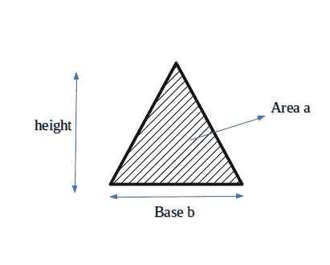

# 给定底和面积的三角形的最小高度

> 原文:[https://www . geesforgeks . org/最小高度-三角形-给定-基底面积/](https://www.geeksforgeeks.org/minimum-height-triangle-given-base-area/)

给定两个整数 a 和 b，找到最小可能的高度，这样至少可以形成一个面积为“a”和底部为“b”的三角形。



**例:**

```
Input : a = 2, b = 2
Output : Minimum height of triangle is 2

Explanation: 
```


```
Input : a = 8, b = 4
Output : Minimum height of triangle is 4
```

底部为“b”而面积为“a”的三角形的最小高度可以通过了解这三者之间的关系来评估。

> 面积、基底和
> 高度的关系是:
> 面积= (1/2) *基底*高度
> 所以高度可以计算为:
> 高度= (2 *面积)/基底
> 最小高度是使用上述公式得到的
> 高度的天花板。

## C++

```
#include <bits/stdc++.h>
using namespace std;
// function to calculate minimum height of 
// triangle
int minHeight(int base, int area){
    return ceil((float)(2*area)/base);
}

int main() {
    int base = 4, area = 8;
    cout << "Minimum height is " 
         << minHeight(base, area) << endl;

    return 0;
}
```

## Java 语言(一种计算机语言，尤用于创建网站)

```
// Java code Minimum height of a 
// triangle with given base and area

class GFG {

    // function to calculate minimum height of 
    // triangle
    static double minHeight(double base, double area)
    {
        double d = (2 * area) / base;
        return Math.ceil(d);
    }

    // Driver code
    public static void main (String[] args) 
    {
        double base = 4, area = 8;
        System.out.println("Minimum height is "+
                            minHeight(base, area));
    }
}
// This code is contributed by Anant Agarwal.
```

## 计算机编程语言

```
# Python Program to find minimum height of triangle
import math

def minHeight(area,base):
        return math.ceil((2*area)/base)

# Driver code
area = 8
base = 4
height = minHeight(area, base)
print("Minimum height is %d" % (height))
```

## C#

```
// C# program to find minimum height of
// a triangle with given base and area
using System;

public class GFG {

    // function to calculate minimum
    // height of triangle
    static int minHeight(int b_ase, int area)
    {
        return (int)Math.Round((float)(2 * area) / b_ase);
    }

    // Driver function
    static public void Main()
    {
        int b_ase = 4, area = 8;
        Console.WriteLine("Minimum height is "
                        + minHeight(b_ase, area));
    }
}

// This code is contributed by vt_m.
```

## 服务器端编程语言（Professional Hypertext Preprocessor 的缩写）

```
<?php

// function to calculate minimum  
// height of triangle
function minHeight($base, $area)
{
    return ceil((2 * $area) / $base);
}

// Driver Code
$base = 4;$area = 8;
echo "Minimum height is ", 
      minHeight($base, $area);

// This code is contributed by anuj_67.
?>
```

## java 描述语言

```
<script>

// function to calculate minimum height of 
// triangle
function minHeight( base,  area){
    return Math.ceil((2*area)/base);
}

    let base = 4, area = 8;

    document.write( "Minimum height is " 
         +minHeight(base, area));

// This code contributed by aashish1995 

</script>
```

**输出:**

```
Minimum height is 4
```