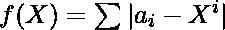

# 将排序后的数组转换为幂序列所需的最小增量或减量

> 原文:[https://www . geeksforgeeks . org/将排序数组转换为幂序列所需的最小增量或减量/](https://www.geeksforgeeks.org/minimum-increments-or-decrements-required-to-convert-a-sorted-array-into-a-power-sequence/)

给定由 **N** 个正整数组成的排序后的[数组](https://www.geeksforgeeks.org/introduction-to-arrays/) **arr[]** ，任务是最小化将给定数组转换为任意整数的幂序列 **X** 所需的每个数组元素的增量或减量的总数。

> *一个序列被称为任意整数 **X** 的**幂序列**，当且仅当对于每个**I<sup>th</sup>T8】元素(0 ≤ **i** < N)， **arr[i] = X <sup>i</sup>** ，其中 **N** 是给定数组的长度。***

**示例:**

> ***输入:** arr[] = {1，3，4}*
> ***输出:** 1*
> ***说明:**arr[1]减 1 将数组修改为{1，2，4}，是 2 的幂序列。因此，所需的增量或减量总数为 1。*
> 
> ***输入:*** arr[] = {1，5，7}
> ***输出:** 6*
> ***解释:***
> ***操作 1:** 将 arr[1]减 1 将数组修改为{1，4，7}*
> ***操作 2:** 将 arr[1]减 1 将数组修改为{1，3，7}因此，所需的增量或减量总数为 4。*

**方法:**给定的问题可以基于以下观察来解决:

*   由于给定数组需要转换成任意整数的幂序列 **X** ，那么数学关系可以写成:

> 
> 其中，0 < = i < N，N 为数组中的元素个数。

*   **f(X)** 的最小值是将其转换为 **X** 的幂序列所需的最小运算次数，而 **X** 的最大值可计算如下:

> => ![X^{N - 1} - a[N - 1] \le f(c) \le f(1)              ](img/d7dc2bee3bea2f2922bf209f644b054a.png "Rendered by QuickLaTeX.com")
> = > ![ X^{N - 1} \le f(1) + a{[N - 1]} ](img/e7b79784316c772853ad67daf1ed2524.png "Rendered by QuickLaTeX.com")

*   因此，思路是从 **1** 开始迭代 **X** 的所有可能值，并检查以下等式是否满足:
    ![X^{N - 1} \le f(1) + a{[N - 1]}          ](img/fb881b4e575af523eb9e1bd1f0dd752a.png "Rendered by QuickLaTeX.com")
    如果发现为真，则寻找的所有可能值，并返回所获得的所有值中的最小值。

按照以下步骤解决给定的问题:

*   初始化一个变量，比如说 **ans** 为 **(** [**数组元素之和**](https://www.geeksforgeeks.org/program-find-sum-elements-given-array/)**–N)**，它存储使数组成为幂序列所需的最小增量或减量数。
*   循环迭代，从 **1** 开始，使用变量 **X** 并执行以下步骤:
    *   初始化两个变量，比如说 **currCost** 为 **0** 和 **currPower** 为 **1** ，存储表达式和整数 **X** 的幂的和。
    *   [迭代范围](https://www.geeksforgeeks.org/range-based-loop-c/)**【0，N–1】**，将 **currCost** 的值更新为**curr cost+ABS(arr[I]–curr power)**，将 **currPower** 的值更新为 **X * currPower** 。
    *   如果表达式![X^{N - 1} \le ans + a{[N - 1]}          ](img/9e6ddd2da3c6d4279cd49018d0fe7282.png "Rendered by QuickLaTeX.com")不满足，则[跳出循环](https://www.geeksforgeeks.org/break-statement-cc/)。否则，将 **ans** 的值更新为 **ans** 和 **currCost** 的最小值。
*   完成上述步骤后，打印**和**的值作为所需的最小操作次数。

下面是上述方法的实现:

## C++

```
// C++ program for the above approach

#include <bits/stdc++.h>
using namespace std;

// Function to find the minimum number
// of increments or decrements required
// to convert array into a power sequence
int minOperations(int a[], int n)
{
    // Initialize the count to f(X) for X = 1
    int ans = accumulate(a, a + n, 0) - n;

    // Calculate the value of f(X)
    // X ^ (n - 1) <= f(1) + a[n - 1]
    for (int x = 1;; x++) {

        int curPow = 1, curCost = 0;

        // Calculate F(x)
        for (int i = 0; i < n; i++) {
            curCost += abs(a[i] - curPow);
            curPow *= x;
        }

        // Check if X ^ (n - 1) > f(1) + a[n - 1]
        if (curPow / x > ans + a[n - 1])
            break;

        // Update ans to store the
        // minimum of ans and F(x)
        ans = min(ans, curCost);
    }

    // Return the minimum number
    // of operations required
    return ans;
}

// Driver Code
int main()
{
    int arr[] = { 1, 5, 7 };
    int N = sizeof(arr) / sizeof(arr[0]);

    cout << minOperations(arr, N);

    return 0;
}
```

## Java 语言(一种计算机语言，尤用于创建网站)

```
// Java program for the above approach
class GFG{

// Function to find the minimum number
// of increments or decrements required
// to convert array into a power sequence
static int minOperations(int a[], int n)
{

    // Initialize the count to f(X) for X = 1
    int ans = 0;
    for(int i = 0; i < n; i++)
    {
        ans += a[i];
    }
    ans -= n;

    // Calculate the value of f(X)
    // X ^ (n - 1) <= f(1) + a[n - 1]
    for(int x = 1;; x++)
    {
        int curPow = 1, curCost = 0;

        // Calculate F(x)
        for(int i = 0; i < n; i++)
        {
            curCost += Math.abs(a[i] - curPow);
            curPow *= x;
        }

        // Check if X ^ (n - 1) > f(1) + a[n - 1]
        if (curPow / x > ans + a[n - 1])
            break;

        // Update ans to store the
        // minimum of ans and F(x)
        ans = Math.min(ans, curCost);
    }

    // Return the minimum number
    // of operations required
    return ans;
}

// Driver Code
public static void main(String[] args)
{
    int arr[] = { 1, 5, 7 };
    int N = arr.length;

    System.out.print(minOperations(arr, N));
}
}

// This code is contributed by avijitmondal1998
```

## 蟒蛇 3

```
# Python3 program for the above approach

# Function to find the minimum number
# of increments or decrements required
# to convert array into a power sequence
def minOperations(a, n):

    # Initialize the count to f(X) for X = 1
    ans = 0
    for i in range(n):
        ans += a[i]

    ans -= n

    # Calculate the value of f(X)
    # X ^ (n - 1) <= f(1) + a[n - 1]
    x = 1
    while(1):
        curPow = 1
        curCost = 0

        # Calculate F(x)
        for i in range(n):
            curCost += abs(a[i] - curPow)
            curPow *= x

        # Check if X ^ (n - 1) > f(1) + a[n - 1]
        if (curPow / x > ans + a[n - 1]):
            break

        # Update ans to store the
        # minimum of ans and F(x)
        ans = min(ans, curCost)
        x += 1

    # Return the minimum number
    # of operations required
    return ans

# Driver Code
if __name__ == '__main__':

    arr =  [1, 5, 7]
    N = len(arr)

    print(minOperations(arr, N))

# This code is contributed by ipg2016107
```

## C#

```
// C# program for the above approach
using System;

class GFG{

// Function to find the minimum number
// of increments or decrements required
// to convert array into a power sequence
static int minOperations(int []a, int n)
{

    // Initialize the count to f(X) for X = 1
    int ans = 0;
    for(int i = 0; i < n; i++)
    {
        ans += a[i];
    }
    ans -= n;

    // Calculate the value of f(X)
    // X ^ (n - 1) <= f(1) + a[n - 1]
    for(int x = 1;; x++)
    {
        int curPow = 1, curCost = 0;

        // Calculate F(x)
        for(int i = 0; i < n; i++)
        {
            curCost += Math.Abs(a[i] - curPow);
            curPow *= x;
        }

        // Check if X ^ (n - 1) > f(1) + a[n - 1]
        if (curPow / x > ans + a[n - 1])
            break;

        // Update ans to store the
        // minimum of ans and F(x)
        ans = Math.Min(ans, curCost);
    }

    // Return the minimum number
    // of operations required
    return ans;
}

// Driver Code
public static void Main()
{
    int []arr = { 1, 5, 7 };
    int N = arr.Length;

    Console.WriteLine(minOperations(arr, N));
}
}

// This code is contributed by mohit kumar 29
```

## java 描述语言

```
<script>

// JavaScript program for the above approach   

// Function to find the minimum number
// of increments or decrements required
// to convert array into a power sequence
    function minOperations(a , n) {

        // Initialize the count to f(X) for X = 1
        var ans = 0;
        for (i = 0; i < n; i++) {
            ans += a[i];
        }
        ans -= n;

        // Calculate the value of f(X)
        // X ^ (n - 1) <= f(1) + a[n - 1]
        for (x = 1;; x++) {
            var curPow = 1, curCost = 0;

            // Calculate F(x)
            for (i = 0; i < n; i++) {
                curCost += Math.abs(a[i] - curPow);
                curPow *= x;
            }

            // Check if X ^ (n - 1) > f(1) + a[n - 1]
            if (curPow / x > ans + a[n - 1])
                break;

            // Update ans to store the
            // minimum of ans and F(x)
            ans = Math.min(ans, curCost);
        }

        // Return the minimum number
        // of operations required
        return ans;
    }

    // Driver Code

        var arr = [ 1, 5, 7 ];
        var N = arr.length;

        document.write(minOperations(arr, N));

// This code contributed by aashish1995

</script>
```

**Output:** 

```
4
```

***时间复杂度:**O(N *(S)<sup>(1/(N–1))</sup>)*
***辅助空间:** O(1)*