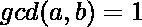

# 组成同素数组的最少插入次数

> 原文:[https://www . geesforgeks . org/minimum-insertions-to-make-a-co-prime-array/](https://www.geeksforgeeks.org/minimum-insertions-to-make-a-co-prime-array/)

给定一个由 N 个元素组成的数组，找到最小插入次数，将给定的数组转换成一个同素数组。也打印结果数组。
**同素数组:**每对相邻元素都是同素的数组。即。

**示例:**

```
Input : A[] = {2, 7, 28}
Output : 1
Explanation : 
Here, 1st pair = {2, 7} are co-primes( gcd(2, 7) = 1).
2nd pair = {7, 28} are not co-primes, insert 9
between them. gcd(7, 9) = 1 and gcd(9, 28) = 1.

Input : A[] = {5, 10, 20}
Output : 2
Explanation : 
Here, there is no pair which are co-primes. 
Insert 7 between (5, 10) and 1 between (10, 20).
```

请注意，要使一对成为同素，我们必须插入一个数字，使新形成的对成为同素。因此，我们必须检查每个相邻对的共素性，并在需要时插入一个数字。现在，应该插入的数字是多少？让我们取两个数字 a 和 b，如果 a 或 b 中的任何一个是 1，那么 GCD(a，b) = 1。因此，我们可以在每对中插入一(1)。为了提高效率，我们使用[欧拉 gcd 函数](https://www.geeksforgeeks.org/eulers-totient-function/)。

下面是上述方法的实现:

## C++

```
// CPP program for minimum insertions to
// make a Co-prime Array.
#include <bits/stdc++.h>
using namespace std;

void printResult(int arr[], int n)
{
    // Counting adjacent pairs that are not
    // co-prime.
    int count = 0;
    for (int i = 1; i < n; i++)    
        if (__gcd(arr[i], arr[i - 1]) != 1)
            count++;

    cout << count << endl; // No.of insertions
    cout << arr[0] << " ";
    for (int i = 1; i < n; i++)
    {
        // If pair is not a co-prime insert 1.
        if (__gcd(arr[i], arr[i - 1]) != 1)
            cout << 1 << " ";
        cout << arr[i] << " ";
    }
}

// Driver Function
int main()
{
    int A[] = { 5, 10, 20 };
    int n = sizeof(A) / sizeof(A[0]);
    printResult(A, n);
    return 0;
}
```

## Java 语言(一种计算机语言，尤用于创建网站)

```
//Java program for minimum insertions
// to make a Co-prime Array.
import java.io.*;

class GFG {

    // Recursive function to return
    // gcd of a and b
    static int gcd(int a, int b)
    {
        // Everything divides 0
        if (a == 0 || b == 0)
        return 0;

        // base case
        if (a == b)
            return a;

        // a is greater
        if (a > b)
            return gcd(a-b, b);

        return gcd(a, b-a);
    }

    static void printResult(int arr[], int n)
    {

        // Counting adjacent pairs that are not
        // co-prime.
        int count = 0;

        for (int i = 1; i < n; i++)    
            if (gcd(arr[i], arr[i - 1]) != 1)
                count++;

        // No.of insertions
        System.out.println(count );
        System.out.print (arr[0] + " ");

        for (int i = 1; i < n; i++)
        {

            // If pair is not a co-prime insert 1.
            if (gcd(arr[i], arr[i - 1]) != 1)
                System.out.print( 1 + " ");
            System.out.print(arr[i] + " ");
        }
    }

    // Driver Function
    public static void main(String args[])
    {
        int A[] = { 5, 10, 20 };
        int n = A.length;
        printResult(A, n);
    }
}

/*This code is contributed by Nikita Tiwari.*/
```

## 蟒蛇 3

```
# Python3 code for minimum insertions
# to make a Co-prime Array.
from fractions import gcd

def printResult(arr, n):

    # Counting adjacent pairs that
    # are not co-prime.
    count = 0
    for i in range(1,n):
        if (gcd(arr[i], arr[i - 1]) != 1):
            count+=1

    print(count)     # No.of insertions
    print( arr[0], end = " ")
    for i in range(1,n):

        # If pair is not a co-prime insert 1.
        if (gcd(arr[i], arr[i - 1]) != 1):
            print(1, end = " ")
        print(arr[i] , end = " ")

# Driver Code
A = [ 5, 10, 20 ]
n = len(A)
printResult(A, n)

# This code is contributed by "Sharad_Bhardwaj".
```

## C#

```
// C# program for minimum insertions
// to make a Co-prime Array.
using System;

class GFG {

    // Recursive function to return
    // gcd of a and b
    static int gcd(int a, int b)
    {
        // Everything divides 0
        if (a == 0 || b == 0)
            return 0;

        // base case
        if (a == b)
            return a;

        // a is greater
        if (a > b)
            return gcd(a - b, b);

        return gcd(a, b - a);
    }

    static void printResult(int[] arr, int n)
    {
        // Counting adjacent pairs that
        // are not co-prime.
        int count = 0;

        for (int i = 1; i < n; i++)
            if (gcd(arr[i], arr[i - 1]) != 1)
                count++;

        // No.of insertions
        Console.WriteLine(count);
        Console.Write(arr[0] + " ");

        for (int i = 1; i < n; i++) {

            // If pair is not a co-prime insert 1.
            if (gcd(arr[i], arr[i - 1]) != 1)
                Console.Write(1 + " ");
            Console.Write(arr[i] + " ");
        }
    }

    // Driver Function
    public static void Main()
    {
        int[] A = { 5, 10, 20 };
        int n = A.Length;
        printResult(A, n);
    }
}

/*This code is contributed by vt_m.*/
```

## 服务器端编程语言（Professional Hypertext Preprocessor 的缩写）

```
<?php
// PHP program for minimum
// insertions to make a
// Co-prime Array.

// Recursive function to
// return gcd of a and b
function gcd($a, $b)
{
    // Everything divides 0
    if ($a == 0 || $b == 0)
        return 0;

    // base case
    if ($a == $b)
        return $a;

    // a is greater
    if ($a > $b)
        return gcd($a - $b, $b);

    return gcd($a, $b - $a);
}

function printResult($arr, $n)
{
    // Counting adjacent pairs
    // that are not co-prime.
    $count = 0;

    for ($i = 1; $i < $n; $i++)
        if (gcd($arr[$i],
                $arr[$i - 1]) != 1)
            $count++;

    // No.of insertions
    echo $count, "\n";
    echo $arr[0] , " ";

    for ($i = 1; $i < $n; $i++)
    {

        // If pair is not a
        // co-prime insert 1.
        if (gcd($arr[$i],
                $arr[$i - 1]) != 1)
            echo 1 , " ";
        echo $arr[$i] , " ";
    }
}

// Driver Code
$A = array(5, 10, 20);
$n = sizeof($A);
printResult($A, $n);

// This code is contributed
// by ajit
?>
```

## java 描述语言

```
<script>

// Javascript program for minimum insertions
// to make a Co-prime Array.

// Recursive function to return
// gcd of a and b
function gcd(a, b)
{

    // Everything divides 0
    if (a == 0 || b == 0)
        return 0;

    // base case
    if (a == b)
        return a;

    // a is greater
    if (a > b)
        return gcd(a - b, b);

    return gcd(a, b - a);
}

function printResult(arr, n)
{

    // Counting adjacent pairs that
    // are not co-prime.
    let count = 0;

    for(let i = 1; i < n; i++)
        if (gcd(arr[i], arr[i - 1]) != 1)
            count++;

    // No.of insertions
    document.write(count + "</br>");
    document.write(arr[0] + " ");

    for(let i = 1; i < n; i++)
    {

        // If pair is not a co-prime insert 1.
        if (gcd(arr[i], arr[i - 1]) != 1)
            document.write(1 + " ");

        document.write(arr[i] + " ");
    }
}

// Driver code
let A = [ 5, 10, 20 ];
let n = A.length;

printResult(A, n);

// This code is contributed by suresh07

</script>
```

**输出:**

```
2
5 1 10 1 20 
```

**时间复杂度:** O(n)。