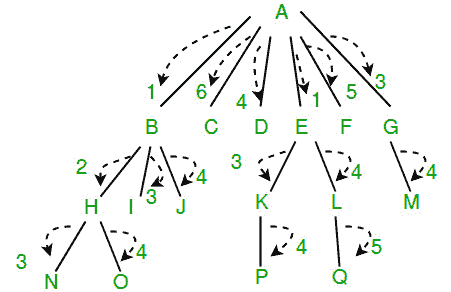

# 将信息传递给树中所有节点的最小迭代次数

> 原文:[https://www . geesforgeks . org/minimum-iterations-pass-information-nodes-tree/](https://www.geeksforgeeks.org/minimum-iterations-pass-information-nodes-tree/)

给定一棵非常大的 n 元树。其中根节点有一些信息，它希望将这些信息传递给它的所有子节点，并有一个限制，即它一次只能将这些信息传递给它的一个子节点(将其视为一次迭代)。
现在，在下一次迭代中，子节点可以将该信息仅传送给它的一个子节点，同时子节点的父节点(即根节点)可以将该信息传送给它的一个剩余子节点。继续这样，我们必须找到将信息传递给树中所有节点所需的最小迭代次数。
以下树的最小迭代次数为 6。根 A 首先将信息传递给 B，在下一次迭代中，A 将信息传递给 E，B 将信息传递给 H，以此类推。



**强烈建议尽量减少浏览器，先自己试试这个。**
这可以使用后顺序遍历来完成。这个想法是考虑身高和孩子指望每一个节点。
如果子节点 I 采取 ci 迭代在它的子树下面传递信息，那么它的父节点将采取(ci + 1)迭代将信息传递给以那个子节点 I 为根的子树。
如果父节点有更多的子节点，它将在后续迭代中传递信息给它们。假设一个父代的子代需要 c1、c2、c3、c4、…、cn 次迭代才能在自己的子树中传递信息，现在父代必须在 n 次迭代中将信息逐个传递给这 n 个子代。如果父代在迭代中选择子代 I，那么父代将进行(i + ci)次迭代，将信息传递给子代 I 及其所有子树。
在任何迭代中，当父代传递信息给子代 i+1 时，如果任何子代(1 到 I)有自己的子代，那么在之前的迭代中已经从父代获得信息的子代(1 到 I)将在后续的迭代中传递信息给更下的子代。
为了在最小迭代中向整个树传递信息，需要确保尽可能高效地利用带宽(即，在任何迭代中，最大可传递的节点数都应该进一步向下传递信息)
最好的情况是，在第 n 次迭代中，n 个不同的节点向它们的子节点传递信息。
**高度= 0 的节点:**(小例子)叶节点没有子节点(不需要传递信息)，所以迭代次数为零。
**高度= 1 的节点:**这里的节点要一个一个的传递信息给所有的子节点(所有的子节点都是叶子节点，所以没有更多的信息往下传递)。因为所有的孩子都是叶子，节点可以以任何顺序传递信息给任何孩子(选择任何还没有收到信息的孩子)。每个子代需要一次迭代，因此迭代次数不会是子代次数。因此，高度为 1 且有 n 个子节点的节点将需要 n 次迭代。
取一个用 ZERO 初始化的计数器，循环遍历所有子级，并不断递增计数器。
**有高度的节点> 1:** 我们假设一个节点有 n 个子节点(1 到 n)，所有 n 个子节点的最小无迭代次数为 c1，c2，…。，cn。
为了确保在任何迭代中参与信息传递的节点的最大数量，父节点应该首先将信息传递给子节点，子节点将在后续迭代中进行最大迭代以进一步向下传递信息。也就是说，在任何迭代中，父母应该选择稍后进行最大迭代的孩子。这可以被认为是一种贪婪方法，其中父母首先选择孩子，孩子需要最大迭代次数，以便所有后续迭代可以被有效利用。
如果父节点以任何其他方式运行，那么最终可能会有一些节点很早就完成了，处于空闲状态，因此在进一步的迭代中带宽没有得到有效利用。
如果有两个子代 I 和 j 具有最小迭代 ci 和 cj，其中 ci 为> cj，那么如果父代首先选择子代 j，那么父代向两个子代及其子树传递信息所需的迭代次数将为:max (1 + cj， 2 + ci) = 2 + ci
如果父代首先选择子代 I，那么父代向两个子代及其子树传递信息所需的迭代次数将是:max(1 + ci，2 + cj) = 1 + ci(因此选择 ci 比选择 cj 给出更好的结果)
这告诉父代应该总是在任何迭代中选择具有最大 ci 值的子代 I。
所以这里贪心的做法是:
把所有 ci 值按降序排序，
我们说排序后，值是 c1 > c2 > c3 > …。> cn
取一个计数器 c，设置 c = 1 + c1(对于迭代次数最大的子节点)
对于从 2 到 n 的所有子节点 I，c = c + 1 + ci
那么父节点需要的迭代次数总计为 max(n，c)
让 ***minItr(A)*** 成为从节点 A 向其所有子树传递信息所需的最小迭代次数。让 ***子节点(A)*** 成为节点 A 的所有子节点的计数。因此递归关系为:

```
1\. Get minItr(B) of all children (B) of a node (A)
2\. Sort all minItr(B) in descending order
3\. Get minItr of A based on all minItr(B)
    minItr(A) = child(A)
    For children B from i = 0 to child(A)
             minItr(A) = max ( minItr(A), minItr(B) + i + 1)

Base cases would be:
If node is leaf, minItr = 0
If node's height is 1, minItr = children count 
```

以下是上述想法的实现。

## C++

```
// C++ program to find minimum number of iterations to pass
// information from root to all nodes in an n-ary tree
#include<bits/stdc++.h>
using namespace std;

// A class to represent n-ary tree (Note that the implementation
// is similar to graph for simplicity of implementation
class NAryTree
{
    int N;    // No. of nodes in Tree

    // Pointer to an array containing list of children
    list<int> *adj;

    // A function used by getMinIter(), it basically does postorder
    void getMinIterUtil(int v, int minItr[]);
public:
    NAryTree(int N);   // Constructor

    // function to add a child w to v
    void addChild(int v, int w);

    // The main function to find minimum iterations
    int getMinIter();

    static int compare(const void * a, const void * b);
};

NAryTree::NAryTree(int N)
{
    this->N = N;
    adj = new list<int>[N];
}

// To add a child w to v
void NAryTree::addChild(int v, int w)
{
    adj[v].push_back(w); // Add w to v’s list.
}

/* A recursive function to used by getMinIter(). This function
// mainly does postorder traversal and get minimum iteration of all children
// of node u, sort them in decreasing order and then get minimum iteration
// of node u

1\. Get minItr(B) of all children (B) of a node (A)
2\. Sort all minItr(B) in descending order
3\. Get minItr of A based on all minItr(B)
    minItr(A) = child(A) -->> child(A) is children count of node A
    For children B from i = 0 to child(A)
             minItr(A) = max ( minItr(A), minItr(B) + i + 1)

Base cases would be:
If node is leaf, minItr = 0
If node's height is 1, minItr = children count
*/

void NAryTree::getMinIterUtil(int u, int minItr[])
{
    minItr[u] = adj[u].size();
    int *minItrTemp = new int[minItr[u]];
    int k = 0, tmp = 0;
    // Recur for all the vertices adjacent to this vertex
    list<int>::iterator i;
    for (i = adj[u].begin(); i!= adj[u].end(); ++i)
    {
        getMinIterUtil(*i, minItr);
        minItrTemp[k++] = minItr[*i];
    }
    qsort(minItrTemp, minItr[u], sizeof (int), compare);
    for (k = 0; k < adj[u].size(); k++)
    {
        tmp = minItrTemp[k] + k + 1;
        minItr[u] = max(minItr[u], tmp);
    }
    delete[] minItrTemp;
}

// The function to do PostOrder traversal. It uses
// recursive getMinIterUtil()
int NAryTree::getMinIter()
{
    // Set minimum iteration all the vertices as zero
    int *minItr = new int[N];
    int res = -1;
    for (int i = 0; i < N; i++)
        minItr[i] = 0;

    // Start Post Order Traversal from Root
    getMinIterUtil(0, minItr);
    res = minItr[0];
    delete[] minItr;
    return res;
}

int NAryTree::compare(const void * a, const void * b)
{
        return ( *(int*)b - *(int*)a );
}

//  Driver function to test above functions
int main()
{
    // TestCase 1
    NAryTree tree1(17);
    tree1.addChild(0, 1);
    tree1.addChild(0, 2);
    tree1.addChild(0, 3);
    tree1.addChild(0, 4);
    tree1.addChild(0, 5);
    tree1.addChild(0, 6);

    tree1.addChild(1, 7);
    tree1.addChild(1, 8);
    tree1.addChild(1, 9);

    tree1.addChild(4, 10);
    tree1.addChild(4, 11);

    tree1.addChild(6, 12);

    tree1.addChild(7, 13);
    tree1.addChild(7, 14);
    tree1.addChild(10, 15);
    tree1.addChild(11, 16);

    cout << "TestCase 1 - Minimum Iteration: "
         << tree1.getMinIter() << endl;

    // TestCase 2
    NAryTree tree2(3);
    tree2.addChild(0, 1);
    tree2.addChild(0, 2);
    cout << "TestCase 2 - Minimum Iteration: "
         << tree2.getMinIter() << endl;

    // TestCase 3
    NAryTree tree3(1);
    cout << "TestCase 3 - Minimum Iteration: "
         << tree3.getMinIter() << endl;

    // TestCase 4
    NAryTree tree4(6);
    tree4.addChild(0, 1);
    tree4.addChild(1, 2);
    tree4.addChild(2, 3);
    tree4.addChild(3, 4);
    tree4.addChild(4, 5);
    cout << "TestCase 4 - Minimum Iteration: "
         << tree4.getMinIter() << endl;

    // TestCase 5
    NAryTree tree5(6);
    tree5.addChild(0, 1);
    tree5.addChild(0, 2);
    tree5.addChild(2, 3);
    tree5.addChild(2, 4);
    tree5.addChild(2, 5);
    cout << "TestCase 5 - Minimum Iteration: "
         << tree5.getMinIter() << endl;

    // TestCase 6
    NAryTree tree6(6);
    tree6.addChild(0, 1);
    tree6.addChild(0, 2);
    tree6.addChild(2, 3);
    tree6.addChild(2, 4);
    tree6.addChild(3, 5);
    cout << "TestCase 6 - Minimum Iteration: "
         << tree6.getMinIter() << endl;

    // TestCase 7
    NAryTree tree7(14);
    tree7.addChild(0, 1);
    tree7.addChild(0, 2);
    tree7.addChild(0, 3);
    tree7.addChild(1, 4);
    tree7.addChild(2, 5);
    tree7.addChild(2, 6);
    tree7.addChild(4, 7);
    tree7.addChild(5, 8);
    tree7.addChild(5, 9);
    tree7.addChild(7, 10);
    tree7.addChild(8, 11);
    tree7.addChild(8, 12);
    tree7.addChild(10, 13);
    cout << "TestCase 7 - Minimum Iteration: "
         << tree7.getMinIter() << endl;

    // TestCase 8
    NAryTree tree8(14);
    tree8.addChild(0, 1);
    tree8.addChild(0, 2);
    tree8.addChild(0, 3);
    tree8.addChild(0, 4);
    tree8.addChild(0, 5);
    tree8.addChild(1, 6);
    tree8.addChild(2, 7);
    tree8.addChild(3, 8);
    tree8.addChild(4, 9);
    tree8.addChild(6, 10);
    tree8.addChild(7, 11);
    tree8.addChild(8, 12);
    tree8.addChild(9, 13);
    cout << "TestCase 8 - Minimum Iteration: "
         << tree8.getMinIter() << endl;

    // TestCase 9
    NAryTree tree9(25);
    tree9.addChild(0, 1);
    tree9.addChild(0, 2);
    tree9.addChild(0, 3);
    tree9.addChild(0, 4);
    tree9.addChild(0, 5);
    tree9.addChild(0, 6);

    tree9.addChild(1, 7);
    tree9.addChild(2, 8);
    tree9.addChild(3, 9);
    tree9.addChild(4, 10);
    tree9.addChild(5, 11);
    tree9.addChild(6, 12);

    tree9.addChild(7, 13);
    tree9.addChild(8, 14);
    tree9.addChild(9, 15);
    tree9.addChild(10, 16);
    tree9.addChild(11, 17);
    tree9.addChild(12, 18);

    tree9.addChild(13, 19);
    tree9.addChild(14, 20);
    tree9.addChild(15, 21);
    tree9.addChild(16, 22);
    tree9.addChild(17, 23);
    tree9.addChild(19, 24);

    cout << "TestCase 9 - Minimum Iteration: "
         << tree9.getMinIter() << endl;

    return 0;
}
```

## Java 语言(一种计算机语言，尤用于创建网站)

```
// Java program to find minimum number of
// iterations to pass information from
// root to all nodes in an n-ary tree
import java.util.ArrayList;
import java.util.Arrays;
import java.util.Collections;
import java.util.Iterator;
import java.util.List;

class GFG
{

    // No. of nodes
    private static int N;

    // Adjacency list containing
    // list of children
    private static List<List<Integer>> adj;

    GFG(int N)
    {
        this.N = N;
        adj = new ArrayList<>(N);

        for (int i = 0; i < N; i++)
            adj.add(new ArrayList<>());
    }

    // function to add a child w to v
    void addChild(int v, int w)
    {
        adj.get(v).add(w);
    }

    // Main function to find the
    // minimum iterations
    private int getMinIteration()
    {
        // Base case : if height = 0 or 1;
        if (N == 0 || N == 1)
            return 0;
        int[] mintItr = new int[N];

        // Start Post Order Traversal from Root
        getMinIterUtil(0, mintItr);
        return mintItr[0];
    }

    /* A recursive function to used by getMinIter().
    This function mainly does postorder traversal
    and get minimum iteration of all children
    of parent node, sort them in decreasing order
    and then get minimum iteration of parent node

    1\. Get minItr(B) of all children (B) of a node (A)
    2\. Sort all minItr(B) in descending order
    3\. Get minItr of A based on all minItr(B)
        minItr(A) = child(A) -->> child(A)
        is children count of node A
        For children B from i = 0 to child(A)
                minItr(A) = max (minItr(A),
                                 minItr(B) + i + 1)

    Base cases would be:
    If node is leaf, minItr = 0
    If node's height is 1, minItr = children count
    */
    private void getMinIterUtil(int u, int[] minItr)
    {
        // Base case : Leaf node
        if (adj.get(u).size() == 0)
            return;
        minItr[u] = adj.get(u).size();

        Integer[] minItrTemp = new Integer[minItr[u]];

        int k = 0;

        Iterator itr = adj.get(u).iterator();

        while (itr.hasNext())
        {
            int currentChild = (int) itr.next();
            getMinIterUtil(currentChild, minItr);
            minItrTemp[k++] = minItr[currentChild];
        }

        Arrays.sort(minItrTemp, Collections.reverseOrder());

        for (k = 0; k < adj.get(u).size(); k++)
        {
            int temp = minItrTemp[k] + k + 1;
            minItr[u] = Math.max(minItr[u], temp);
        }
    }

    // Driver Code
    public static void main(String args[])
    {
        // TestCase1
        GFG testCase1 = new GFG(17);
        testCase1.addChild(0, 1);
        testCase1.addChild(0, 2);
        testCase1.addChild(0, 3);
        testCase1.addChild(0, 4);
        testCase1.addChild(0, 5);
        testCase1.addChild(0, 6);
        testCase1.addChild(1, 7);
        testCase1.addChild(1, 8);
        testCase1.addChild(1, 9);
        testCase1.addChild(4, 10);
        testCase1.addChild(4, 11);
        testCase1.addChild(6, 12);
        testCase1.addChild(7, 13);
        testCase1.addChild(7, 14);
        testCase1.addChild(10, 15);
        testCase1.addChild(11, 16);

        System.out.println("TestCase 1 - Minimum Iteration: " +
                                  testCase1.getMinIteration());

        // TestCase2
        GFG testCase2 = new GFG(3);

        testCase2.addChild(0, 1);
        testCase2.addChild(0, 2);

        System.out.println("TestCase 2 - Minimum Iteration: " +
                                  testCase2.getMinIteration());

        // TestCase3
        GFG testCase3 = new GFG(1);
        System.out.println("TestCase 3 - Minimum Iteration: " +
                                  testCase3.getMinIteration());

        // TestCase4
        GFG testCase4 = new GFG(6);
        testCase4.addChild(0, 1);
        testCase4.addChild(1, 2);
        testCase4.addChild(2, 3);
        testCase4.addChild(3, 4);
        testCase4.addChild(4, 5);

        System.out.println("TestCase 4 - Minimum Iteration: " +
                                  testCase4.getMinIteration());

        // TestCase 5
        GFG testCase5 = new GFG(6);
        testCase5.addChild(0, 1);
        testCase5.addChild(0, 2);
        testCase5.addChild(2, 3);
        testCase5.addChild(2, 4);
        testCase5.addChild(2, 5);

        System.out.println("TestCase 5 - Minimum Iteration: " +
                                  testCase5.getMinIteration());

        // TestCase 6
        GFG testCase6 = new GFG(6);
        testCase6.addChild(0, 1);
        testCase6.addChild(0, 2);
        testCase6.addChild(2, 3);
        testCase6.addChild(2, 4);
        testCase6.addChild(3, 5);

        System.out.println("TestCase 6 - Minimum Iteration: " +
                                  testCase6.getMinIteration());

        // TestCase 7
        GFG testCase7 = new GFG(14);
        testCase7.addChild(0, 1);
        testCase7.addChild(0, 2);
        testCase7.addChild(0, 3);
        testCase7.addChild(1, 4);
        testCase7.addChild(2, 5);
        testCase7.addChild(2, 6);
        testCase7.addChild(4, 7);
        testCase7.addChild(5, 8);
        testCase7.addChild(5, 9);
        testCase7.addChild(7, 10);
        testCase7.addChild(8, 11);
        testCase7.addChild(8, 12);
        testCase7.addChild(10, 13);

        System.out.println("TestCase 7 - Minimum Iteration: " +    
                                  testCase7.getMinIteration());

        // TestCase 8
        GFG testCase8 = new GFG(14);
        testCase8.addChild(0, 1);
        testCase8.addChild(0, 2);
        testCase8.addChild(0, 3);
        testCase8.addChild(0, 4);
        testCase8.addChild(0, 5);
        testCase8.addChild(1, 6);
        testCase8.addChild(2, 7);
        testCase8.addChild(3, 8);
        testCase8.addChild(4, 9);
        testCase8.addChild(6, 10);
        testCase8.addChild(7, 11);
        testCase8.addChild(8, 12);
        testCase8.addChild(9, 13);

        System.out.println("TestCase 8 - Minimum Iteration: " +
                                  testCase8.getMinIteration());

        // TestCase 9
        GFG testCase9 = new GFG(25);
        testCase9.addChild(0, 1);
        testCase9.addChild(0, 2);
        testCase9.addChild(0, 3);
        testCase9.addChild(0, 4);
        testCase9.addChild(0, 5);
        testCase9.addChild(0, 6);
        testCase9.addChild(1, 7);
        testCase9.addChild(2, 8);
        testCase9.addChild(3, 9);
        testCase9.addChild(4, 10);
        testCase9.addChild(5, 11);
        testCase9.addChild(6, 12);
        testCase9.addChild(7, 13);
        testCase9.addChild(8, 14);
        testCase9.addChild(9, 15);
        testCase9.addChild(10, 16);
        testCase9.addChild(11, 17);
        testCase9.addChild(12, 18);
        testCase9.addChild(13, 19);
        testCase9.addChild(14, 20);
        testCase9.addChild(15, 21);
        testCase9.addChild(16, 22);
        testCase9.addChild(17, 23);
        testCase9.addChild(19, 24);

        System.out.println("TestCase 9 - Minimum Iteration: " +
                                  testCase9.getMinIteration());
    }
}

// This code is contributed
// by MitaliSrivastava
```

## C#

```
// C# program to find minimum number of
// iterations to pass information from
// root to all nodes in an n-ary tree
using System;
using System.Collections.Generic;
class GFG
{

  // No. of nodes
  public int N;

  // Adjacency list containing
  // list of children
  static List<List<int>> adj;
  public GFG(int N)
  {
    this.N = N;
    adj = new List<List<int>>(N);
    for (int i = 0; i < N; i++)
      adj.Add(new List<int>());
  }

  // function to add a child w to v
  void addChild(int v, int w)
  {
    adj[v].Add(w);
  }

  // Main function to find the
  // minimum iterations
  private int getMinIteration()
  {

    // Base case : if height = 0 or 1;
    if (N == 0 || N == 1)
      return 0;
    int[] mintItr = new int[N];

    // Start Post Order Traversal from Root
    getMinIterUtil(0, mintItr);
    return mintItr[0];
  }

  /* A recursive function to used by getMinIter().
    This function mainly does postorder traversal
    and get minimum iteration of all children
    of parent node, sort them in decreasing order
    and then get minimum iteration of parent node

    1\. Get minItr(B) of all children (B) of a node (A)
    2\. Sort all minItr(B) in descending order
    3\. Get minItr of A based on all minItr(B)
        minItr(A) = child(A) -->> child(A)
        is children count of node A
        For children B from i = 0 to child(A)
                minItr(A) = max (minItr(A),
                                 minItr(B) + i + 1)

    Base cases would be:
    If node is leaf, minItr = 0
    If node's height is 1, minItr = children count
    */
  private void getMinIterUtil(int u, int[] minItr)
  {
    // Base case : Leaf node
    if (adj[u].Count == 0)
      return;
    minItr[u] = adj[u].Count;
    int[] minItrTemp = new int[minItr[u]];
    int k = 0;

    // Iterator itr = adj.get(u).iterator();
    foreach (int itr in adj[u])
    {
      int currentChild = (int) itr;
      getMinIterUtil(currentChild, minItr);
      minItrTemp[k++] = minItr[currentChild];
    }

    Array.Sort(minItrTemp);
    for(int i =0, j = minItrTemp.Length-1; i<j;i++,j--){
      int temp = minItrTemp[i];
      minItrTemp[i] = minItrTemp[j];
      minItrTemp[j] = temp;
    }
    for (k = 0; k < adj[u].Count; k++)
    {
      int temp = minItrTemp[k] + k + 1;
      minItr[u] = Math.Max(minItr[u], temp);
    }
  }

  // Driver Code
  public static void Main(String []args)
  {

    // TestCase1
    GFG testCase1 = new GFG(17);
    testCase1.addChild(0, 1);
    testCase1.addChild(0, 2);
    testCase1.addChild(0, 3);
    testCase1.addChild(0, 4);
    testCase1.addChild(0, 5);
    testCase1.addChild(0, 6);
    testCase1.addChild(1, 7);
    testCase1.addChild(1, 8);
    testCase1.addChild(1, 9);
    testCase1.addChild(4, 10);
    testCase1.addChild(4, 11);
    testCase1.addChild(6, 12);
    testCase1.addChild(7, 13);
    testCase1.addChild(7, 14);
    testCase1.addChild(10, 15);
    testCase1.addChild(11, 16);

    Console.WriteLine("TestCase 1 - Minimum Iteration: " +
                      testCase1.getMinIteration());

    // TestCase2
    GFG testCase2 = new GFG(3);

    testCase2.addChild(0, 1);
    testCase2.addChild(0, 2);

    Console.WriteLine("TestCase 2 - Minimum Iteration: " +
                      testCase2.getMinIteration());

    // TestCase3
    GFG testCase3 = new GFG(1);
    Console.WriteLine("TestCase 3 - Minimum Iteration: " +
                      testCase3.getMinIteration());

    // TestCase4
    GFG testCase4 = new GFG(6);
    testCase4.addChild(0, 1);
    testCase4.addChild(1, 2);
    testCase4.addChild(2, 3);
    testCase4.addChild(3, 4);
    testCase4.addChild(4, 5);

    Console.WriteLine("TestCase 4 - Minimum Iteration: " +
                      testCase4.getMinIteration());

    // TestCase 5
    GFG testCase5 = new GFG(6);
    testCase5.addChild(0, 1);
    testCase5.addChild(0, 2);
    testCase5.addChild(2, 3);
    testCase5.addChild(2, 4);
    testCase5.addChild(2, 5);

    Console.WriteLine("TestCase 5 - Minimum Iteration: " +
                      testCase5.getMinIteration());

    // TestCase 6
    GFG testCase6 = new GFG(6);
    testCase6.addChild(0, 1);
    testCase6.addChild(0, 2);
    testCase6.addChild(2, 3);
    testCase6.addChild(2, 4);
    testCase6.addChild(3, 5);

    Console.WriteLine("TestCase 6 - Minimum Iteration: " +
                      testCase6.getMinIteration());

    // TestCase 7
    GFG testCase7 = new GFG(14);
    testCase7.addChild(0, 1);
    testCase7.addChild(0, 2);
    testCase7.addChild(0, 3);
    testCase7.addChild(1, 4);
    testCase7.addChild(2, 5);
    testCase7.addChild(2, 6);
    testCase7.addChild(4, 7);
    testCase7.addChild(5, 8);
    testCase7.addChild(5, 9);
    testCase7.addChild(7, 10);
    testCase7.addChild(8, 11);
    testCase7.addChild(8, 12);
    testCase7.addChild(10, 13);
    Console.WriteLine("TestCase 7 - Minimum Iteration: " +    
                      testCase7.getMinIteration());

    // TestCase 8
    GFG testCase8 = new GFG(14);
    testCase8.addChild(0, 1);
    testCase8.addChild(0, 2);
    testCase8.addChild(0, 3);
    testCase8.addChild(0, 4);
    testCase8.addChild(0, 5);
    testCase8.addChild(1, 6);
    testCase8.addChild(2, 7);
    testCase8.addChild(3, 8);
    testCase8.addChild(4, 9);
    testCase8.addChild(6, 10);
    testCase8.addChild(7, 11);
    testCase8.addChild(8, 12);
    testCase8.addChild(9, 13);
    Console.WriteLine("TestCase 8 - Minimum Iteration: " +
                      testCase8.getMinIteration());

    // TestCase 9
    GFG testCase9 = new GFG(25);
    testCase9.addChild(0, 1);
    testCase9.addChild(0, 2);
    testCase9.addChild(0, 3);
    testCase9.addChild(0, 4);
    testCase9.addChild(0, 5);
    testCase9.addChild(0, 6);
    testCase9.addChild(1, 7);
    testCase9.addChild(2, 8);
    testCase9.addChild(3, 9);
    testCase9.addChild(4, 10);
    testCase9.addChild(5, 11);
    testCase9.addChild(6, 12);
    testCase9.addChild(7, 13);
    testCase9.addChild(8, 14);
    testCase9.addChild(9, 15);
    testCase9.addChild(10, 16);
    testCase9.addChild(11, 17);
    testCase9.addChild(12, 18);
    testCase9.addChild(13, 19);
    testCase9.addChild(14, 20);
    testCase9.addChild(15, 21);
    testCase9.addChild(16, 22);
    testCase9.addChild(17, 23);
    testCase9.addChild(19, 24);
    Console.WriteLine("TestCase 9 - Minimum Iteration: " +
                      testCase9.getMinIteration());
  }
}

// This code is contributed by aashish1995
```

## java 描述语言

```
<script>

var height;
var graph;

function findHeight(node , h)
{
    height[node] = h;
    for(let i=0;i<graph[node].length;i++)
    {
        let v = graph[node][i];

        findHeight(v , h + 1);
    }
}

function getMinIteration()
{
    findHeight(0 , 0);
    let max_height = 0;
    for(let i=0;i<height.length;i++)
    {
        if(height[i] > max_height)
        {
            max_height = height[i];
        }
    }
    for(let i=0;i<height.length;i++)
    {
        height[i] = max_height - height[i];
    }
    return getMinIterationUtil(0);
}

function getMinIterationUtil(node)
{
    if(height[node] == 0 )
    {
        return 0;
    }
    if(height[node] == 1 )
    {
        return graph[node].length;
    }
    let edges =[...graph[node] ];
    let edgeLenArr = [];
    for(let i=0;i<edges.length;i++ )
    {
        edgeLenArr.push( graph[ graph[node][i] ].length );
    }
    for (let i = 0; i < edgeLenArr.length - 1; i++) {
        for (let j = i + 1; j < edgeLenArr.length; j++) {
            if(edgeLenArr[i] < edgeLenArr[j])
            {
                let temp  = edgeLenArr[i];
                edgeLenArr[i] = edgeLenArr[j];
                edgeLenArr[j] = temp;
                let temp1  = edges[i];
                edges[i] = edges[j];
                edges[j] = temp1;
            }
        }
    }
    let max_data = edges.length;
    for(let i=0;i<edges.length;i++)
    {
        max_data =    Math.max( max_data , i + 1 + getMinIterationUtil(edges[i]));
    }
    return max_data;
}

function addChild(a , b)
{
    graph[a].push(b);
}

function intializeGraph(n)
{
    height = new Array(n);
    height.fill(0);
    graph = new Array(n);
    for(let i=0;i<graph.length;i++)
    { graph[i] = []; }
}

 // TestCase1
intializeGraph(17);
addChild(0, 1);
addChild(0, 2);
addChild(0, 3);
addChild(0, 4);
addChild(0, 5);
addChild(0, 6);
addChild(1, 7);
addChild(1, 8);
addChild(1, 9);
addChild(4, 10);
addChild(4, 11);
addChild(6, 12);
addChild(7, 13);
addChild(7, 14);
addChild(10, 15);
addChild(11, 16);

document.write("TestCase 1 - Minimum Iteration: " + getMinIteration());
document.write('<br>');
document.write('<br>');

 // TestCase2
 intializeGraph(3);
 addChild(0, 1);
 addChild(0, 2);

 document.write("TestCase 2 - Minimum Iteration: " + getMinIteration());
 document.write('<br>');
 document.write('<br>');

 // TestCase3
 intializeGraph(1);
 document.write("TestCase 3 - Minimum Iteration: " + getMinIteration(1));
 document.write('<br>');
 document.write('<br>');

//  // TestCase4
intializeGraph(6);
 addChild(0, 1);
 addChild(1, 2);
 addChild(2, 3);
 addChild(3, 4);
 addChild(4, 5);

 document.write("TestCase 4 - Minimum Iteration: " + getMinIteration());
 document.write('<br>');
 document.write('<br>');

 // TestCase 5
 intializeGraph(6);
 addChild(0, 1);
 addChild(0, 2);
 addChild(2, 3);
 addChild(2, 4);
 addChild(2, 5);

 document.write("TestCase 5 - Minimum Iteration: " + getMinIteration());
document.write('<br>');
document.write('<br>');

 // TestCase 6
 intializeGraph(6);
 addChild(0, 1);
 addChild(0, 2);
 addChild(2, 3);
 addChild(2, 4);
 addChild(3, 5);

document.write("TestCase 6 - Minimum Iteration: " + getMinIteration());
document.write('<br>');
document.write('<br>');

 // TestCase 7
 intializeGraph(14);
 addChild(0, 1);
 addChild(0, 2);
 addChild(0, 3);
 addChild(1, 4);
 addChild(2, 5);
 addChild(2, 6);
 addChild(4, 7);
 addChild(5, 8);
 addChild(5, 9);
 addChild(7, 10);
 addChild(8, 11);
 addChild(8, 12);
 addChild(10, 13);

 document.write("TestCase 7 - Minimum Iteration: " +    getMinIteration());
document.write('<br>');
document.write('<br>');

 // TestCase 8
 intializeGraph(14);
 addChild(0, 1);
 addChild(0, 2);
 addChild(0, 3);
 addChild(0, 4);
 addChild(0, 5);
 addChild(1, 6);
 addChild(2, 7);
 addChild(3, 8);
 addChild(4, 9);
 addChild(6, 10);
 addChild(7, 11);
 addChild(8, 12);
 addChild(9, 13);

 document.write("TestCase 8 - Minimum Iteration: " + getMinIteration());
document.write('<br>');
document.write('<br>');

 // TestCase 9
 intializeGraph(25);
 addChild(0, 1);
 addChild(0, 2);
 addChild(0, 3);
 addChild(0, 4);
 addChild(0, 5);
 addChild(0, 6);
 addChild(1, 7);
 addChild(2, 8);
 addChild(3, 9);
 addChild(4, 10);
 addChild(5, 11);
 addChild(6, 12);
 addChild(7, 13);
 addChild(8, 14);
 addChild(9, 15);
 addChild(10, 16);
 addChild(11, 17);
 addChild(12, 18);
 addChild(13, 19);
 addChild(14, 20);
 addChild(15, 21);
 addChild(16, 22);
 addChild(17, 23);
 addChild(19, 24);

document.write("TestCase 9 - Minimum Iteration: " + getMinIteration(25));
document.write('<br>');
document.write('<br>');

//this code is contributed by gaurav2146

</script>
```

**输出:**

```
TestCase 1 - Minimum Iteration: 6
TestCase 2 - Minimum Iteration: 2
TestCase 3 - Minimum Iteration: 0
TestCase 4 - Minimum Iteration: 5
TestCase 5 - Minimum Iteration: 4
TestCase 6 - Minimum Iteration: 3
TestCase 7 - Minimum Iteration: 6
TestCase 8 - Minimum Iteration: 6
TestCase 9 - Minimum Iteration: 8
```

本文由**阿努拉格·辛格**供稿。如果你发现任何不正确的地方，或者你想分享更多关于上面讨论的话题的信息，请写评论。