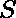

# 给定字符串的所有排列的最小字符串长度。

> 原文:[https://www . geesforgeks . org/给定字符串具有全排列的最小字符串长度/](https://www.geeksforgeeks.org/minimum-length-of-string-having-all-permutation-of-given-string/)

给定一个字符串其中，。假设中所有的人物都是独一无二的。任务是计算一个字符串的最小长度，该字符串由任意顺序的给定字符串的所有排列组成。
**注意:**所有排列都必须作为子串出现在结果字符串中。
**举例:**

```
Input : ab
Output : 3
The resulting string is aba.

Input : abc
Output : 9
The resulting string is abcabacba.
```

**方法:**上述问题的答案很简单。

1.  如果弦的长度是 **1** ，那么答案是 **1** 。
2.  如果弦的长度是 **2** ，那么答案是 **3** 。
3.  如果弦的长度是 **3** ，那么答案是 **9** 。

所以，观察输出后我们可以看到，如果字符串的长度是 **n** ，那么答案将是 **1！+ 2!+ … + n！**。因此，我们可以在字符串向量中预先计算出直到 **n = 26** 的结果。
以下是上述方法的实施。

## C++

```
// C++ implementation to find the minimum length of
// string having all permutation of the given string
#include <bits/stdc++.h>
using namespace std;

// function to find minimum length of required string
void minLength(string s)
{

    // Precomputed answers for all String.
    vector<string> minlen = { "0", "1", "3", "9", "33", "153", "872",
                    "5912", "46232", "409112", "4037912", "43954712",
                    "522956312", "6749977112", "93928268312",
                    "1401602636312", "22324392524312", "378011820620312",
                    "6780385526348312", "128425485935180312",
                    "2561327494111820312", "53652269665821260312",
                     "1177652997443428940312", "27029669736328405580312",
                     "647478071469567844940312", "16158688114800553828940312",
                     "419450149241406189412940312" };

    cout << minlen[s.size()];
}

// Driver program
int main()
{
    string s = "abc";

    // function call to print minimum length of string
    minLength(s);

    return 0;
}
// This code is written by
// Sanjit_Prasad
```

## Java 语言(一种计算机语言，尤用于创建网站)

```
// Java implementation to find
// the minimum length of string
// having all permutation of
// the given string
class GFG
{

// function to find minimum
// length of required string
static void minLength(String s)
{

    // Precomputed answers for all String.
    String minlen[] = { "0", "1", "3", "9", "33", "153", "872",
                        "5912", "46232", "409112", "4037912",
                        "43954712", "522956312", "6749977112",
                        "93928268312", "1401602636312",
                        "22324392524312", "378011820620312",
                        "6780385526348312", "128425485935180312",
                        "2561327494111820312", "53652269665821260312",
                        "1177652997443428940312", "27029669736328405580312",
                        "647478071469567844940312",
                        "16158688114800553828940312",
                        "419450149241406189412940312"};

    System.out.println(minlen[s.length()]);
}

// Driver code
public static void main (String args[])
{
    String s = "abc";

    // function call to print
    // minimum length of string
    minLength(s);

}
}

// This code is contributed by ANKITRAI1
```

## 计算机编程语言

```
# Python implementation to find the minimum length of
# string having all permutation of the given string.

# function to find minimum length of required string.
def minLength(s):

    # Precomputed answers for all String.
    minlen = ["0", "1", "3", "9", "33", "153", "872", "5912", "46232", "409112", "4037912", "43954712",
              "522956312", "6749977112", "93928268312", "1401602636312", "22324392524312",
              "378011820620312", "6780385526348312", "128425485935180312", "2561327494111820312",
              "53652269665821260312", "1177652997443428940312", "27029669736328405580312",
              "647478071469567844940312", "16158688114800553828940312", "419450149241406189412940312"]

    print(minlen[len(s)])

# Driver program
s = "abc"

# function call to print minimum length of string
minLength(s)

# This code is written by
# Sanjit_Prasad
```

## C#

```
// C# implementation to find
// the minimum length of string
// having all permutation of
// the given string
using System;

class GFG
{

// function to find minimum
// length of required string
static void minLength(String s)
{

    // Precomputed answers for all String.
    String[] minlen = { "0", "1", "3", "9", "33", "153", "872",
                        "5912", "46232", "409112", "4037912",
                        "43954712", "522956312", "6749977112",
                        "93928268312", "1401602636312",
                        "22324392524312", "378011820620312",
                        "6780385526348312", "128425485935180312",
                        "2561327494111820312", "53652269665821260312",
                        "1177652997443428940312", "27029669736328405580312",
                        "647478071469567844940312",
                        "16158688114800553828940312",
                        "419450149241406189412940312"};

    Console.WriteLine(minlen[s.Length]);
}

// Driver code
public static void Main ()
{
    String s = "abc";

    // function call to print
    // minimum length of string
    minLength(s);
}
}

// This code is contributed
// by Akanksha Rai(Abby_akku)
```

## 服务器端编程语言（Professional Hypertext Preprocessor 的缩写）

```
<?php
// PHP implementation to find the
// minimum length of string having
// all permutation of the given string

// function to find minimum length
// of required string
function minLength($s)
{
    // Precomputed answers for all String.
    $minlen = array("0", "1", "3", "9", "33", "153", "872",
                    "5912", "46232", "409112", "4037912",
                    "43954712", "522956312", "6749977112",
                    "93928268312", "1401602636312",
                    "22324392524312", "378011820620312",
                    "6780385526348312", "128425485935180312",
                    "2561327494111820312", "53652269665821260312",
                    "1177652997443428940312", "27029669736328405580312",
                    "647478071469567844940312", "16158688114800553828940312",
                    "419450149241406189412940312");

    echo $minlen[strlen($s)];
}

// Driver Code
$s = "abc";

// function call to print
// minimum length of string
minLength($s);

// This code is written by
// ash264
?>
```

## java 描述语言

```
<script>
// javascript implementation to find
// the minimum length of string
// having all permutation of
// the given string // function to find minimum
// length of required string
function minLength(s)
{

    // Precomputed answers for all String.
    minlen = [ "0", "1", "3", "9", "33", "153", "872",
                        "5912", "46232", "409112", "4037912",
                        "43954712", "522956312", "6749977112",
                        "93928268312", "1401602636312",
                        "22324392524312", "378011820620312",
                        "6780385526348312", "128425485935180312",
                        "2561327494111820312", "53652269665821260312",
                        "1177652997443428940312", "27029669736328405580312",
                        "647478071469567844940312",
                        "16158688114800553828940312",
                        "419450149241406189412940312"];

    document.write(minlen[s.length]);
}

// Driver code
s = "abc";

// function call to print
// minimum length of string
minLength(s);

// This code is contributed by 29AjayKumar

</script>
```

**输出:**

```
9
```

**时间复杂度:** 