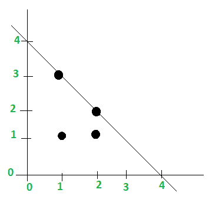

# 三角形最短路径的最小长度

> 原文:[https://www . geesforgeks . org/三角形最短路径的最小长度/](https://www.geeksforgeeks.org/minimum-length-of-the-shortest-path-of-a-triangle/)

给定平面上的 **N** 点，(X <sub>1</sub> 、Y <sub>1</sub> )、(X <sub>2</sub> 、Y <sub>2</sub> )、(X <sub>3</sub> 、Y <sub>3</sub> )、……、(X <sub>N</sub> 、Y <sub>N</sub> )。任务是计算三角形短边的最小长度。和路径或点来放置一个等腰三角形，三角形的任意两条边在坐标轴(X 轴和 Y 轴)上覆盖所有的点。
**注:**一个点如果位于三角形内部或三角形的边上，则被覆盖。
**例:**

> **输入:** (1，3)、(1，1)、(2，1)、(2，2)
> **输出:**长度- > 4、路径- > ( 1，4)和(4，1)
> T6】输入: (1，2)、(1，1)、(2，1)
> **输出:**长度- > 3、路径- > ( 1，3)和(3，1)



在第一个例子中，最短路径的最小长度等于点的最大和，即 1+3 或 2+2。所以覆盖所有点的路径是坐标轴上的(1，4)和(4，1)。
**下面是解决这个问题的分步算法:**

1.  初始化平面上的“N”个点。
2.  遍历每个点，找到每个点的总和，并将其存储在变量“答案”中。
3.  用之前的总和替换下一个最大的点数总和。
4.  然后你会得到坐标轴上的路径(1，答案)和(答案，1)，这将覆盖等腰三角形的所有点。

以下是上述算法的实现:

## C++

```
// C++ program to illustrate
// the above problem
#include <bits/stdc++.h>
using namespace std;
#define ll long long

// function to get the minimum length of
// the shorter side of the triangle
void shortestLength(int n, int x[], int y[])
{
        int answer = 0;

    // traversing through each points on the plane
    int i = 0;
    while (n--) {
        // if sum of a points is greater than the
        // previous one, the maximum gets replaced
        if (x[i] + y[i] > answer)
            answer = x[i] + y[i];

        i++;
    }

    // print the length
    cout << "Length -> " << answer << endl;
    cout << "Path -> "
         << "( 1, " << answer << " )"
         << "and ( " << answer << ", 1 )";
}

// Driver code
int main()
{
    // initialize the number of points
    int n = 4;

    // points on the plane
    int x[n] = { 1, 4, 2, 1 };
    int y[n] = { 4, 1, 1, 2 };

    shortestLength(n, x, y);

    return 0;
}
```

## Java 语言(一种计算机语言，尤用于创建网站)

```
// Java program to illustrate
// the above problem
class GFG
{

// function to get the minimum length of
// the shorter side of the triangle
static void shortestLength(int n, int x[],
                           int y[])
{
    int answer = 0;

    // traversing through each
    // points on the plane
    int i = 0;
    while (n != 0 && i < x.length)
    {
        // if sum of a points is greater
        // than the previous one, the
        // maximum gets replaced
        if (x[i] + y[i] > answer)
            answer = x[i] + y[i];

        i++;
    }

    // print the length
    System.out.println("Length -> " + answer );
    System.out.println("Path -> " +
                       "( 1, " + answer + " )" +
                       "and ( " + answer + ", 1 )");
}

// Driver code
public static void main(String[] args)
{
    // initialize the number of points
    int n = 4;

    // points on the plane
    int x[] = new int[] { 1, 4, 2, 1 };
    int y[] = new int[] { 4, 1, 1, 2 };

    shortestLength(n, x, y);
}
}

// This code is contributed
// by Prerna Saini
```

## 蟒蛇 3

```
# Python 3 program to illustrate
# the above problem

# function to get the minimum length of
# the shorter side of the triangle
def shortestLength(n, x, y):
    answer = 0

    # traversing through each
    # points on the plane
    i = 0
    while n > 0:

        # if sum of a points is greater
        # than the previous one, the
        # maximum gets replaced
        if (x[i] + y[i] > answer):
            answer = x[i] + y[i]

        i += 1
        n -= 1

    # print the length
    print("Length -> "+ str(answer))
    print( "Path -> "+
        "( 1, " +str(answer)+ " )"+
        "and ( "+str( answer) +", 1 )")

# Driver code
if __name__ == "__main__":

    # initialize the number of points
    n = 4

    # points on the plane
    x = [ 1, 4, 2, 1 ]
    y = [ 4, 1, 1, 2 ]
    shortestLength(n, x, y)

# This code is contributed
# by ChitraNayal
```

## C#

```
// C# program to illustrate
// the above problem
using System;

class GFG
{

// function to get the minimum
// length of the shorter side
// of the triangle
static void shortestLength(int n, int[] x,
                           int[] y)
{
    int answer = 0;

    // traversing through each
    // points on the plane
    int i = 0;
    while (n != 0 && i < x.Length)
    {
        // if sum of a points is greater
        // than the previous one, the
        // maximum gets replaced
        if (x[i] + y[i] > answer)
            answer = x[i] + y[i];

        i++;
    }

    // print the length
    Console.WriteLine("Length -> " + answer);
    Console.WriteLine("Path -> " +
                      "( 1, " + answer + " )" +
                      "and ( " + answer + ", 1 )");
}

// Driver code
static public void Main ()
{

    // initialize the
    // number of points
    int n = 4;

    // points on the plane
    int[] x = new int[] { 1, 4, 2, 1 };
    int[] y = new int[] { 4, 1, 1, 2 };

    shortestLength(n, x, y);
}
}

// This code is contributed by Mahadev
```

## 服务器端编程语言（Professional Hypertext Preprocessor 的缩写）

```
<?php
// PHP program to illustrate
// the above problem

// function to get the minimum length of
// the shorter side of the triangle
function shortestLength($n, &$x, &$y)
{
    $answer = 0;

    // traversing through each
    // points on the plane
    $i = 0;
    while ($n--)
    {

        // if sum of a points is greater
        // than the previous one, the
        // maximum gets replaced
        if ($x[$i] + $y[$i] > $answer)
            $answer = $x[$i] + $y[$i];

        $i++;
    }

    // print the length
    echo "Length -> ".$answer."\n";
    echo "Path -> ". "( 1, " .$answer ." )".
         "and ( " .$answer . ", 1 )";
}

// Driver code

// initialize the number of points
$n = 4;

// points on the plane
$x = array(1, 4, 2, 1 );
$y = array(4, 1, 1, 2 );

shortestLength($n, $x, $y);

// This code is contributed
// by ChitraNayal
?>
```

## java 描述语言

```
<script>

// Javascript program to illustrate
// the above problem

// function to get the minimum length of
// the shorter side of the triangle
function shortestLength(n, x, y)
{
    let answer = 0;

    // traversing through each
    // polets on the plane
    let i = 0;
    while (n != 0 && i < x.length)
    {
        // if sum of a polets is greater
        // than the previous one, the
        // maximum gets replaced
        if (x[i] + y[i] > answer)
            answer = x[i] + y[i];

        i++;
    }

    // prlet the length
    document.write("Length -> " + answer + "<br/>");
    document.write("Path -> " +
                       "( 1, " + answer + " )" +
                       "and ( " + answer + ", 1 )");
}

// Driver Code

    // initialize the number of polets
    let n = 4;

    // polets on the plane
    let x = [ 1, 4, 2, 1 ];
    let y = [ 4, 1, 1, 2 ];

    shortestLength(n, x, y);

</script>
```

**Output:** 

```
Length -> 5
Path -> ( 1, 5 )and ( 5, 1 )
```