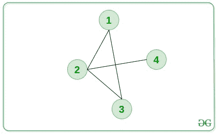

# 1 到 N 之间的最小长度路径，包括每个节点

> 原文:[https://www . geesforgeks . org/最小长度-1 到 n 之间的路径-包括每个节点/](https://www.geeksforgeeks.org/minimum-length-paths-between-1-to-n-including-each-node/)

给定一个由 **N** 节点和 **M** 边组成的无向[图](https://www.geeksforgeeks.org/graph-data-structure-and-algorithms/)，任务是找到从**节点 1** 到**节点 N** 从给定图的每个可能节点经过的路径的最小长度。如果不存在这样的路径，则打印 **-1** 。

**注意:**路径可以任意多次通过一个节点。

**示例:**

> **输入:** N = 4，M = 4，边[][] = {{1，2}，{2，3}，{1，3}，{2，4}}
> 输出:2 2 3 2
> T6】解释:
> 
> 
> 
> 从 1 到 4 的最小路径长度，从 1 通过是 2。
> 从 1 到 4 的最小路径长度，从 2 经过是 2。
> 从 1 到 4 的最小路径长度，从 3 经过是 3。
> 从 1 到 4 的最短路径长度，从 4 经过是 2。
> 
> **输入:** N = 5，M = 7，边[][] = {{1，2}，{1，4}，{2，3}，{2，5}，{4，3}，{4，5}，{1，5}}
> **输出:** 1 2 4 2 1

**方法:**思路是运行两个 [BFS](https://www.geeksforgeeks.org/breadth-first-traversal-for-a-graph/) ，一个从节点 **1** 排除节点 **N** 开始，另一个从节点 **N** 排除节点 **1** 开始，求所有节点距 **1** 和 **N** 的最小距离。两个最小距离的[和](https://www.geeksforgeeks.org/sum-function-python/)将是从 **1** 到 **N** 包括节点的路径的最小长度。按照以下步骤解决问题:

*   初始化一个 [<u>队列</u>](https://www.geeksforgeeks.org/queue-data-structure/) ，比如说**队列 1** 从节点 **1** 执行 **BFS** ，以及一个队列**队列 2** 从节点 **N** 执行 BFS。
*   初始化两个 [<u>数组</u>](https://www.geeksforgeeks.org/arrays-in-java/) ，比如 **dist1[]** 和 **dist2[]** 通过执行 **BFS1** 和 **BFS2** 来存储最短距离。
*   执行两次 BFS，并在每种情况下执行以下步骤:
    *   [<u>从队列中弹出</u>](https://www.geeksforgeeks.org/queuepush-and-queuepop-in-cpp-stl/) ，将节点存储在 **x** 中，其距离存储在 **dis** 中。
    *   如果**距离【x】**小于**距离**，则[继续](https://www.geeksforgeeks.org/continue-statement-cpp/) 。
    *   遍历 **x** 的邻接表，对于每个孩子 **y** ，如果 **dist[y]** 大于 **dis + 1** ，则更新 **dist[y]** 等于 **dis + 1** 。
*   在上述步骤中填充两个数组 **dist1[]** 和 **dist2[]** 后，[遍历范围](https://www.geeksforgeeks.org/range-based-loop-c/)**【0，N】**，如果 **(dist1[i] + dist2[i])** 的和大于 **10 <sup>9</sup>** ，则打印**-1”**，因为它们不存在这样的路径。否则，打印 **(dist1[i] + dist2[i])** 的值作为结果。

下面是上述方法的实现:

## C++

```
// C++ program for the above approach

#include <bits/stdc++.h>
using namespace std;
#define ll long long int

// Function to calculate the distances
// from node 1 to N
void minDisIncludingNode(int n, int m,
                         int edges[][2])
{
    // Vector to store our edges
    vector<ll> g[10005];

    // Storing the edgees in the Vector
    for (int i = 0; i < m; i++) {
        int a = edges[i][0] - 1;
        int b = edges[i][1] - 1;
        g[a].push_back(b);
        g[b].push_back(a);
    }

    // Initialize queue
    queue<pair<ll, ll> > q;
    q.push({ 0, 0 });
    vector<int> dist(n, 1e9);
    dist[0] = 0;

    // BFS from first node using queue
    while (!q.empty()) {
        auto up = q.front();

        // Pop from queue
        q.pop();
        int x = up.first;
        int lev = up.second;
        if (lev > dist[x])
            continue;
        if (x == n - 1)
            continue;

        // Traversing its adjacency list
        for (ll y : g[x]) {
            if (dist[y] > lev + 1) {
                dist[y] = lev + 1;
                q.push({ y, lev + 1 });
            }
        }
    }
    // Initialize queue
    queue<pair<ll, ll> > q1;
    q1.push({ n - 1, 0 });
    vector<int> dist1(n, 1e9);
    dist1[n - 1] = 0;

    // BFS from last node using queue
    while (!q1.empty()) {
        auto up = q1.front();

        // Pop from queue
        q1.pop();
        int x = up.first;
        int lev = up.second;
        if (lev > dist1[x])
            continue;
        if (x == 0)
            continue;

        // Traversing its adjacency list
        for (ll y : g[x]) {
            if (dist1[y] > lev + 1) {
                dist1[y] = lev + 1;
                q1.push({ y, lev + 1 });
            }
        }
    }

    // Printing the minimum distance
    // including node i
    for (int i = 0; i < n; i++) {
        // If not reachable
        if (dist[i] + dist1[i] > 1e9)
            cout << -1 << " ";

        // Path exists
        else
            cout << dist[i] + dist1[i] << " ";
    }
}

// Driver Code
int main()
{
    // Given Input
    int n = 5;
    int m = 7;
    int edges[m][2]
        = { { 1, 2 }, { 1, 4 },
            { 2, 3 }, { 2, 5 },
            { 4, 3 }, { 4, 5 },
            { 1, 5 } };

    // Function Call
    minDisIncludingNode(n, m, edges);

    return 0;
}
```

## 蟒蛇 3

```
# Python 3 program for the above approach

# Function to calculate the distances
# from node 1 to N
def minDisIncludingNode(n, m, edges):
    # Vector to store our edges
    g = [[] for i in range(10005)]

    # Storing the edgees in the Vector
    for i in range(m):
        a = edges[i][0] - 1
        b = edges[i][1] - 1
        g[a].append(b)
        g[b].append(a)

    # Initialize queue
    q = []
    q.append([0, 0])
    dist = [1e9 for i in range(n)]
    dist[0] = 0

    # BFS from first node using queue
    while(len(q)>0):
        up = q[0]

        # Pop from queue
        q = q[1:]
        x = up[0]
        lev = up[1]
        if (lev > dist[x]):
            continue
        if (x == n - 1):
            continue

        # Traversing its adjacency list
        for y in g[x]:
            if (dist[y] > lev + 1):
                dist[y] = lev + 1
                q.append([y, lev + 1])

    # Initialize queue
    q1 = []
    q1.append([n - 1, 0])
    dist1 = [1e9 for i in range(n)]
    dist1[n - 1] = 0

    # BFS from last node using queue
    while (len(q1) > 0):
        up = q1[0]

        # Pop from queue
        q1 = q1[1:]
        x = up[0]
        lev = up[1]
        if (lev > dist1[x]):
            continue
        if (x == 0):
            continue

        # Traversing its adjacency list
        for y in g[x]:
            if (dist1[y] > lev + 1):
                dist1[y] = lev + 1
                q1.append([y, lev + 1])

    # Printing the minimum distance
    # including node i
    for i in range(n):
        # If not reachable
        if (dist[i] + dist1[i] > 1e9):
            print(-1,end = " ")

        # Path exists
        else:
            print(dist[i] + dist1[i],end = " ")

# Driver Code
if __name__ == '__main__':
    # Given Input
    n = 5
    m = 7
    edges = [[1, 2],[1, 4],[2, 3],[2, 5],[4, 3],[4, 5],[1, 5]]

    # Function Call
    minDisIncludingNode(n, m, edges)

    # This code is contributed by SURENDRA_GANGWAR.
```

## java 描述语言

```
<script>
// Javascript program for the above approach

// Function to calculate the distances
// from node 1 to N
function minDisIncludingNode(n, m, edges) {
  // Vector to store our edges

  let g = new Array(10005).fill(0).map(() => []);
  // Storing the edgees in the Vector
  for (let i = 0; i < m; i++) {
    let a = edges[i][0] - 1;
    let b = edges[i][1] - 1;
    g[a].push(b);
    g[b].push(a);
  }

  // Initialize queue
  let q = [];
  q.push([0, 0]);
  dist = new Array(n).fill(1e9);
  dist[0] = 0;

  // BFS from first node using queue
  while (q.length > 0) {
    let up = q[0];

    // Pop from queue
    q.pop();
    let x = up[0];
    let lev = up[1];
    if (lev > dist[x]) continue;
    if (x == n - 1) continue;

    // Traversing its adjacency list
    for (let y of g[x]) {
      if (dist[y] > lev + 1) {
        dist[y] = lev + 1;
        q.push([y, lev + 1]);
      }
    }
  }

  // Initialize queue
  let q1 = [];
  q1.push([n - 1, 0]);
  let dist1 = new Array(n).fill(1e9);
  dist1[n - 1] = 0;

  // BFS from last node using queue
  while (q1.length > 0) {
    let up = q1[0];

    // Pop from queue
    q1.pop();
    let x = up[0];
    let lev = up[1];
    if (lev > dist1[x]) continue;
    if (x == 0) continue;

    // Traversing its adjacency list
    for (let y of g[x]) {
      if (dist1[y] > lev + 1) {
        dist1[y] = lev + 1;
        q1.push([y, lev + 1]);
      }
    }
  }

  // Printing the minimum distance
  // including node i
  for (let i = 0; i < n; i++) {
    // If not reachable
    if (dist[i] + dist1[i] > 1e9) document.write(-1 + " ");
    // Path exists
    else document.write(dist[i] + dist1[i] + " ");
  }
}

// Driver Code
// Given Input
let n = 5;
let m = 7;
let edges = [
  [1, 2],
  [1, 4],
  [2, 3],
  [2, 5],
  [4, 3],
  [4, 5],
  [1, 5],
];

// Function Call
minDisIncludingNode(n, m, edges);

// This code is contributed by gfgking
</script>
```

**Output:** 

```
1 2 4 2 1
```

***时间复杂度:** O(N + M)*
***辅助空间:** O(N)*