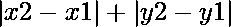

# 通过访问从源到最终顶点的每个坐标所覆盖的最小曼哈顿距离

> 原文:[https://www . geesforgeks . org/minist-Manhattan-distance-covered-by-visitoring-ever-coordinates-from-a-a-final-vertex/](https://www.geeksforgeeks.org/minimum-manhattan-distance-covered-by-visiting-every-coordinates-from-a-source-to-a-final-vertex/)

给定一个坐标点数组**arr【】**以及一个源和最终坐标点，任务是找到从源到最终顶点覆盖的最小曼哈顿距离，这样数组中的每个点都会被访问一次。

> 曼哈顿距离= 

**例:**

> **输入:**源= (0，0)，最终= (100，100)
> arr[] = {(70，40)，(30，10)，(10，5)，(90，70)，(50，20)}
> T4】输出:200
> T7】输入:源= (0，0)，最终= (5，5)
> arr[] = {(1，1)}
> **输出:【T0**

**方法:**思路是使用[排列组合](https://www.geeksforgeeks.org/permutation-and-combination/)生成到坐标的每一个可能的排列移动，然后计算从阵列的第一个坐标移动到最终坐标所覆盖的总曼哈顿距离，如果最终覆盖的距离小于到目前为止所覆盖的最小距离。然后更新覆盖的最小距离。
以下是上述方法的实施:

## C++

```
// C++ implementation to find the
// minimum manhattan distance
// covered by visiting N co-ordinates

#include <bits/stdc++.h>
using namespace std;

// Class of co-ordinates
class pairs {
public:
    int x;
    int y;
};

// Function to calculate the
// manhattan distance between
// pair of points
int calculate_distance(pairs a,
                       pairs b)
{
    return abs(a.x - b.x) +
           abs(a.y - b.y);
}

// Function to find the minimum
// distance covered for visiting
// every co-ordinate point
int findMinDistanceUtil(vector<int> nodes,
           int noOfcustomer, int** matrix)
{
    int mindistance = INT_MAX;

    // Loop to compute the distance
    // for every possible permutation
    do {
        int distance = 0;
        int prev = 1;

        // Computing every total manhattan
        // distance covered for the every
        // co-ordinate points
        for (int i = 0; i < noOfcustomer; i++) {
            distance = distance +
                       matrix[prev][nodes[i]];
            prev = nodes[i];
        }

        // Adding the final distance
        distance = distance + matrix[prev][0];

        // if distance is less than
        // minimum value than update it
        if (distance < mindistance)
            mindistance = distance;
    }while (
        next_permutation(
            nodes.begin(), nodes.end()
        ));
    return mindistance;
}

// Function to initialize the input
// and find the minimum distance
// by visiting every coordinate
void findMinDistance()
{
    int noOfcustomer = 1;
    vector<pairs> coordinate;
    vector<int> nodes;
    // filling the coordinates into vector
    pairs office, home, customer;
    office.x = 0;
    office.y = 0;
    coordinate.push_back(office);
    home.x = 5;
    home.y = 5;
    coordinate.push_back(home);
    customer.x = 1;
    customer.y = 1;
    coordinate.push_back(customer);

    // make a 2d matrix which stores
    // distance between two point
    int** matrix = new int*[noOfcustomer + 2];

    // Loop to compute the distance between
    // every pair of points in the co-ordinate
    for (int i = 0; i < noOfcustomer + 2; i++) {
        matrix[i] = new int[noOfcustomer + 2];

        for (int j = 0; j < noOfcustomer + 2; j++) {
            matrix[i][j] = calculate_distance(
                    coordinate[i], coordinate[j]);
        }

        // Condition to not move the
        // index of the source or
        // the final vertex
        if (i != 0 && i != 1)
            nodes.push_back(i);
    }
    cout << findMinDistanceUtil(
        nodes, noOfcustomer, matrix);
}

// Driver Code
int main()
{
    // Function Call
    findMinDistance();
    return 0;
}
```

**Output:** 

```
10
```

**业绩分析:**

*   **时间复杂度:** *O(N！* N)*
*   **辅助空间:** *O(N <sup>2</sup> )*