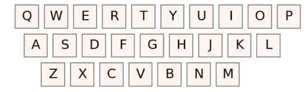

# 在基于 QWERTY 的键盘上输入一个单词所需的最小移动次数

> 原文:[https://www . geeksforgeeks . org/基于 qwerty 的键盘键入单词所需的最小移动次数/](https://www.geeksforgeeks.org/minimum-moves-required-to-type-a-word-in-qwerty-based-keyboard/)

给定一个仅由小写英文字母组成的字符串 **S** 。任务是找出手指移动的最小次数来键入给定的字符串。当您按下键盘上当前按下的键所在行以外的键时，会考虑移动。



**仅由英文字母组成的 QWERTY 键盘。**

**示例:**

> **输入:**S =**geeksforgeeks”
> T5】输出:7
> T8】解释:T10】移 1>T24】g
> 移 2>T26】e
> 移 2>T28】e
> 移 3>T30】k
> 移 3>T32】S
> 移 3>T33**
> 
> ****输入:**S = " radhamohan "
> T3】输出: 6**

****方法:**这可以通过在 **QWERTY** 键盘中初始设置每个字符的行号来完成。以下是步骤:**

1.  **将每个字符的行存储在一个数组**行【】**中。**
2.  **初始化**移动= 1** 。**
3.  **遍历给定的字符串，检查字符串中当前字符的行是否等于前一个字符。**
4.  **如果当前字符不相等，则增加移动，因为我们需要在打印字符时更改当前行。**
5.  **否则检查下一对字符。**

**下面是上述方法的实现:**

## **C++**

```
// C++ program for the above approach
#include <bits/stdc++.h>
using namespace std;

// Function that calculates the moves
// required to print the current string
int numberMoves(string s)
{
    // row1 has qwertyuiop, row2 has
    // asdfghjkl, and row3 has zxcvbnm
    // Store the row number of
    // each character
    int row[] = { 2, 3, 3, 2, 1, 2, 2,
                  2, 1, 2, 2, 2, 3, 3,
                  1, 1, 1, 1, 2, 1, 1,
                  3, 1, 3, 1, 3 };

    // String length
    int n = s.length();

    // Initialise move to 1
    int move = 1;

    // Traverse the string
    for (int i = 1; i < n; i++) {

        // If current row number is
        // not equal to previous row
        // then increment the moves
        if (row[s[i] - 'a']
            != row[s[i - 1] - 'a']) {
            move++;
        }
    }

    // Return the moves
    return move;
}

// Driver Code
int main()
{
    // Given String str
    string str = "geeksforgeeks";

    // Function Call
    cout << numberMoves(str);
    return 0;
}
```

## **Java 语言(一种计算机语言，尤用于创建网站)**

```
// Java program for the above approach
import java.util.*;
class GFG{

// Function that calculates the moves
// required to print the current String
static int numberMoves(String s)
{
    // row1 has qwertyuiop, row2 has
    // asdfghjkl, and row3 has zxcvbnm
    // Store the row number of
    // each character
    int row[] = { 2, 3, 3, 2, 1, 2, 2,
                  2, 1, 2, 2, 2, 3, 3,
                  1, 1, 1, 1, 2, 1, 1,
                  3, 1, 3, 1, 3 };

    // String length
    int n = s.length();

    // Initialise move to 1
    int move = 1;

    // Traverse the String
    for (int i = 1; i < n; i++)
    {

        // If current row number is
        // not equal to previous row
        // then increment the moves
        if (row[s.charAt(i) - 'a'] !=
            row[s.charAt(i-1) - 'a'])
        {
            move++;
        }
    }

    // Return the moves
    return move;
}

// Driver Code
public static void main(String[] args)
{
    // Given String str
    String str = "geeksforgeeks";

    // Function Call
    System.out.print(numberMoves(str));
}
}

// This code is contributed by sapnasingh4991
```

## **蟒蛇 3**

```
# Python3 program for the above approach

# Function that calculates the moves
# required to print current String
def numberMoves(s):

    # row1 has qwertyuiop, row2 has
    # asdfghjkl, and row3 has zxcvbnm
    # Store the row number of
    # each character
    row = [2, 3, 3, 2, 1, 2,
           2, 2, 1, 2, 2, 2, 3,
           3, 1, 1, 1, 1, 2, 1,
           1, 3, 1, 3, 1, 3];

    # String length
    n = len(s);

    # Initialise move to 1
    move = 1;

    # Traverse the String
    for i in range(1, n):

    # If current row number is
    # not equal to previous row
    # then increment the moves
    if(row[ord(s[i]) -
           ord('a')] != row[ord(s[i - 1]) -
                            ord('a')]):
      move += 1;

    # Return the moves
    return move;

# Driver Code
if __name__ == '__main__':

    # Given String str
    str = "geeksforgeeks";

    # Function Call
    print(numberMoves(str));

# This code is contributed by Rajput-Ji Add
```

## **C#**

```
// C# program for the above approach
using System;
class GFG{

// Function that calculates the moves
// required to print the current String
static int numberMoves(String s)
{
    // row1 has qwertyuiop, row2 has
    // asdfghjkl, and row3 has zxcvbnm
    // Store the row number of
    // each character
    int []row = { 2, 3, 3, 2, 1, 2, 2,
                  2, 1, 2, 2, 2, 3, 3,
                  1, 1, 1, 1, 2, 1, 1,
                  3, 1, 3, 1, 3 };

    // String length
    int n = s.Length;

    // Initialise move to 1
    int move = 1;

    // Traverse the String
    for (int i = 1; i < n; i++)
    {

        // If current row number is
        // not equal to previous row
        // then increment the moves
        if (row[s[i] - 'a'] !=
            row[s[i - 1] - 'a'])
        {
            move++;
        }
    }

    // Return the moves
    return move;
}

// Driver Code
public static void Main(String[] args)
{
    // Given String str
    String str = "geeksforgeeks";

    // Function Call
    Console.Write(numberMoves(str));
}
}

// This code is contributed by sapnasingh4991
```

****Output:** 

```
7
```** 

*****时间复杂度:** O(N)，其中 N 是字符串的长度。*
***空间复杂度:** O(1)***