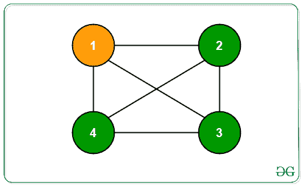
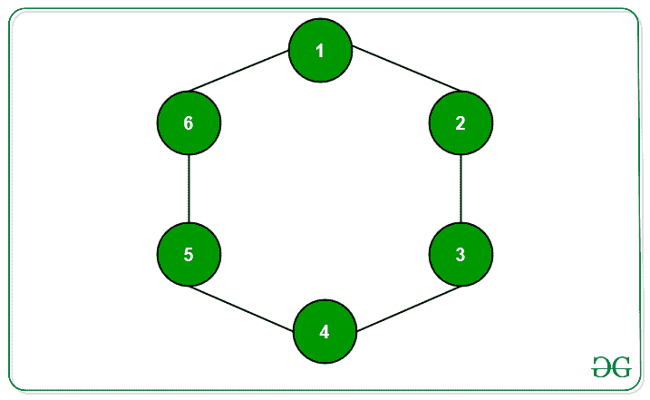
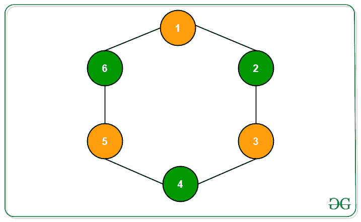

# 图中要着色的最小节点，这样每个节点都有一个着色的邻居

> 原文:[https://www . geesforgeks . org/最小图中要着色的节点数，这样每个节点都有一个着色的邻居/](https://www.geeksforgeeks.org/minimum-nodes-to-be-colored-in-a-graph-such-that-every-node-has-a-colored-neighbour/)

给定一个带有 **V** 节点和 **E** 边的图形 **G** ，任务是给不超过**层(V/2)** 节点着色，使得每个节点在 1 个单位的距离处至少有一个着色节点*。图的任意两个连通节点之间的距离总是正好为 1 个单位。打印需要着色的节点。*

***示例:***

> ***输入:** N = 4，
> G:* 
> 
> **
> 
>  ***输出:** 1
> 
> 
> 
> **输入:** N = 6，
> G:
> 
> 
> 
> **输出:** 3
> 
> *

***方法:**这个问题可以使用 [**BFS**](https://en.wikipedia.org/wiki/Breadth-first_search) 遍历来解决。按照以下步骤解决问题:*

*   *初始化数组**奇数[]** 和**偶数[]** ，以存储分别与源相距奇数和偶数个节点的节点。*
*   *从源节点开始，执行 BFS 遍历，其中**距离**初始化为 0，表示到源节点的距离。根据**距离**的值，将特定级别的所有节点存储在奇数[]或偶数[]中。*
*   *如果距离为奇数，即**(距离& 1)** 为 1，则将该节点插入奇数[]。否则，插入偶数[]。*
*   *现在用最少的元素打印数组中的节点。*
*   *由于奇数距离或偶数距离的节点数中的最小值不超过**层(V/2)** ，因此答案正确，因为奇数距离的每个节点都连接到偶数距离的节点，反之亦然。*
*   *因此，如果距源偶数距离的节点数较少，则从偶数[]打印节点。否则，打印奇数[]中的所有节点。*

> ***图解:**
> 对于下面给出的图 G，
> 源节点 S = 1* 
> 
> **
> 
> *   *偶数[] = {1，3，5}*
> *   *奇数[] = {2，6，4}*
> *   *最小值(偶数大小()、奇数大小())=最小值(3，3) = 3*
> *   *因此，给距源奇数距离或距源偶数距离的所有节点着色是正确的，因为它们的计数是相同的。*

*下面是上述方法的实现:*

## *C++*

```
*// C++ Program to implement the
// above approach

#include <bits/stdc++.h>
using namespace std;

// Stores the graph
map<int, vector<int> > graph;

// Stores the visited nodes
map<int, int> vis;

// Stores the nodes
// at odd distance
vector<int> odd;

// Stores the nodes at
// even distance
vector<int> even;

// Function to separate and
// store the odd and even
// distant nodes from source
void bfs()
{
    // Source node
    int src = 1;

    // Stores the nodes and their
    // respective distances from
    // the source
    queue<pair<int, int> > q;

    // Insert the source
    q.push({ src, 0 });

    // Mark the source visited
    vis[src] = 1;

    while (!q.empty()) {

        // Extract a node from the
        // front of the queue
        int node = q.front().first;
        int dist = q.front().second;
        q.pop();

        // If distance from source
        // is odd
        if (dist & 1) {
            odd.push_back(node);
        }

        // Otherwise
        else {
            even.push_back(node);
        }

        // Traverse its neighbors
        for (auto i : graph[node]) {

            // Insert its unvisited
            // neighbours into the queue
            if (!vis.count(i)) {

                q.push({ i, (dist + 1) });
                vis[i] = 1;
            }
        }
    }
}

// Driver Program
int main()
{
    graph[1].push_back(2);
    graph[2].push_back(1);
    graph[2].push_back(3);
    graph[3].push_back(2);
    graph[3].push_back(4);
    graph[4].push_back(3);
    graph[4].push_back(5);
    graph[5].push_back(4);
    graph[5].push_back(6);
    graph[6].push_back(5);
    graph[6].push_back(1);
    graph[1].push_back(6);

    bfs();

    if (odd.size() < even.size()) {
        for (int i : odd) {
            cout << i << " ";
        }
    }
    else {
        for (int i : even) {
            cout << i << " ";
        }
    }
    return 0;
}*
```

## *Java 语言(一种计算机语言，尤用于创建网站)*

```
*// Java program to implement the
// above approach
import java.util.ArrayList;
import java.util.HashMap;
import java.util.LinkedList;
import java.util.Map;
import java.util.Queue;

class Pair
{
    int first, second;

    public Pair(int first, int second)
    {
        this.first = first;
        this.second = second;
    }
}

class GFG{

// Stores the graph
static Map<Integer, ArrayList<Integer>> graph = new HashMap<>();

// Stores the visited nodes
static Map<Integer, Integer> vis = new HashMap<>();

// Stores the nodes
// at odd distance
static ArrayList<Integer> odd = new ArrayList<>();

// Stores the nodes at
// even distance
static ArrayList<Integer> even = new ArrayList<>();

// Function to separate and
// store the odd and even
// distant nodes from source
static void bfs()
{

    // Source node
    int src = 1;

    // Stores the nodes and their
    // respective distances from
    // the source
    Queue<Pair> q = new LinkedList<>();

    // Insert the source
    q.add(new Pair(src, 0));

    // Mark the source visited
    vis.put(src, 1);

    while (!q.isEmpty())
    {

        // Extract a node from the
        // front of the queue
        int node = q.peek().first;
        int dist = q.peek().second;
        q.poll();

        // If distance from source
        // is odd
        if ((dist & 1) != 0)
        {
            odd.add(node);
        }

        // Otherwise
        else
        {
            even.add(node);
        }

        // Traverse its neighbors
        for(Integer i : graph.get(node))
        {

            // Insert its unvisited
            // neighbours into the queue
            if (!vis.containsKey(i))
            {
                q.add(new Pair(i, (dist + 1)));
                vis.put(i, 1);
            }
        }
    }
}

// Driver code
public static void main(String[] args)
{
    graph.put(1, new ArrayList<>());
    graph.put(2, new ArrayList<>());
    graph.put(3, new ArrayList<>());
    graph.put(4, new ArrayList<>());
    graph.put(5, new ArrayList<>());
    graph.put(6, new ArrayList<>());
    graph.get(1).add(2);
    graph.get(2).add(1);
    graph.get(2).add(3);
    graph.get(3).add(2);
    graph.get(3).add(4);
    graph.get(4).add(3);
    graph.get(4).add(5);
    graph.get(5).add(4);
    graph.get(5).add(6);
    graph.get(6).add(5);
    graph.get(6).add(1);
    graph.get(1).add(6);

    bfs();

    if (odd.size() < even.size())
    {
        for(int i : odd)
        {
            System.out.print(i + " ");
        }
    }
    else
    {
        for(int i : even)
        {
            System.out.print(i + " ");
        }
    }
}
}

// This code is contributed by sanjeev2552*
```

## *蟒蛇 3*

```
*# Python3 Program to implement the
# above approach

# Stores the graph
graph = dict()

# Stores the visited nodes
vis = dict()

# Stores the nodes
# at odd distance
odd = []

# Stores the nodes at
# even distance
even = []

# Function to separate and
# store the odd and even
# distant nodes from source
def bfs():

    # Source node
    src = 1;

    # Stores the nodes and their
    # respective distances from
    # the source
    q = []

    # Insert the source
    q.append([ src, 0 ]);

    # Mark the source visited
    vis[src] = 1;

    while (len(q) != 0):

        # Extract a node from the
        # front of the queue
        node = q[0][0]
        dist = q[0][1]
        q.pop(0);

        # If distance from source
        # is odd
        if (dist & 1):
            odd.append(node);

        # Otherwise
        else:
            even.append(node);

        # Traverse its neighbors
        for i in graph[node]:

            # Insert its unvisited
            # neighbours into the queue
            if (i not in vis):

                q.append([ i, (dist + 1) ]);
                vis[i] = 1;

# Driver code
if __name__=='__main__':

    graph[1] = [2, 6]
    graph[2] = [1, 3]
    graph[3] = [2, 4]
    graph[4] = [3, 5]
    graph[5] = [4, 6]
    graph[6] = [5, 1]

    bfs();

    if (len(odd) < len(even)):
        for i in odd:
            print(i, end = ' ')

    else:
        for i in even:
            print(i, end = ' ')

# This code is contributed by rutvik_56*
```

***Output:** 

```
1 3 5
```* 

****时间复杂度:** O(V + E)*
***辅助空间** : O(V)**