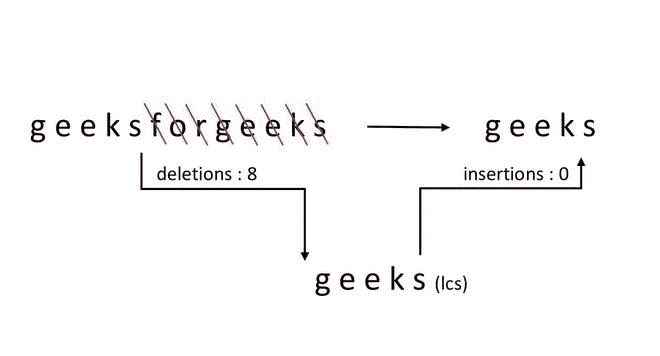

# 将一个字符串转换成另一个字符串的最少删除和插入次数

> 原文:[https://www . geesforgeks . org/最小数量-删除-插入-转换-一个字符串-另一个/](https://www.geeksforgeeks.org/minimum-number-deletions-insertions-transform-one-string-another/)

给定两个大小分别为 m 和 n 的字符串“str1”和“str2”。任务是从/在 str1 中移除/删除并插入最少数量的字符，以将其转换为 str2。可能需要从 str1 的一个点移除/删除相同的字符，并将其插入到另一个点。

**例 1:**

```
Input : 
str1 = "heap", str2 = "pea" 
Output : 
Minimum Deletion = 2 and
Minimum Insertion = 1
Explanation:
p and h deleted from heap
Then, p is inserted at the beginning
One thing to note, though p was required yet
it was removed/deleted first from its position and
then it is inserted to some other position.
Thus, p contributes one to the deletion_count
and one to the insertion_count.
```


**例 2:**

```
Input : 
str1 = "geeksforgeeks", str2 = "geeks"
Output : 
Minimum Deletion = 8
Minimum Insertion = 0       
```



**简单方法:**

一种简单的方法是考虑 str1 的所有子序列，并为每个子序列计算最少的删除和插入，以便将其转换为 str2。一个非常复杂的方法，这个解的时间复杂度是指数的。

**有效方法:**

一种有效的方法使用[的概念来寻找给定的两个序列的最长公共子序列](https://www.geeksforgeeks.org/dynamic-programming-set-4-longest-common-subsequence/)的长度。

**算法:**

*   **str1** 和 **str2** 是给定的字符串。
*   **m** 和 **n** 分别为它们的长度。
*   **len** 是 **str1** 和 **str2** 的最长公共子序列的长度
*   最小删除次数**minDel**= m–len
*   最小插入次数**最小插入次数**= n–len

下面是上述代码的实现:

## C++

```
// Dynamic Programming C++ implementation to find
// minimum number of deletions and insertions
#include <bits/stdc++.h>

using namespace std;

// Returns length of length common subsequence
// for str1[0..m-1], str2[0..n-1]
int lcs(string str1, string str2, int m, int n)
{
    int L[m + 1][n + 1];
    int i, j;

    // Following steps build L[m+1][n+1] in bottom
    // up fashion. Note that L[i][j] contains
    // length of LCS of str1[0..i-1] and str2[0..j-1]
    for (i = 0; i <= m; i++) {
        for (j = 0; j <= n; j++) {
            if (i == 0 || j == 0)
                L[i][j] = 0;

            else if (str1.at(i - 1) == str2.at(j - 1))
                L[i][j] = L[i - 1][j - 1] + 1;

            else
                L[i][j] = max(L[i - 1][j], L[i][j - 1]);
        }
    }

    // L[m][n] contains length of LCS
    // for X[0..n-1] and Y[0..m-1]
    return L[m][n];
}

// function to find minimum number
// of deletions and insertions
void printMinDelAndInsert(string str1, string str2)
{
    int m = str1.size();
    int n = str2.size();

    int len = lcs(str1, str2, m, n);

    cout << "Minimum number of deletions = " << (m - len)
         << endl;

    cout << "Minimum number of insertions = " << (n - len)
         << endl;
}

// Driver Code
int main()
{
    string str1 = "heap";
    string str2 = "pea";

      // Function Call
    printMinDelAndInsert(str1, str2);
    return 0;
}
```

## Java 语言(一种计算机语言，尤用于创建网站)

```
// Dynamic Programming Java implementation
// to find minimum number of deletions and
// insertions
import java.io.*;

class GFG {

    // Returns length of length common
    // subsequence for str1[0..m-1],
    // str2[0..n-1]
    static int lcs(String str1, String str2, int m, int n)
    {
        int L[][] = new int[m + 1][n + 1];
        int i, j;

        // Following steps build L[m+1][n+1] in
        // bottom up fashion. Note that L[i][j]
        // contains length of LCS of str1[0..i-1]
        // and str2[0..j-1]
        for (i = 0; i <= m; i++) {
            for (j = 0; j <= n; j++) {
                if (i == 0 || j == 0)
                    L[i][j] = 0;

                else if (str1.charAt(i - 1)
                         == str2.charAt(j - 1))
                    L[i][j] = L[i - 1][j - 1] + 1;

                else
                    L[i][j] = Math.max(L[i - 1][j],
                                       L[i][j - 1]);
            }
        }

        // L[m][n] contains length of LCS
        // for X[0..n-1] and Y[0..m-1]
        return L[m][n];
    }

    // function to find minimum number
    // of deletions and insertions
    static void printMinDelAndInsert(String str1,
                                     String str2)
    {
        int m = str1.length();
        int n = str2.length();

        int len = lcs(str1, str2, m, n);

        System.out.println("Minimum number of "
                           + "deletions = ");
        System.out.println(m - len);

        System.out.println("Minimum number of "
                           + "insertions = ");
        System.out.println(n - len);
    }

    // Driver code
    public static void main(String[] args)
    {
        String str1 = new String("heap");
        String str2 = new String("pea");

          // Function Call
        printMinDelAndInsert(str1, str2);
    }
}
// This code is contributed by Prerna Saini
```

## 蟒蛇 3

```
# Dynamic Programming Python3
# implementation to find minimum
# number of deletions and insertions

# Returns length of length
# common subsequence for
# str1[0..m-1], str2[0..n-1]

def lcs(str1, str2, m, n):

    L = [[0 for i in range(n + 1)]
         for i in range(m + 1)]

    # Following steps build L[m+1][n+1]
    # in bottom up fashion. Note that
    # L[i][j] contains length of LCS
    # of str1[0..i-1] and str2[0..j-1]
    for i in range(m + 1):
        for j in range(n + 1):
            if (i == 0 or j == 0):
                L[i][j] = 0
            elif(str1[i - 1] == str2[j - 1]):
                L[i][j] = L[i - 1][j - 1] + 1
            else:
                L[i][j] = max(L[i - 1][j],
                              L[i][j - 1])

    # L[m][n] contains length of LCS
    # for X[0..n-1] and Y[0..m-1]
    return L[m][n]

# function to find minimum number
# of deletions and insertions

def printMinDelAndInsert(str1, str2):
    m = len(str1)
    n = len(str2)
    leng = lcs(str1, str2, m, n)
    print("Minimum number of deletions = ",
          m - leng, sep=' ')
    print("Minimum number of insertions = ",
          n - leng, sep=' ')

# Driver Code
str1 = "heap"
str2 = "pea"

# Function Call
printMinDelAndInsert(str1, str2)

# This code is contributed
# by sahilshelangia
```

## C#

```
// Dynamic Programming C# implementation
// to find minimum number of deletions and
// insertions
using System;

class GFG {

    // Returns length of length common
    // subsequence for str1[0..m-1],
    // str2[0..n-1]
    static int lcs(string str1, string str2, int m, int n)
    {
        int[, ] L = new int[m + 1, n + 1];
        int i, j;

        // Following steps build L[m+1][n+1] in
        // bottom up fashion. Note that L[i][j]
        // contains length of LCS of str1[0..i-1]
        // and str2[0..j-1]
        for (i = 0; i <= m; i++) {
            for (j = 0; j <= n; j++) {
                if (i == 0 || j == 0)
                    L[i, j] = 0;

                else if (str1[i - 1] == str2[j - 1])
                    L[i, j] = L[i - 1, j - 1] + 1;

                else
                    L[i, j] = Math.Max(L[i - 1, j],
                                       L[i, j - 1]);
            }
        }

        // L[m][n] contains length of LCS
        // for X[0..n-1] and Y[0..m-1]
        return L[m, n];
    }

    // function to find minimum number
    // of deletions and insertions
    static void printMinDelAndInsert(string str1,
                                     string str2)
    {
        int m = str1.Length;
        int n = str2.Length;

        int len = lcs(str1, str2, m, n);

        Console.Write("Minimum number of "
                      + "deletions = ");
        Console.WriteLine(m - len);

        Console.Write("Minimum number of "
                      + "insertions = ");
        Console.Write(n - len);
    }

    // Driver code
    public static void Main()
    {
        string str1 = new string("heap");
        string str2 = new string("pea");

          // Function Call
        printMinDelAndInsert(str1, str2);
    }
}

// This code is contributed by nitin mittal.
```

## java 描述语言

```
<script>
    // Dynamic Programming Javascript implementation
    // to find minimum number of deletions and
    // insertions

    // Returns length of length common
    // subsequence for str1[0..m-1],
    // str2[0..n-1]
    function lcs(str1, str2, m, n)
    {
        let L = new Array(m + 1);

        let i, j;

        for (i = 0; i <= m; i++)
        {
            L[i] = new Array(n + 1);
            for (j = 0; j <= n; j++)
            {
                L[i][j] = 0;
            }
        }

        // Following steps build L[m+1][n+1] in
        // bottom up fashion. Note that L[i][j]
        // contains length of LCS of str1[0..i-1]
        // and str2[0..j-1]
        for (i = 0; i <= m; i++) {
            for (j = 0; j <= n; j++) {
                if (i == 0 || j == 0)
                    L[i][j] = 0;

                else if (str1[i - 1]
                         == str2[j - 1])
                    L[i][j] = L[i - 1][j - 1] + 1;

                else
                    L[i][j] = Math.max(L[i - 1][j],
                                       L[i][j - 1]);
            }
        }

        // L[m][n] contains length of LCS
        // for X[0..n-1] and Y[0..m-1]
        return L[m][n];
    }

    // function to find minimum number
    // of deletions and insertions
    function printMinDelAndInsert(str1, str2)
    {
        let m = str1.length;
        let n = str2.length;

        let len = lcs(str1, str2, m, n);

        document.write("Minimum number of "
                           + "deletions = ");
        document.write((m - len) + "</br>");

        document.write("Minimum number of "
                           + "insertions = ");
        document.write((n - len) + "</br>");
    }

    let str1 = "heap";
    let str2 = "pea";

    // Function Call
    printMinDelAndInsert(str1, str2);

    // This code is contributed by rameshtravel07.
</script>
```

**Output**

```
Minimum number of deletions = 2
Minimum number of insertions = 1
```

**时间复杂度:** O(m * n)

本文由**阿育什·乔哈里**供稿。如果你喜欢 GeeksforGeeks 并想投稿，你也可以使用[write.geeksforgeeks.org](https://write.geeksforgeeks.org)写一篇文章或者把你的文章邮寄到 contribute@geeksforgeeks.org。看到你的文章出现在极客博客主页上，帮助其他极客。
如果你发现任何不正确的地方，或者你想分享更多关于上面讨论的话题的信息，请写评论。