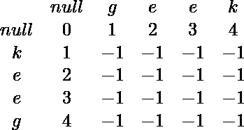

# 组成字符串回文的最小删除次数|第 2 集

> 原文:[https://www . geesforgeks . org/minimum-number-deletes-make-string-回文-set-2/](https://www.geeksforgeeks.org/minimum-number-deletions-make-string-palindrome-set-2/)

给定字符串 A，计算使结果字符串成为回文所需删除的最小字符数。
**例:**

```
Input : baca
Output : 1

Input : geek
Output : 2
```

我们已经在下面的帖子中讨论了一种方法。
[组成字符串回文的最小删除次数](https://www.geeksforgeeks.org/minimum-number-deletions-make-string-palindrome/)
下面的方法将使用修改后的[列文斯坦距离](https://www.geeksforgeeks.org/dynamic-programming-set-5-edit-distance/)。我们考虑修改的 Levensthein(仅考虑删除)原始字符串及其反向字符串。

## C++

```
// CPP program to find minimum deletions to make
// palindrome.
#include <bits/stdc++.h>
using namespace std;

int getLevenstein(string const& input)
{
    // Find reverse of input string
    string revInput(input.rbegin(), input.rend());

    // Create a DP table for storing edit distance
    // of string and reverse.
    int n = input.size();
    vector<vector<int> > dp(n + 1, vector<int>(n + 1, -1));
    for (int i = 0; i <= n; ++i) {
        dp[0][i] = i;
        dp[i][0] = i;
    }

    // Find edit distance between input and revInput
    // considering only delete operation.
    for (int i = 1; i <= n; ++i) {
        for (int j = 1; j <= n; ++j) {
            if (input[i - 1] == revInput[j - 1])
                dp[i][j] = dp[i - 1][j - 1];           
            else
                dp[i][j] = 1 + min({ dp[i - 1][j], dp[i][j - 1] });           
        }
    }

    /*Go from bottom left to top right and find the minimum*/
    int res = numeric_limits<int>::max();
    for (int i = n, j = 0; i >= 0; --i, ++j) {
        res = min(res, dp[i][j]);
        if (i < n)
            res = min(res, dp[i + 1][j]);       
        if (i > 0)
            res = min(res, dp[i - 1][j]);       
    }
    return res;
}

// Driver code
int main()
{
    string input("myfirstgeekarticle");
    cout << getLevenstein(input);
    return 0;
}
```

## Java 语言(一种计算机语言，尤用于创建网站)

```
// Java program to find minimum deletions to make
// palindrome.
import java.io.*;
import java.util.*;

class GFG
{

    static int getLevenstein(StringBuilder input)
    {
        StringBuilder revInput = new StringBuilder(input);

        // Find reverse of input string
        revInput = revInput.reverse();

        // Create a DP table for storing edit distance
        // of string and reverse.
        int n = input.length();
        int[][] dp = new int[n + 1][n + 1];
        for (int i = 0; i <= n; ++i)
        {
            dp[0][i] = i;
            dp[i][0] = i;
        }

        // Find edit distance between input and revInput
        // considering only delete operation.
        for (int i = 1; i <= n; ++i)
        {
            for (int j = 1; j <= n; ++j)
            {
                if (input.charAt(i - 1) == revInput.charAt(j - 1))
                    dp[i][j] = dp[i - 1][j - 1];
                else
                    dp[i][j] = 1 + Math.min(dp[i - 1][j], dp[i][j - 1]);
            }
        }

        /* Go from bottom left to top right and find the minimum */
        int res = Integer.MAX_VALUE;
        for (int i = n, j = 0; i >= 0; i--, j++)
        {
            res = Math.min(res, dp[i][j]);
            if (i < n)
                res = Math.min(res, dp[i + 1][j]);
            if (i > 0)
                res = Math.min(res, dp[i - 1][j]);
        }
        return res;
    }

    // Driver Code
    public static void main(String[] args)
    {
        StringBuilder input = new StringBuilder("myfirstgeekarticle");
        System.out.println(getLevenstein(input));
    }
}

// This code is contributed by
// sanjeev2552
```

## 蟒蛇 3

```
# Python3 program to find minimum deletions
# to make palindrome.
INT_MAX = 99999999999

def getLevenstein(inpt):

    # Find reverse of input string
    revInput = inpt[::-1]

    # Create a DP table for storing 
    # edit distance of string and reverse.
    n = len(inpt)
    dp = [[-1 for _ in range(n + 1)]
              for __ in range(n + 1)]
    for i in range(n + 1):
        dp[0][i] = i
        dp[i][0] = i

    # Find edit distance between
    # input and revInput considering
    # only delete operation.
    for i in range(1, n + 1):
        for j in range(1, n + 1):
            if inpt[i - 1] == revInput[j - 1]:
                dp[i][j] = dp[i - 1][j - 1]
            else:
                dp[i][j] = 1 + min(dp[i - 1][j],
                                   dp[i][j - 1])

    # Go from bottom left to top right
    # and find the minimum
    res = INT_MAX
    i, j = n, 0
    while i >= 0:
        res = min(res, dp[i][j])
        if i < n:
            res = min(res, dp[i + 1][j])
        if i > 0:
            res = min(res, dp[i - 1][j])
        i -= 1
        j += 1
    return res

# Driver Code
if __name__ == "__main__":
    inpt = "myfirstgeekarticle"
    print(getLevenstein(inpt))

# This code is contributed
# by vibhu4agarwal
```

## C#

```
// C# program to find minimum deletions to make
// palindrome.
using System;

class GFG
{
    static int getLevenstein(String input)
    {

        // Find reverse of input string
        String revInput = Reverse(input);

        // Create a DP table for storing edit distance
        // of string and reverse.
        int n = input.Length;
        int[,] dp = new int[n + 1, n + 1];
        for (int i = 0; i <= n; ++i)
        {
            dp[0, i] = i;
            dp[i, 0] = i;
        }

        // Find edit distance between input and revInput
        // considering only delete operation.
        for (int i = 1; i <= n; ++i)
        {
            for (int j = 1; j <= n; ++j)
            {
                if (input[i - 1] == revInput[j - 1])
                    dp[i, j] = dp[i - 1, j - 1];
                else
                    dp[i, j] = 1 + Math.Min(dp[i - 1, j],
                                            dp[i, j - 1]);
            }
        }

        /* Go from bottom left to top right
        and find the minimum */
        int res = int.MaxValue;
        for (int i = n, j = 0; i >= 0; i--, j++)
        {
            res = Math.Min(res, dp[i, j]);
            if (i < n)
                res = Math.Min(res, dp[i + 1, j]);
            if (i > 0)
                res = Math.Min(res, dp[i - 1, j]);
        }
        return res;
    }
    static String Reverse(String input)
    {
        char[] a = input.ToCharArray();
        int l, r = a.Length - 1;
        for (l = 0; l < r; l++, r--)
        {
            char temp = a[l];
            a[l] = a[r];
            a[r] = temp;
        }
        return String.Join("",a);
    }

    // Driver Code
    public static void Main(String[] args)
    {
        String input = "myfirstgeekarticle";
        Console.WriteLine(getLevenstein(input));
    }
}

// This code is contributed by 29AjayKumar
```

## java 描述语言

```
<script>
// Javascript program to find minimum deletions to make
// palindrome.
function getLevenstein(input)
{
    let revInput = (input).split("");

        // Find reverse of input string
        revInput = revInput.reverse();

        // Create a DP table for storing edit distance
        // of string and reverse.
        let n = input.length;
        let dp = new Array(n + 1);
        for(let i = 0; i < n + 1; i++)
        {
            dp[i] = new Array(n+1);
            for(let j = 0; j < n + 1; j++)
                dp[i][j] = 0;
        }
        for (let i = 0; i <= n; ++i)
        {
            dp[0][i] = i;
            dp[i][0] = i;
        }

        // Find edit distance between input and revInput
        // considering only delete operation.
        for (let i = 1; i <= n; ++i)
        {
            for (let j = 1; j <= n; ++j)
            {
                if (input[i - 1] == revInput[j - 1])
                    dp[i][j] = dp[i - 1][j - 1];
                else
                    dp[i][j] = 1 + Math.min(dp[i - 1][j], dp[i][j - 1]);
            }
        }

        /* Go from bottom left to top right and find the minimum */
        let res = Number.MAX_VALUE;
        for (let i = n, j = 0; i >= 0; i--, j++)
        {
            res = Math.min(res, dp[i][j]);
            if (i < n)
                res = Math.min(res, dp[i + 1][j]);
            if (i > 0)
                res = Math.min(res, dp[i - 1][j]);
        }
        return res;
}

// Driver Code
let input = ("myfirstgeekarticle");
document.write(getLevenstein(input));

// This code is contributed by rag2127
</script>
```

**输出:**

```
12
```

时间复杂度:O(  )
空间复杂度:O(  )
哪里是弦的长度
为什么起作用？
要理解它，我们需要从我们如何创建 dp[][]的最开始开始，例如对于单词“geek”，它最初看起来是这样的:

第一行和第一列都用数字 1 填充..4 由于这是创建空字符串所需的修改次数，即:
[0][1] == 1，要从字母“g”创建空字符串，请删除这一个字母
[0][2] == 2，要从字母“ge”创建空字符串，请删除这两个字母，等等。
第一列同样的故事:
[1][0] == 1，从字母‘k’创建空字符串删除这一个字母
[2][0] == 2，从字母“ke”创建空字符串，删除这两个字母，等等。
现在，我们使用动态编程的方法来获得最小的修改次数，以获得每隔一个子串成为第二个子串，并且在结尾 out dp[][]看起来是这样的:

所以例如从‘kee’获得子串‘gee’的最小修改次数是 2。到目前为止还不错，但是这个算法做了两件事，一是插入字符，二是删除字符，我们只对删除的数量感兴趣。因此，让我们再一次看一下我们的结果数组，例如在条目[4][1]中，该条目表示:
[4][1]–要从字符串“keeg”中生成字符串“g ”,我们需要执行 3 次修改(这只是**删除**字符“kee”)
[3][2]–要从“kee”中生成字符串“ge ”,我们还需要从第一个字符串“g”和第二个“ke”
中删除 3 次修改，因此基本上每次我们都会对角移动这里要注意的是，这就像在字符串上有两个指针，一个从开头移动，另一个从结尾移动。很重要的一点是字符串不一定要有偶数个字符，所以这也是我们在 dp[][]中也要检查上下值的原因。