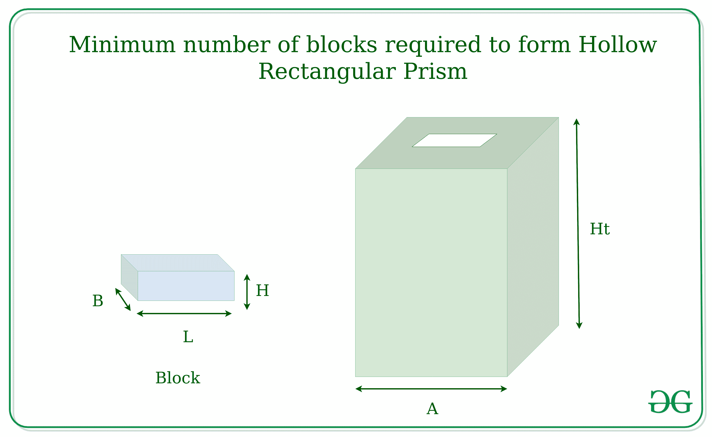

# 形成空心直角棱镜所需的最小块数

> 原文:[https://www . geesforgeks . org/最小块数-需要形成空心矩形棱柱/](https://www.geeksforgeeks.org/minimum-number-of-blocks-required-to-form-hollow-rectangular-prism/)

给定块体 **L、B** 和 **H** 的尺寸，任务是形成一个长度为 **A** 和高度为 **Ht** 的空心矩形棱柱体，使得需要的块体数量最少。
示例:

> **输入:** L = 40，B = 30，H = 10 & A = 500，Ht = 300
> **输出:** 500
> **输入:** L = 30，B = 20，H = 20，& A = 600，Ht =240
> **输出:** 960



**方法:**
计算每层所需的最小块数，可以通过设置块数来完成，通过找到直角棱镜 4 条边所需的块数来占据最大长度，然后选择可以作为块高度的块边。从宽度或高度中取较大者作为高度。
以下是上述办法的实施:

## C++

```
// C++ Implementation to find the minimum
// no of blocks required to form
// hollow rectangular prism
#include <bits/stdc++.h>
using namespace std;

// Function to display output
void disp(int row_no, int block)
{
    cout << row_no * block;
}

// Function to return minimum no of layers
// required to form the hollow prism
int row(int ht, int h)
{
    return ht / h;
}

// Function to calculate no of blocks
// required for each layer
void calculate(int l, int w, int h, int a, int ht)
{
    // No of blocks required for each row
    int no_block = (4 * a) / l;
    int row_no;

    // Check for no of layers is minimum
    if (h < w)
        row_no = row(ht, w);
    else
        row_no = row(ht, h);
    disp(row_no, no_block);
}

// Driver function
int main()
{
    // Length, width, height of each block
    int l = 50, w = 20, h = 35;

    // Side of one wall
    int a = 700;

    // height of each wall
    int ht = 140;

    calculate(l, w, h, a, ht);
    return 0;
}
```

## Java 语言(一种计算机语言，尤用于创建网站)

```
// Java Implementation to find the minimum
// no of blocks required to form
// hollow rectangular prism
import java.util.*;

class GFG{

// Function to display output
static void disp(int row_no, int block)
{
    System.out.print(row_no * block);
}

// Function to return minimum no of layers
// required to form the hollow prism
static int row(int ht, int h)
{
    return ht / h;
}

// Function to calculate no of blocks
// required for each layer
static void calculate(int l, int w, int h, int a, int ht)
{
    // No of blocks required for each row
    int no_block = (4 * a) / l;
    int row_no;

    // Check for no of layers is minimum
    if (h < w)
        row_no = row(ht, w);
    else
        row_no = row(ht, h);
    disp(row_no, no_block);
}

// Driver function
public static void main(String[] args)
{
    // Length, width, height of each block
    int l = 50, w = 20, h = 35;

    // Side of one wall
    int a = 700;

    // height of each wall
    int ht = 140;

    calculate(l, w, h, a, ht);
}
}

// This code is contributed by PrinciRaj1992
```

## 蟒蛇 3

```
# Python 3 Implementation to find the minimum
# no of blocks required to form
# hollow rectangular prism

# Function to display output
def disp(row_no,block):
    print(row_no * block)

# Function to return minimum no of layers
# required to form the hollow prism
def row(ht, h):
    return ht // h

# Function to calculate no of blocks
# required for each layer
def calculate(l, w, h, a, ht):

        # No of blocks required for each row
    no_block = (4 * a) // l

    # Check for no of layers is minimum
    if (h < w):
        row_no = row(ht, w)
    else:
        row_no = row(ht, h)
    disp(row_no, no_block)

# Driver function
if __name__ == '__main__':
    # Length, width, height of each block
    l = 50
    w = 20
    h = 35

    # Side of one wall
    a = 700

    # height of each wall
    ht = 140

    calculate(l, w, h, a, ht)

# This code is contributed by Surendra_Gangwar
```

## C#

```
// C# Implementation to find the minimum
// no of blocks required to form
// hollow rectangular prism
using System;

class GFG{

// Function to display output
static void disp(int row_no, int block)
{
    Console.Write(row_no * block);
}

// Function to return minimum no of layers
// required to form the hollow prism
static int row(int ht, int h)
{
    return ht / h;
}

// Function to calculate no of blocks
// required for each layer
static void calculate(int l, int w, int h,
                        int a, int ht)
{
    // No of blocks required for each row
    int no_block = (4 * a) / l;
    int row_no;

    // Check for no of layers is minimum
    if (h < w)
        row_no = row(ht, w);
    else
        row_no = row(ht, h);
    disp(row_no, no_block);
}

// Driver function
public static void Main(String[] args)
{
    // Length, width, height of each block
    int l = 50, w = 20, h = 35;

    // Side of one wall
    int a = 700;

    // height of each wall
    int ht = 140;

    calculate(l, w, h, a, ht);
}
}

// This code is contributed by PrinciRaj1992
```

## java 描述语言

```
<script>
// javascript Implementation to find the minimum
// no of blocks required to form
// hollow rectangular prism

// Function to display output
function disp( row_no,  block)
{
     document.write( row_no * block);
}

// Function to return minimum no of layers
// required to form the hollow prism
function row( ht,  h)
{
    return ht / h;
}

// Function to calculate no of blocks
// required for each layer
function calculate( l,  w,  h,  a,  ht)
{

    // No of blocks required for each row
    let no_block = (4 * a) / l;
    let row_no;

    // Check for no of layers is minimum
    if (h < w)
        row_no = row(ht, w);
    else
        row_no = row(ht, h);
    disp(row_no, no_block);
}

// Driver function

    // Length, width, height of each block
    let l = 50, w = 20, h = 35;

    // Side of one wall
    let a = 700;

    // height of each wall
    let ht = 140;
    calculate(l, w, h, a, ht);

// This code is contributed by Rajput-Ji

</script>
```

**Output:** 

```
224
```