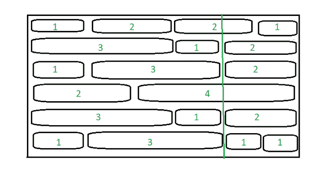

# 可以相交的最小砖块数量

> 原文:[https://www . geesforgeks . org/最小可相交砖块数/](https://www.geeksforgeeks.org/minimum-number-of-bricks-that-can-be-intersected/)

给定一个 [2D 数组](https://www.geeksforgeeks.org/multidimensional-arrays-c-cpp/)**arr【】【】**，表示一面墙上相同高度的砖块的宽度，任务是通过从墙的顶部到底部画一条直线来找到可以相交的砖块的最小数量。
***注:**一条线如果穿过一块砖，就说它与一块砖相交，如果它接触一块砖的边界，就说它不相交。*

**示例:**

> **输入:** arr[][] = {{1，2，2，1}，{3，1，2}，{1，3，2}，{2，4}，{3，1，2}，{1，3，1，1}
> 
> 
> 
> **输出:** 2
> **说明:**以 2D 阵左上角为原点，在 x 轴坐标 x = 4 处画线，使其与第 1、第 4 层的砖块交叉，得到交叉的砖块数量最少。
> 
> **输入:** arr[][] = {{1，1，1}}
> **输出:** 0
> **说明:**可以在 x 轴上 x = 1 或 x = 2 坐标处画线，使其不与任何砖块相交，从而使穿过的砖块数量最少。

**天真法:**最简单的方法是考虑可以在 **x** 轴上的每一个可能的坐标上，沿着墙的宽度画直线，考虑墙左上角的 x = 0。然后，计算每种情况下插入的砖块数量，并打印获得的最小数量。

***时间复杂度:** O(N * M)其中 **N** 为砖块总数 **M** 为墙体总宽度*
***辅助空间:** O(1)*

**方法:**对上述方法进行优化，思路是将 x 轴上以一定宽度结束的砖块数量存储在一个 [hashmap](https://www.geeksforgeeks.org/unordered_map-in-cpp-stl/) 中，然后找到砖块数量最多的那条线结束。得到这个数后，从墙的总高度减去它，得到穿过的最小砖块数。

按照以下步骤解决问题:

*   初始化一个 [hashmap](https://www.geeksforgeeks.org/unordered_map-in-cpp-stl/) 、 **M** 来存储 x 轴上某一宽度处结束的砖块数量。
*   使用变量 **i** 存储行索引，遍历数组、 **arr**
    *   初始化一个变量，**宽度**为 **0** 来存储结束位置。
    *   将当前行的大小存储在变量 **X** 中。
    *   [使用变量 **j** 在范围](https://www.geeksforgeeks.org/range-based-loop-c/)**【0，X-2】**中迭代
        *   将**宽度**的值增加 **arr[i][j]** ，将 **M** 中**宽度**的值增加 **1** 。
        *   此外，记录以某个宽度结束的砖块数量，并将其存储在变量 **res** 中。
*   从墙的总高度减去 **res** 的值，并将其存储在变量**和**中。
*   打印**和**的值作为结果。

下面是上述方法的实现:

## C++

```
// C++ program for the above approach
#include <bits/stdc++.h>
using namespace std;

// Function to find a line across a wall such
// that it intersects minimum number of bricks
void leastBricks(vector<vector<int> > wall)
{
    // Declare a hashmap
    unordered_map<int, int> map;

    // Store the maximum number of
    // brick ending a point on x-axis
    int res = 0;

    // Iterate over all the rows
    for (vector<int> list : wall) {

        // Initialize width as 0
        int width = 0;

        // Iterate over individual bricks
        for (int i = 0; i < list.size() - 1; i++) {

            // Add the width of the current
            // brick to the total width
            width += list[i];

            // Increment number of bricks
            // ending at this width position
            map[width]++;

            // Update the variable, res
            res = max(res, map[width]);
        }
    }

    // Print the answer
    cout << wall.size() - res;
}

// Driver Code
int main()
{
    // Given Input
    vector<vector<int> > arr{
        { 1, 2, 2, 1 }, { 3, 1, 2 },
        { 1, 3, 2 }, { 2, 4 },
        { 3, 1, 2 }, { 1, 3, 1, 1 }
    };

    // Function Call
    leastBricks(arr);

    return 0;
}
```

## Java 语言(一种计算机语言，尤用于创建网站)

```
// Java program for the above approach
import java.util.ArrayList;
import java.util.Arrays;
import java.util.HashMap;

public class GFG
{

    // Function to find a line across a wall such
    // that it intersects minimum number of bricks
    static void leastBricks(ArrayList<ArrayList<Integer> > wall)
    {

        // Declare a hashmap
        HashMap<Integer, Integer> map = new HashMap<>();

        // Store the maximum number of
        // brick ending a point on x-axis
        int res = 0;

        // Iterate over all the rows
        for (ArrayList<Integer> list : wall) {

            // Initialize width as 0
            int width = 0;

            // Iterate over individual bricks
            for (int i = 0; i < list.size() - 1; i++) {

                // Add the width of the current
                // brick to the total width
                width += list.get(i);

                // Increment number of bricks
                // ending at this width position
                map.put(width,
                        map.getOrDefault(width, 0) + 1);

                // Update the variable, res
                res = Math.max(res,
                               map.getOrDefault(width, 0));
            }
        }

        // Print the answer
        System.out.println(wall.size() - res);
    }

    // Driver code
    public static void main(String[] args)
    {
      // Given Input
        ArrayList<ArrayList<Integer> > arr
            = new ArrayList<>();
        arr.add(new ArrayList<>(Arrays.asList(1, 2, 2, 1)));
        arr.add(new ArrayList<>(Arrays.asList(3, 1, 2)));
        arr.add(new ArrayList<>(Arrays.asList(1, 3, 2)));
        arr.add(new ArrayList<>(Arrays.asList(2, 4)));
        arr.add(new ArrayList<>(Arrays.asList(3, 1, 2)));
        arr.add(new ArrayList<>(Arrays.asList(1, 3, 1, 1)));

        // Function Call
        leastBricks(arr);
    }
}

// This code is contributed by abhinavjain194
```

## 蟒蛇 3

```
# Python 3 program for the above approach
from collections import defaultdict

# Function to find a line across a wall such
# that it intersects minimum number of bricks
def leastBricks(wall):

    # Declare a hashmap
    map = defaultdict(int)

    # Store the maximum number of
    # brick ending a point on x-axis
    res = 0

    # Iterate over all the rows
    for list in wall:

        # Initialize width as 0
        width = 0

        # Iterate over individual bricks
        for i in range(len(list) - 1):

            # Add the width of the current
            # brick to the total width
            width += list[i]

            # Increment number of bricks
            # ending at this width position
            map[width] += 1

            # Update the variable, res
            res = max(res, map[width])

    # Print the answer
    print(len(wall) - res)

# Driver Code
if __name__ == "__main__":

    # Given Input
    arr = [
        [1, 2, 2, 1], [3, 1, 2],
        [1, 3, 2], [2, 4],
        [3, 1, 2], [1, 3, 1, 1]
    ]

    # Function Call
    leastBricks(arr)

    # This code is contributed by ukasp.
```

## C#

```
// C# program for the above approach
using System;
using System.Collections.Generic;

class GFG{

// Function to find a line across a wall such
// that it intersects minimum number of bricks
static void leastBricks(List<List<int>> wall)
{

    // Declare a hashmap
    Dictionary<int,
               int> map = new Dictionary<int,
                                         int>();

    // Store the maximum number of
    // brick ending a point on x-axis
    int res = 0;

    // Iterate over all the rows
    foreach (List<int> subList in wall)
    {

        // Initialize width as 0
        int width = 0;
        for(int i = 0; i < subList.Count - 1; i++)
        {

            // Add the width of the current
            // brick to the total width
            width += subList[i];

            // Increment number of bricks
            // ending at this width position
            if (map.ContainsKey(width))
                map[width]++;
            else
                map.Add(width, 1);

            // Update the variable, res
            res = Math.Max(res, map[width]);
        }
    }

    // Print the answer
    Console.Write(wall.Count-res);
}

// Driver Code
public static void Main()
{

    // Given Input
    List<List<int>> myList = new List<List<int>>();
    myList.Add(new List<int>{ 1, 2, 2, 1 });
    myList.Add(new List<int>{ 3, 1, 2 });
    myList.Add(new List<int>{ 1, 3, 2 });
    myList.Add(new List<int>{ 2, 4 });
    myList.Add(new List<int>{ 3, 1, 2 });
    myList.Add(new List<int>{ 1, 3, 1, 1 });

    // Function Call
    leastBricks(myList);
}
}

// This code is contributed by bgangwar59
```

## java 描述语言

```
<script>

// JavaScript program for the above approach

// Function to find a line across a wall such
// that it intersects minimum number of bricks
function leastBricks(wall) {
    // Declare a hashmap
    let map = new Map();

    // Store the maximum number of
    // brick ending a point on x-axis
    let res = 0;

    // Iterate over all the rows
    for (let list of wall) {

        // Initialize width as 0
        let width = 0;

        // Iterate over individual bricks
        for (let i = 0; i < list.length - 1; i++) {

            // Add the width of the current
            // brick to the total width
            width += list[i];

            // Increment number of bricks
            // ending at this width position
            if (map.has(width)) {
                map.set(width, map.get(width) + 1);
            } else {
                map.set(width, 1)
            }

            // Update the variable, res
            res = Math.max(res, map.get(width));
        }
    }

    // Print the answer
    document.write(wall.length - res);
}

// Driver Code

// Given Input
let arr = [
    [1, 2, 2, 1], [3, 1, 2],
    [1, 3, 2], [2, 4],
    [3, 1, 2], [1, 3, 1, 1]
];

// Function Call
leastBricks(arr);

</script>
```

**Output:** 

```
2
```

***时间复杂度:** O(N)其中 N 是墙上的砖块总数*
T5**辅助空间:** O(M)其中 M 是墙的总宽度