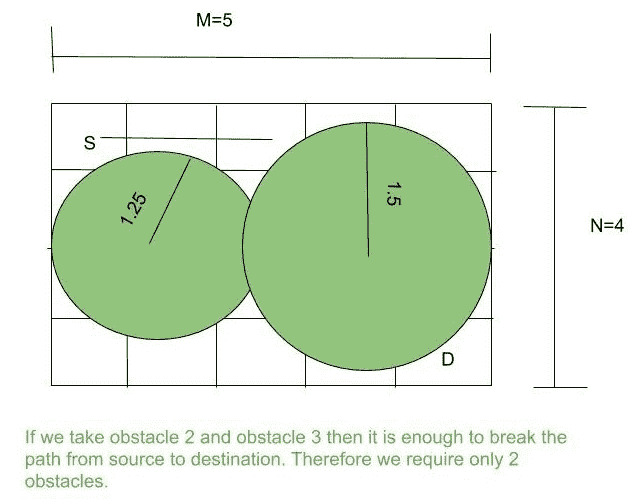

# 网格中阻碍路径所需的最小圆形障碍物数量

> 原文:[https://www . geeksforgeeks . org/最小圆形障碍物数量-阻碍网格路径所需数量/](https://www.geeksforgeeks.org/minimum-number-of-circular-obstacles-required-to-obstruct-the-path-in-a-grid/)

考虑一个尺寸为 **NxM** 的网格和一个由可用的圆形障碍物组成的阵列 **R** ，任务是找到阻碍源**【0，0】**和目的地**【N-1，M-1】**之间的路径所需的给定半径的最小数量的圆形障碍物。如果不可能，打印-1。
**注意:**圆形障碍物可以重叠，如例 1 中的图像所示。

**示例:**

> **输入:** N = 4，M = 5，R[] = {1.0，1.5，1.25 }
> T3】输出: 2
> 
> 
> 
> **输入:** N = 10，M = 12，R[] = {1.0，1.25}
> **输出:** -1

**进场:**

*   找出是按行还是按列放置障碍。
*   按递减顺序排列半径。
*   由于障碍物覆盖了半径为 R[i]的整个圆，因此，对于直线，它覆盖了直径。
*   使用数组 R[]中的较大值，将该值减少 **2 * Ri** 直到变为零。
*   使用完所有障碍物后，当 **val < = 0** 时，返回所使用障碍物的计数，如果 **val > 0** 使用完所有障碍物后，打印 **-1** 。

下面是上述方法的实现。

## 卡片打印处理机（Card Print Processor 的缩写）

```
// C++ program to find the minimum
// number of obstacles required

#include <bits/stdc++.h>
using namespace std;

// Function to find the minimum
// number of obstacles required
int solve(int n, int m, int obstacles,
          double range[])
{
    // Find the minimum range required
    // to put obstacles
    double val = min(n, m);

    // Sorting the radius
    sort(range, range + obstacles);

    int c = 1;
    for (int i = obstacles - 1; i >= 0; i--) {
        range[i] = 2 * range[i];
        val -= range[i];

        // If val is less than zero
        // then we have find the number of
        // obstacles required
        if (val <= 0) {
            return c;
        }
        else {
            c++;
        }
    }

    if (val > 0) {
        return -1;
    }
}

// Driver function
int main()
{
    int n = 4, m = 5, obstacles = 3;
    double range[] = { 1.0, 1.25, 1.15 };
    cout << solve(n, m, obstacles, range) << "\n";
    return 0;
}
```

## Java 语言(一种计算机语言，尤用于创建网站)

```
// Java program to find the minimum
// number of obstacles required
import java.util.*;

class GFG
{

// Function to find the minimum
// number of obstacles required
static int solve(int n, int m, int obstacles,
                double range[])
{
    // Find the minimum range required
    // to put obstacles
    double val = Math.min(n, m);

    // Sorting the radius
    Arrays.sort(range);

    int c = 1;
    for (int i = obstacles - 1; i >= 0; i--)
    {
        range[i] = 2 * range[i];
        val -= range[i];

        // If val is less than zero
        // then we have find the number of
        // obstacles required
        if (val <= 0)
        {
            return c;
        }
        else
        {
            c++;
        }
    }

    if (val > 0)
    {
        return -1;
    }
    return 0;
}

// Driver code
public static void main(String[] args)
{
    int n = 4, m = 5, obstacles = 3;
    double range[] = { 1.0, 1.25, 1.15 };
    System.out.print(solve(n, m, obstacles, range)+ "\n");
}
}

// This code is contributed by PrinciRaj1992
```

## C#

```
// C# program to find the minimum
// number of obstacles required
using System;

class GFG
{

    // Function to find the minimum
    // number of obstacles required
    static int solve(int n, int m, int obstacles,
                    double []range)
    {
        // Find the minimum range required
        // to put obstacles
        double val = Math.Min(n, m);

        // Sorting the radius
        Array.Sort(range);

        int c = 1;
        for (int i = obstacles - 1; i >= 0; i--)
        {
            range[i] = 2 * range[i];
            val -= range[i];

            // If val is less than zero
            // then we have find the number of
            // obstacles required
            if (val <= 0)
            {
                return c;
            }
            else
            {
                c++;
            }
        }

        if (val > 0)
        {
            return -1;
        }
        return 0;
    }

    // Driver code
    public static void Main()
    {
        int n = 4, m = 5, obstacles = 3;
        double []range = { 1.0, 1.25, 1.15 };
        Console.WriteLine(solve(n, m, obstacles, range));
    }
}

// This code is contributed by AnkitRai01
```

## 蟒蛇 3

```
# Python3 program to find the minimum
# number of obstacles required

# Function to find the minimum
# number of obstacles required
def solve(n, m, obstacles,rangee):

    # Find the minimum rangee required
    # to put obstacles
    val = min(n, m)

    # Sorting the radius
    rangee = sorted(rangee)
    c = 1
    for i in range(obstacles - 1, -1, -1):
        rangee[i] = 2 * rangee[i]
        val -= rangee[i]

        # If val is less than zero
        # then we have find the number of
        # obstacles required
        if (val <= 0):
            return c
        else:
            c += 1

    if (val > 0):
        return -1

# Driver code
n = 4
m = 5
obstacles = 3
rangee = [1.0, 1.25, 1.15]
print(solve(n, m, obstacles, rangee))

# This code is contributed by mohit kumar 29
```

## java 描述语言

```
<script>

// Javascript program to find the minimum
// number of obstacles required
// Function to find the minimum
// number of obstacles required
function solve(n, m, obstacles, range)
{
    // Find the minimum range required
    // to put obstacles
    var val = Math.min(n, m);

    // Sorting the radius
    range.sort((a,b)=>a-b)

    var c = 1;
    for (var i = obstacles - 1; i >= 0; i--) {
        range[i] = 2 * range[i];
        val -= range[i];

        // If val is less than zero
        // then we have find the number of
        // obstacles required
        if (val <= 0) {
            return c;
        }
        else {
            c++;
        }
    }

    if (val > 0) {
        return -1;
    }
}

// Driver function
var n = 4, m = 5, obstacles = 3;
var range = [1.0, 1.25, 1.15];
document.write( solve(n, m, obstacles, range) + "<br>");

</script>
```

**Output:** 

```
2
```