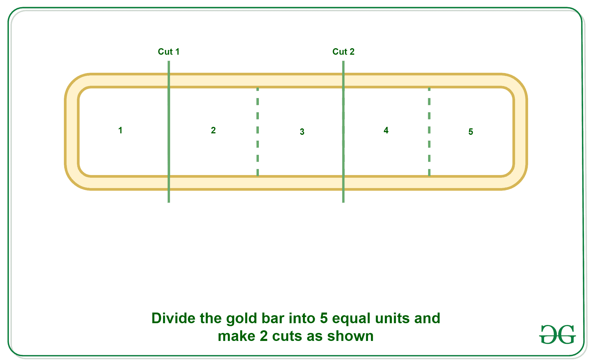

# 从 N 长金条

中支付工资所需的最低削减次数

> 原文:[https://www . geeksforgeeks . org/最低要求减薪次数-从 n-length-gold-bar/](https://www.geeksforgeeks.org/minimum-number-of-cuts-required-to-pay-salary-from-n-length-gold-bar/)

给定一根长度为 **N** 且带有 **N** 相同标记的金条，任务是找到在 **N 天**内支付工资所需的最小切割次数，以便在任何**I<sup>th</sup>T9】日，工人都拥有金条的 **i** 部分。
**示例:**** 

> **输入:** N = 5
> **输出:** 2
> **说明:**
> 将 5 根长度的金条通过 2 次切割分成长度为 1、2、2 的 3 部分。那么每天的工资如下:
> 第 1 天= 1(给 1 根长杆)
> 第 2 天= 2–1 = 1(给 2 根长杆，收回 1 根长杆)
> 第 3 天= 1(给 1 根长杆)
> 第 4 天= 2–1 = 1(给 2 根长杆，收回 1 根长杆)
> 第 5 天= 1(给 1 根长杆)
> 
> 
> 
> **输入:** N = 15
> **输出:** 3
> **说明:**
> 将 15 根长度的金条通过 3 次切割分成长度为 1、2、4、8 的 4 个部分。那么每天的工资如下:
> 第 1 天= 1(给出 1 根长杆)
> 第 2 天= 2–1 = 1(给出 2 根长杆，收回 1 根长杆)
> 第 3 天= 1(给出 1 根长杆)
> 第 4 天= 4–2–1 = 1(给出 4 根长杆，收回 1 根和 2 根长杆)
> 第 5 天= 1(给出 1 根长杆)
> 第 6 天= 2–1 = 1(给出 2 根长杆，收回 1 根长杆)
> 第 7 天= 1(给出 1 根长杆)
> 第 8 天= 8–4–2–1 = 1(给出 8 根长杆，收回 1 根， 2 和 4 长杆)
> 第 9 天= 1(给出 1 长杆)
> 第 10 天= 2–1 = 1(给出 2 长杆并收回 1 长杆)
> 第 11 天= 1(给出 1 长杆)
> 第 12 天= 4–2–1 = 1(给出 4 长杆并收回 1 和 2 长杆)
> 第 13 天= 1(给出 1 长杆)
> 第 14 天= 2–1 = 1(给出 2 根长杆，收回 1 根长杆)
> 第 15 天= 1(给出 1 根长杆)

**方法:**
众所周知，任何数字都可以借助于[数字以 2 的幂](https://www.geeksforgeeks.org/powers-2-required-sum/)来表示。所以如果我们把金条的长度切成最接近对数的整数 <sub>2</sub> (N)，那么我们可以表示 N 以内的任意数
**例如:**当 N = 15 时，我们可以把这个数分成 1、2、4、8 几部分，用这些数我们可以表示 1 到 15 之间的任意数，如下图:

```
For 1 - 1
For 2 - 2
For 3 - 2 + 1
For 4 - 4
For 5 - 4 + 1
For 6 - 4 + 2
For 7 - 4 + 2 + 1
For 8 - 8
For 9 - 8 + 1
For 10 - 8 + 2
For 11 - 8 + 2 + 1
For 12 - 8 + 4
For 13 - 8 + 4 + 1
For 14 - 8 + 4 + 2
For 15 - 8 + 4 + 2 + 1
```

下面是上述方法的实现。

## C++

```
// CPP Implementation to find
// the minimum number of cuts to
// pay the worker.
#include <bits/stdc++.h>

using namespace std;

// Function to find the minimum
// number of cuts to pay the worker.
int pay(int n)
{

    // Nearest Integer to the Log
    // value of the number N
    int cuts = int(log(n)/log(2));

    return cuts;
}

// Driver code
int main()
{
    int n = 5;
    int cuts = pay(n);
    cout << cuts << endl;

    // Cuts Required in the
    // Length of 15
    n = 15;
    cuts = pay(n);
    cout<<(cuts);

    return 0;
}

// This code is contributed by mohit kumar 29
```

## Java 语言(一种计算机语言，尤用于创建网站)

```
// JAVA Implementation to find
// the minimum number of cuts to
// pay the worker.
class GFG
{

// Function to find the minimum
// number of cuts to pay the worker.
static int pay(int n)
{

    // Nearest Integer to the Log
    // value of the number N
    int cuts = (int) (Math.log(n)/Math.log(2));

    return cuts;
}

// Driver code
public static void main(String[] args)
{
    int n = 5;
    int cuts = pay(n);
    System.out.print(cuts +"\n");

    // Cuts Required in the
    // Length of 15
    n = 15;
    cuts = pay(n);
    System.out.print(cuts);
}
}

// This code is contributed by 29AjayKumar
```

## 计算机编程语言

```
# Python Implementation to find
# the minimum number of cuts to
# pay the worker.

import math

# Function to find the minimum
# number of cuts to pay the worker.
def pay(n):

    # Nearest Integer to the Log
    # value of the number N
    cuts = int(math.log(n, 2))

    return cuts

# Driver Code
if __name__ == "__main__":
    n = 5
    cuts = pay(n)
    print(cuts)

    # Cuts Required in the
    # Length of 15
    n = 15
    cuts = pay(n)
    print(cuts)
```

## C#

```
// C# Implementation to find
// the minimum number of cuts to
// pay the worker.
using System;

class GFG
{

// Function to find the minimum
// number of cuts to pay the worker.
static int pay(int n)
{

    // Nearest int to the Log
    // value of the number N
    int cuts = (int) (Math.Log(n)/Math.Log(2));

    return cuts;
}

// Driver code
public static void Main(String[] args)
{
    int n = 5;
    int cuts = pay(n);
    Console.Write(cuts +"\n");

    // Cuts Required in the
    // Length of 15
    n = 15;
    cuts = pay(n);
    Console.Write(cuts);
}
}

// This code is contributed by 29AjayKumar
```

## java 描述语言

```
<script>

// JavaScript Implementation to find
// the minimum number of cuts to
// pay the worker.

// Function to find the minimum
// number of cuts to pay the worker.
function pay(n)
{

    // Nearest Integer to the Log
    // value of the number N
    let cuts = parseInt(Math.log(n)/Math.log(2));

    return cuts;
}

// Driver code
    let n = 5;
    let cuts = pay(n);
    document.write(cuts + "<br>");

    // Cuts Required in the
    // Length of 15
    n = 15;
    cuts = pay(n);
    document.write(cuts + "<br>");

</script>
```

**Output:** 

```
2
3
```