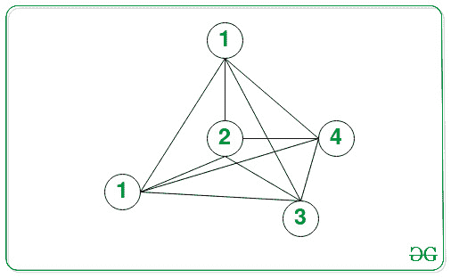

# 安排所有考试所需的最短天数

> 原文:[https://www . geeksforgeeks . org/要求安排所有考试的最短天数/](https://www.geeksforgeeks.org/minimum-number-of-days-required-to-schedule-all-exams/)

给定由 **N** 节点组成的[图](https://www.geeksforgeeks.org/graph-data-structure-and-algorithms/)，其中每个节点代表一个考试和一个 [2D 数组](https://www.geeksforgeeks.org/multidimensional-arrays-c-cpp/) **边【】【2】**使得每对考试**(边[i][0]，边[i][1])** 表示它们之间的边，任务是找到调度所有考试所需的最小天数，使得没有通过边连接的两个考试被调度在同一天。

**示例:**

> **输入:** N = 5，E = 10，边[][] = {{0，1}，{0，2}，{0，3}，{0，4}，{1，2}，{1，3}，{1，4}，{2，3}，{2，4}，{3，4}}
> **输出:** 5
> **解释:**
> 
> 
> 
> 在上图中，所有节点(代表考试)通过有向路径相互连接。因此，完成考试所需的最少天数为 5 天。
> 
> **输入:** N = 7，E = 12，边[][] = [{0，1}，{0，3}，{0，4}，{0，6}，{1，2}，{1，4}，{1，6}，{2，5}，{2，6}，{3，4}，{3，5}，{4，5}]
> **输出:** 3

**方法:**利用[图着色](https://www.geeksforgeeks.org/graph-coloring-applications/)的概念可以解决给定的问题。虽然，问题是 NP 完全的，一个很好的近似如下。

*   [根据图](https://www.geeksforgeeks.org/c-program-to-implement-adjacency-matrix-of-a-given-graph/)的给定边[][]创建邻接矩阵。
*   初始化一个成对的[向量](https://www.geeksforgeeks.org/sorting-vector-of-pairs-in-c-set-1-sort-by-first-and-second/)，比如说**vddegree[]**，存储每个节点与节点的度。
*   [计算每个顶点的度数](https://www.geeksforgeeks.org/find-degree-particular-vertex-graph/)并存储在[数组](https://www.geeksforgeeks.org/introduction-to-arrays/)**vddegree【】**中。
*   按照[的度数降序](https://www.geeksforgeeks.org/program-sort-string-descending-order/)排列**vddegree【】**中的所有顶点。
*   初始化两个数组，比如**color【】**和**colored【】**来存储用于给顶点着色的颜色以及顶点是否着色。
*   初始化两个变量，比如说 **numvc** 和 **K** 作为 **0** ，记录着色的顶点数和分配给每个节点的颜色数。
*   [使用变量 **i** 迭代范围](https://www.geeksforgeeks.org/range-based-loop-c/)**【0，V】**，并执行以下步骤:
    *   如果 **numvc** 的值与 **V** 的值相同，那么[会跳出循环](https://www.geeksforgeeks.org/break-statement-cc/)，因为所有顶点都是彩色的。
    *   如果当前顶点是彩色的，则[继续迭代](https://www.geeksforgeeks.org/continue-statement-cpp/)。
    *   如果顶点没有着色，那么用颜色 **K** 为顶点着色为**着色的【vddegree[I]】=颜色【K】**，并增加 **numvc** 的值。
    *   [迭代范围](https://www.geeksforgeeks.org/range-based-loop-c/)**【0，V】**，如果当前顶点没有着色且不与节点 **i** 相邻，则用颜色 **K** 给当前节点着色，并增加 **numvc** 的值。
    *   将 **K** 的值增加 **1** 。
*   [按递增顺序排列彩色[]的数组](https://www.geeksforgeeks.org/sort-array-according-order-defined-another-array/)。
*   完成上述步骤后，打印数组 **中存在的唯一元素的[数量的值，该值被着色为【】](https://www.geeksforgeeks.org/print-distinct-elements-given-integer-array/)**的最小天数。

下面是上述方法的实现:

## C++14

```
// C++ program for the above approach

#include <bits/stdc++.h>
using namespace std;

// Comparator function to sort the
// vector of pairs in decreasing order
bool compare(pair<int, int> a,
             pair<int, int> b)
{
    // If the first values are the same
    if (a.first == b.first) {
        return (a.second < b.second);
    }

    // Otherwise
    else {
        return (a.first > b.first);
    }
}

// Function to add an undirected
// edge between any pair of nodes
void addEdge(vector<vector<int> >& adj,
             int u, int v)
{
    adj[u][v] = 1;
    adj[v][u] = 1;
}

// Function to find the minimum number
// of days to schedule all the exams
int minimumDays(int V, int Edges[][2],
                int E)
{
    // Stores the adjacency list of
    // the given graph
    vector<vector<int> > adj(
        V, vector<int>(V, 0));

    // Iterate over the edges
    for (int i = 0; i < E; i++) {

        int u = Edges[i][0];
        int v = Edges[i][1];

        // Add the edges between the
        // nodes u and v
        addEdge(adj, u, v);
    }

    // Initialize a vector of pair that
    // stores { degree, vertex }
    vector<pair<int, int> > vdegree(V);

    for (int i = 0; i < V; i++) {

        // Degree of the node
        int degree = 0;
        vdegree[i].second = i;

        for (int j = 0; j < V; j++) {
            if (adj[i][j] != 0) {

                // Increment the degree
                degree++;
            }
        }

        // Update the degree of the
        // current node
        vdegree[i].first = degree;
    }

    // Sort to arrange all vertices
    // in descending order of degree
    sort(vdegree.begin(),
         vdegree.end(), compare);

    // Stores the vertices according
    // to degree in descending order
    int vorder[V];

    for (int i = 0; i < V; i++) {
        vorder[i] = vdegree[i].second;
    }

    // Stores the color of the all
    // the nodes
    int color[V];

    for (int i = 0; i < V; i++) {
        color[i] = i + 1;
    }

    int colored[V];

    // Initialize all vertices with
    // an invalid color 0
    memset(colored, 0, sizeof(colored));

    // Keeps the track of number of
    // vertices colored
    int numvc = 0;

    // Track the different color
    // assigned
    int k = 0;

    for (int i = 0; i < V; i++) {

        // If all vertices are colored
        // then exit from the for loop
        if (numvc == V) {
            break;
        }

        // If vertex is already
        // colored, then continue
        if (colored[vorder[i]] != 0) {
            continue;
        }

        // If vertex not colored
        else {

            colored[vorder[i]] = color[k];

            // After coloring increase
            // the count of colored
            // vertex by 1
            numvc++;

            for (int j = 0; j < V; j++) {

                // If the current node
                // and its adjacent are
                // not colored
                if (colored[j] == 0
                    && adj[vorder[i]][j] == 0) {

                    colored[j] = color[k];

                    // Increment the count
                    numvc++;
                }
            }

            // Increment k
            k++;
        }
    }

    // Sort the array
    sort(colored, colored + V);

    // Count of unique colors
    int unique_color = 1;

    // Count the number of unique
    // colors
    for (int i = 1; i < V; i++) {

        if (colored[i]
            != colored[i - 1]) {
            unique_color++;
        }
    }

    // Return the number of days
    // to sechedule an exam
    return unique_color;
}

// Driver Code
int main()
{
    int V = 7, E = 12;
    int Edges[][2]
        = { { 0, 1 }, { 0, 3 }, { 0, 4 }, { 0, 6 }, { 1, 2 }, { 1, 4 }, { 1, 6 }, { 2, 5 }, { 2, 6 }, { 3, 4 }, { 3, 5 }, { 4, 5 } };
    cout << minimumDays(V, Edges, E);

    return 0;
}
```

## 蟒蛇 3

```
# Python 3 program for the above approach

# Comparator function to sort the
# vector of pairs in decreasing order

# Function to add an undirected
# edge between any pair of nodes
def addEdge(adj, u, v):
    adj[u][v] = 1
    adj[v][u] = 1

# Function to find the minimum number
# of days to schedule all the exams
def minimumDays(V, Edges, E):
    # Stores the adjacency list of
    # the given graph
    adj = [[0 for i in range(V)] for j in range(V)]

    # Iterate over the edges
    for i in range(E):
        u = Edges[i][0]
        v = Edges[i][1]

        # Add the edges between the
        # nodes u and v
        addEdge(adj, u, v)

    # Initialize a vector of pair that
    # stores [degree, vertex }
    vdegree = [[0,0] for i in range(V)]

    for i in range(V):
        # Degree of the node
        degree = 0
        vdegree[i][1] = i

        for j in range(V):
            if (adj[i][j] != 0):
                # Increment the degree
                degree += 1

        # Update the degree of the
        # current node
        vdegree[i][0] = degree

    # Sort to arrange all vertices
    # in descending order of degree
    vdegree.sort(reverse=True)

    # Stores the vertices according
    # to degree in descending order
    vorder = [0 for i in range(V)]

    for i in range(V):
        vorder[i] = vdegree[i][1]

    # Stores the color of the all
    # the nodes
    color = [0 for i in range(V)]

    for i in range(V):
        color[i] = i + 1

    colored = [0 for i in range(V)]

    # Keeps the track of number of
    # vertices colored
    numvc = 0

    # Track the different color
    # assigned
    k = 0

    for i in range(V):
        # If all vertices are colored
        # then exit from the for loop
        if (numvc == V):
            break

        # If vertex is already
        # colored, then continue
        if (colored[vorder[i]] != 0):
            continue

        # If vertex not colored
        else:
            colored[vorder[i]] = color[k]

            # After coloring increase
            # the count of colored
            # vertex by 1
            numvc += 1

            for j in range(V):
                # If the current node
                # and its adjacent are
                # not colored
                if (colored[j] == 0 and adj[vorder[i]][j] == 0):
                    colored[j] = color[k]

                    # Increment the count
                    numvc += 1

            # Increment k
            k += 1

    # Sort the array
    colored.sort()

    # Count of unique colors
    unique_color = 1

    # Count the number of unique
    # colors
    for i in range(1,V,1):
        if (colored[i] != colored[i - 1]):
            unique_color += 1

    # Return the number of days
    # to sechedule an exam
    return unique_color

# Driver Code
if __name__ == '__main__':
    V = 7
    E = 12
    Edges = [[0, 1 ], [0, 3 ], [0, 4 ], [0, 6 ], [1, 2 ], [1, 4 ], [1, 6 ], [2, 5 ], [2, 6 ], [3, 4 ], [3, 5 ], [4, 5 ] ]
    print(minimumDays(V, Edges, E))

    # This code is contributed by ipg2016107.
```

**Output:** 

```
3
```

***时间复杂度:**O(N<sup>2</sup>)*
***辅助空间:** O(N)*