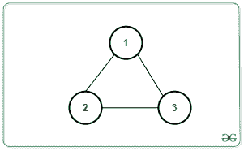
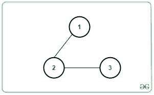

# 需要从无向图中移除的最小边数，以使其成为非循环图

> 原文:[https://www . geeksforgeeks . org/从无向图中移除所需的最小边数以使其非循环/](https://www.geeksforgeeks.org/minimum-number-of-edges-required-to-be-removed-from-an-undirected-graph-to-make-it-acyclic/)

给定一个由 **N** 个节点组成的无向图，这些节点包含来自矩阵**条边【】中的范围**【1，N】**和 **M** 条边的值，任务是确定需要移除的最小边数，以使生成的[图不包含任何循环](https://www.geeksforgeeks.org/detect-cycle-undirected-graph/)。**

**示例:**

> **输入:** N = 3，M = 3，边[][] = [[1，2]，[2，3]，[3，1]]
> 
> [](https://media.geeksforgeeks.org/wp-content/uploads/20200901131728/tree.png)
> 
> **输出:** 1
> **说明:**
> 去掉任意一条边会使图无环。因此，至少需要移除一条边。
> 
> **输入:** N = 3，M = 2，边[][] = [[1，2]，[2，3]]
> 
> [](https://media.geeksforgeeks.org/wp-content/uploads/20200901131803/tree1.png)
> 
> **输出:** 0
> **说明:**图形已经是无环的了。因此，不需要去除边缘。

**天真方法:**最简单的方法是尝试从给定的图中逐个删除所有可能的边序列组合，对于每个组合，计算使图无环所需的删除次数。最后，在这些组合中，选择删除最少边数的一个，得到一个[非循环图](https://en.wikipedia.org/wiki/Tree_(graph_theory)#Forest)。
***时间复杂度:** O(M！)*
***辅助空间:** O(N + M)*

**高效方法:**上述方法可以基于以下观察进行优化:

1.  当一个图形是一棵 [**树**](https://www.geeksforgeeks.org/binary-tree-data-structure/) 或一片[树木森林](https://www.geeksforgeeks.org/count-number-trees-forest/)(断开的树木组)时，它是非循环的。
2.  具有 **C** 节点的树将具有(**C–1**)条边。
3.  如果从 **C <sub>1</sub> 到C <sub>K</sub>** 之间有 **K** 连接的组件，则需要移除的最小边数等于:

> **M–(C<sub>1</sub>–1)–(C<sub>2</sub>–1)……(C<sub>K</sub>-1)**
> T9】=>M–(C<sub>1</sub>+……+C<sub>K</sub>)+K
> T16】=>M–N+K

按照以下步骤解决问题:

1.  使用[离散傅立叶变换](https://www.geeksforgeeks.org/depth-first-traversal-for-a-graph/)从给定的图表中找到连接组件的[数量](https://www.geeksforgeeks.org/connected-components-in-an-undirected-graph/)。
2.  考虑连接组件的**计数为 **K** ，然后打印**M–N+K**作为需要移除的最小边数，以使生成的图形无环。**

下面是上述方法的实现:

## C++

```
// C++ Program to implement
// the above approach

#include <bits/stdc++.h>
using namespace std;

// Stores the adjacency list
vector<int> vec[100001];

// Stores if a vertex is
// visited or not
bool vis[100001];
int cc = 1;

// Function to perform DFS Traversal
// to count the number and size of
// all connected components
void dfs(int node)
{
    // Mark the current node as visited
    vis[node] = true;

    // Traverse the adjacency list
    // of the current node
    for (auto x : vec[node]) {

        // For every unvisited node
        if (!vis[x]) {
            cc++;

            // Recursive DFS Call
            dfs(x);
        }
    }
}

// Function to add undirected
// edge in the graph
void addEdge(int u, int v)
{
    vec[u].push_back(v);
    vec[v].push_back(u);
}

// Function to calculate minimum
// number of edges to be removed
void minEdgeRemoved(int N, int M,
                    int Edges[][2])
{

    // Create Adjacency list
    for (int i = 0; i < M; i++) {
        addEdge(Edges[i][0],
                Edges[i][1]);
    }

    memset(vis, false, sizeof(vis));
    int k = 0;

    // Iterate over all the nodes
    for (int i = 1; i <= N; i++) {
        if (!vis[i]) {
            cc = 1;
            dfs(i);
            k++;
        }
    }

    // Print the final count
    cout << M - N + k << endl;
}

// Driver Code
int main()
{
    int N = 3, M = 2;

    int Edges[][2] = { { 1, 2 }, { 2, 3 } };

    minEdgeRemoved(N, M, Edges);
}
```

## Java 语言(一种计算机语言，尤用于创建网站)

```
// Java program to implement
// the above approach
import java.util.*;

class GFG{

// Stores the adjacency list
@SuppressWarnings("unchecked")
static Vector<Integer> []vec = new Vector[100001];

// Stores if a vertex is
// visited or not
static boolean []vis = new boolean[100001];
static int cc = 1;

// Function to perform DFS Traversal
// to count the number and size of
// all connected components
static void dfs(int node)
{

    // Mark the current node as visited
    vis[node] = true;

    // Traverse the adjacency list
    // of the current node
    for(int x : vec[node])
    {

        // For every unvisited node
        if (!vis[x])
        {
            cc++;

            // Recursive DFS call
            dfs(x);
        }
    }
}

// Function to add undirected
// edge in the graph
static void addEdge(int u, int v)
{
    vec[u].add(v);
    vec[v].add(u);
}

// Function to calculate minimum
// number of edges to be removed
static void minEdgeRemoved(int N, int M,
                           int Edges[][])
{

    // Create Adjacency list
    for(int i = 0; i < M; i++)
    {
        addEdge(Edges[i][0],
                Edges[i][1]);
    }

    int k = 0;

    // Iterate over all the nodes
    for(int i = 1; i <= N; i++)
    {
        if (!vis[i])
        {
            cc = 1;
            dfs(i);
            k++;
        }
    }

    // Print the final count
    System.out.print(M - N + k + "\n");
}

// Driver Code
public static void main(String[] args)
{
    int N = 3, M = 2;

    int Edges[][] = { { 1, 2 }, { 2, 3 } };

    for(int i = 0; i < vec.length; i++)
        vec[i] = new Vector<Integer>();

    minEdgeRemoved(N, M, Edges);
}
}

// This code is contributed by 29AjayKumar
```

## 蟒蛇 3

```
# Python3 program to implement
# the above approach

# Stores the adjacency list
vec = [[] for i in range(100001)]

# Stores if a vertex is
# visited or not
vis = [False] * 100001
cc = 1

# Function to perform DFS Traversal
# to count the number and size of
# all connected components
def dfs(node):

    global cc

    # Mark the current node as visited
    vis[node] = True

    # Traverse the adjacency list
    # of the current node
    for x in vec[node]:

        # For every unvisited node
        if (vis[x] == 0):
            cc += 1

            # Recursive DFS Call
            dfs(x)

# Function to add undirected
# edge in the graph
def addEdge(u, v):

    vec[u].append(v)
    vec[v].append(u)

# Function to calculate minimum
# number of edges to be removed
def minEdgeRemoved(N, M, Edges):

    global cc

    # Create Adjacency list
    for i in range(M):
        addEdge(Edges[i][0], Edges[i][1])

    # memset(vis, false, sizeof(vis))
    k = 0

    # Iterate over all the nodes
    for i in range(1, N + 1):
        if (not vis[i]):
            cc = 1
            dfs(i)
            k += 1

    # Print the final count
    print(M - N + k)

# Driver Code
if __name__ == '__main__':

    N = 3
    M = 2

    Edges = [ [ 1, 2 ], [ 2, 3 ] ]

    minEdgeRemoved(N, M, Edges)

# This code is contributed by mohit kumar 29
```

## C#

```
// C# program to implement
// the above approach
using System;
using System.Collections.Generic;

class GFG{

// Stores the adjacency list
static List<int> []vec = new List<int>[100001];

// Stores if a vertex is
// visited or not
static bool []vis = new bool[100001];
static int cc = 1;

// Function to perform DFS Traversal
// to count the number and size of
// all connected components
static void dfs(int node)
{

    // Mark the current node as visited
    vis[node] = true;

    // Traverse the adjacency list
    // of the current node
    foreach(int x in vec[node])
    {

        // For every unvisited node
        if (!vis[x])
        {
            cc++;

            // Recursive DFS call
            dfs(x);
        }
    }
}

// Function to add undirected
// edge in the graph
static void addEdge(int u, int v)
{
    vec[u].Add(v);
    vec[v].Add(u);
}

// Function to calculate minimum
// number of edges to be removed
static void minEdgeRemoved(int N, int M,
                           int [,]Edges)
{

    // Create Adjacency list
    for(int i = 0; i < M; i++)
    {
        addEdge(Edges[i, 0],
                Edges[i, 1]);
    }

    int k = 0;

    // Iterate over all the nodes
    for(int i = 1; i <= N; i++)
    {
        if (!vis[i])
        {
            cc = 1;
            dfs(i);
            k++;
        }
    }

    // Print the readonly count
    Console.Write(M - N + k + "\n");
}

// Driver Code
public static void Main(String[] args)
{
    int N = 3, M = 2;

    int [,]Edges = { { 1, 2 }, { 2, 3 } };

    for(int i = 0; i < vec.Length; i++)
        vec[i] = new List<int>();

    minEdgeRemoved(N, M, Edges);
}
}

// This code is contributed by 29AjayKumar
```

## java 描述语言

```
<script>

    // JavaScript implementation of the above approach

    // Stores the adjacency list
    let vec = new Array(100001);

    // Stores if a vertex is
    // visited or not
    let vis = new Array(100001);
    vis.fill(false);
    let cc = 1;

    // Function to perform DFS Traversal
    // to count the number and size of
    // all connected components
    function dfs(node)
    {

        // Mark the current node as visited
        vis[node] = true;

        // Traverse the adjacency list
        // of the current node
        for(let x = 0; x < vec[node].length; x++)
        {

            // For every unvisited node
            if (!vis[vec[node][x]])
            {
                cc++;

                // Recursive DFS call
                dfs(vec[node][x]);
            }
        }
    }

    // Function to add undirected
    // edge in the graph
    function addEdge(u, v)
    {
        vec[u].push(v);
        vec[v].push(u);
    }

    // Function to calculate minimum
    // number of edges to be removed
    function minEdgeRemoved(N, M, Edges)
    {

        // Create Adjacency list
        for(let i = 0; i < M; i++)
        {
            addEdge(Edges[i][0], Edges[i][1]);
        }

        let k = 0;

        // Iterate over all the nodes
        for(let i = 1; i <= N; i++)
        {
            if (!vis[i])
            {
                cc = 1;
                dfs(i);
                k++;
            }
        }

        // Print the readonly count
        document.write((M - N + k) + "</br>");
    }

    let N = 3, M = 2;

    let Edges = [ [ 1, 2 ], [ 2, 3 ] ];

    for(let i = 0; i < vec.length; i++)
        vec[i] = [];

    minEdgeRemoved(N, M, Edges);

</script>
```

**Output:** 

```
0
```

***时间复杂度:** O(N + M)*
***辅助空间:** O(N + M)*