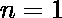
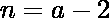
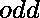

# 使异或最大化需要移除的元素的最小数量

> 原文:[https://www . geeksforgeeks . org/最小待移除元素数最大异或/](https://www.geeksforgeeks.org/minimum-number-of-elements-to-be-removed-to-make-xor-maximum/)

给定一个数字，其中。任务是在到之间找到要删除的元素的最小数量，使得从剩余元素获得的异或最大。
**例** :

```
Input: N = 5
Output: 2

Input: 1000000000000000
Output: 1
```

**方法:**考虑以下情况:

> **情况 1:** 当或时，则回答为 **0** 。不需要移除任何元素。
> **情况 2:** 现在我们要找一个是 **2** 的幂，大于等于的数。
> 这个号码就叫吧。
> 所以，如果或者那么我们就去掉。因此答案是 **1** 。
> 否则如果，那么答案是 **0** 。不需要移除任何元素。
> **案例三:**否则，如果为，那么答案为 **1** 。
> 否则如果是，那么答案就是 **2** 。

以下是上述方法的实现:

## C++

```
// C++ implementation to find minimum number of
// elements to remove to get maximum XOR value
#include <bits/stdc++.h>
using namespace std;

unsigned int nextPowerOf2(unsigned int n)
{
    unsigned count = 0;

    // First n in the below condition
    // is for the case where n is 0
    if (n && !(n & (n - 1)))
        return n;

    while (n != 0) {
        n >>= 1;
        count += 1;
    }

    return 1 << count;
}

// Function to find minimum number of
// elements to be removed.
int removeElement(unsigned int n)
{

    if (n == 1 || n == 2)
        return 0;

    unsigned int a = nextPowerOf2(n);

    if (n == a || n == a - 1)
        return 1;

    else if (n == a - 2)
        return 0;

    else if (n % 2 == 0)
        return 1;

    else
        return 2;
}

// Driver code
int main()
{
    unsigned int n = 5;

    // print minimum number of elements
    // to be removed
    cout << removeElement(n);

    return 0;
}
```

## Java 语言(一种计算机语言，尤用于创建网站)

```
//Java implementation to find minimum number of
//elements to remove to get maximum XOR value
public class GFG {

    static int nextPowerOf2(int n)
    {
     int count = 0;

     // First n in the below condition
     // is for the case where n is 0
     if (n!=0 && (n& (n - 1))==0)
         return n;

     while (n != 0) {
         n >>= 1;
         count += 1;
     }

     return 1 << count;
    }

    //Function to find minimum number of
    //elements to be removed.
    static int removeElement(int n)
    {

     if (n == 1 || n == 2)
         return 0;

     int a = nextPowerOf2(n);

     if (n == a || n == a - 1)
         return 1;

     else if (n == a - 2)
         return 0;

     else if (n % 2 == 0)
         return 1;

     else
         return 2;
    }

    //Driver code
    public static void main(String[] args) {

         int n = 5;

         // print minimum number of elements
         // to be removed
         System.out.println(removeElement(n));
    }
}
```

## 蟒蛇 3

```
# Python 3 to find minimum number
# of elements to remove to get
# maximum XOR value

def nextPowerOf2(n) :
    count = 0

    # First n in the below condition
    # is for the case where n is 0
    if (n and not(n and (n - 1))) :
        return n

    while n != 0 :
        n >>= 1
        count += 1

    return 1 << count

# Function to find minimum number
# of elements to be removed.
def removeElement(n) :

    if n == 1 or n == 2 :
        return 0

    a = nextPowerOf2(n)

    if n == a or n == a - 1 :
        return 1

    elif n == a - 2 :
        return 0

    elif n % 2 == 0 :
        return 1

    else :
        return 2

# Driver Code
if __name__ == "__main__" :

    n = 5

    # print minimum number of
    # elements to be removed
    print(removeElement(n))

# This code is contributed
# by ANKITRAI1
```

## C#

```
//C# implementation to find minimum number of
//elements to remove to get maximum XOR value

using System;
public class GFG {

    static int nextPowerOf2(int n)
    {
     int count = 0;

     // First n in the below condition
     // is for the case where n is 0
     if (n!=0 && (n& (n - 1))==0)
         return n;

     while (n != 0) {
         n >>= 1;
         count += 1;
     }

     return 1 << count;
    }

    //Function to find minimum number of
    //elements to be removed.
    static int removeElement(int n)
    {

     if (n == 1 || n == 2)
         return 0;

     int a = nextPowerOf2(n);

     if (n == a || n == a - 1)
         return 1;

     else if (n == a - 2)
         return 0;

     else if (n % 2 == 0)
         return 1;

     else
         return 2;
    }

    //Driver code
    public static void Main() {

         int n = 5;

         // print minimum number of elements
         // to be removed
         Console.Write(removeElement(n));
    }
}
```

## 服务器端编程语言（Professional Hypertext Preprocessor 的缩写）

```
<?php
// PHP implementation to find
// minimum number of elements
// to remove to get maximum
// XOR value

function nextPowerOf2($n)
{
    $count = 0;

    // First n in the below condition
    // is for the case where n is 0
    if ($n && !($n & ($n - 1)))
        return $n;

    while ($n != 0)
    {
        $n >>= 1;
        $count += 1;
    }

    return 1 << $count;
}

// Function to find minimum number
// of elements to be removed.
function removeElement($n)
{

    if ($n == 1 || $n == 2)
        return 0;

    $a = nextPowerOf2($n);

    if ($n == $a || $n == $a - 1)
        return 1;

    else if ($n == $a - 2)
        return 0;

    else if ($n % 2 == 0)
        return 1;

    else
        return 2;
}

// Driver code
$n = 5;

// print minimum number of
// elements to be removed
echo removeElement($n);

// This code is contributed by mits
?>
```

## java 描述语言

```
<script>

// Javascript implementation to
// find minimum number of
// elements to remove to get
// maximum XOR value

function nextPowerOf2(n)
{
    let count = 0;

    // First n in the below condition
    // is for the case where n is 0
    if (n && !(n & (n - 1)))
        return n;

    while (n != 0) {
        n >>= 1;
        count += 1;
    }

    return 1 << count;
}

// Function to find minimum number of
// elements to be removed.
function removeElement(n)
{

    if (n == 1 || n == 2)
        return 0;

    let a = nextPowerOf2(n);

    if (n == a || n == a - 1)
        return 1;

    else if (n == a - 2)
        return 0;

    else if (n % 2 == 0)
        return 1;

    else
        return 2;
}

// Driver code
    let n = 5;

    // print minimum number of elements
    // to be removed
    document.write(removeElement(n));

</script>
```

**Output:** 

```
2
```

**时间复杂度:** O(logn)