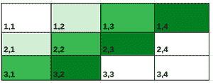
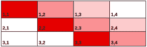

# 获取 2D 网格中隐藏单元格所需的最小提示数

> 原文:[https://www . geeksforgeeks . org/获得 2d 网格中隐藏单元所需的最小提示数/](https://www.geeksforgeeks.org/minimum-number-of-hint-required-to-get-the-hidden-cell-in-2d-grid/)

给定一个大小为 **M * N** 的 2D 数组。任务是找到在网格上选择一个隐藏单元的正确位置所需的最小数量的提示，其中在每个提示中隐藏单元的 [**曼哈顿距离**](https://en.wikipedia.org/wiki/Taxicab_geometry) 将被通知。

**注:**两个像元之间的曼哈顿距离是像元的行和列之间的绝对差之和。

**示例:**

> **输入:** M = 1，N = 3
> **输出:** 1
> **说明:**对于任何隐藏单元，如果 X-path 距离(1，1)已知，则隐藏单元为(1，1+X)。
> 
> **输入:** M = 1，N = 1
> **输出:** 0
> **说明:**只有一个可能的单元格。

**方法:**有三种可能的情况可以找到单元格在网格上的位置:

**情况-1:** 当网格为行形式时，即**维度=(1×N)**

<figure class="table">

| (1,1) | (1,2) | (1,3) | (1,4) | 。。。 | (1，N) |

对于上表，至少需要一个提示。在提示中可以得到到单元格 **(1，1)** 的距离，如果 **X** 是隐藏单元格到 **(1，1)** 的距离，那么 **(1，1+X )** 就是隐藏单元格。

**情况-2:** 当网格为柱形时，即**维度=(N×1)**

<figure class="table">

| (1,1) |
| (2,1) |
| (3,1) |
| 。
。
。 |
| (4,1) |

对于上表，至少需要一个提示。在提示中可以得到 **(1，1)** 的距离，如果 **X** 是隐藏单元格到 **(1，1)** 的距离，那么 **(1+X，1)** 就是隐藏单元格。

**案例-3:** 当网格为矩形时，即**维度= (M x N)**
对于这种类型的表格，至少需要两个提示。所需的提示如下所示:

1.  一种是获取到单元格 **(1，1)** 的路径距离，如果 **X** 是隐藏单元格到 **(1，1)** 的路径距离，那么任何形式的单元格 **(1+X <sub>1</sub> ，1+X <sub>2</sub> )** 都将是隐藏单元格**X<sub>1</sub>+X<sub>2</sub>= X**。
2.  另一个是获取到单元格 **(1，N)** 的路径距离，如果 **Y** 是隐藏单元格到 **(1，N)** 的路径距离，那么任何形式的单元格 **(1+Y <sub>1</sub> ，N-Y <sub>2</sub> )** 都将是隐藏单元格**Y<sub>1</sub>+Y<sub>2</sub>= Y**。

对于 X 和 Y 的任意组合，只有一个单元格同时满足这两个距离。使用上述两个方程，可以很容易地找到隐藏单元。因此，在这种情况下，至少需要两项帮助。

遵循下图，以更好地理解条件和单元格与任何 X 和 Y 值的交集。任何 X 和 Y 的值都只有一个像元作为交点。



来自 1，1 的等距离细胞



与(1，N)等距，即 1，4

下面是上述方法的实现:

## C++

```
// C++ code to implement above approach
#include <bits/stdc++.h>
using namespace std;

// Function to find minimum help required
// for finding the hidden cell
int minHints(int M, int N)
{
    int res;

    // Grid having one cell
    if (M == 1 && N == 1)
        res = 0;

    // Row form or column form grid
    else if (M == 1 || N == 1)
        res = 1;

    // Rectangle form grid
    else
        res = 2;

    return res;
}

int main()
{
    // Declaring the dimension of the grid
    int M = 1, N = 3;

    cout << minHints(M, N);
    return 0;
}
```

**Output**

```
1
```

***时间复杂度:*** O(1)
***辅助空间:*** O(1)

</figure>

</figure>