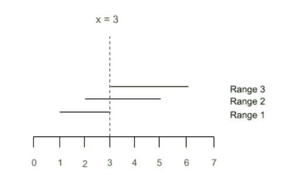

# 每个段至少包含一个整数所需的最小整数数量

> 原文:[https://www . geeksforgeeks . org/最小整数数量-要求每个段至少包含一个整数/](https://www.geeksforgeeks.org/minimum-number-of-integers-required-such-that-each-segment-contains-at-least-one-of-them/)

给定两个数组**start【】**和**end【】**,它们分别由表示一个线段的起点和终点的正整数组成，任务是找出位于至少一个给定线段中的最小整数数，并且每个线段至少包含其中的一个。

**示例:**

> **输入:**开始[] = {1，2，3}，结束[] = { 3，5，6}
> **输出:** 3
> **解释:**
> 三个范围([1，3]，[2，5]，[3，6])都包含整数 3。
> 
> **输入:**开始[] = {4，1，2，5}，结束[] = {7，3，5，6}
> **输出:** 3 6
> **解释:**
> 线段{1，3}和{2，5}都包含整数 3。
> 线段{4，7}和{5，6}包含整数 6。

**数学公式:**
描述问题的数学方式是把每个给定范围的整数看作一条直线上两个整数坐标**【a】<sub>I</sub>，b<sub>I</sub>**定义的线段。那么覆盖每个给定范围所需的最小整数数就是最小点数，使得每个段包含至少一个点。
例 1**的表示如下:**



**天真的做法:**
解决问题最简单的方法就是找到所有起点的最小值和所有线段的所有终点的最大值。迭代这个范围，对于这个范围内的每个点，记录这个点可以覆盖的线段数。使用数组将段数存储为:

**arr[点] =可使用该点覆盖的线段数**

1.  求数组**arr【】**中的最大值。
2.  如果该最大值等于 N，则对应于该值的索引是覆盖所有段的点。
3.  如果这个最大值小于 **N** ，那么对应于这个值的索引就是一个覆盖了一些线段的点。
4.  对数组 arr[]重复步骤 1 至 3，排除该最大值，直到找到的所有最大值之和等于 n

***时间复杂度:** O((A-B+1)*N)，其中 A 为线段终点的最大值，B 为线段起点的最小值。*
***辅助空间:** O(1)*

**高效方法:**
使用[贪婪技术](https://www.geeksforgeeks.org/greedy-algorithms/)可以高效解决问题。按照下面给出的步骤解决问题:

*   [](https://www.geeksforgeeks.org/sorting-algorithms/)**根据端点对线段进行排序。**
*   **选择所有线段的**最小**端点对应的点(或坐标)。**
*   **现在，所有起点小于**这个选择点**且终点大于这个选择点的线段都可以被这个点**覆盖**。**
*   **然后打印最小点数。**

**下面是上述方法的实现:**

## **C++**

```
// C++ program for the above approach
#include <bits/stdc++.h>
using namespace std;

// function to sort the 2D vector
// on basis of second element.
bool sortcol(const pair<int, int> p1,
             const pair<int, int> p2)
{
    return p1.second < p2.second;
}

// Function to compute minimum number
// of points which cover all segments
void minPoints(pair<int, int> points[], int n)
{

    // Sort the list of tuples by
    // their second element.
    sort(points, points + n, sortcol);

    // To store the solution
    vector<int> coordinates;
    int i = 0;

    // Iterate over all the segments
    while (i < n)
    {
        int seg = points[i].second;
        coordinates.push_back(seg);
        int p = i + 1;

        if (p >= n)
            break;

        // Get the start point of next segment
        int arrived = points[p].first;

        // Loop over all those segments whose
        // start point is less than the end
        // point of current segment
        while (seg >= arrived)
        {
            p += 1;

            if (p >= n)
                break;

            arrived = points[p].first;
        }
        i = p;
    }

    // Print the possibles values of M
    for(auto point : coordinates)
        cout << point << " ";
}

// Driver code
int main()
{
    int n = 4;

    // Starting points of segments
    int start[] = { 4, 1, 2, 5 };

    // Ending points of segments
    int end[] = { 7, 3, 5, 6 };

    pair<int, int> points[n];

    // Insert ranges in points[]
    for(int i = 0; i < n; i++)
    {
        points[i] = { start[i], end[i] };
    }

    // Function call
    minPoints(points, n);

    return 0;
}

// This code is contributed by Kingash
```

## **Java 语言(一种计算机语言，尤用于创建网站)**

```
// Java program for the above approach
import java.util.*;

class GFG{

// Function to compute minimum number
// of points which cover all segments
static void minPoints(int[][] points, int n)
{

    // Sort the list of tuples by
    // their second element.
    Arrays.sort(points, (a, b) -> a[1] - b[1]);

    // To store the solution
    ArrayList<Integer> coordinates = new ArrayList<>();
    int i = 0;

    // Iterate over all the segments
    while (i < n)
    {
        int seg = points[i][1];
        coordinates.add(seg);
        int p = i + 1;

        if (p >= n)
            break;

        // Get the start point of next segment
        int arrived = points[p][0];

        // Loop over all those segments whose
        // start point is less than the end
        // point of current segment
        while (seg >= arrived)
        {
            p += 1;

            if (p >= n)
                break;

            arrived = points[p][0];
        }
        i = p;
    }

    // Print the possibles values of M
    for(Integer point : coordinates)
        System.out.print(point + " ");
}

// Driver code
public static void main(String[] args)
{

    int n = 4;

    // Starting points of segments
    int[] start = { 4, 1, 2, 5 };

    // Ending points of segments
    int[] end = { 7, 3, 5, 6 };

    int[][] points = new int[n][2];

    // Insert ranges in points[]
    for(int i = 0; i < n; i++)
    {
        points[i][0] = start[i];
        points[i][1] = end[i];
    }

    // Function call
    minPoints(points, n);
}
}

// This code is contributed by offbeat
```

## **蟒蛇 3**

```
# Python3 program for the above approach

# Function to compute minimum number
# of points which cover all segments
def minPoints(points):

    # Sort the list of tuples by
    # their second element.
    points.sort(key = lambda x: x[1])

    # To store the solution
    coordinates = []
    i = 0

    # Iterate over all the segments
    while i < n:

        seg = points[i][1]
        coordinates.append(seg)
        p = i + 1

        if p >= n:
            break

        # Get the start point of next segment
        arrived = points[p][0]

        # Loop over all those segments whose
        # start point is less than the end
        # point of current segment
        while seg >= arrived:

            p += 1
            if p >= n:
                break
            arrived = points[p][0]
        i = p

# Print the possibles values of M
    for point in coordinates:
        print(point, end =" ")

# Driver Code
n = 4

# Starting points of segments
start = [4, 1, 2, 5]

# Ending points of segments
end = [7, 3, 5, 6]

points = []

# Insert ranges in points[]
for i in range(n):
    tu = (start[i], end[i])
    points.append(tu)

# Function Call
minPoints(points)
```

****Output:** 

```
3 6
```** 

*****时间复杂度:** O(N*log N)*
***辅助空间:** O(N)***