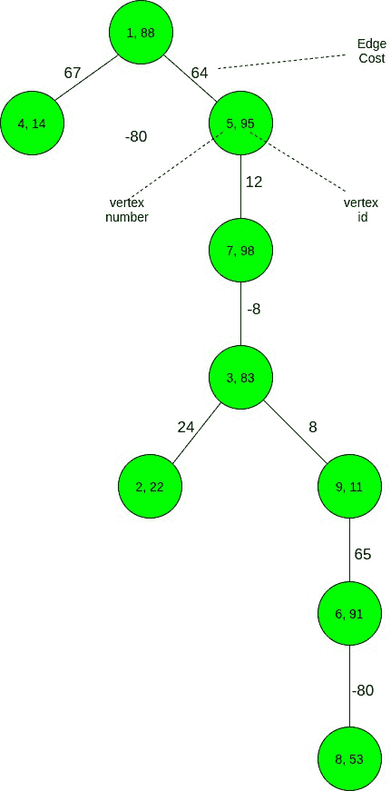
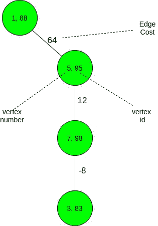

# 满足给定条件所需从树上移除的最小叶子数量

> 原文:[https://www . geeksforgeeks . org/为满足给定条件需要从树上移除的最小叶片数/](https://www.geeksforgeeks.org/minimum-number-of-leaves-required-to-be-removed-from-a-tree-to-satisfy-the-given-condition/)

给定一个由 **N** 个顶点组成的**树**，根在顶点 **1** 和一个代表分配给每个顶点的值的数组**val【】**，以及一个代表**树**中每个边的成本的数组**cost【**，任务是找到要从给定树上移除的最小数量的叶子，使得:

> 对于任何顶点 **V** ，顶点 **U** 在其子树中的边的代价之和永远不会超过**值【U】**。

**示例**:

> **输入:** N = 9，val[] = {88，22，83，14，95，91，98，53，11}，
> 成本[] = { -1，24，-8，67，64，65，12，-80，8 }
> 
> 
> 
> **输出:** 5
> **说明:**
> 必要去叶后的最终图形如下:
> 
> 
> 
> 边的成本(1，4) = 67 > 14 (= val[4])。因此，顶点 4 被移除。
> 边的成本(3，2) = 24 > 22 (= val[2])。因此，顶点 2 被移除。
> 边缘成本(1–>5–>7–>3–>9)= 64+12+8–8 = 76>11(= val[9])。因此，需要删除顶点 9。因此，整个子树{9，6，8}被删除。
> 因此，从树中删除了 5 个节点。
> 
> **输入:** N = 7，val[] = { 11，16，27，21，15，9，11 }，
> 成本[] = { 12，1，7，-17，-2，2，17}
> 边[] = {{0，3}，{0，4}，{3，6}，{4，2}，{2，1 }，{2，5}}
> **输出:** 7

**方法:**
按照以下步骤解决问题:

*   如果对于一个顶点 **V** ，有一个顶点 **U** 使得边缘代价(V–>U)超过**val【U】**，除了删除以 **U** 或 **V** 为根的整个子树外，别无选择。这是因为我们只被允许删除叶顶点。
*   由于只能删除叶顶点，要删除 **U** 或 **V** ，需要逐叶删除整个子树，才能到达顶点 **U** 或 **V** 。
*   为了最小化要删除的叶子数量，贪婪地选择顶点数量较少的子树，即如果 **V** 的子树中的顶点数量超过 **U** 的子树中的顶点数量，V 的子树将被删除，反之亦然。
*   在树上应用[深度优先搜索](https://www.geeksforgeeks.org/depth-first-search-or-dfs-for-a-graph/)，对于每个未访问的顶点，检查它是否满足要求的条件。
*   对于满足条件的每个顶点，增加**计数**。对于不满足条件的顶点，不需要遍历其子树，因为需要完全删除。
*   最后，打印**N–count**，在完成树的遍历后作为 count 包含不需要删除的顶点数。

以下是上述方法的实施情况:

## C++

```
// C++ Program to find the minimum
// number of leaves to be deleted
#include <bits/stdc++.h>
using namespace std;

// Stores the count of safe nodes
int cnt = 0;

// Function to perform DFS on the Tree
// to obtain the count of vertices that
// are not required to be deleted
void dfs(int* val, int* cost,
         vector<vector<int> >& tr,
         int u, int s)
{
    // Update cost to reach
    // the vertex
    s = s + cost[u];
    if (s < 0)
        s = 0;

    // If the vertex does not
    // satisfy the condition
    if (s > val[u])
        return;

    // Otherwise
    cnt++;

    // Traverse its subtree
    for (int i = 0; i < tr[u].size(); i++) {
        dfs(val, cost, tr, tr[u][i], s);
    }
}

// Driver Code
int main()
{
    int n = 9;
    int val[] = { 88, 22, 83, 14, 95,
                  91, 98, 53, 11 };
    int cost[] = { -1, 24, -8, 67, 64,
                   65, 12, -80, 8 };

    // Stores the Tree
    vector<vector<int> > tr(n + 1);
    tr[0].push_back(3);
    tr[0].push_back(4);
    tr[4].push_back(6);
    tr[6].push_back(2);
    tr[2].push_back(1);
    tr[2].push_back(8);
    tr[8].push_back(5);
    tr[5].push_back(7);

    // Perform DFS
    dfs(val, cost, tr, 0, 0);

    // Print the number of nodes
    // to be deleted
    cout << n - cnt;

    return 0;
}
```

## Java 语言(一种计算机语言，尤用于创建网站)

```
// Java Program to find the minimum
// number of leaves to be deleted
import java.util.*;
class GFG{

// Stores the count of safe nodes
static int cnt = 0;

// Function to perform DFS on the Tree
// to obtain the count of vertices that
// are not required to be deleted
static void dfs(int []val, int []cost,
                Vector<Integer> []tr,
                int u, int s)
{
  // Update cost to reach
  // the vertex
  s = s + cost[u];
  if (s < 0)
    s = 0;

  // If the vertex does not
  // satisfy the condition
  if (s > val[u])
    return;

  // Otherwise
  cnt++;

  // Traverse its subtree
  for (int i = 0; i < tr[u].size(); i++) 
  {
    dfs(val, cost, tr, tr[u].get(i), s);
  }
}

// Driver Code
public static void main(String[] args)
{
  int n = 9;
  int val[] = {88, 22, 83, 14, 95,
               91, 98, 53, 11};
  int cost[] = {-1, 24, -8, 67, 64,
                65, 12, -80, 8};

  // Stores the Tree
  @SuppressWarnings("unchecked")
  Vector<Integer> []tr = new Vector[n + 1];

  for (int i = 0; i < tr.length; i++)
    tr[i] = new Vector<Integer>();
  tr[0].add(3);
  tr[0].add(4);
  tr[4].add(6);
  tr[6].add(2);
  tr[2].add(1);
  tr[2].add(8);
  tr[8].add(5);
  tr[5].add(7);

  // Perform DFS
  dfs(val, cost, tr, 0, 0);

  // Print the number of nodes
  // to be deleted
  System.out.print(n - cnt);
}
}

// This code is contributed by Princi Singh
```

## 蟒蛇 3

```
# Python3 program to find the minimum
# number of leaves to be deleted

# Stores the count of safe nodes
cnt = 0

# Function to perform DFS on the Tree
# to obtain the count of vertices that
# are not required to be deleted
def dfs(val, cost, tr, u, s):

    global cnt

    # Update cost to reach
    # the vertex
    s = s + cost[u]

    if (s < 0):
        s = 0

    # If the vertex does not
    # satisfy the condition
    if (s > val[u]):
        return

    # Otherwise
    cnt += 1

    # Traverse its subtree
    for i in range(0, len(tr[u])):
        dfs(val, cost, tr, tr[u][i], s)

# Driver Code
if __name__ == "__main__":

    n = 9
    val = [ 88, 22, 83, 14, 95, 
            91, 98, 53, 11 ]
    cost = [ -1, 24, -8, 67, 64, 
             65, 12, -80, 8]

    # Stores the Tree
    tr = [[] for i in range(n + 1)]
    tr[0].append(3)
    tr[0].append(4)
    tr[4].append(6)
    tr[6].append(2)
    tr[2].append(1)
    tr[2].append(8)
    tr[8].append(5)
    tr[5].append(7)

    # Perform DFS
    dfs(val, cost, tr, 0, 0)

    # Print the number of nodes
    # to be deleted
    print(n - cnt)

# This code is contributed by rutvik_56
```

## C#

```
// C# Program to find the minimum
// number of leaves to be deleted
using System;
using System.Collections.Generic;
class GFG{

// Stores the count of safe nodes
static int cnt = 0;

// Function to perform DFS on the Tree
// to obtain the count of vertices that
// are not required to be deleted
static void dfs(int []val, int []cost,
                List<int> []tr,
                int u, int s)
{
  // Update cost to reach
  // the vertex
  s = s + cost[u];
  if (s < 0)
    s = 0;

  // If the vertex does not
  // satisfy the condition
  if (s > val[u])
    return;

  // Otherwise
  cnt++;

  // Traverse its subtree
  for (int i = 0; i < tr[u].Count; i++) 
  {
    dfs(val, cost, tr, tr[u][i], s);
  }
}

// Driver Code
public static void Main(String[] args)
{
  int n = 9;
  int []val = {88, 22, 83, 14, 95,
               91, 98, 53, 11};
  int []cost = {-1, 24, -8, 67, 64,
                65, 12, -80, 8};

  // Stores the Tree  
  List<int> []tr = new List<int>[n + 1];

  for (int i = 0; i < tr.Length; i++)
    tr[i] = new List<int>();

  tr[0].Add(3);
  tr[0].Add(4);
  tr[4].Add(6);
  tr[6].Add(2);
  tr[2].Add(1);
  tr[2].Add(8);
  tr[8].Add(5);
  tr[5].Add(7);

  // Perform DFS
  dfs(val, cost, tr, 0, 0);

  // Print the number of nodes
  // to be deleted
  Console.Write(n - cnt);
}
}

// This code is contributed by Rajput-Ji
```

## java 描述语言

```
<script>

// Javascript Program to find the minimum
// number of leaves to be deleted

// Stores the count of safe nodes
var cnt = 0;

// Function to perform DFS on the Tree
// to obtain the count of vertices that
// are not required to be deleted
function dfs(val, cost, tr, u, s)
{
  // Update cost to reach
  // the vertex
  s = s + cost[u];
  if (s < 0)
    s = 0;

  // If the vertex does not
  // satisfy the condition
  if (s > val[u])
    return;

  // Otherwise
  cnt++;

  // Traverse its subtree
  for (var i = 0; i < tr[u].length; i++) 
  {
    dfs(val, cost, tr, tr[u][i], s);
  }
}

// Driver Code
var n = 9;
var val = [88, 22, 83, 14, 95,
             91, 98, 53, 11];
var cost = [-1, 24, -8, 67, 64,
              65, 12, -80, 8];
// Stores the Tree  
var tr = Array.from(Array(n+1), ()=>Array());

tr[0].push(3);
tr[0].push(4);
tr[4].push(6);
tr[6].push(2);
tr[2].push(1);
tr[2].push(8);
tr[8].push(5);
tr[5].push(7);
// Perform DFS
dfs(val, cost, tr, 0, 0);
// Print the number of nodes
// to be deleted
document.write(n - cnt);

</script>
```

**Output:** 

```
5
```

***时间复杂度:**O(N)*
T5**辅助空间:** O(N)