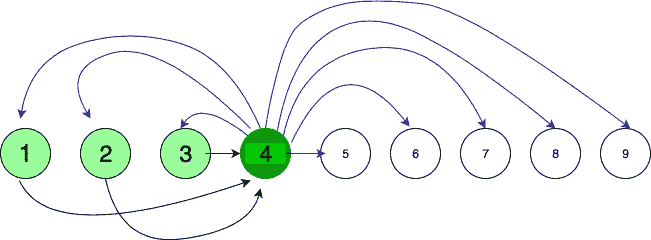

# 分发所有问题所需的最小邮件数量

> 原文:[https://www . geesforgeks . org/最低邮件数量-要求分发所有问题/](https://www.geeksforgeeks.org/minimum-number-of-mails-required-to-distribute-all-the-questions/)

给定一次考试的 N 个问题和班上的 K 个学生。在这批 K 个学生中，有 N 个学生准确地记住了**个**问题。一封邮件最多可以包含 **X** 个问题。
找到所需的**最小邮件数**，以便全班同学了解所有问题。

**注**:邮件有以下信息——发件人姓名、收件人姓名和问题

**示例:**

> **输入:** N = 3，K = 3，X = 1
> **输出:** 6
> 学生 1 向学生 2 和学生 3 发送问题(2 封邮件)
> 学生 2 和学生 3 也是如此，因此邮件总数= 2 * 3 = 6
> 
> **输入:** N = 4，K = 9，X = 2
> **输出:** 19
> 参考下面的流程图

**流程图:**

**N = 4，K = 9，X = 2**
Pivot = 4 号学生
学生 1，2，& 3 向学生 4 发送 3 封邮件。现在学生 4 有了所有的问题。他相应地分发，3/2 = 2 封邮件给每 3 个已经有 1 个问题的学生，4/2 = 2 封邮件给剩下的 5 个学生。所以邮件总数是(3 + 2 * 3 + 2 * 5) = 19



**方法:**这里使用了贪婪的方法。选择一个枢纽，它首先接收所有问题，然后相应地分发它们。这将需要最少的步骤。N-1 个学生，把他们的每个问题发给第 n 个学生。所以第 N 个学生有所有的问题，(到目前为止发送的邮件= N-1)。现在提到邮件包含发件人的名字，所以第 n 个学生知道哪个问题来自谁，这样他就可以避免发回同样的问题。现在第 n 个学生充当分发员，他打包问题并相应地发送。每一个 N-1 的学生都需要知道剩下的 N-1 题。所以需要发送给他们每个人的最小邮件数是[上限](https://www.geeksforgeeks.org/ceil-floor-functions-cpp/) ((N-1)/X)，其中 X 是邮件可以容纳的最大问题数，[上限](https://www.geeksforgeeks.org/ceil-floor-functions-cpp/)表示最小整数函数。所以到目前为止发送的邮件总数= [上限](https://www.geeksforgeeks.org/ceil-floor-functions-cpp/) ((N-1)/X) * (N-1) + (N-1)。所以 N 个学生知道所有的问题。其余的 K-N 学生需要知道所有的 N 个问题，所以他们每个人必须至少收到 [ceil](https://www.geeksforgeeks.org/ceil-floor-functions-cpp/) (N/X)封邮件，其中 X 是一封邮件可以容纳的最大问题数， [ceil](https://www.geeksforgeeks.org/ceil-floor-functions-cpp/) 表示最小整数函数。所以收到的邮件总数是:

> [天花板](https://www.geeksforgeeks.org/ceil-floor-functions-cpp/)(N/X)*(K-N)+([天花板](https://www.geeksforgeeks.org/ceil-floor-functions-cpp/) ((N-1)/X)) * (N-1)) + (N-1)

下面是上述方法的实现:

## C++

```
// C++ code to find the
// minimum number of mails
#include <bits/stdc++.h>
#define ll long long int
using namespace std;

// Function returns the min no of mails required
long long int MinimumMail(int n, int k, int x)
{
    // Using the formula derived above
    ll m = (n - 1) + (ll)ceil((n - 1) * 1.0 / x) * (n - 1)
                      + (ll)ceil(n * 1.0 / x) * (k - n);

    return m;
}

// Driver Code
int main()
{
    // no of questions
    int N = 4;

    // no of students
    int K = 9;

    // maximum no of questions a mail can hold
    int X = 2;

    // Calling function
    cout << MinimumMail(N, K, X) << endl;

    return 0;
}
```

## Java 语言(一种计算机语言，尤用于创建网站)

```
// Java code to find the
// minimum number of mails
import java.io.*;
import java.util.*;
import java.lang.*;

class GFG
{

// Function returns the min
// no of mails required
static double MinimumMail(int n,
                          int k,
                          int x)
{
    // Using the formula
    // derived above
    double m = (n - 1) + Math.ceil((n - 1) * 1.0 / x) * (n - 1)
                       + Math.ceil(n * 1.0 / x) * (k - n);

    return m;
}

// Driver Code
public static void main(String[] args)
{
    // no of questions
    int N = 4;

    // no of students
    int K = 9;

    // maximum no of questions
    // a mail can hold
    int X = 2;

    // Calling function
    System.out.print((int)MinimumMail(N, K, X) + "\n");
}
}
```

## 蟒蛇 3

```
# Python3 code to find the minimum
# number of mails
import math

# Function returns the min no of
# mails required
def MinimumMail(n, k, x):

    # Using the formula derived above
    m = ((n - 1) + int(math.ceil((n - 1) * 1.0 / x) *
         (n - 1) + math.ceil(n * 1.0 / x) * (k - n)));

    return m;

# Driver Code

# no of questions
N = 4;

# no of students
K = 9;

# maximum no of questions
# a mail can hold
X = 2;

# Calling function
print(MinimumMail(N, K, X));

# This code is contributed by mits
```

## C#

```
// C# code to find the
// minimum number of mails
using System;

class GFG
{

// Function returns the min
// no of mails required
static double MinimumMail(int n,
                          int k,
                          int x)
{
    // Using the formula
    // derived above
    double m = (n - 1) + Math.Ceiling((n - 1) *
                           1.0 / x) * (n - 1) +
                         Math.Ceiling(n * 1.0 /
                                  x) * (k - n);

    return m;
}

// Driver Code
public static void Main()
{
    // no of questions
    int N = 4;

    // no of students
    int K = 9;

    // maximum no of questions
    // a mail can hold
    int X = 2;

    // Calling function
    Console.WriteLine((int)MinimumMail(N, K, X) + "\n");
}
}

// This code is contributed by anuj_67.
```

## 服务器端编程语言（Professional Hypertext Preprocessor 的缩写）

```
<?php
// PHP code to find the
// minimum number of mails

// Function returns the
// min no of mails required
function MinimumMail($n, $k, $x)
{
    // Using the formula
    // derived above
    $m = ($n - 1) + ceil(($n - 1) *
             1.0 / $x) * ($n - 1) +
                    ceil($n * 1.0 /
                   $x) * ($k - $n);

    return $m;
}

// Driver Code

// no of questions
$N = 4;

// no of students
$K = 9;

// maximum no of questions
// a mail can hold
$X = 2;

// Calling function
echo MinimumMail($N, $K, $X), "\n";

// This code is contributed by ajit
?>
```

## java 描述语言

```
<script>

// Javascript code to find the minimum
// number of mails

// Function returns the min
// no of mails required
function MinimumMail(n, k, x)
{

    // Using the formula
    // derived above
    let m = (n - 1) + Math.ceil((n - 1) * 1.0 / x) *
            (n - 1) + Math.ceil(n * 1.0 / x) * (k - n);

    return m;
}

// Driver code

// No of questions
let N = 4;

// No of students
let K = 9;

// Maximum no of questions
// a mail can hold
let X = 2;

// Calling function
document.write(MinimumMail(N, K, X) + "</br>");

// This code is contributed by divyesh072019

</script>
```

**Output:** 

```
19
```