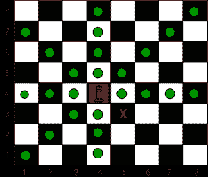

# 棋盘中国王到达目的地所需的最小移动次数

> 原文:[https://www . geesforgeks . org/棋王到达目的地所需的最小移动次数/](https://www.geeksforgeeks.org/minimum-number-of-moves-required-to-reach-the-destination-by-the-king-in-a-chess-board/)

给定四个整数 **sourceX** 、 **sourceY** 、 **destinationX** 和 **destinationY** ，它们代表棋盘上的源坐标和目的坐标。任务是找到**王**从源头到达目的地所需的最小移动次数。
一个王者可以移动到与当前王者所在的方块有共同边或共同顶点的方块(一般有 8 个不同的方块可以移动到)。



使用 L、R、U、D、LU、LD、RU 和 RD 打印路径，其中 L、R、U 和 D 分别表示左、右、上和下。

**示例:**

> **输入:** sourceX = 4，sourceY = 4，destinationX = 3，destination y = 5
> T3】输出: 1
> DR
> 
> **输入:** sourceX = 4，sourceX = 4，destinationX = 7，destination = 0
> **输出:** 4
> UL
> UL
> UL
> L

**进场:**向目的地对角方向移动，直到国王到达与目的地相同的列或同一行，然后直线向目的地移动。

下面是上述方法的实现:

## C++

```
// C++ program to Find the minimum number of moves required to
// reach the destination by the king in a chess board
#include <bits/stdc++.h>
using namespace std;

// function to Find the minimum number of moves required to
// reach the destination by the king in a chess board
void MinSteps(int SourceX, int SourceY, int DestX, int DestY)
{
    // minimum number of steps
    cout << max(abs(SourceX - DestX), abs(SourceY - DestY)) << endl;

    // while the king is not in the same row or column
    // as the destination
    while ((SourceX != DestX) || (SourceY != DestY)) {

        // Go up
        if (SourceX < DestX) {
            cout << 'U';
            SourceX++;
        }

        // Go down
        if (SourceX > DestX) {
            cout << 'D';
            SourceX--;
        }

        // Go left
        if (SourceY > DestY) {
            cout << 'L';
            SourceY--;
        }

        // Go right
        if (SourceY < DestY) {
            cout << 'R';
            SourceY++;
        }

        cout << endl;
    }
}

// Driver code
int main()
{
    int sourceX = 4, sourceY = 4;
    int destinationX = 7, destinationY = 0;

    MinSteps(sourceX, sourceY, destinationX, destinationY);

    return 0;
}
```

## Java 语言(一种计算机语言，尤用于创建网站)

```
// Java program to Find the minimum
// number of moves required to reach
// the destination by the king in a
// chess board
import java.io.*;

class GFG
{

// function to Find the minimum number
// of moves required to reach the
// destination by the king in a chess board
static void MinSteps(int SourceX, int SourceY,
                     int DestX, int DestY)
{
    // minimum number of steps
    System.out.println(Math.max(Math.abs(SourceX - DestX),
                     Math.abs(SourceY - DestY)));

    // while the king is not in the same
    // row or column as the destination
    while ((SourceX != DestX) ||
           (SourceY != DestY))
    {

        // Go up
        if (SourceX < DestX)
        {
            System.out.print( 'U');
            SourceX++;
        }

        // Go down
        if (SourceX > DestX)
        {
            System.out.println( 'D');
            SourceX--;
        }

        // Go left
        if (SourceY > DestY)
        {
            System.out.print( 'L');
            SourceY--;
        }

        // Go right
        if (SourceY < DestY)
        {
            System.out.print( 'R');
            SourceY++;
        }

        System.out.println();
    }
}

// Driver code
public static void main (String[] args)
{
    int sourceX = 4, sourceY = 4;
    int destinationX = 7, destinationY = 0;

    MinSteps(sourceX, sourceY,
             destinationX, destinationY);
}
}

// This code is contributed by inder_verma
```

## 蟒蛇 3

```
# Python 3 program to Find the minimum number of moves required to
# reach the destination by the king in a chess board

# function to Find the minimum number of moves required to
# reach the destination by the king in a chess board
def MinSteps(SourceX, SourceY, DestX, DestY):
    # minimum number of steps
    print(max(abs(SourceX - DestX), abs(SourceY - DestY)))

    # while the king is not in the same row or column
    # as the destination
    while ((SourceX != DestX) or (SourceY != DestY)):
        # Go up
        if (SourceX < DestX):
            print('U',end = "")
            SourceX += 1

        # Go down
        if (SourceX > DestX):
            print('D',end = "")
            SourceX -= 1

        # Go left
        if (SourceY > DestY):
            print('L')
            SourceY -= 1

        # Go right
        if (SourceY < DestY):
            print('R',end = "")
            SourceY += 1

# Driver code
if __name__ == '__main__':
    sourceX = 4
    sourceY = 4
    destinationX = 7
    destinationY = 0

    MinSteps(sourceX, sourceY, destinationX, destinationY)

# This code is contributed by
# Surendra_Gangwar
```

## C#

```
// C# program to Find the minimum
// number of moves required to reach
// the destination by the king in a
// chess board
using System;

class GFG
{

// function to Find the minimum number
// of moves required to reach the
// destination by the king in a chess board
static void MinSteps(int SourceX, int SourceY,
                     int DestX, int DestY)
{
    // minimum number of steps
    Console.WriteLine(Math.Max(Math.Abs(SourceX - DestX),
                               Math.Abs(SourceY - DestY)));

    // while the king is not in the same
    // row or column as the destination
    while ((SourceX != DestX) ||
           (SourceY != DestY))
    {

        // Go up
        if (SourceX < DestX)
        {
            Console.Write( 'U');
            SourceX++;
        }

        // Go down
        if (SourceX > DestX)
        {
            Console.Write( 'D');
            SourceX--;
        }

        // Go left
        if (SourceY > DestY)
        {
            Console.Write( 'L');
            SourceY--;
        }

        // Go right
        if (SourceY < DestY)
        {
            Console.Write( 'R');
            SourceY++;
        }

        Console.WriteLine();
    }
}

// Driver code
public static void Main ()
{
    int sourceX = 4, sourceY = 4;
    int destinationX = 7, destinationY = 0;

    MinSteps(sourceX, sourceY,
             destinationX, destinationY);
}
}

// This code is contributed by inder_verma
```

## 服务器端编程语言（Professional Hypertext Preprocessor 的缩写）

```
<?php
// PHP program to Find the minimum
// number of moves required to
// reach the destination by the
// king in a chess board

// function to Find the minimum
// number of moves required to
// reach the destination by the
// king in a chess board
function MinSteps($SourceX, $SourceY,
                  $DestX, $DestY)
{
    // minimum number of steps
    echo max(abs($SourceX - $DestX),
             abs($SourceY - $DestY)) . "\n";

    // while the king is not in the
    // same row or column as the destination
    while (($SourceX != $DestX) ||
           ($SourceY != $DestY))
    {

        // Go up
        if ($SourceX < $DestX)
        {
            echo 'U';
            $SourceX++;
        }

        // Go down
        if ($SourceX > $DestX)
        {
            echo 'D';
            $SourceX--;
        }

        // Go left
        if ($SourceY > $DestY)
        {
            echo 'L';
            $SourceY--;
        }

        // Go right
        if ($SourceY < $DestY)
        {
            echo 'R';
            $SourceY++;
        }

        echo "\n";
    }
}

// Driver code
$sourceX = 4; $sourceY = 4;
$destinationX = 7; $destinationY = 0;

MinSteps($sourceX, $sourceY,
         $destinationX, $destinationY);

// This code is contributed
// by Akanksha Rai
?>
```

## java 描述语言

```
<script>

// Javascript program to Find the minimum
// number of moves required to reach the
// destination by the king in a chess board

// function to Find the minimum number of
// moves required to reach the destination
// by the king in a chess board
function MinSteps(SourceX, SourceY, DestX, DestY)
{

    // Minimum number of steps
    document.write(Math.max(Math.abs(SourceX - DestX),
    Math.abs(SourceY - DestY)) + "<br>");

    // While the king is not in the same row
    // or column as the destination
    while ((SourceX != DestX) ||
           (SourceY != DestY))
    {

        // Go up
        if (SourceX < DestX)
        {
            document.write('U');
            SourceX++;
        }

        // Go down
        if (SourceX > DestX)
        {
            document.write('D');
            SourceX--;
        }

        // Go left
        if (SourceY > DestY) {
            document.write('L');
            SourceY--;
        }

        // Go right
        if (SourceY < DestY)
        {
            document.write('R');
            SourceY++;
        }
        document.write("<br>");
    }
}

// Driver code
let sourceX = 4, sourceY = 4;
let destinationX = 7, destinationY = 0;

MinSteps(sourceX, sourceY, destinationX,
         destinationY);

// This code is contributed by souravmahato348

</script>
```

**Output:** 

```
4
UL
UL
UL
L
```