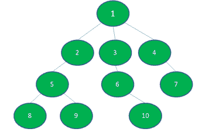
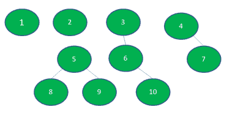
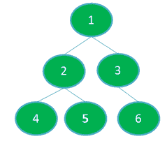
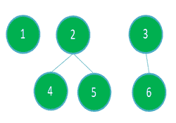

# 要移除的节点的最小数量，使得没有子树具有超过 K 个节点

> 原文:[https://www . geeksforgeeks . org/最小移除节点数-无子树的节点数超过 k 个/](https://www.geeksforgeeks.org/minimum-number-of-nodes-to-be-removed-such-that-no-subtree-has-more-than-k-nodes/)

给定具有从 **1** 到 **N** 和**(N–1)**边的 **N** 节点值和一个数量 **K** 的树，任务是从树中移除最小数量的节点，使得每个子树最多具有 **K** 节点。移除节点将移除该节点到所有其他连接节点的边。

**示例:**

> **输入:** N = 10，K = 3，下图:
> 
> [](https://media.geeksforgeeks.org/wp-content/uploads/20200722134450/rszscreenshot53.png)
> 
> **输出:**
> 移除的节点数:2
> 移除的节点数:2 1
> **说明:**
> 移除节点 1 和 2 后，这里，没有一个子树或树的节点数超过 3 个。下面是结果图:
> 
> [](https://media.geeksforgeeks.org/wp-content/uploads/20200722140935/rszscreenshot54.png)
> 
> **输入:** N = 6，K = 3，下图:
> 
> [](https://media.geeksforgeeks.org/wp-content/uploads/20200801132537/rsz1rsz1screenshot55.png)
> 
> **输出:**
> 移除的节点数:1
> 移除的节点:1
> **说明:**
> 移除节点 1 后，这里没有一个子树或树的节点超过 3 个。下面是结果图:
> 
> [](https://media.geeksforgeeks.org/wp-content/uploads/20200801132919/rsz2screenshot55.png)

**方法:**思想是观察一个节点 X 的子树中的节点数是其子树和节点本身的节点数的**和**。以下是步骤:

*   使用[动态规划](https://www.geeksforgeeks.org/dynamic-programming/)和 [DFS](https://www.geeksforgeeks.org/depth-first-search-or-dfs-for-a-graph/) 轻松存储每个节点的子树中节点的**计数**。
*   现在，如果子树中没有节点超过 K 个节点，那么只要子树中的节点超过 K 个，就移除该节点，并将 0 传递给它的父节点。
*   在上面的步骤中，我们让每个节点的子树中的节点不大于 K，并最小化节点移除的数量。

下面是上述方法的实现:

## C++

```
// C++ program for the above approach
#include <bits/stdc++.h>
using namespace std;

#define N 20

// Function to perform DFS Traversal
int dfs(vector<bool> &visited, int s,
        int &K, int &removals,
        vector<int> &removed_nodes,
        vector<vector<int>> &adj)
{

  // Mark the node as true
  visited[s] = true;
  int nodes = 1;

  // Traverse adjacency list
  // of child node
  for(int child : adj[s])
  {

    // If already visited then
    // omit the node
    if (visited[child])
      continue;

    // Add number of nodes
    // in subtree
    nodes += dfs(visited, child, K,
                 removals, removed_nodes,
                 adj);
  }

  if (nodes > K)
  {

    // Increment the count
    removals++;
    removed_nodes.push_back(s);
    nodes = 0;
  }

  // Return the nodes
  return nodes;
}

// Function to add edges in graph
void addEdge(vector<vector<int>> &adj,
             int a, int b)
{
  adj[a].push_back(b);
  adj[b].push_back(a);
}

// Function that finds the number
// of nodes to be removed such that
// every subtree has size at most K
void findRemovedNodes(vector<bool> &visited, int K,
                      int &removals,
                      vector<int> &removed_nodes,
                      vector<vector<int>> &adj)
{

  // Function Call to find the
  // number of nodes to remove
  dfs(visited, 1, K, removals,
      removed_nodes, adj);

  // Print Removed Nodes
  cout << "Number of nodes removed: "
       << removals << endl;

  cout << "Removed Nodes: ";
  for(int node : removed_nodes)
  {
    cout << node << " ";
  }
}

// Driver Code
int main()
{

  // Variables used to store data globally
  vector<bool> visited(N);
  int K;
  int removals = 0;
  vector<int> removed_nodes;

  // Adjacency list representation of tree
  vector<vector<int>> adj(N);

  // Insert of nodes in graph
  addEdge(adj, 1, 2);
  addEdge(adj, 1, 3);
  addEdge(adj, 2, 4);
  addEdge(adj, 2, 5);
  addEdge(adj, 3, 6);

  // Required subtree size
  K = 3;

  // Function Call
  findRemovedNodes(visited, K, removals,
                   removed_nodes, adj);

  return 0;
}

// This code is contributed by sanjeev2552
```

## Java 语言(一种计算机语言，尤用于创建网站)

```
// Java program for the above approach
import java.util.*;

class GFG {

    // Variables used to store data globally
    static final int N = 20;
    static boolean visited[] = new boolean[N];
    static int K;
    static int removals = 0;
    static ArrayList<Integer> removed_nodes
        = new ArrayList<>();

    // Adjacency list representation of tree
    static ArrayList<ArrayList<Integer> > adj
        = new ArrayList<>();

    // Function to perform DFS Traversal
    static int dfs(int s)
    {
        // Mark the node as true
        visited[s] = true;
        int nodes = 1;

        // Traverse adjacency list
        // of child node
        for (Integer child : adj.get(s)) {

            // If already visited then
            // omit the node
            if (visited[child])
                continue;

            // Add number of nodes
            // in subtree
            nodes += dfs(child);
        }

        if (nodes > K) {

            // Increment the count
            removals++;
            removed_nodes.add(s);
            nodes = 0;
        }

        // Return the nodes
        return nodes;
    }

    // Function to add edges in graph
    static void addEdge(int a, int b)
    {
        adj.get(a).add(b);
        adj.get(b).add(a);
    }

    // Function that finds the number
    // of nodes to be removed such that
    // every subtree has size at most K
    public static void findRemovedNodes(int K)
    {
        // Function Call to find the
        // number of nodes to remove
        dfs(1);

        // Print Removed Nodes
        System.out.println("Number of nodes"
                           + " removed: "
                           + removals);

        System.out.print("Removed Nodes: ");
        for (int node : removed_nodes)
            System.out.print(node + " ");
    }

    // Driver Code
    public static void main(String[] args)
    {
        // Creating list for all nodes
        for (int i = 0; i < N; i++)
            adj.add(new ArrayList<>());

        // Insert of nodes in graph
        addEdge(1, 2);
        addEdge(1, 3);
        addEdge(2, 4);
        addEdge(2, 5);
        addEdge(3, 6);

        // Required subtree size
        K = 3;

        // Function Call
        findRemovedNodes(K);
    }
}
```

## 蟒蛇 3

```
# Python3 program for the above approach

# Variables used to store data globally
N = 20
visited = [False for i in range(N)]
K = 0
removals = 0
removed_nodes = []

# Adjacency list representation of tree
adj = [[] for i in range(N)]

# Function to perform DFS Traversal
def dfs(s):

    global removals

    # Mark the node as true
    visited[s] = True
    nodes = 1

    # Traverse adjacency list
    # of child node
    for child in adj[s]:

        # If already visited then
        # omit the node
        if (visited[child]):
            continue

        # Add number of nodes
        # in subtree
        nodes += dfs(child)

    if (nodes > K):

        # Increment the count
        removals += 1
        removed_nodes.append(s)
        nodes = 0

    # Return the nodes
    return nodes

# Function to add edges in graph
def addEdge(a, b):

    adj[a].append(b)
    adj[b].append(a)

# Function that finds the number
# of nodes to be removed such that
# every subtree has size at most K
def findRemovedNodes(K):

    # Function Call to find the
    # number of nodes to remove
    dfs(1)

    # Print Removed Nodes
    print("Number of nodes removed: ", removals)

    print("Removed Nodes: ", end = ' ')

    for node in removed_nodes:
        print(node, end = ' ')

# Driver Code
if __name__ == "__main__":

    # Insert of nodes in graph
    addEdge(1, 2)
    addEdge(1, 3)
    addEdge(2, 4)
    addEdge(2, 5)
    addEdge(3, 6)

    # Required subtree size
    K = 3

    # Function Call
    findRemovedNodes(K)

# This code is contributed by rutvik_56
```

## C#

```
// C# program for the above approach
using System;
using System.Collections.Generic;

class GFG{

  // Variables used to store data globally
  static readonly int N = 20;
  static bool []visited = new bool[N];
  static int K;
  static int removals = 0;
  static List<int> removed_nodes
    = new List<int>();

  // Adjacency list representation of tree
  static List<List<int> > adj
    = new List<List<int>>();

  // Function to perform DFS Traversal
  static int dfs(int s)
  {
    // Mark the node as true
    visited[s] = true;
    int nodes = 1;

    // Traverse adjacency list
    // of child node
    foreach (int child in adj[s])
    {

      // If already visited then
      // omit the node
      if (visited[child])
        continue;

      // Add number of nodes
      // in subtree
      nodes += dfs(child);
    }

    if (nodes > K)
    {

      // Increment the count
      removals++;
      removed_nodes.Add(s);
      nodes = 0;
    }

    // Return the nodes
    return nodes;
  }

  // Function to add edges in graph
  static void addEdge(int a, int b)
  {
    adj[a].Add(b);
    adj[b].Add(a);
  }

  // Function that finds the number
  // of nodes to be removed such that
  // every subtree has size at most K
  public static void findRemovedNodes(int K)
  {
    // Function Call to find the
    // number of nodes to remove
    dfs(1);

    // Print Removed Nodes
    Console.WriteLine("Number of nodes" +    
                           " removed: " +
                               removals);

    Console.Write("Removed Nodes: ");
    foreach (int node in removed_nodes)
      Console.Write(node + " ");
  }

  // Driver Code
  public static void Main(String[] args)
  {
    // Creating list for all nodes
    for (int i = 0; i < N; i++)
      adj.Add(new List<int>());

    // Insert of nodes in graph
    addEdge(1, 2);
    addEdge(1, 3);
    addEdge(2, 4);
    addEdge(2, 5);
    addEdge(3, 6);

    // Required subtree size
    K = 3;

    // Function Call
    findRemovedNodes(K);
  }
}

// This code is contributed by Rohit_ranjan
```

## java 描述语言

```
<script>

    // JavaScript program for the above approach

    // Variables used to store data globally
    let N = 20;
    let visited = new Array(N);
    let K;
    let removals = 0;
    let removed_nodes = [];

    // Adjacency list representation of tree
    let adj = [];

    // Function to perform DFS Traversal
    function dfs(s)
    {
      // Mark the node as true
      visited[s] = true;
      let nodes = 1;

      // Traverse adjacency list
      // of child node
      for(let child  = 0; child < adj[s].length; child++)
      {

        // If already visited then
        // omit the node
        if (visited[adj[s][child]])
          continue;

        // Add number of nodes
        // in subtree
        nodes += dfs(adj[s][child]);
      }

      if (nodes > K)
      {

        // Increment the count
        removals++;
        removed_nodes.push(s);
        nodes = 0;
      }

      // Return the nodes
      return nodes;
    }

    // Function to add edges in graph
    function addEdge(a, b)
    {
      adj[a].push(b);
      adj[b].push(a);
    }

    // Function that finds the number
    // of nodes to be removed such that
    // every subtree has size at most K
    function findRemovedNodes(K)
    {
      // Function Call to find the
      // number of nodes to remove
      dfs(1);

      // Print Removed Nodes
      document.write("Number of nodes" + " removed: " +
      removals + "</br>");

      document.write("Removed Nodes: ");
      for(let node = 0; node < removed_nodes.length; node++)
        document.write(removed_nodes[node] + " ");
    }

    // Creating list for all nodes
    for (let i = 0; i < N; i++)
      adj.push([]);

    // Insert of nodes in graph
    addEdge(1, 2);
    addEdge(1, 3);
    addEdge(2, 4);
    addEdge(2, 5);
    addEdge(3, 6);

    // Required subtree size
    K = 3;

    // Function Call
    findRemovedNodes(K);

</script>
```

**Output**

```
Number of nodes removed: 1
Removed Nodes: 1
```

***时间复杂度:**O(N)*
T5**辅助空间:** O(N)