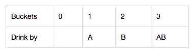
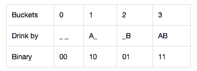
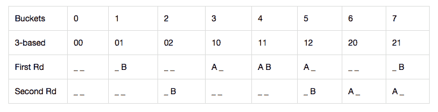

# 找到毒桶所需的最小猪数

> 原文:[https://www . geeksforgeeks . org/需要找到毒桶的最小猪数/](https://www.geeksforgeeks.org/minimum-number-of-pigs-required-to-find-the-poisonous-bucket/)

给定一个整数 **N** 表示桶数，一个整数 **M** ，表示猪喝了毒药后死亡所需的最短时间(以分钟为单位)，任务是在 **P** 分钟内找出哪桶有毒所需的最小猪数，如果正好有一桶有毒，而剩下的装满水。

**示例:**

> **输入:** N = 1000，M = 15，P = 60
> **输出:** 5
> **说明:**找到毒桶所需的最小猪数为 5 头。
> 
> **输入:** N = 4，M = 15，P = 15
> **输出:** 2
> **说明:**找到毒桶所需的最小猪数为 2 头。

**方法:**给定的问题可以使用给定的观测值来解决:

*   一只猪可以被允许用任意多的桶同时喝水，而且喂食不需要时间。
*   猪瞬间喝完水桶后，必须有 **M** 分钟的冷静停机时间。在此期间，只允许观察，不允许喂食。
*   任何给定的桶都可以被采样无限次(由无限数量的猪)。

现在，测试的 **P** 分钟和死亡的 **M** 分钟只是简单的告诉猪可以用多少回合，也就是猪可以吃多少次。因此，声明一个名为 **r = P(测试分钟数)/ M(死亡分钟数)**的变量。

考虑案例以理解方法:

**<u>情况 1:</u>** 如果 r = 1，即回合数为 **1** 。
**例:** 4 桶，15 分钟死亡，15 分钟测试。答案是 2。假设 A 和 B 代表 2 头猪，那么情况是:

[](https://media.geeksforgeeks.org/wp-content/uploads/20201114154947/1sa.png)

显然，使用二进制形式来表示解决方案为:

[](https://media.geeksforgeeks.org/wp-content/uploads/20201114155101/2sa.png)

**结论:**如果有 **x** 猪，可以表示(编码) **2 <sup>x</sup>** 桶。

**<u>情况二:</u>** 若 r > 1，即回合数多于 **1** 。下面是以下符号:

*   **0** 表示猪不喝不死。
*   **1** 表示猪在第一轮(也是唯一一轮)喝酒。

概括以上结果( **t** 表示猪在 **t** 轮中饮水而死):如果有 **t** 次尝试，则使用基于 **(t + 1)的**号来表示(编码)桶。(这也是第一个结论使用 2 为基数的原因)

**例:** 8 桶，死 15 桶，测 40 桶。现在，有 2 (= (40/15)。楼)尝试，结果，基于 3 的数字被用来编码桶。所需的最小猪数为 **2** (= **数学对数(8，3)。天花板**)。

[](https://media.geeksforgeeks.org/wp-content/uploads/20201114155155/3sa.png)

下面是上述方法的实现:

## C++

```
// C++ program for the above approach

#include <bits/stdc++.h>
using namespace std;

// Function to find the minimum number of pigs
// required to find the poisonous bucket
void poorPigs(int buckets,
              int minutesToDie,
              int minutesToTest)
{
    // Print the result
    cout << ceil(log(buckets)
                 / log((minutesToTest
                        / minutesToDie)
                       + 1));
}

// Driver Code
int main()
{
    int N = 1000, M = 15, P = 60;
    poorPigs(N, M, P);

    return 0;
}
```

## Java 语言(一种计算机语言，尤用于创建网站)

```
// Java program for the above approach
import java.io.*;

class GFG
{

  // Function to find the minimum number of pigs
  // required to find the poisonous bucket
  static void poorPigs(int buckets, int minutesToDie,
                       int minutesToTest)
  {

    // Print the result
    System.out.print((int)Math.ceil(
      Math.log(buckets)
      / Math.log((minutesToTest / minutesToDie)
                 + 1)));
  }

  // Driver Code
  public static void main(String[] args)
  {
    int N = 1000, M = 15, P = 60;
    poorPigs(N, M, P);
  }
}

// This code is contributed by Dharanendra L V.
```

## 蟒蛇 3

```
# Python program for the above approach
import  math

# Function to find the minimum number of pigs
# required to find the poisonous bucket
def poorPigs(buckets, minutesToDie, minutesToTest):

    # Prthe result
    print(math.ceil(math.log(buckets)\
                    // math.log((minutesToTest \
                                 // minutesToDie) + 1)));

# Driver Code
if __name__ == '__main__':
    N = 1000;
    M = 15;
    P = 60;
    poorPigs(N, M, P);

# This code is contributed by 29AjayKumar
```

## C#

```
// C# program for the above approach
using System;
class GFG
{

  // Function to find the minimum number of pigs
  // required to find the poisonous bucket
  static void poorPigs(int buckets, int minutesToDie,
                       int minutesToTest)
  {

    // Print the result
    Console.WriteLine((int)Math.Ceiling(
      Math.Log(buckets)
      / Math.Log((minutesToTest / minutesToDie)
                 + 1)));
  }

  // Driver Code
  static public void Main()
  {
    int N = 1000, M = 15, P = 60;
    poorPigs(N, M, P);
  }
}

// This code is contributed by jana_sayantan.
```

## java 描述语言

```
<script>
// Javascript program for the above approach

  // Function to find the minimum number of pigs
  // required to find the poisonous bucket
  function poorPigs(buckets, minutesToDie,
                       minutesToTest)
  {

    // Print the result
    document.write(Math.ceil(
      Math.log(buckets)
      / Math.log((minutesToTest / minutesToDie)
                 + 1)));
  }

    // Driver Code
    let N = 1000, M = 15, P = 60;
    poorPigs(N, M, P);

// This code is contributed by souravghosh0416.
</script>
```

**Output:** 

```
5
```

***时间复杂度:**O(1)*
T5**辅助空间:** O(1)