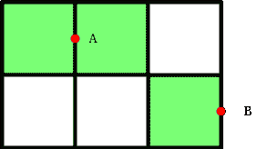

# 覆盖二维网格所有块所需的最小点数

> 原文:[https://www . geeksforgeeks . org/覆盖所有 2d 网格块所需的最小点数/](https://www.geeksforgeeks.org/minimum-number-of-points-required-to-cover-all-blocks-of-a-2-d-grid/)

给定两个整数 **N** 和 **M** 。任务是找到覆盖一个 **N * M** 网格所需的最小点数。

> 当一个点被放置在任何公共线或边线上时，它可以覆盖二维网格中的两个块。

**例:**

> **输入:** N = 5，M = 7
> **输出:** 18
> **输入:** N = 3，M = 8
> **输出:** 12

**进场:**这个问题可以用[贪婪进场](https://www.geeksforgeeks.org/greedy-algorithms/)解决。主要思想是观察放置在公共线或边线上的单个点覆盖两个块。所以当 **B** 为偶数时，覆盖所有区块(比如 **B 区块**)所需的总点数为 **B/2** ，否则 **B/2 + 1** 当 **B** 为奇数时。
对于具有 **N*M** 块的网格，当其中任何一个为偶数时，块的总数将为 **(N*M)/2** 。否则，将需要 **((N*M)/2) + 1** 点来覆盖所有块，最后一个未触及的块需要一个额外的点。
下图显示了如何使用点来覆盖 2D 网格中的块:

[](https://media.geeksforgeeks.org/wp-content/uploads/20200624075349/gridCovering.png)

“A”点覆盖两个街区，“B”点覆盖一个街区。
以下是上述方法的实现:

## C++

```
// C++ program for the above approach
#include <bits/stdc++.h>
using namespace std;

// Function to find the minimum number
// of Points required to cover a grid
int minPoints(int n, int m)
{
    int ans = 0;

    // If number of block is even
    if ((n % 2 != 0)
        && (m % 2 != 0)) {
        ans = ((n * m) / 2) + 1;
    }
    else {
        ans = (n * m) / 2;
    }

    // Return the minimum points
    return ans;
}

// Driver Code
int main()
{
    // Given size of grid
    int N = 5, M = 7;

    // Function Call
    cout << minPoints(N, M);
    return 0;
}
```

## Java 语言(一种计算机语言，尤用于创建网站)

```
// Java program for the above approach
class GFG{

// Function to find the minimum number
// of Points required to cover a grid
static int minPoints(int n, int m)
{
    int ans = 0;

    // If number of block is even
    if ((n % 2 != 0) && (m % 2 != 0))
    {
        ans = ((n * m) / 2) + 1;
    }
    else
    {
        ans = (n * m) / 2;
    }

    // Return the minimum points
    return ans;
}

// Driver Code
public static void main (String[] args)
{
    // Given size of grid
    int N = 5, M = 7;

    // Function Call
    System.out.print(minPoints(N, M));
}
}

// This code is contributed by Ritik Bansal
```

## 蟒蛇 3

```
# Python3 program for the above approach

# Function to find the minimum number
# of Points required to cover a grid
def minPoints(n, m):

    ans = 0

    # If number of block is even
    if ((n % 2 != 0) and (m % 2 != 0)):
        ans = ((n * m) // 2) + 1

    else:
        ans = (n * m) // 2

    # Return the minimum points
    return ans

# Driver code
if __name__ == '__main__':

    # Given size of grid
    N = 5
    M = 7

    # Function call
    print(minPoints(N, M))

# This code is contributed by himanshu77
```

## C#

```
// C# program for the above approach
using System;
class GFG{

// Function to find the minimum number
// of Points required to cover a grid
static int minPoints(int n, int m)
{
    int ans = 0;

    // If number of block is even
    if ((n % 2 != 0) && (m % 2 != 0))
    {
        ans = ((n * m) / 2) + 1;
    }
    else
    {
        ans = (n * m) / 2;
    }

    // Return the minimum points
    return ans;
}

// Driver Code
public static void Main(String[] args)
{
    // Given size of grid
    int N = 5, M = 7;

    // Function Call
    Console.Write(minPoints(N, M));
}
}

// This code is contributed by sapnasingh4991
```

## java 描述语言

```
<script>
// Javascript implementation for the above approach

// Function to find the minimum number
// of Polets required to cover a grid
function minPolets(n, m)
{
    let ans = 0;

    // If number of block is even
    if ((n % 2 != 0) && (m % 2 != 0))
    {
        ans = Math.floor((n * m) / 2) + 1;
    }
    else
    {
        ans = Math.floor((n * m) / 2);
    }

    // Return the minimum polets
    return ans;
}

    // Driver Code

    // Given size of grid
    let N = 5, M = 7;

    // Function Call
    document.write(minPolets(N, M));

</script>
```

**Output:** 

```
18
```

**时间复杂度:***O(1)*
T5】辅助空间: *O(1)*