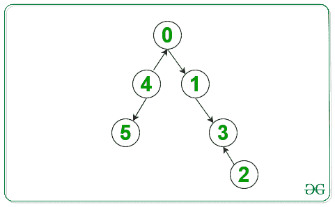
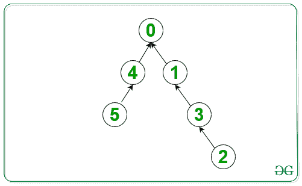
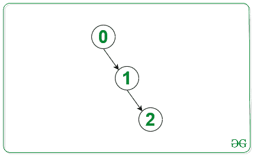

# 每隔一个节点到达节点 0 的最小反转次数

> 原文:[https://www . geeksforgeeks . org/每隔一个节点到达节点 0 的最小反转次数/](https://www.geeksforgeeks.org/minimum-number-of-reversals-to-reach-node-0-from-every-other-node/)

给定一个具有从 **0 到 N–1**的 **N** 顶点值和**N–1**边的有向图，任务是计算必须反转的边的数量，以便从每个节点到**节点 0** 总有一条路径。

**示例:**

> **输入:**下面是给定的图形
> 
> 
> 
> **输出:**3
> T3】说明:T5】
> 
> 
> 
> **输入:**下面是给定的图形
> 
> 
> 
> **输出:** 0

**方法:**想法是对一个图使用 [BFS 遍历。以下是步骤:](https://www.geeksforgeeks.org/breadth-first-search-or-bfs-for-a-graph/)

1.  创建一个方向相反的有向图。
2.  创建一个[队列](https://www.geeksforgeeks.org/queue-data-structure/)，并将**节点 0** 推送到队列中。
3.  在图的 BFS 遍历过程中，请执行以下操作:
    *   从队列中弹出前节点(比如 **current_node** )。
    *   遍历反向图中当前节点的[邻接表](https://www.geeksforgeeks.org/add-and-remove-vertex-in-adjacency-list-representation-of-graph/)，将队列中未被访问的节点推入。
    *   遍历反向图中当前节点的[邻接表](https://www.geeksforgeeks.org/add-and-remove-vertex-in-adjacency-list-representation-of-graph/)，将队列中未被访问的节点推入。
    *   在上述步骤中插入队列的节点总数是需要反转的边数，因为图中连接到当前节点但尚未被访问的节点无法到达**节点 0** ，因此我们需要反转它们的方向。将上述步骤中的节点数加到最终计数中。

下面是上述方法的实现:

## C++

```
// C++ program for the above approach
#include <bits/stdc++.h>
using namespace std;

// Function to find minimum reversals
int minRev(vector<vector<int> > edges,
           int n)
{

    // Add all adjacent nodes to
    // the node in the graph
    unordered_map<int, vector<int> > graph;
    unordered_map<int, vector<int> > graph_rev;

    for (int i = 0;
         i < edges.size(); i++) {

        int x = edges[i][0];
        int y = edges[i][1];

        // Insert edges in the graph
        graph[x].push_back(y);

        // Insert edges in the
        // reversed graph
        graph_rev[y].push_back(x);
    }

    queue<int> q;

    // Create array visited to mark
    // all the visited nodes
    vector<int> visited(n, 0);
    q.push(0);

    // Stores the number of
    // edges to be reversed
    int ans = 0;

    // BFS Traversal
    while (!q.empty()) {

        // Pop the current node
        // from the queue
        int curr = q.front();

        // mark the current
        // node visited
        visited[curr] = 1;

        // Initialize count of edges
        // need to be reversed to 0
        int count = 0;
        q.pop();

        // Push adjacent nodes in the
        // reversed graph to the queue,
        // if not visited
        for (int i = 0;
             i < graph_rev[curr].size();
             i++) {

            if (!visited[graph_rev[curr][i]]) {
                q.push(graph_rev[curr][i]);
            }
        }

        // Push adjacent nodes in graph
        // to the queue, if not visited
        // count the number of
        // nodes added to the queue
        for (int i = 0;
             i < graph[curr].size();
             i++) {

            if (!visited[graph[curr][i]]) {
                q.push(graph[curr][i]);
                count++;
            }
        }

        // Update the reverse edge
        // to the final count
        ans += count;
    }

    // Return the result
    return ans;
}

// Driver Code
int main()
{
    vector<vector<int> > edges;

    // Given edges to the graph
    edges = { { 0, 1 }, { 1, 3 }, { 2, 3 },
              { 4, 0 }, { 4, 5 } };

    // Number of nodes
    int n = 6;

    // Function Call
    cout << minRev(edges, n);
    return 0;
}
```

## 蟒蛇 3

```
# Python3 program for the above approach

# Function to find minimum reversals
def minRev(edges, n):

    # Add all adjacent nodes to
    # the node in the graph
    graph = dict()
    graph_rev = dict()

    for i in range(len(edges)):

        x = edges[i][0];
        y = edges[i][1];

        # Insert edges in the graph
        if x not in graph:
            graph[x] = []
        graph[x].append(y);

        # Insert edges in the
        # reversed graph
        if y not in graph_rev:
            graph_rev[y] = []
        graph_rev[y].append(x);

    q = []

    # Create array visited to mark
    # all the visited nodes
    visited = [0 for i in range(n)]
    q.append(0);

    # Stores the number of
    # edges to be reversed
    ans = 0;

    # BFS Traversal
    while (len(q) != 0):

        # Pop the current node
        # from the queue
        curr = q[0]

        # mark the current
        # node visited
        visited[curr] = 1;

        # Initialize count of edges
        # need to be reversed to 0
        count = 0;
        q.pop(0);

        # Push adjacent nodes in the
        # reversed graph to the queue,
        # if not visited
        if curr in graph_rev:
            for i in range(len(graph_rev[curr])):

                if (not visited[graph_rev[curr][i]]):
                    q.append(graph_rev[curr][i]);

        # Push adjacent nodes in graph
        # to the queue, if not visited
        # count the number of
        # nodes added to the queue
        if curr in graph:
            for i in range(len(graph[curr])):

                if (not visited[graph[curr][i]]):
                    q.append(graph[curr][i]);
                    count += 1

        # Update the reverse edge
        # to the final count
        ans += count;

    # Return the result
    return ans;

# Driver Code
if __name__=='__main__':

    edges = []

    # Given edges to the graph
    edges = [ [ 0, 1 ], [ 1, 3 ], [ 2, 3 ],[ 4, 0 ], [ 4, 5 ] ];

    # Number of nodes
    n = 6;

    # Function Call
    print(minRev(edges, n))

# This code is contributed by rutvik_56
```

## C#

```
// C# program for the above approach
using System;
using System.Collections;
using System.Collections.Generic;

class GFG{

// Function to find minimum reversals
static int minRev(ArrayList edges, int n)
{

    // Add all adjacent nodes to
    // the node in the graph
    Dictionary<int,
               ArrayList> graph = new Dictionary<int,
                                                 ArrayList>();

    Dictionary<int,
               ArrayList> graph_rev = new Dictionary<int,
                                                     ArrayList>();

    for(int i = 0;i < edges.Count; i++)
    {

        int x = (int)((ArrayList)edges[i])[0];
        int y = (int)((ArrayList)edges[i])[1];

        // Insert edges in the graph
        if (!graph.ContainsKey(x))
        {
            graph[x] = new ArrayList();
        }
        graph[x].Add(y);

        // Insert edges in the
        // reversed graph
        if (!graph_rev.ContainsKey(y))
        {
            graph_rev[y] = new ArrayList();
        }
        graph_rev[y].Add(x);
    }

    Queue q = new Queue();

    // Create array visited to mark
    // all the visited nodes
    ArrayList visited = new ArrayList();
    for(int i = 0; i < n + 1; i++)
    {
        visited.Add(false);
    }
    q.Enqueue(0);

    // Stores the number of
    // edges to be reversed
    int ans = 0;

    // BFS Traversal
    while (q.Count != 0)
    {

        // Pop the current node
        // from the queue
        int curr = (int)q.Peek();

        // mark the current
        // node visited
        visited[curr] = true;

        // Initialize count of edges
        // need to be reversed to 0
        int count = 0;
        q.Dequeue();

        // Enqueue adjacent nodes in the
        // reversed graph to the queue,
        // if not visited
        if (graph_rev.ContainsKey(curr))
        {
            for (int i = 0;
                     i < graph_rev[curr].Count;
                     i++)
            {
                if (!(bool)visited[(int)(
                    (ArrayList)graph_rev[curr])[i]])
                {
                    q.Enqueue((int)(
                        (ArrayList)graph_rev[curr])[i]);
                }
            }
        }

        // Enqueue adjacent nodes in graph
        // to the queue, if not visited
        // count the number of
        // nodes added to the queue
        if (graph.ContainsKey(curr))
        {
            for(int i = 0;
                    i < ((ArrayList)graph[curr]).Count;
                    i++)
            {
                if (!(bool)visited[(int)(
                    (ArrayList)graph[curr])[i]])
                {
                    q.Enqueue((int)(
                        (ArrayList)graph[curr])[i]);
                    count++;
                }
            }
        }

        // Update the reverse edge
        // to the final count
        ans += count;
    }

    // Return the result
    return ans;
}

// Driver Code
public static void Main(string []args)
{
    ArrayList edges = new ArrayList(){
                      new ArrayList(){ 0, 1 },
                      new ArrayList(){ 1, 3 },
                      new ArrayList(){ 2, 3 },
                      new ArrayList(){ 4, 0 },
                      new ArrayList(){ 4, 5 } };

    // Number of nodes
    int n = 6;

    // Function Call
    Console.Write(minRev(edges, n));
}
}

// This code is contributed by pratham76
```

**Output:** 

```
3
```

**时间复杂度:** *O(V+E)* 其中 V 为顶点数，E 为边数。
**辅助空间:** *O(V)* 其中 V 为顶点数。