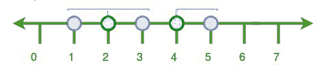
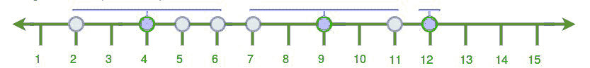

# 要求的塔的最小数量，使得每栋房屋至少在一个塔的范围内

> 原文:[https://www . geeksforgeeks . org/所需塔的最小数量，以便每所房子都在至少一个塔的范围内/](https://www.geeksforgeeks.org/minimum-number-of-towers-required-such-that-every-house-is-in-the-range-of-at-least-one-tower/)

给定一张城市地图和网络范围，任务是确定塔的最小数量，以便每个房子都在至少一个塔的范围内。每个塔都必须安装在现有房屋的顶部。

**示例:**

```
Input: range : 1
       house : 1 2 3 4 5
Output: 2

Input: range : 2
       house : 7 2 4 6 5 9 12 11 
Output: 3
```



所有的城市都可以通过插入两个塔来覆盖，即在 2 号和 4 号房。



所有的城市都可以通过插入 3 个塔来覆盖，即在 4 号、9 号和 12 号房。
**算法:-**

1.  首先，对所有元素进行排序。
2.  只计算一次，然后遍历直到它的中间房子。
3.  在此之后，再次遍历直到塔范围。
4.  再次重复 1、2、3 步，直到所有房屋都被覆盖。

以下是上述方法的实现:

## C++

```
// C++ implementation of above approach
#include <bits/stdc++.h>
using namespace std;

// Function to count the number of tower
int number_of_tower(int house[], int range, int n)
{

    // first we sort the house numbers
    sort(house, house + n);

    // for count number of towers
    int numOfTower = 0;

    // for iterate all houses
    int i = 0;
    while (i < n) {

        // count number of towers
        numOfTower++;

        // find find the middle location
        int loc = house[i] + range;

        // traverse till middle location
        while (i < n && house[i] <= loc)
            i++;

        // this is point to middle
        // house where we insert the tower
        --i;

        // now find the last location
        loc = house[i] + range;

        // traverse till last house of the range
        while (i < n && house[i] <= loc)
            i++;
    }

    // return the number of tower
    return numOfTower;
}

// Driver code
int main()
{
    // given elements
    int house[] = { 7, 2, 4, 6, 5, 9, 12, 11 };
    int range = 2;
    int n = sizeof(house) / sizeof(house[0]);

    // print number of towers
    cout << number_of_tower(house, range, n);
}
```

## Java 语言(一种计算机语言，尤用于创建网站)

```
// Java implementation of above approach

import java.util.Arrays;

public class Improve {

    // Function to count the number of tower
    static int number_of_tower(int house[], int range, int n)
    {

        // first we sort the house numbers
        Arrays.sort(house);

        // for count number of towers
        int numOfTower = 0;

        // for iterate all houses
        int i = 0;
        while (i < n) {

            // count number of towers
            numOfTower++;

            // find find the middle location
            int loc = house[i] + range;

            // traverse till middle location
            while (i < n && house[i] <= loc)
                i++;

            // this is point to middle
            // house where we insert the tower
            --i;

            // now find the last location
            loc = house[i] + range;

            // traverse till last house of the range
            while (i < n && house[i] <= loc)
                i++;
        }

        // return the number of tower
        return numOfTower;
    }

    public static void main(String args[])
    {
        // given elements
        int house[] = { 7, 2, 4, 6, 5, 9, 12, 11 };
        int range = 2;
        int n = house.length;

        // print number of towers
        System.out.println(number_of_tower(house, range, n));

    }
    // This code is contributed by ANKITRAI1
}
```

## 蟒蛇 3

```
# Python 3 implementation of
# above approach

# Function to count the
# number of tower
def number_of_tower(house, r, n):

    # first we sort the house numbers
    house.sort()

    # for count number of towers
    numOfTower = 0

    # for iterate all houses
    i = 0
    while (i < n) :

        # count number of towers
        numOfTower += 1

        # find find the middle location
        loc = house[i] + r

        # traverse till middle location
        while (i < n and house[i] <= loc):
            i += 1

        # this is point to middle
        # house where we insert the tower
        i -= 1

        # now find the last location
        loc = house[i] + r

        # traverse till last house
        # of the range
        while (i < n and house[i] <= loc):
            i += 1

    # return the number of tower
    return numOfTower

# Driver code
if __name__ == "__main__":

    # given elements
    house = [ 7, 2, 4, 6, 5, 9, 12, 11 ]
    r = 2
    n = len(house)

    # print number of towers
    print(number_of_tower(house, r, n))

# This code is contributed
# by ChitraNayal
```

## C#

```
// C# implementation of above approach

using System;

public class Improve {

    // Function to count the number of tower
    static int number_of_tower(int []house, int range, int n)
    {

        // first we sort the house numbers
        Array.Sort(house);

        // for count number of towers
        int numOfTower = 0;

        // for iterate all houses
        int i = 0;
        while (i < n) {

            // count number of towers
            numOfTower++;

            // find find the middle location
            int loc = house[i] + range;

            // traverse till middle location
            while (i < n && house[i] <= loc)
                i++;

            // this is point to middle
            // house where we insert the tower
            --i;

            // now find the last location
            loc = house[i] + range;

            // traverse till last house of the range
            while (i < n && house[i] <= loc)
                i++;
        }

        // return the number of tower
        return numOfTower;
    }

    public static void Main()
    {
        // given elements
        int []house = { 7, 2, 4, 6, 5, 9, 12, 11 };
        int range = 2;
        int n = house.Length;

        // print number of towers
        Console.WriteLine(number_of_tower(house, range, n));

 // This code is contributed by inder_verma..
    }

}
```

## 服务器端编程语言（Professional Hypertext Preprocessor 的缩写）

```
<?php
//PHP implementation of above approach

// Function to count the number of tower
function  number_of_tower($house, $range, $n)
{

    // first we sort the house numbers
    sort($house);

    // for count number of towers
    $numOfTower = 0;

    // for iterate all houses
    $i = 0;
    while ($i < $n) {

        // count number of towers
        $numOfTower++;

        // find find the middle location
        $loc = $house[$i] + $range;

        // traverse till middle location
        while ($i < $n && $house[$i] <= $loc)
            $i++;

        // this is point to middle
        // house where we insert the tower
        --$i;

        // now find the last location
        $loc = $house[$i] + $range;

        // traverse till last house of the range
        while ($i < $n && $house[$i] <= $loc)
            $i++;
    }

    // return the number of tower
    return $numOfTower;
}

// Driver code

    // given elements
    $house = array( 7, 2, 4, 6, 5, 9, 12, 11 );
    $range = 2;
    $n = sizeof($house) / sizeof($house[0]);

    // print number of towers
    echo  number_of_tower($house, $range, $n);

// This code is contributed by Sachin.
?>
```

## java 描述语言

```
<script>

// JavaScript implementation of above approach

    // Function to count the number of tower
    function number_of_tower(house,range,n)
    {
        // first we sort the house numbers
        house.sort(function(a,b){return a-b;});

        // for count number of towers
        let numOfTower = 0;

        // for iterate all houses
        let i = 0;
        while (i < n) {

            // count number of towers
            numOfTower++;

            // find find the middle location
            let loc = house[i] + range;

            // traverse till middle location
            while (i < n && house[i] <= loc)
                i++;

            // this is point to middle
            // house where we insert the tower
            --i;

            // now find the last location
            loc = house[i] + range;

            // traverse till last house of the range
            while (i < n && house[i] <= loc)
                i++;
        }

        // return the number of tower
        return numOfTower;
    }

    // given elements
    let house=[7, 2, 4, 6, 5, 9, 12, 11];
    let range = 2;
    let n = house.length;
    // print number of towers
    document.write(number_of_tower(house, range, n));

// This code is contributed by avanitrachhadiya2155

</script>
```

**Output:** 

```
3
```

**时间复杂度:**O(nlogn)
T3】空间复杂度: O(1)