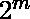

# 将 N 以下的每个整数表示为总和所需的最小数

> 原文:[https://www . geesforgeks . org/需要最小数字来表示 n 以下的每个整数作为总和/](https://www.geeksforgeeks.org/minimum-numbers-needed-to-express-every-integer-below-n-as-a-sum/)

我们有一个整数 N。我们需要将 N 表示为 K 个整数的和，这样通过将这些整数中的一些(或全部)相加，我们可以得到[1，N]范围内的所有数字。K 的最小值是多少？

**示例:**

```
Input  : N = 7
Output : 3
Explanation : Three integers are 1, 2, 4\. By adding some(or all) of these groups we can get all number in the range 1 to N. 
1; 2; 1+2=3; 4; 1+4=5; 2+4=6; 1+2+4=7

Input  : N = 32
Output : 6
Explanation : Six integers are 1, 2, 4, 8, 16, 1.
```

首先我们手工解决小数字的问题。
n=1 : 1
n=2 : 1，1
n=3 : 1，2
n=4 : 1，2，1
n=5 : 1，2，2
n=6 : 1，2，3
n=7 : 1，2，4
n=8 : 1，2，4，1
如果我们仔细检查，我们可以看到如果则整数为![[1, 2, 4..., 2^{m-1}]  ](img/e9538b83683a0863cc492deb3cac40c6.png "Rendered by QuickLaTeX.com")。这只是另一种说法。所以现在我们知道对于K 的最小值是 m。
现在我们检查对于发生了什么。对于我们只是在整数列表中添加一个新的整数 1。意识到对于中的每个数字，我们可以将新添加的整数增加 1，这将是整数的最佳列表。要验证 N=4 到 N=7，最小 K 不变；每一步只增加最后一个整数。

当然，我们可以在 **O(log N)** 时间内以迭代方式实现这一点(通过在列表中插入 2 的连续幂，最后一个元素将是 N-(2^n-1)).的形式但这和求 N 的二进制表达式的长度完全一样，也可以在 **O(对数 N)** 时间内完成。

## C++

```
// CPP program to find count of integers needed
// to express all numbers from 1 to N.
#include <bits/stdc++.h>
using namespace std;

// function to count length of binary expression of n
int countBits(int n)
{
    int count = 0;
    while (n) {
        count++;
        n >>= 1;
    }
    return count;
}

// Driver code
int main()
{
    int n = 32;
    cout << "Minimum value of K is = "
         << countBits(n) << endl;
    return 0;
}
```

## Java 语言(一种计算机语言，尤用于创建网站)

```
// Java  program to find count of integers needed
// to express all numbers from 1 to N

import java.io.*;

class GFG {

// function to count length of binary expression of n
static int countBits(int n)
{
    int count = 0;
    while (n>0) {
        count++;
        n >>= 1;
    }
    return count;
}

// Driver code
    public static void main (String[] args) {
        int n = 32;
        System.out.println("Minimum value of K is = "+
             countBits(n));

    }
}
```

## 蟒蛇 3

```
# Python3 program to find count of integers
# needed to express all numbers from 1 to N.

# function to count length of
# binary expression of n
def countBits(n):

    count = 0;
    while (n):
        count += 1;
        n >>= 1;

    return count;

# Driver code
n = 32;
print("Minimum value of K is =",
                  countBits(n));

# This code is contributed by mits
```

## C#

```
// C# program to find count of
// integers needed to express all
// numbers from 1 to N
using System;

class GFG
{
// function to count length of
// binary expression of n
static int countBits(int n)
{
    int count = 0;
    while (n > 0)
    {
        count++;
        n >>= 1;
    }
    return count;
}

// Driver code
static public void Main ()
{
    int n = 32;
    Console.WriteLine("Minimum value of K is = "+
                                   countBits(n));
}
}

// This code is contributed
// by Sach_Code
```

## 服务器端编程语言（Professional Hypertext Preprocessor 的缩写）

```
<?php
// PHP program to find count of integers
// needed to express all numbers from 1 to N.

// function to count length of
// binary expression of n
function countBits($n)
{
    $count = 0;
    while ($n)
    {
        $count++;
        $n >>= 1;
    }
    return $count;
}

// Driver code
$n = 32;
echo "Minimum value of K is = ",
      countBits($n), "\n";

// This code is contributed by Sachin
?>
```

## java 描述语言

```
<script>

// Javascript program to find count of
// integers needed to express all
// numbers from 1 to N.

// Function to count length of binary
// expression of n
function countBits(n)
{
    var count = 0;
    while (n)
    {
        count++;
        n >>= 1;
    }
    return count;
}

// Driver code
var n = 32;
document.write("Minimum value of K is = "  +
               countBits(n));

// This code is contributed by rrrtnx

</script>
```

**输出:**

```
Minimum value of K is = 6
```

请参见[计数设置位](https://www.geeksforgeeks.org/count-set-bits-in-an-integer/)了解更有效的整数计数设置位的方法。