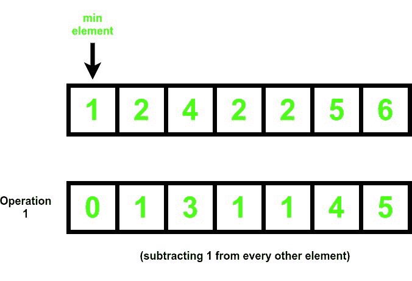
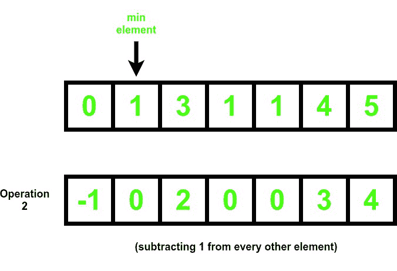
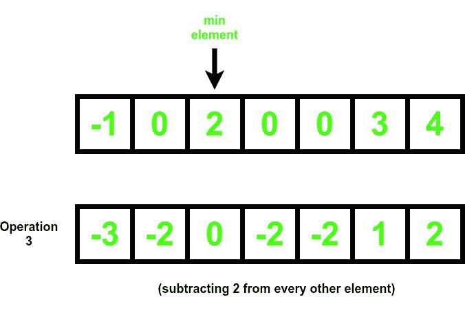
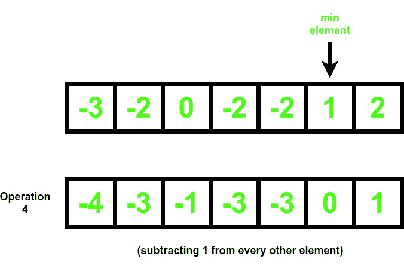
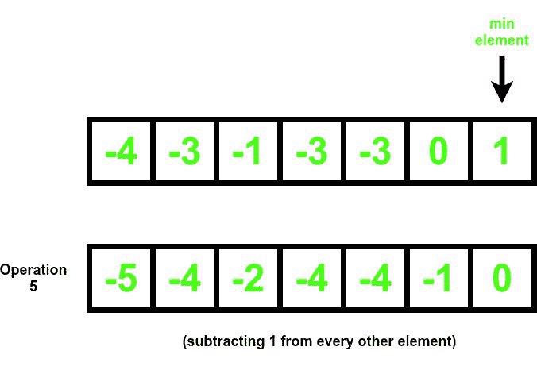

# 使数组所有元素小于或等于 0 所需的最小运算

> 原文:[https://www . geeksforgeeks . org/最小操作-要求使数组的所有元素小于等于 0/](https://www.geeksforgeeks.org/minimum-operations-required-to-make-all-elements-of-array-less-than-equal-to-0/)

给定一个由 **N** 个正数组成的[数组](https://www.geeksforgeeks.org/introduction-to-arrays/) **arr[]** ，任务是找到使[数组](https://www.geeksforgeeks.org/introduction-to-arrays/)的所有元素小于或等于 **0** 所需的最小运算次数。在每次操作中，必须从[数组](https://www.geeksforgeeks.org/introduction-to-arrays/)中选择最小正元素，并从该数字中减去[数组](https://www.geeksforgeeks.org/introduction-to-arrays/)的所有元素。

**示例:**

> **输入:** arr[] = {1，2，4，2，2，5，6}
> **输出:** 5
> **说明:**说明见下图:
> 
>    
> 
> 
> 
> 生成的数组符合标准，因为它的所有元素都小于或等于 0
> 
> **输入:** arr[] = {1，2，3 }
> T3】输出: 3

**天真法:**解决问题最简单的方法是[遍历数组](https://www.geeksforgeeks.org/c-program-to-traverse-an-array/)，当[数组](https://www.geeksforgeeks.org/introduction-to-arrays/)的所有元素不小于等于 **0** 时，找到最小非零正元素，从整个[数组](https://www.geeksforgeeks.org/introduction-to-arrays/)中减去该元素。

***时间复杂度:**O(N<sup>2</sup>)*
***辅助空间:** O(1)*

**有效方法:**通过观察答案将是[数组](https://www.geeksforgeeks.org/introduction-to-arrays/)中非零不同元素的数量，可以进一步优化上述方法。按照以下步骤解决问题:

*   初始化一个[哈希映射](https://www.geeksforgeeks.org/java-util-hashmap-in-java-with-examples/)比如 **m** ，存储[数组](https://www.geeksforgeeks.org/introduction-to-arrays/)中存在的唯一元素。
*   [使用变量 **i** 在范围](https://www.geeksforgeeks.org/range-based-loop-c/)**【0，N-1】**中迭代，并将**m【arr[I]】**标记为 **1** 。
*   打印 **m.size()** 的值作为答案。

下面是上述方法的实现:

## C++

```
// C++ Program for the above approach
#include <bits/stdc++.h>
using namespace std;

// Function to find minimum number of
// non-zero elements that has to be subtracted
// such that all the elements are less than or 0
int distinct(vector<int> arr)
{
    // Hash map to mark elements true
    // that are present in the array
    map<int, bool> m;

    // Traverse the array
    for (int i = 0; i < arr.size(); i++) {
        // Mark arr[i] true
        m[arr[i]] = true;
    }

    // Finally, return the size of hashmap
    return m.size();
}

// Driver Code
int main()
{

    // Given Input
    vector<int> arr = { 1, 2, 4, 2, 2, 5, 6 };

    // Function Call
    int ans = distinct(arr);
    cout << ans << endl;
    return 0;
}
```

## Java 语言(一种计算机语言，尤用于创建网站)

```
// Java program for the above approach
import java.util.HashMap;

class GFG{

// Function to find minimum number of
// non-zero elements that has to be subtracted
// such that all the elements are less than or 0
public static int distinct(int[] arr)
{

    // Hash map to mark elements true
    // that are present in the array
    HashMap<Integer,
            Boolean> m = new HashMap<Integer,
                                     Boolean>();

    // Traverse the array
    for(int i = 0; i < arr.length; i++)
    {

        // Mark arr[i] true
        m.put(arr[i], true);
    }

    // Finally, return the size of hashmap
    return m.size();
}

// Driver Code
public static void main(String args[])
{

    // Given Input
    int[] arr = { 1, 2, 4, 2, 2, 5, 6 };

    // Function Call
    int ans = distinct(arr);

    System.out.println(ans);
}
}

// This code is contributed by gfgking
```

## 蟒蛇 3

```
# Python 3 Program for the above approach

# Function to find minimum number of
# non-zero elements that has to be subtracted
# such that all the elements are less than or 0
def distinct(arr):

    # Hash map to mark elements true
    # that are present in the array
    m = {}

    # Traverse the array
    for i in range(len(arr)):
        # Mark arr[i] true
        m[arr[i]] = True

    # Finally, return the size of hashmap
    return len(m)

# Driver Code
if __name__ == "__main__":

    # Given Input
    arr = [1, 2, 4, 2, 2, 5, 6]

    # Function Call
    ans = distinct(arr)
    print(ans)

    # This code is contributed by  ukasp.
```

## C#

```
// C# program for the above approach
using System;
using System.Collections.Generic;

class GFG{

// Function to find minimum number of
// non-zero elements that has to be subtracted
// such that all the elements are less than or 0
static int distinct(List<int> arr)
{

    // Hash map to mark elements true
    // that are present in the array
    Dictionary<int,
               bool> m = new Dictionary<int,
                                        bool>();

    // Traverse the array
    for(int i = 0; i < arr.Count; i++)
    {

        // Mark arr[i] true
        if (m.ContainsKey(arr[i]))
            m[arr[i]] = true;
        else
            m.Add(arr[i],true);
    }

    // Finally, return the size of hashmap
    return m.Count;
}

// Driver Code
public static void Main()
{

    // Given Input
    List<int> arr = new List<int>(){ 1, 2, 4, 2, 2, 5, 6 };

    // Function Call
    int ans = distinct(arr);
    Console.Write(ans);
}
}

// This code is contributed by SURENDRA_GANGWAR
```

## java 描述语言

```
<script>

// JavaScript Program for the above approach

// Function to find minimum number of
// non-zero elements that has to be subtracted
// such that all the elements are less than or 0
function distinct(arr) {
    // Hash map to mark elements true
    // that are present in the array
    let m = new Map();

    // Traverse the array
    for (let i = 0; i < arr.length; i++) {
        // Mark arr[i] true
        m.set(arr[i], true);
    }

    // Finally, return the size of hashmap
    return m.size;
}

// Driver Code

// Given Input
let arr = [1, 2, 4, 2, 2, 5, 6];

// Function Call
let ans = distinct(arr);
document.write(ans + "<br>");

</script>
```

**Output:** 

```
5
```

***时间复杂度:** O(N)*
***辅助空间:** O(1)*