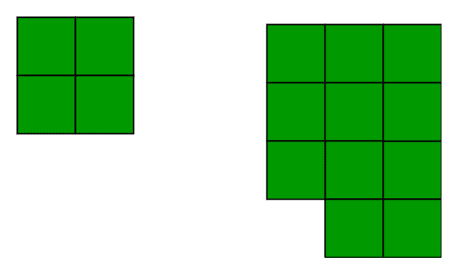

# n 块的最小周长

> 原文:[https://www.geeksforgeeks.org/minimum-perimeter-n-blocks/](https://www.geeksforgeeks.org/minimum-perimeter-n-blocks/)

给我们 n 个大小为 1×1 的块，我们需要找到这些块构成的网格的最小周长。
**例:**

```
Input : n = 4
Output : 8
Minimum possible perimeter with 4 blocks
is 8\. See below explanation.

Input : n = 11
Output : 14
The square grid of above examples would be as
```



让我们举个例子来看一个模式。假设我们有 4 个区块，以下是不同的可能性

```
  +--+--+--+--+
  |  |  |  |  |  Perimeter = 10
  +--+--+--+--+

  +--+--+--+
  |  |  |  |     Perimeter = 10
  +--+--+--+
        |  |
        +--+

  +--+--+--+
  |  |  |  |     Perimeter = 10
  +--+--+--+
     |  |
     +--+

  +--+--+
  |  |  |        Perimeter = 8
  +--+--+
  |  |  |
  +--+--+
```

如果我们用纸和笔做一些例子，我们可以注意到当形成的形状最接近正方形时，周长变得最小。这样做的原因是，我们希望块的最大边面向形状内部，以便形状的周长变得最小。
如果方块的数量是一个完美的正方形，那么周长就是 4*sqrt(n)。
但是，如果块数不是完美的平方根，那么我们计算最接近平方根的行数和列数。在将方块排列成矩形后，我们还有剩余的方块，然后我们将简单地在周长上增加 2，因为只剩下 2 个额外的边。
下面给出上述想法的实现。

## C++

```
// CPP program to find minimum
// perimeter using n blocks.
#include <bits/stdc++.h>
using namespace std;

int minPerimeter(int n)
{
    int l = sqrt(n);
    int sq = l * l;

    // if n is a perfect square
    if (sq == n)
        return l * 4;
    else
    {
        // Number of rows
        long long int row = n / l;

        // perimeter of the
        // rectangular grid
        long long int perimeter
                      = 2 * (l + row);

        // if there are blocks left
        if (n % l != 0)
            perimeter += 2;
        return perimeter;
    }
}

// Driver code
int main()
{
    int n = 10;
    cout << minPerimeter(n);
    return 0;
}
```

## Java 语言(一种计算机语言，尤用于创建网站)

```
// JAVA Code to find minimum
// perimeter using n blocks
import java.util.*;

class GFG
{
    public static long minPerimeter(int n)
    {
        int l = (int) Math.sqrt(n);
        int sq = l * l;

        // if n is a perfect square
        if (sq == n)
            return l * 4;
        else
        {
            // Number of rows
            long row = n / l;

            // perimeter of the
            // rectangular grid
            long perimeter
                  = 2 * (l + row);

            // if there are blocks left
            if (n % l != 0)
                perimeter += 2;
            return perimeter;
        }
    }

    // Driver code
    public static void main(String[] args)
    {
        int n = 10;
        System.out.println(minPerimeter(n));
    }
}

// This code is contributed by Arnav Kr. Mandal
```

## 蟒蛇 3

```
# Python3 program to find minimum
# perimeter using n blocks.
import math

def minPerimeter(n):
    l = math.sqrt(n)
    sq = l * l

    # if n is a perfect square
    if (sq == n):
        return l * 4
    else :
        # Number of rows
        row = n / l

        # perimeter of the
        # rectangular grid
        perimeter = 2 * (l + row)

        # if there are blocks left
        if (n % l != 0):
            perimeter += 2
        return perimeter

# Driver code
n = 10
print(int(minPerimeter(n)))

# This code is contributed by
# Prasad Kshirsagar
```

## C#

```
// C# Code to find minimum
// perimeter using n blocks
using System;

class GFG
{
    public static long minPerimeter(int n)
    {
        int l = (int) Math.Sqrt(n);
        int sq = l * l;

        // if n is a perfect square
        if (sq == n)
            return l * 4;
        else
        {
            // Number of rows
            long row = n / l;

            // perimeter of the
            // rectangular grid
            long perimeter
                  = 2 * (l + row);

            // if there are blocks left
            if (n % l != 0)
                perimeter += 2;
            return perimeter;
        }
    }

    // Driver code
    public static void Main()
    {
        int n = 10;
        Console.Write(minPerimeter(n));
    }
}

// This code is contributed by nitin mittal
```

## 服务器端编程语言（Professional Hypertext Preprocessor 的缩写）

```
<?php
// PHP program to find minimum
// perimeter using n blocks.

function minPerimeter($n)
{
    $l = floor(sqrt($n));
    $sq = $l * $l;

    // if n is a perfect square
    if ($sq == $n)
        return $l * 4;
    else
    {
        // Number of rows
        $row = floor($n / $l);

        // perimeter of the
        // rectangular grid
        $perimeter = 2 * ($l + $row);

        // if there are blocks left
        if ($n % $l != 0)
            $perimeter += 2;
        return $perimeter;
    }
}

// Driver code
$n = 10;
echo minPerimeter($n);

// This code is contributed
// by nitin mittal.
?>
```

## java 描述语言

```
<script>

// JavaScript program for the
// above approach

function minPerimeter(n)
    {
        let l =  Math.sqrt(n);
        let sq = l * l;

        // if n is a perfect square
        if (sq == n)
            return l * 4;
        else
        {
            // Number of rows
            let row = n / l;

            // perimeter of the
            // rectangular grid
            let perimeter
                  = 2 * (l + row);

            // if there are blocks left
            if (n % l != 0)
                perimeter += 2;
            return perimeter;
        }
    }

// Driver Code

    let n = 10;
    document.write(Math.floor(minPerimeter(n)))

</script>
```

**输出:**

```
14
```

**参考文献:**
[【http://mathforum.org/library/drmath/view/61595.html】](http://mathforum.org/library/drmath/view/61595.html)
[intermath . Coe . uga . edu/tweb/gcsu-geo-SPR 06/aheah/aheah _ rectpery . doc](http://intermath.coe.uga.edu/tweb/gcsu-geo-spr06/aheath/aheath_rectperimeter.doc)
本文由 **Sarthak Kohli** 供稿。如果你喜欢 GeeksforGeeks 并想投稿，你也可以使用[write.geeksforgeeks.org](https://write.geeksforgeeks.org)写一篇文章或者把你的文章邮寄到 contribute@geeksforgeeks.org。看到你的文章出现在极客博客主页上，帮助其他极客。
如果发现有不正确的地方，或者想分享更多关于上述话题的信息，请写评论。