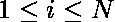
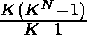

# 赢得游戏所需的最低玩家数

> 原文:[https://www . geesforgeks . org/最低玩家要求赢得游戏/](https://www.geeksforgeeks.org/minimum-players-required-to-win-the-game/)

给定 **N** 个问题和 **K** 个选项，其中和。任务是为所有的用问题试图**赢得游戏的玩家总数的总和。你要最小化玩家总数之和，以 **10 <sup> 9 </sup> +7** 为模输出。
**注意:**任何错误的回答都会导致玩家被淘汰。**

**示例:**

```
Input: N = 3, K = 3
Output: 39

Input: N = 5, K = 2
Output: 62
```

**进场:**

> *   It takes k players to solve the nth problem.
> 
>  <sup>2</sup> 
> 
> *   Moving forward, it takes k <sup>n</sup> players to solve the first problem.

所以，我们的问题简化为求 GP 项**K+K<sup>2</sup>+…+K<sup>N</sup>**之和，等于。
现在我们可以用[费马小定理](https://www.geeksforgeeks.org/fermats-little-theorem/)用 **10 <sup>9</sup> +7** 取模得到需要的答案。

下面是上述方法的实现:

## C++

```
// C++ program to find minimum players
// required to win the game anyhow
#include <bits/stdc++.h>
using namespace std;
#define mod 1000000007

// function to calculate (a^b)%(10^9+7).
long long int power(long long int a, long long int b)
{
    long long int res = 1;
    while (b) {
        if (b & 1) {
            res *= a;
            res %= mod;
        }
        b /= 2;
        a *= a;
        a %= mod;
    }
    return res;
}

// function to find the minimum required player
long long int minPlayer(long long int n, long long int k)
{

    // computing the nenomenator
    long long int num = ((power(k, n) - 1) + mod) % mod;

    // computing modulo inverse of denominator
    long long int den = (power(k - 1, mod - 2) + mod) % mod;

    // final result
    long long int ans = (((num * den) % mod) * k) % mod;

    return ans;
}

// Driver code
int main()
{

    long long int n = 3, k = 3;

    cout << minPlayer(n, k);

    return 0;
}
```

## Java 语言(一种计算机语言，尤用于创建网站)

```
//Java program to find minimum players
//required to win the game anyhow
public class TYU {

    static long  mod =  1000000007;

    //function to calculate (a^b)%(10^9+7).
     static long power(long a, long b)
     {
      long res = 1;
      while (b != 0) {
          if ((b & 1) != 0) {
              res *= a;
              res %= mod;
          }
          b /= 2;
          a *= a;
          a %= mod;
      }
      return res;
     }

     //function to find the minimum required player
     static long minPlayer(long n, long k)
     {

      // computing the nenomenator
      long num = ((power(k, n) - 1) + mod) % mod;

      // computing modulo inverse of denominator
      long den = (power(k - 1, mod - 2) + mod) % mod;

      // final result
      long ans = (((num * den) % mod) * k) % mod;

      return ans;
     }

     //Driver code
    public static void main(String[] args) {

         long n = 3, k = 3;

         System.out.println(minPlayer(n, k));
    }
}
```

## 蟒蛇 3

```
# Python 3 Program  to find minimum players
#  required to win the game anyhow

# constant
mod = 1000000007

# function to calculate (a^b)%(10^9+7).
def power(a, b) :
    res = 1

    while(b) :
        if (b & 1) :
            res *= a
            res %= mod

        b //= 2
        a *= a
        a %= mod

    return res

# function to find the minimum required player
def minPlayer(n, k) :

    # computing the nenomenator
    num = ((power(k, n) - 1) + mod) % mod

    # computing modulo inverse of denominator
    den = (power(k - 1,mod - 2) + mod) % mod

    # final result
    ans = (((num * den) % mod ) * k) % mod

    return ans

# Driver Code
if __name__ == "__main__" :

    n, k = 3, 3

    print(minPlayer(n, k))

# This code is contributed by ANKITRAI1
```

## C#

```
// C# program to find minimum players
// required to win the game anyhow
using System;
class GFG
{

static long mod = 1000000007;

// function to calculate (a^b)%(10^9+7).
static long power(long a, long b)
{
long res = 1;
while (b != 0)
{
    if ((b & 1) != 0)
    {
        res *= a;
        res %= mod;
    }
    b /= 2;
    a *= a;
    a %= mod;
}
return res;
}

// function to find the minimum
// required player
static long minPlayer(long n, long k)
{

    // computing the nenomenator
    long num = ((power(k, n) - 1) + mod) % mod;

    // computing modulo inverse
    // of denominator
    long den = (power(k - 1, mod - 2) + mod) % mod;

    // final result
    long ans = (((num * den) % mod) * k) % mod;

    return ans;
}

// Driver code
public static void Main()
{
    long n = 3, k = 3;

    Console.WriteLine(minPlayer(n, k));
}
}

// This code is contributed
// by Shashank
```

## 服务器端编程语言（Professional Hypertext Preprocessor 的缩写）

```
<?php
// PHP program to find minimum players
// required to win the game anyhow

// function to calculate (a^b)%(10^9+7).
function power($a, $b)
{
    $mod = 1000000007;
    $res = 1;
    while ($b)
    {
        if ($b & 1)
        {
            $res *= $a;
            $res %= $mod;
        }
        $b /= 2;
        $a *= $a;
        $a %= $mod;
    }
    return $res;
}

// function to find the minimum
// required player
function minPlayer($n, $k)
{
    $mod =1000000007;

    // computing the nenomenator
    $num = ((power($k, $n) - 1) +
                   $mod) % $mod;

    // computing modulo inverse
    // of denominator
    $den = (power($k - 1, $mod - 2) +
                  $mod) % $mod;

    // final result
    $ans = ((($num * $den) % $mod) *
                       $k) % $mod;

    return $ans;
}

// Driver code
$n = 3;
$k = 3;

echo minPlayer($n, $k);

// This code is contributed
// by Shivi_Aggarwal
?>
```

## java 描述语言

```
<script>
//javascript program to find minimum players
//required to win the game anyhow

    var mod = 107;

    // function to calculate (a^b)%(10^9+7).
    function power(a , b) {
        var res = 1;
        while (b != 0) {
            if ((b & 1) != 0) {
                res *= a;
                res = res%mod;
            }
            b = parseInt(b/2);
            a *= a;
            a %= mod;
        }
        return res;
    }

    // function to find the minimum required player
    function minPlayer(n , k) {

        // computing the nenomenator
        var num = ((power(k, n) - 1) + mod) % mod;

        // computing modulo inverse of denominator
        var den = (power(k - 1, mod - 2) + mod) % mod;

        // final result
        var ans = (((num * den) % mod) * k) % mod;

        return ans;
    }

    // Driver code

        var n = 3, k = 3;

        document.write(minPlayer(n, k));

// This code contributed by gauravrajput1
</script>
```

**Output:** 

```
39
```

**时间复杂度:** O(log(n))